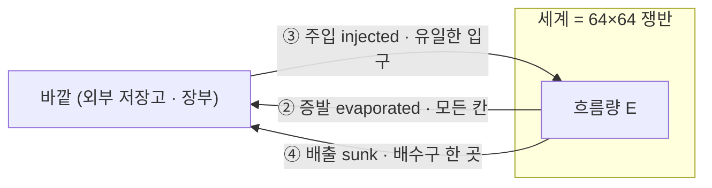
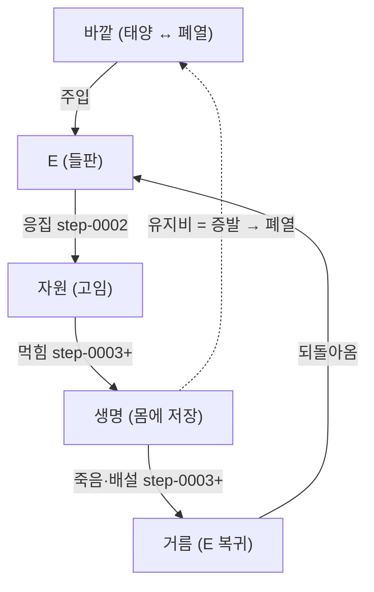

# 개념 노트 — 열린 세계와 닫힌 장부 (보존 · 통과 · 순환)

> [step-0001로](../step-0001.md) · 관련 요소: [02-quantity](02-quantity.md)(닫힌 장부) · [04-drive](04-drive.md)(구동) · [06-life](06-life.md)(생명)
> 이 노트는 새 코드가 아니라 **step-0001 의 설계가 왜 물리적으로 옳은가**를 정리한 개념 문서다. step 진행과 무관하게 언제든 참조한다.

## 왜 이 노트가 있나 — 두 가지 자연스러운 오해

step-0001 을 읽으면 두 질문이 거의 반드시 떠오른다:

1. **"source 로 들어오고 증발·배출로 나가는데 — 에너지 보존 법칙 위반 아닌가?"**
2. **"나간 게 안 돌아온다면, 계속 순환하는 생태계는 못 만드는 것 아닌가?"**

둘 다 **아니다.** 그리고 둘을 풀면 이 프로젝트의 토대가 왜 *지금 이 모양*인지가 분명해진다. 핵심 한 줄:

> **세계는 "열린 계"다 — 에너지는 *통과*하고 물질은 *순환*한다. "닫힌 장부"는 순환(loop)이 아니라 회계(book)가 닫혔다는 뜻이다.**

---

## 1. 보존 위반이 아니다 — 닫힌 *계*가 아니라 열린 *계*다

보존을 따질 땐 **경계를 어디까지 보느냐**가 전부다.

- **세계만 보면**: 들어오고(주입) 나간다(증발·배출). 세계 안의 총량 `sumE` 는 출렁인다.
- **세계 + 바깥을 함께 보면**: 들어온 만큼 바깥이 줄고, 나간 만큼 바깥이 는다. **전체 총량은 정확히 보존된다.**

[02-quantity](02-quantity.md) 의 닫힌 장부가 증명하는 게 바로 이것이다:

```
sumE(t) + evaporated + sunk − injected = sumE(0)      잔차 ~1e-13
```

좌변이 항상 초기값과 같다 = **단 한 톨도 무에서 생기거나 흔적 없이 사라지지 않는다.** 보존은 깨지지 않고, 세계가 바깥과 *거래하는 열린 계*일 뿐이다.

> **비유 — 지구와 태양.** 지구 생태계는 태양에서 에너지가 **들어오고**(주입) 우주로 열이 **빠져나간다**(증발·배출). 지구는 태양 에너지를 재활용하지 않는다 — *통과*시킨다. 그래도 우주 전체로 보면 에너지는 보존된다. 우리 세계 = 작은 지구, `source` = 태양, `증발`·`sink` = 우주로의 복사.



화살표가 **바깥→세계→바깥 한 방향**임에 주목. 나간 화살표가 입구로 되돌아오지 *않는다*. 증발한 E 도, 배수구로 빠진 E 도 다시 `source` 가 되지 않는다 — `source` 는 그것과 무관하게 바깥에서 **새 E** 를 붓는 별개의 장치다.

---

## 2. 생태계에서 **에너지는 순환하지 않는다 — 통과한다**

여기가 직관을 한 번 고쳐야 하는 지점이다. 실제 생태계에서도:

| | 순환하나? | 어떻게 |
|---|---|---|
| **에너지** | ❌ 한 방향 *통과* | 태양 → 식물 → 초식 → 육식 → 폐열로 우주로. 위로 갈수록 줄고, 돌아오지 않음 |
| **물질**(탄소·물·질소) | ⭕ *순환* | 분해자가 되돌려 빙글빙글 재사용 |

그래서 "순환하는 생태계"의 정체는 **에너지 순환이 아니라 — ① 에너지의 *끊임없는 통과* + ② 물질의 *순환*** 이다.

그리고 **열역학 2법칙**이 못을 박는다: 에너지 통과가 끊기면(=수도꼭지를 잠그면) 세계는 반드시 평형으로 식어 죽는다. [04-drive](04-drive.md) 의 V3 가 이를 수치로 증명했다:

```
구동 off, 11000 tick → varE 1.8e-33 (기울기 소멸) · sumE 0.068 (E₀ 4096 의 0.0017%)  = 죽음
구동 on,  정상상태   → 주입 1.45/tick ↔ 증발 1.36 + 배출 균형, 기울기 영구 유지       = 살아있음
```

**결론: `source→sink` 통과 구조는 버그가 아니라, 생명이 존재하기 위한 물리적 필수 조건이다.** "스스로 굴러가는 세계"는 정의상 열린(통과) 계여야 한다.

---

## 3. 그럼 "순환 생태계"는 어떻게 — 오히려 이 토대라서 가능하다

순환은 **물질(E)이 세계 *안*에서 도는 것**으로 구현한다. 에너지 통과가 그 바퀴를 돌리는 동력이다.



- `자원 → 생명 → 죽음 → 거름 → 다시 자원` 이 **물질 순환 바퀴**다.
- 이 바퀴가 멈추지 않는 이유 = `source` 가 새 E 를 계속 붓기 때문(에너지 통과).
- `증발` 은 바퀴가 돌 때마다 떼이는 **"세금"**(엔트로피) — 이 세금 때문에 `source` 가 *반드시* 필요하다.

**닫힌 장부 + 구동은 순환의 걸림돌이 아니라 *전제 조건*이다:**

- 물질이 보존돼야(닫힌 장부) 바퀴를 돌 때 E 가 새거나 폭발하지 않고 **안정적으로** 순환한다.
- 에너지가 통과해야(구동) 바퀴가 평형으로 **멈추지 않는다.**

거꾸로, "완전히 닫힌 순환"(바깥 입력 0, 영구히 도는 바퀴)을 만들려 하면 그것은 **영구기관**이라 2법칙이 금지한다. 자연도 못 하는 일이다.

---

## 4. 용어 정리 — 헷갈리는 짝들

| 말 | 뜻 | 아닌 것 |
|---|---|---|
| **닫힌 장부** (closed *book*) | 들어온/나간 양을 빠짐없이 기록 → 회계가 맞아떨어짐 | 닫힌 *순환*(loop). 나간 E 는 안 돌아온다 |
| **닫힌 계** (isolated system) | 바깥과 거래 0 → 평형사 | **우리 세계는 닫힌 계가 *아니다*** (열린 계) |
| **증발** | 모든 칸에서 균일하게 E 가 바깥으로 (엔트로피 세금) | 한 지점의 배수구(=배출) |
| **배출(sink)** | 배수구 한 곳에서 E 를 빼냄 → *기울기*를 만듦 | 증발과 다른 출구. 둘 다 바깥행 |
| **에너지 순환** | (생태계엔) 없음 — 통과한다 | — |
| **물질 순환** | 자원→생명→거름→자원 (세계 안에서 돎) | 에너지가 도는 게 아님 |

---

## 5. step 로드맵과의 연결

| 조각 | 무엇을 | 어디서 |
|---|---|---|
| **에너지 통과** (열린 계) | `source→sink` 구동으로 비평형 유지 = 안 죽는 세계 | [step-0001](../step-0001.md) ✓ |
| **물질이 고임** (바퀴의 첫 칸) | 응집으로 자원(고임) 출현·재생 | [step-0002](../step-0002.md) ✓ |
| **바퀴가 돈다** (자원→생명→거름→자원) | 생명이 자원을 먹고, 죽어 거름으로 되돌림 | step-0003+ (예정) |

> **선례**: 형제 프로토타입(MR)의 `step-0007` 이 바로 이 자가순환 사슬 — `source → 별 → 생명 → 거름 → 새 별` 이 스스로 굴러가는 것 — 을 이미 보였다. HWS 는 같은 바퀴를 step-0003 부터 깨끗하게 다시 쌓으며, **지금의 닫힌 장부 + 구동 토대가 그 바퀴를 가능하게 하는 기반**이다.

---

## 6. 한 문단 요약

세계는 **열린 계**다 — `source` 로 새 E 가 들어오고 `증발`·`sink` 로 나간다. 이건 보존 위반이 아니라(전체로는 보존, 장부가 증명), *생명이 존재하기 위한 필수 조건*이다(2법칙: 통과가 끊기면 평형사). 생태계에서 **에너지는 순환하지 않고 통과하며, 도는 것은 물질**이다. "순환 생태계"는 `자원→생명→거름→자원` 의 **물질 바퀴**를 **에너지 통과**가 돌리는 것이고 — 그 바퀴가 안정적으로 돌려면 **물질 보존(닫힌 장부)** 과 **에너지 통과(구동)** 가 *둘 다* 필요하다. 그래서 step-0001 의 토대는 순환의 걸림돌이 아니라 *전제*다.
