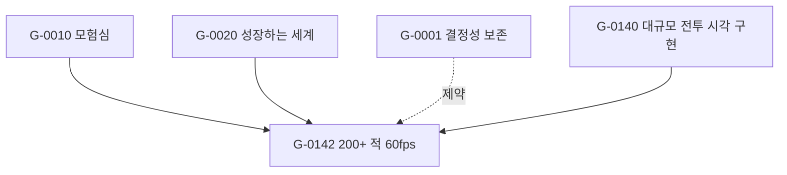

# Goal 시스템 설계 — 프로젝트의 1차 표현 구조

> **문서 종류:** 구현 설계 명세 (Implementation Spec)
> **대상 독자:** 본 시스템을 구현할 AI 에이전트 또는 개발자
> **상태:** 초안 v0.1
> **최종 수정:** 2026-05-04

-----

## 0. 이 문서를 읽는 법

이 문서는 **Goal 시스템을 구현하기 위한 명세**다. 구현자는 이 문서만으로:

1. Goal이 무엇이고 무엇이 아닌지 판별할 수 있어야 한다.
1. Goal의 데이터 구조(스키마)를 그대로 코드/스토리지로 옮길 수 있어야 한다.
1. Goal Tree(정확히는 DAG)의 무결성 규칙을 검증하는 도구를 작성할 수 있어야 한다.
1. Goal 파일을 어떻게 저장·명명·갱신할지에 대한 전략을 알 수 있어야 한다.
1. 기존 `docs/` 마크다운 자산과 어떻게 통합되는지 알 수 있어야 한다.

본 문서가 다루지 않는 것:

- 구체적 UI/UX (별도 R&D 필요)
- 게임 인게임의 “퀘스트 = Goal” 통합 (별도 검토 항목)
- 일감 관리(Task) 시스템의 상세 — 본 문서는 Goal에 한정한다

-----

## 1. 배경과 문제 정의

### 1.1 문제

전통적 SW 개발에서는 **구현 비용 >> 설계 비용**이었으므로 코드가 사실상의 1차 표현이었다. 설계 문서는 부차적이고 항상 코드보다 뒤처졌다.

AI 에이전트 기반 개발에서는 이 비용 구조가 역전된다:

- 구현 비용이 **의도 기술 비용에 수렴**한다.
- 명확한 의도가 있다면 코드는 재생성 가능한 산출물이다.
- 따라서 코드가 아니라 **의도(Goal)** 가 프로젝트의 1차 표현이어야 한다.

### 1.2 Goal이 해결하는 것

- **“왜 이 코드가 존재하는가”의 영구 기록**: 코드 주석/PR 설명/회의록에 흩어진 의도를 단일 자산으로.
- **변경의 정당성 추적**: Goal이 변경되면 그에 봉사하던 코드의 정당성이 재검토되어야 함을 명시적으로 드러낸다.
- **AI 에이전트의 작업 단위**: Task보다 한 층 위의, 시간 독립적이고 영구적인 작업 맥락.
- **프로젝트 전체의 의도 그래프 가시화**: 어떤 의도들이 어떻게 분해되어 코드에 닿는지를 한눈에.

### 1.3 Goal과 Task의 분리

|구분     |Goal            |Task          |
|-------|----------------|--------------|
|시간성    |시간 독립적          |시간 종속적        |
|답하는 질문 |왜 (Why)         |어떻게 (How)     |
|수명     |코드베이스가 살아있는 한 영구|완료 시 종료       |
|변경 시 영향|봉사 코드 전체 정당성 재검토|다음 Task 큐잉    |
|다대다 관계 |코드 모듈과 다대다      |보통 단일 Goal에 봉사|

**핵심:** Task는 Goal에 봉사한다. Goal 없이 Task만 있는 것은 의도 없는 작업이다.

-----

## 2. Goal의 정의

### 2.1 Goal이란 무엇인가

> **Goal은 “이 프로젝트가 무엇을 달성하려 하는가”의 한 단위로, 검증 가능한 성공 기준을 갖고, 더 작은 Goal로 분해 가능하며, 코드 모듈에 의해 실현되는 시간 독립적 의도 노드다.**

### 2.2 Goal이 아닌 것 (배제 기준)

다음은 Goal로 작성해서는 **안 된다**:

|안티패턴                     |이유                      |올바른 형태                           |
|-------------------------|------------------------|---------------------------------|
|`"VoxelRenderer 모듈을 만든다"`|모듈명을 Goal로 위장. “무엇”의 분해.|`"200+ 적이 등장해도 60fps 유지"`        |
|`"버그 #1234를 수정한다"`       |Task 수준. 시간 종속적.        |`"전투 입력 지연이 1프레임 이내로 유지된다"`      |
|`"재미있는 게임을 만든다"`         |검증 불가능.                 |`"플레이 세션 평균 길이가 25분을 넘는다"`       |
|`"코드 품질을 올린다"`           |검증 기준 부재.               |`"VM 모듈의 단위 테스트 커버리지 80% 이상"`    |
|`"리팩토링한다"`               |Task. Goal은 결과 상태를 기술.  |(Goal 없음. 상위 Goal에 봉사하는 Task로 처리)|

**핵심 판별법:** 6개월 후에도 그 표현이 그대로 의미가 있는가? Yes → Goal 후보. No → Task.

### 2.3 좋은 Goal의 5가지 속성

1. **검증 가능 (Verifiable):** 달성 여부를 외부에서 관찰 가능한 형태로 기술.
1. **시간 독립 (Time-independent):** “지금” 또는 “다음 스프린트”가 아닌, 영구적 상태로 기술.
1. **의도 분해 (Intent-decomposable):** 하위 Goal이 모듈명이 아니라 더 작은 의도여야 한다.
1. **단일 책임 (Single-purpose):** 하나의 Goal은 하나의 명확한 의도만 표현.
1. **코드 비종속 (Code-agnostic):** Goal 자체는 어떤 모듈로 구현할지 명시하지 않음. (그것은 `realizes` 관계에서 드러남)

-----

## 3. Goal 스키마

### 3.1 필수 필드

```yaml
id: G-XXXX                    # 고유 식별자. G-NNNN 형식. 영구 불변.
title: string                  # 한 줄 제목. 80자 이내. 검증 가능한 상태로 기술.
intent: markdown               # "왜 이 Goal이 존재하는가". 상위 Goal과의 관계 서술.
success_criteria:              # 달성 검증 조건. 1개 이상 필수.
  - description: string        # 사람이 읽는 조건 서술
    measurable: boolean        # 자동 측정 가능 여부
    measure: string | null     # 측정 방법 (가능한 경우)
status: enum                   # proposed | active | achieved | abandoned | superseded
created_at: ISO8601
updated_at: ISO8601
```

### 3.2 관계 필드

```yaml
parents: [G-XXXX, ...]         # 상위 Goal들. DAG이므로 다중 가능. 최상위는 빈 배열.
children: [G-XXXX, ...]        # 하위 Goal들. 분해 결과.
constraints: [G-XXXX, ...]     # 이 Goal이 따라야 하는 제약 Goal들 (예: G-DETERMINISM)
realizes:                      # 이 Goal을 실현하는 코드 자산
  - path: string               # 모듈/파일 경로
    role: string               # 이 자산이 Goal에 어떻게 봉사하는지
related_docs: [path, ...]      # 관련 마크다운 문서
```

### 3.3 선택 필드

```yaml
rationale: markdown            # 왜 이 분해 방식을 택했는지의 설계 근거
alternatives_considered:       # 검토 후 기각된 대안들
  - option: string
    rejected_because: string
risks: [string, ...]           # 이 Goal 달성을 막을 수 있는 리스크
tags: [string, ...]            # 자유 태그 (예: pillar:exploration, layer:vm)
```

### 3.4 ID 규칙

- 형식: `G-` 접두사 + 4자리 0패딩 정수. 예: `G-0001`, `G-0042`.
- 예약 ID 범위:
  - `G-0001` ~ `G-0099`: 최상위 Pillar Goal (4 Pillars 매핑 + 메타 Goal)
  - `G-0100` ~ `G-0999`: 시스템 수준 Goal (HktCore, 렌더링, 시뮬레이션 등)
  - `G-1000` ~: 일반 Goal
- ID는 **영구 불변**이다. Goal이 폐기(abandoned/superseded)되어도 ID는 재사용하지 않는다.
- `superseded` 상태의 Goal은 `superseded_by: G-YYYY` 필드로 후속 Goal을 가리킨다.

### 3.5 제약 Goal (Constraint Goal)

일부 Goal은 다른 Goal들의 자식이자 동료로서 **횡단 제약**을 표현한다. 예시:

- `G-0001 결정성 보존`: 모든 시뮬레이션 Goal의 제약
- `G-0002 AI-Only 제작`: 모든 에셋 생성 Goal의 제약
- `G-0003 UE5는 표현 계층`: 모든 렌더링 Goal의 제약

이들은 `constraints` 필드에서 참조되며, 위반 시 검증기가 경고를 발생시켜야 한다.

-----

## 4. 구조: Tree가 아니라 DAG

### 4.1 왜 Tree가 아닌가

실제 프로젝트의 의도는 트리가 아니다. 하나의 하위 Goal이 여러 상위 Goal에 동시에 봉사하는 경우가 흔하다:

- “60fps 안정 유지”는 “쾌적한 전투”와 “다중 적 연출”과 “모바일 지원” 모두의 자식이다.
- “결정성 보존”은 거의 모든 시뮬레이션 Goal의 제약이다.

따라서 Goal 그래프는 **DAG (Directed Acyclic Graph)** 다.

### 4.2 DAG 무결성 규칙

구현자는 다음 규칙을 검증하는 도구를 제공해야 한다:

1. **순환 금지 (Acyclicity):** Goal A가 직간접적으로 자기 자신의 조상이 되는 경로가 있어서는 안 된다.
1. **고아 금지 (No orphans):** 최상위 Pillar Goal을 제외한 모든 Goal은 최소 1개의 `parents`를 가져야 한다.
1. **참조 무결성 (Referential integrity):** `parents`/`children`/`constraints`/`superseded_by`에 등장하는 모든 ID는 실재해야 한다.
1. **양방향 일관성 (Bidirectional consistency):** A의 `parents`에 B가 있다면, B의 `children`에 A가 있어야 한다.
1. **상태 일관성 (Status consistency):**
- `achieved` Goal의 모든 `success_criteria`는 충족 표시되어야 한다.
- `abandoned` Goal의 모든 `children`은 `abandoned` 또는 다른 부모로 재배치되어야 한다.

### 4.3 표현 방식 권장

- **저장소 형식:** 개별 Goal당 하나의 파일. `goals/G-XXXX.yaml` 또는 `goals/G-XXXX.md`(YAML frontmatter + 본문).
- **권장 형식:** 마크다운 + YAML frontmatter. `intent`/`rationale` 같은 긴 산문이 자연스럽게 들어가고, 마크다운 도구 생태계와 호환된다.
- **인덱스 자동 생성:** `goals/INDEX.md`는 도구가 전체 Goal 트리를 자동 생성. 사람이 직접 수정하지 않는다.

-----

## 5. 코드와의 연결

### 5.1 Goal → Code (정방향)

Goal 파일의 `realizes` 필드가 이 Goal을 실현하는 코드 자산을 가리킨다:

```yaml
realizes:
  - path: Source/HktVoxelCore/Private/MeshBuilder.cpp
    role: Binary Greedy Meshing의 핵심 알고리즘 구현
  - path: Source/HktVoxelCore/Private/ChunkManager.cpp
    role: 청크 단위 메시 생성 큐잉
```

### 5.2 Code → Goal (역방향)

코드 측에는 파일 헤더 또는 모듈 문서에 봉사 Goal을 표기:

```cpp
// @goal: G-0142 (대량 적 렌더링 60fps)
// @goal: G-0001 (결정성 보존)  // 제약
// File: HktVoxelCrowdRenderer.cpp
```

또는 모듈 디렉토리에 `GOALS.md` 파일로 명시:

```markdown
# Module: HktVoxelCore

## Realizes
- G-0142: 대량 적 렌더링 60fps
- G-0150: 청크 단위 가시 영역 관리

## Respects (Constraints)
- G-0003: UE5는 표현 계층
```

### 5.3 양방향 일관성 검증

도구는 다음을 검증한다:

- Goal의 `realizes`에 등장한 코드 경로가 실재하는가?
- 코드의 `@goal: G-XXXX` 태그가 실재하는 Goal을 가리키는가?
- Goal A의 `realizes`에 파일 X가 있는데, 파일 X에는 A의 태그가 없는 경우 → 양방향 비일관 경고.

-----

## 6. 마크다운 문서와의 통합

### 6.1 기존 `docs/` 자산의 위치

현재 `docs/` 디렉토리의 마크다운 문서들은 두 종류로 분류된다:

1. **방향성 문서** (예: `히키토의_대모험_방향성.md`): 큰 단위 의도. 여러 Goal로 분해되어야 함.
1. **R&D / 구현 문서** (예: `rnd-niagara-mesh-deconstruct.md`): 특정 Goal의 `related_docs`에 연결되는 보조 자료.

### 6.2 권장 디렉토리 구조

Goal 그래프는 DAG이므로 폴더 트리에 1:1 매핑되지 않는다. 따라서 **Goal 파일은 의미적 분류를 폴더로 표현하지 않고 평탄(flat)하게 저장**하며, 분류/계층은 frontmatter 메타데이터로부터 도구가 자동으로 도출한다. 파일 관리 전략의 상세는 7절에서 다룬다.

```
docs/
├── goals/                      # Goal 파일들 — 평탄 구조, 파일명 = ID
│   ├── G-0001.md
│   ├── G-0002.md
│   ├── G-0010.md
│   ├── G-0142.md
│   ├── ...
│   ├── INDEX.md                # 자동 생성 — 상태/태그/Pillar별 인덱스
│   ├── TREE.md                 # 자동 생성 — 사람이 읽는 계층 뷰
│   └── graph.mmd               # 자동 생성 — Mermaid DAG 그래프
├── rnd/                        # R&D 문서 (Goal에서 참조)
│   ├── rnd-niagara-mesh-deconstruct.md
│   └── ...
├── direction/                  # 방향성 문서 (Goal로 분해 진행)
│   └── 히키토의_대모험_방향성.md
└── CLAUDE.md                   # 프로젝트 컨벤션
```

### 6.3 마이그레이션 원칙

기존 문서를 한 번에 모두 Goal로 변환하지 않는다. 점진적으로:

1. 최상위 Pillar Goal부터 작성 (방향성 문서의 4 Pillars 매핑).
1. 현재 능동적으로 작업 중인 영역의 Goal부터 분해.
1. R&D 문서는 그대로 두고, 해당 작업의 Goal에서 `related_docs`로 참조.
1. 비활성 영역은 작업 시작 시점에 분해.

-----

## 7. 파일 관리 전략

### 7.1 핵심 원칙: Flat + Derived View

Goal 그래프는 DAG이고, 폴더 트리는 단일 부모만 허용한다. 따라서 의미적 분류를 폴더로 표현하려는 모든 시도는 다음 중 하나로 귀결된다:

- **모순:** 다중 부모 Goal이 한 폴더에만 들어감 → 다른 부모 관점에서는 보이지 않음
- **중복:** 심볼릭 링크나 복사본 → 동기화 지옥
- **임의 선택:** “주된 부모”를 정해 한 폴더에 둠 → 임의성, 다른 관점의 정당성 부정

해법은 단순하다. **데이터 자체와 데이터의 분류/뷰를 분리한다.**

> **Goal 파일은 평탄한 단일 디렉토리에 ID로만 저장하고, 모든 계층 구조와 분류는 frontmatter 메타데이터에서 도구가 자동으로 도출한다.**

### 7.2 파일명과 저장 규칙

- **파일명 = ID.** `goals/G-0142.md`. 제목을 파일명에 포함하지 않는다.
  - **이유:** 제목은 변경 가능하지만 ID는 영구 불변. 파일명에 제목을 넣으면 제목 변경 시 파일 이동이 발생하고, 외부 참조와 Git 히스토리가 깨진다.
- **모든 Goal은 동일 디렉토리(`goals/`).** Pillar/시스템/일반 Goal 모두 평탄.
- **하위 폴더로 분류하지 않는다.** Pillar별 폴더, 상태별 폴더, 레이어별 폴더 모두 금지.

### 7.3 자동 생성 뷰

평탄한 데이터에서 도구가 다음 뷰들을 생성한다. 모두 `goals/` 내부에 두되, 첫 줄에 “자동 생성 — 직접 수정 금지” 주석을 명시한다.

#### 7.3.1 `INDEX.md` — 다축 인덱스

상태/Pillar/태그 등 여러 축으로 분류된 인덱스. 다중 부모 Goal은 모든 해당 위치에 나타나며, 부가 위치는 `(also under ...)`로 표시.

```markdown
# Goals Index (자동 생성 — 직접 수정 금지)
> Last generated: 2026-05-04T10:30:00+09:00

## By Pillar

### G-0010 모험심
- G-0110 신규 발견 콘텐츠 잔존성
- G-0142 200+ 적 60fps  *(also under G-0020)*

### G-0020 성장하는 세계
- G-0140 대규모 전투 시각 구현
- G-0142 200+ 적 60fps  *(also under G-0010)*

## By Status
### Active (37) ...
### Achieved (8) ...
### Abandoned (3) ...

## By Tag
### layer:rendering (12) ...
### layer:vm (15) ...
### constraint (4) ...
```

#### 7.3.2 `TREE.md` — 사람이 읽는 계층 뷰

Pillar Goal부터 깊이 우선으로 펼친 들여쓰기 트리. 다중 부모 Goal은 첫 등장 위치에서만 자식까지 펼치고, 이후 등장에서는 `→ G-XXXX` 식으로 참조만 표기.

```markdown
# Goal Tree (자동 생성 — 직접 수정 금지)

- G-0010 모험심
  - G-0110 신규 발견 콘텐츠 잔존성
  - G-0142 200+ 적 60fps
    - G-0143 HISM 인스턴싱
    - G-0144 LOD 전환 정책
- G-0020 성장하는 세계
  - G-0140 대규모 전투 시각 구현
    - → G-0142 200+ 적 60fps (자식 트리는 G-0010 하위 참조)
```

#### 7.3.3 `graph.mmd` — Mermaid DAG 그래프

DAG는 트리로 표현 불가능하지만 그래프로는 자연스럽다. Mermaid는 GitHub/Obsidian/VSCode에서 즉시 렌더링된다.



큰 그래프는 자동으로 Pillar별 서브그래프로 분할한다.

### 7.4 평탄 구조의 우월성

|관점        |폴더 분류             |평탄 + 메타데이터              |
|----------|------------------|------------------------|
|다중 부모 표현  |불가 (단일 부모만)       |자연스러움 (`parents: [...]`)|
|부모 변경 비용  |파일 이동 + 외부 링크 깨짐  |frontmatter 한 줄 수정      |
|가능한 뷰     |1개 (폴더 구조 자체)     |무한 (도구가 도출)             |
|Git diff  |파일 이동 노이즈         |메타데이터 변경만               |
|AI 에이전트 접근|폴더 탐색 필요          |ID 직접 접근                |
|단일 진실 공급원 |깨짐 (분류가 폴더+메타에 분산)|보존 (메타데이터에만)            |

### 7.5 파일 수 임계점 대처

Goal이 일정 수를 넘어가면 단일 디렉토리가 무거워질 수 있다. 그 시점의 해법은 **의미적 분류가 아니라 ID 범위 기반 저장 샤딩**이다:

```
docs/goals/
├── 0000-0099/      # Pillar/메타 Goal
├── 0100-0999/      # 시스템 수준 Goal
├── 1000-1999/
└── ...
```

이는 순수히 저장 차원의 파티셔닝이며 **의미적 분류가 아니다**. 도구는 여전히 모든 파일을 평탄하게 취급한다 (글로브 패턴 `goals/**/G-*.md`).

**임계점 가이드라인:**

- ~500 파일 이하: 샤딩 불필요
- 500 ~ 2000 파일: ID 범위 샤딩 권장
- 2000+ 파일: 샤딩 필수 + 도구 성능 최적화 검토

### 7.6 상호 참조 규칙

- **Goal 간 참조:** frontmatter의 `parents`/`children`/`constraints`/`superseded_by`에 ID 사용. 파일 경로 사용 금지 (이동에 강건하기 위함).
- **본문 내 참조:** 마크다운 링크 형식 `[G-0142](./G-0142.md)`. 파일명이 ID와 동일하므로 안정적.
- **외부 문서에서의 참조:** 가능하면 ID로만 참조 (`G-0142 참조`). 경로 참조 시 `docs/goals/G-0142.md` 사용.

### 7.7 파일 라이프사이클

|이벤트            |처리                                                            |
|---------------|--------------------------------------------------------------|
|Goal 신규 작성     |다음 가용 ID 할당 → `G-XXXX.md` 생성 → frontmatter 채움                 |
|제목 변경          |frontmatter `title` 수정. 파일명은 그대로.                             |
|부모 변경          |frontmatter `parents` 수정. 파일 이동 없음.                           |
|폐기 (abandoned) |`status: abandoned`로 변경. 파일 삭제하지 않음 (역사 보존).                  |
|대체 (superseded)|`status: superseded`, `superseded_by: G-YYYY` 추가. 파일 유지.      |
|자동 생성 뷰 갱신     |Goal 파일 변경 시 CI/사전 커밋 훅에서 `INDEX.md`/`TREE.md`/`graph.mmd` 재생성|

**핵심:** 파일은 거의 이동하지 않고, 거의 삭제되지 않는다. ID 영속성과 역사 보존이 우선이다.

-----

## 8. Goal 파일 예시

### 8.1 최상위 Pillar Goal 예시

```markdown
---
id: G-0010
title: 플레이어가 미지의 세계를 탐험하는 쾌감을 느낀다
status: active
created_at: 2026-05-04T00:00:00+09:00
updated_at: 2026-05-04T00:00:00+09:00
parents: []
children: [G-0110, G-0111, G-0112]
constraints: [G-0002]
tags: [pillar:exploration]
---

## Intent

설계 기둥 중 "모험심"에 해당하는 최상위 의도. "다음에 뭐가 나올지 모른다"는
미지(未知)의 쾌감을 플레이어 경험의 핵심 축으로 삼는다.

## Success Criteria

- description: 신규 플레이어가 첫 1시간 내 1회 이상 "최초 발견" 이벤트를 경험한다
  measurable: true
  measure: 텔레메트리 — first_discovery_event 발생률 ≥ 80% (신규 플레이어 코호트)
- description: 30시간 플레이 시점에도 미발견 콘텐츠가 잔존한다
  measurable: true
  measure: 플레이어별 도감 완성도 ≤ 70% (p50 기준)

## Rationale

기존 MMORPG가 "정해진 콘텐츠 소비" 모델을 따랐다면, 본 프로젝트는 AI 절차 생성으로
"고갈되지 않는 발견"을 핵심 차별화로 삼는다.
```

### 8.2 시스템 수준 Goal 예시

```markdown
---
id: G-0142
title: 200+ 적 동시 렌더링 시 60fps 유지
status: active
created_at: 2026-05-04T00:00:00+09:00
updated_at: 2026-05-04T00:00:00+09:00
parents: [G-0140]
children: [G-0143, G-0144, G-0145]
constraints: [G-0001, G-0003]
realizes:
  - path: Source/HktVoxelCore/Public/HktVoxelCrowdRenderer.h
    role: HISM 기반 대량 렌더링 인터페이스
related_docs:
  - docs/rnd/rnd-mass-enemy-rendering.md
tags: [layer:rendering, perf]
---

## Intent

"성장하는 세계" Pillar 하위, 대규모 전투 및 생태계 시뮬레이션의 시각적 구현.
플레이어가 200+ NPC가 등장하는 상황에서도 쾌적한 전투 입력을 유지할 수 있어야 한다.

## Success Criteria

- description: 200 NPC 동시 가시 상태에서 평균 프레임타임 ≤ 16.6ms
  measurable: true
  measure: UE5 stat unit, 5분 평균
- description: 1% low 프레임타임 ≤ 22ms (45fps 하한)
  measurable: true
  measure: UE5 stat unit, 1% low

## Alternatives Considered

- option: UE5 Mass Entity Framework
  rejected_because: 시뮬레이션 시스템이 UE5에 결합되어 G-0003 위반
- option: 표준 Skeletal Mesh + Animation Blueprint
  rejected_because: 200 인스턴스 시 CPU 본 변환 비용 폭증
```

### 8.3 제약 Goal 예시

```markdown
---
id: G-0001
title: 시뮬레이션 결정성 보존
status: active
created_at: 2026-05-04T00:00:00+09:00
updated_at: 2026-05-04T00:00:00+09:00
parents: []
children: []
tags: [constraint, layer:vm]
---

## Intent

HktCore VM은 서버와 클라이언트가 동일 입력으로 동일 출력을 산출해야 한다.
이 제약을 위반하는 어떤 구현도 받아들일 수 없다.

## Success Criteria

- description: 동일 입력 시퀀스에 대해 서버/클라이언트 상태 해시가 100% 일치
  measurable: true
  measure: 자동화 테스트 — 1000 tick 시뮬레이션 후 state hash 비교
```

-----

## 9. 구현 작업 분해

### 9.1 Phase 1 — 스키마 및 검증기 (필수)

- [ ] **Task 1.1:** Goal 파일 형식(YAML frontmatter + Markdown) 파서 구현
- [ ] **Task 1.2:** 스키마 검증 (필수 필드, 타입, ID 형식)
- [ ] **Task 1.3:** DAG 무결성 검증 (4.2의 5가지 규칙)
- [ ] **Task 1.4:** 자동 생성 뷰 도구 — `INDEX.md`(다축 인덱스), `TREE.md`(계층 뷰), `graph.mmd`(Mermaid DAG). 7.3절 사양 준수.

### 9.2 Phase 2 — 코드 연결 (필수)

- [ ] **Task 2.1:** `realizes` 경로 실재성 검증
- [ ] **Task 2.2:** 코드 내 `@goal: G-XXXX` 태그 스캐너
- [ ] **Task 2.3:** 양방향 일관성 검증 (5.3)

### 9.3 Phase 3 — 초기 Goal 작성 (필수)

- [ ] **Task 3.1:** 최상위 Pillar Goal 4개 작성 (`G-0010` ~ `G-0040`)
- [ ] **Task 3.2:** 횡단 제약 Goal 작성 (`G-0001`, `G-0002`, `G-0003`)
- [ ] **Task 3.3:** 현재 능동 R&D 영역 Goal 분해 (Mass Enemy 렌더링, Niagara VFX)

### 9.4 Phase 4 — 고급 도구 (선택)

- [ ] **Task 4.1:** 인터랙티브 그래프 뷰어 (D3.js 기반, 클릭 시 Goal 상세 표시)
- [ ] **Task 4.2:** Goal 변경 영향 분석기 (특정 Goal 수정 시 재검토 대상 코드/하위 Goal 추출)
- [ ] **Task 4.3:** Claude Code 통합: Goal ID 기반 작업 컨텍스트 자동 로드 (`@goal G-0142` 태그 입력 시 해당 Goal 트리와 `realizes` 코드를 자동 첨부)
- [ ] **Task 4.4:** ID 범위 샤딩 도구 (7.5절, Goal 수가 임계점 도달 시)

-----

## 10. 성공 검증 (이 시스템 자체의 Goal)

이 Goal 시스템 구축 작업이 성공했는지의 판단 기준:

1. **재생성 가능성:** 코드를 모두 삭제해도, Goal Tree만 있으면 AI 에이전트가 동등한 의도의 코드를 재생성할 수 있다.
1. **변경 추적성:** 임의의 코드 모듈에 대해, 그것이 봉사하는 Goal과 그 상위 의도 사슬을 자동으로 추출할 수 있다.
1. **무결성 보장:** CI 단계에서 DAG 무결성과 양방향 일관성이 자동 검증된다.
1. **저비용 유지:** Goal 파일을 사람이 직접 작성/수정하는 부담이, 그로 인해 절감되는 의도 재구성 비용보다 작다.

-----

## 11. 향후 검토 항목 (본 문서 범위 외)

- [ ] Goal과 인게임 퀘스트 시스템의 통합 가능성 (플레이어 퀘스트도 Goal Tree로 표현?)
- [ ] Goal 변경 시 영향 분석 도구 (어떤 코드가 재검토 대상인가)
- [ ] 다중 에이전트 협업 시 Goal 잠금/충돌 정책
- [ ] Goal 우선순위 / 의존 그래프 기반 작업 스케줄링
- [ ] Task 시스템과의 정식 인터페이스 정의

-----

## 부록 A — 용어 정의

- **Goal:** 검증 가능한 성공 기준을 갖는 시간 독립적 의도 단위.
- **Task:** Goal에 봉사하는 시간 종속적 1회성 작업.
- **Pillar Goal:** 최상위 Goal. 4 Pillars 또는 메타 의도에 해당.
- **Constraint Goal:** 다른 Goal들의 횡단 제약을 표현하는 Goal.
- **DAG:** Directed Acyclic Graph. Goal 간 관계를 표현하는 자료구조.
- **Realizes:** Goal이 실현되는 코드 자산 관계.
- **Supersede:** 한 Goal이 더 나은 분해의 다른 Goal로 대체됨.