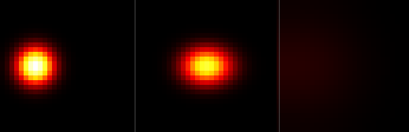

# step_0006 — 관성: 질량(=에너지)의 탄도 이류 (뉴턴 1법칙)

> energy = 질량(E=mc²). 그 질량이 *운동량*을 싣고, 힘이 없으면 **제 속도를 지킨 채 등속 직진**한다.
> 확산(완화·대비 지움)과 정반대 성격의 첫 동역학 — 덩어리를 *통째로 옮기는* 탄도 운동.

## 논의 — 왜 이 step 인가

별(0004)·빛나는 별(0005)까지 왔지만 세계의 모든 법칙이 *흩는 가족*(확산·방출·복사)이라 에너지가 "정체"된 느낌이었다. 우주→지구로 가려면 *모으는* 쪽 — 중력 — 이 필요하다. 그런데 사용자와의 논의에서 더 깊은 순서 문제가 드러났다:

- **중력은 GR 로 해야 하나?** 구조 형성(가스→별→행성)은 약장·저속 영역이라 GR 은 뉴턴 중력으로 *환원*된다(뉴턴 = GR 의 약장 극한). 실제 우주 구조 시뮬도 전부 뉴턴 N-body 다. GR(곡률 텐서·아인슈타인 방정식)은 *가장 단순한 단위 하나* 원칙과 정면충돌하고, 우리 기판(정적 유클리드 격자+완화형 장)엔 시공간·세계선조차 없다. → GR 은 극한 영역에 닿으면 가법 보정 step 으로 미룬다.
- **중력 = 관성력?** 등가원리상 *국소적으로는* 맞다(자유낙하=국소 관성계, 느끼는 힘은 겉보기). 하지만 전역으로는 조석/곡률이 남아 좌표로 못 지운다. 핵심은 — 관성력/측지선 관점은 **관성 운동을 전제**하는데, 우리 세계엔 관성이 아예 없었다. 확산은 시간 1차(완화), 운동량도 탄도 운동도 없다. 관성 없는 세계에 중력을 얹으면 "겉보기 힘으로 박아넣은 중력"이 된다.
- **질량은 어디 있나?** 어디에도 없었다. 장은 energy·potential 뿐. 그래서 결정: **energy 가 곧 질량이다(E=mc²).** 질량은 두 역할(관성 + 중력 원천)을 한 양이 동시에 하며, 그게 등가원리(관성질량=중력질량)다 — 같은 장을 양쪽에 쓰면 등가원리가 *공리가 아니라 구조적 결과*로 떨어진다.

**결론:** 중력보다 **관성을 먼저** 깐다. 질량은 허공에 도입할 수 없으므로(정적 숫자는 무의미), 이 step = *질량의 탄생 + 그 첫 관성 동역학(운동량/이류)* 한 묶음. 그 위에 다음 step 이 `−ρ∇Φ`(질량이 만든 퍼텐셜) 가속을 얹으면 중력이 *제 모습으로* 창발한다.

**검증 가능성:** 질량·운동량 보존 + 질량중심의 *등속 직진*(뉴턴 1법칙) — 확산(제자리 퍼짐)과 정량 대조.

## 구현 — `engine/htj-inertia.js` (넷째 법칙, 가법)

energy 장을 *질량 밀도 ρ* 로 다시 읽고, 운동량 밀도 `g = ρv`(새 장 `mom_x/y/z`, 지연 초기화)를 더한다. 법칙은 **탄도 이류** 하나:

```
연속(질량) :  ∂ρ/∂t = −∇·(ρv)
운동량     :  ∂g/∂t = −∇·(g v)        (힘 없음 → 자유 관성)
v = g/ρ
```

수치 스킴은 donor-cell **상류차분(upwind)** — 1차·보존형(flux 형식: 한 셀이 잃은 flux = 이웃이 얻음). 면속도 `uf=½(v_i+v_j)`, 상류 셀 값을 실어 보낸다. 축별 1패스(차원 분리), 면속도는 스텝 시작 상태에서 한 번 계산(이중버퍼 → 결정론). 닫힌 경계(no-flux): 도메인 바깥 면으로 flux 없음 → Σρ·Σg 정확 보존. CFL `|v|·dt ≤ dx(=1)` 아래 ρ ≥ 0.

- `dt=0`(또는 운동량 0) → 항등 early-return → **회귀 0**(0001~0005 불변). 확산·방출·복사와 직교 공존.
- **CFL 안전 서브스텝 가드(버그 수정)**: donor-cell 은 `|v|·dt ≤ 1` 에서만 비음수다. 점화(step_0012)처럼 열이 *주입*돼 속도가 CFL 을 넘기면 음수밀도→폭주→NaN(화면이 빔)으로 갔다. 그래서 `advect` 가 한 호출 내부에서 최대 Courant 수 `c=Σ|v_축|·dt` 로 `nsub=⌈c/1⌉` 만큼 dt 를 쪼개(서브스텝마다 ρ,g 로 속도 재계산) *스스로* 비음수·보존을 지킨다. **CFL 안전 흐름은 `nsub=1` → 종전과 byte-동일(회귀 0)**. 영구 가드는 verify 검증 9(CFL `|v|dt=3` 위반에도 비음수·질량 보존). 상세: `steps/step_0012/step_0012.md` 「버그 수정」.
- `seedMovingBlob` — 가우시안 질량 덩어리 + 균일 속도 `v0`(g=ρv0). 균일 v → 정확한 평행이동(비선형 없음)으로 깨끗한 뉴턴 1법칙 시연.
- 측정자: `totalMomentum`, `centerOfMass`(ρ 가중).

**확인용(viewer)** — `viewer.html` STEPS 에 `0006`(움직이는 덩어리 init + advect advance) 추가, `htj-inertia.js` 스크립트 등록, 캡처 훅 `inertiaInit/inertiaRun/centerOfMass` + `capture.js --inertia`. engine 은 viewer 를 모른다(단방향).

## 검증

### (a) 수치 — `node steps/step_0006/verify.js` → **PASS (11/11)**

```
PASS  질량 보존 — Σρ 불변(이류는 형태 변환 없는 수송) = ΔM/M0 = 6.48e-15
PASS  운동량 보존 — 힘 없으면 Σg 불변 = Σgx 500.0 → 500.0
PASS  탄도 직진 — 질량중심이 +x 로 이동(덩어리 통째로 직진) = CoM_x 6.02 → 10.02
PASS  뉴턴 1법칙 — CoM 속도 = p_total/M (등속) = 측정 v=0.5000 ≈ p/M=0.5
PASS  직진성 — 가로(y) 이동 없음(운동량 방향으로만) = ΔCoM_y = 2.77e-13
PASS  등속 — 매 스텝 보폭 일정(가속 0, CoM 선형) = 보폭 편차/보폭 = 2.39e-9
PASS  대조 — 확산만: CoM 정지(퍼질 뿐 순 이동 없음) = |ΔCoM| = 6.66e-14
PASS  정지 항등 — 운동량 0 이면 이류해도 불변 = 0x17b03ce5
PASS  비음수 — CFL 상한(|v|dt=1)에서도 질량 ≥ 0 = min ρ = 0.00e+0
PASS  결정론 — 같은 흐름 → 동일 지문·운동량 = 0x9d1afef5 · 500.00
PASS  항등 — dt=0 이면 세계 불변(회귀 0) = 0x8d19d5c5
```

**회귀 0** 확인: step_0002(10/10)·0003(12/12)·0004(14/14)·0005(11/11) 전부 재실행 PASS.

### (b) 눈 — `steps/step_0006/capture.png`



3패널(질량 밀도 z-최대 투영, heat 색): **t=0**(왼쪽 압축 덩어리) → **t=T**(오른쪽으로 *통째로 직진* — 질량중심 x 7.0→14.0 이동) → **확산 대조**(같은 덩어리에 확산만 → 제자리에서 흐릿하게 퍼짐, 순 이동 거의 없음). 탄도 이동(Δ7.0)이 확산 드리프트(Δ1.2, 경계 반사분)와 정량 대조 — verify 가설(관성=직진, 확산=제자리 퍼짐)이 화면에 그대로 보인다. (t=T 덩어리가 약간 퍼진 것은 1차 상류차분의 수치 확산 — 정직한 한계.)

> 참고: 정식 viewer 캡처(`node viewer/capture.js --inertia`)는 chromium 필요 — 이 샌드박스엔 브라우저가 없어 engine 상태를 Node 에서 직접 PNG 로 렌더했다(engine 은 렌더러 독립이므로 *같은 세계*). 사용자 머신에서 위 명령으로 voxel 캡처 재현 가능.

## 쉽게 풀어 쓴 설명

지금까지 이 세계의 모든 변화는 "퍼짐"이었다. 뜨거운 데가 식어 고르게 퍼지고(확산), 별빛이 새어나가고. *무언가가 한 방향으로 쭉 가는* 일은 없었다 — 미는 동안만 움직이고 놓으면 멈추는, 꿀 속의 세계였다.

이 step 에서 처음으로 **관성**을 줬다. 그리고 그 전에 한 가지를 정했다: **에너지가 곧 질량이다.** 이제 에너지 덩어리는 "무게"를 갖고, 한 번 밀면(운동량을 실으면) *놓아도 계속 같은 속도로 직진*한다. 그림에서 왼쪽 덩어리가 오른쪽으로 통째로 옮겨가는 게 그것이다 — 퍼지는 게 아니라 *간다*. 이게 뉴턴 1법칙(관성)이고, 무게(질량)도 미는 양(운동량)도 도중에 만들어지거나 사라지지 않는다(보존).

왜 굳이 중력보다 관성을 먼저? 중력의 진짜 모습은 "관성으로 직진하던 것이 *휘는* 것"이다. 직진이 없으면 휠 것도 없다. 그래서 직진(관성)을 먼저 깔아야 다음에 중력이 *힘으로 박아넣은 가짜*가 아니라 *궤적이 휘는 진짜*로 나올 수 있다.

## 목적에의 의미 · 다음 연결

무대(0001)→확산(0002)→에너지 탄생(0003)→별 점화(0004)→빛나는 별(0005)→**관성(0006)**. 0005 까지가 전부 *흩는* 법칙이었다면, 0006 은 처음으로 *방향을 가진 운동*(탄도)을 들였고, 동시에 **질량**(=에너지)이라는, 중력이 붙을 토대를 세웠다.

**다음(step_0007 후보) — 중력의 창발:** 질량 ρ 가 단 하나의 규칙으로 퍼텐셜을 만들고(∇²Φ ∝ ρ, Poisson — 첫 *장거리* 법칙), 그 기울기가 운동량을 가속한다(`g ← g − dt·ρ∇Φ`). 같은 질량 장이 *관성*과 *중력 원천* 두 역할을 동시에 하므로 등가원리가 구조적으로 성립. 검증축: 약하게 흩어진 질량이 *스스로 뭉친다*(농축 지표↑, 확산의 거울상) — 별·행성이 author 없이 창발하는 첫 걸음. (남은 격차: 1차 상류차분의 수치 확산 → 더 높은 차수/제한자는 별도 step. 압력 없는 dust 충돌 시 caustic.)
