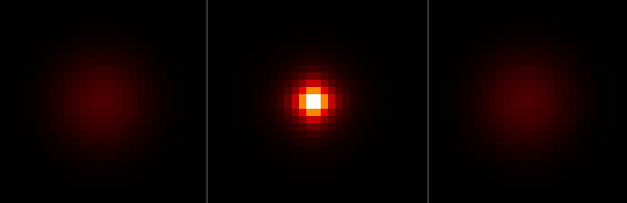

# step_0007 — 보편중력: 질량(=에너지)의 자기중력 (Poisson)

> 모든 질량이 *예외 없이* 퍼텐셜을 만들고, 모든 질량이 그 기울기를 힘으로 느낀다 = 만유인력.
> 질량이 *스스로 뭉친다* — 확산(대비를 지움)의 정확한 거울상(중력은 대비를 키운다).

## 논의 — 왜 이 step 인가 (사용자와의 결정)

0006 에서 관성(질량의 직진)을 깔았다. 이제 그 운동량을 *가속하는 힘*을 더해 중력을 창발시킨다. 형식은 **뉴턴 자기중력(Poisson)** — 다음 이유로 GR 이 아니다:

- **약장 극한**: 구조 형성(가스→별→행성)에서 GR 은 뉴턴으로 환원된다. 실제 우주 구조 시뮬도 전부 뉴턴 N-body. GR(곡률 텐서·아인슈타인 방정식)은 *가장 단순한 단위* 원칙과 충돌하고, 우리 기판(정적 격자+완화/이류 장)엔 시공간조차 없다.
- **"케이스마다 하드코딩" 우려 해소**: 진짜 뉴턴 중력은 쌍힘이 아니라 *단 한 줄의 장 법칙*(∇²Φ ∝ ρ) — 질량이 *하나의 장*을 만들고 모든 질량이 *같은 장*에 반응한다. 질량 하나에서, 케이스 없이.
- **energy=질량의 배당**: 질량은 *관성*(0006)과 *중력 원천*(0007)을 동시에 한 양으로 한다 → "관성질량=중력질량"(등가원리)이 공리가 아니라 *같은 장을 양쪽에 쓴 구조적 결과*.

**보편성**: source 가 임의의 ρ, response 가 모든 ρ → 모든 질량이 모든 질량을 끈다. 나중에 비선형 입자가 생기면 *그 입자도 질량이라* 자동으로 중력을 받는다(따로 "중력 속성" 안 붙임).

**검증 가능성**: Poisson 정합 · 인력(서로 끌림) · 운동량 보존 · 뭉침(농축↑=확산의 거울상) · PE→KE.

## 구현 — `engine/htj-gravity.js` (다섯째 법칙, 가법)

법칙은 한 인과사슬:

```
1) Poisson :  ∇²Φ = (ρ − ρ̄)              (질량 ρ=energy 가 퍼텐셜 Φ 를 만든다)
2) 가속    :  g ← g + dt·G·ρ·(a − ā),  a = −∇Φ   (기울기가 운동량을 가속)
```

두 가지를 못 박는다:

- **평균 차감(Jeans swindle)**: source 를 `(ρ−ρ̄)` 로 → 균일 밀도는 *순 힘 0*(끌 중심 없음), 오직 *밀도 대비*만 끌림. 닫힌/주기 상자에서 Poisson 가해성(∫source=0)도 만족. 이게 확산(대비를 *지움*)의 정확한 거울상 — 중력은 대비를 *키운다*(과밀이 더 과밀 = Jeans 불안정).
- **질량가중 평균 가속 ā 차감**: 내부 힘은 질량중심을 가속할 수 없다(뉴턴 3법칙) → `Σρ(a−ā)=0` → *순 운동량 정확 보존*(Poisson 수렴도와 무관).

Φ 는 **Gauss-Seidel(red-black, 주기 경계)** 완화로 푼다 — HTJ 의 *첫 장거리(비국소) 법칙*. warm-start(직전 Φ 재사용)로 진화 시 적은 iters. `G=0` 또는 `dt=0` → 항등(회귀 0). 관성(이류)와 직교: 중력은 *운동량을 가속*, 이류는 *질량을 수송*.

**확인용(viewer)**: STEPS `0007`(넓은 질량 구름 → 자기중력 수축) + `htj-gravity.js` 스크립트 + 훅 `gravityInit/gravityRun` + `capture.js --gravity`. engine 은 viewer 를 모른다(단방향).

## 검증

### (a) 수치 — `node steps/step_0007/verify.js` → **PASS (10/10)**

```
PASS  Poisson 정합 — ∇²Φ ≈ (ρ−ρ̄) (잔차 작음) = max 잔차 = 7.99e-14
PASS  인력 — 왼쪽 덩어리 +x(오른쪽으로), 오른쪽 −x(왼쪽으로) = 왼 Σgx=4.21e+0 (>0), 오 Σgx=-4.21e+0 (<0)
PASS  운동량 보존 — 내부 힘은 Σg 못 바꿈(평균 가속 차감) = |ΔΣg| = 8.66e-13
PASS  접근 — 중력으로 두 덩어리가 가까워진다(거리↓) = 간격 9.99 → 8.96
PASS  뭉침 — 농축↑(분산 증가, 확산의 거울상) = 분산 3.27e-1 → 2.35e+1
PASS  PE→KE — 붕괴하며 운동에너지 증가(낙하 가속) = KE 0.00e+0 → 1.07e+5
PASS  질량 보존 — 중력+이류 동안 Σρ 불변 = ΔM/M0 = 5.68e-15
PASS  대조 — G=0: 운동량 0 → 세계 정지(분산·거리 불변) = 분산 Δ=0.00e+0, 간격 Δ=0.00e+0
PASS  항등 — G=0/dt=0 이면 세계 불변(회귀 0) = 0x547028a5
PASS  결정론 — 같은 흐름 → 동일 지문 = 0x30cb93e9
```

**회귀 0** 확인: step_0002(10/10)·0003(12/12)·0004(14/14)·0005(11/11)·0006(11/11) 전부 재실행 PASS.

### (b) 눈 — `steps/step_0007/capture.png`



3패널(질량 밀도 z-최대 투영, heat 색): **t=0**(넓게 퍼진 흐릿한 질량 구름) → **t=T**(자기중력으로 *수축*한 밝은 고밀 코어, 피크 0.70→7.18 = 약 10배) → **G=0 대조**(구름 그대로). 자기중력이 질량을 *모으는* 것이 화면에 그대로 — **step_0002 확산(덩어리가 퍼짐)의 정확한 거울상**(모임↔퍼짐).

> 정식 viewer 캡처(`node viewer/capture.js --gravity`)는 chromium 필요 — 샌드박스 브라우저 부재로 engine 상태를 Node 에서 직접 PNG 렌더(engine 은 렌더러 독립 = 같은 세계). 사용자 머신에서 재현 가능.

## 쉽게 풀어 쓴 설명

0006 까지 질량은 *직진*만 했다 — 밀면 가고, 안 밀면 그대로. 이 step 에서 **질량이 서로를 끌어당긴다.** 방식은 "질량이 주변 공간(여기선 퍼텐셜)을 움푹 패게 하고, 다른 질량이 그 경사로 굴러떨어진다." 모든 질량이 *빠짐없이* 그렇게 하니 = 만유인력.

그림이 핵심이다. 왼쪽은 넓게 퍼진 흐릿한 질량 구름. ▶ 흐름을 주면(가운데) 그 구름이 *스스로 오므라들어* 가운데가 밝은 단단한 덩어리가 된다. 중력이 없으면(오른쪽) 구름은 그대로다. 0002 의 확산이 뜨거운 점을 *퍼뜨려* 없앴다면, 중력은 정반대로 흩어진 것을 *그러모은다.* 우주가 균일한 가스에서 별·은하 같은 *구조*로 간 바로 그 힘이다.

중요한 정직한 한계: 이 중력엔 *밀어내는 짝이 없어서*, 그냥 두면 구름이 한 점으로 무한히 붕괴한다(특이점). 별·행성·물체가 *어떤 크기에서 멈춰 서 있으려면* 반대 방향의 *반발*이 필요하다 — 그게 다음 step 이다.

## 목적에의 의미 · 다음 연결

무대→확산→탄생→점화→빛나는 별→관성(0006)→**보편중력(0007)**. 0007 은 처음으로 *모으는* 법칙이자 *첫 장거리 상호작용*이다. 균일에서 구조로 가는 우주적 다리이며, energy=질량 덕에 *질량을 가진 무엇이든 자동으로 중력을 받는다*(미래 입자 포함).

**다음(step_0008 후보) — 단거리 반발/포화:** 중력은 끌어모으기만 해 한 점 붕괴한다. *겹침을 거부하는* 단거리 반발(밀도 상한/포화)을 더하면 — ① 붕괴가 *멈춰* 유한 크기의 *지속하는 덩어리(입자)*가 서고(중력 인력 ↔ 반발의 균형), ② 같은 반발이 스케일을 올리면 *접촉*(지면이 떠받침)이 된다. 이게 방향성 메모(STATE §3)의 "선 캐릭터 = 두 법칙의 균형(중력↓ + 반발↑)"으로 가는 핵심 한 수. 검증축: 중력만 → 한 점 붕괴 vs 중력+반발 → *유한 크기 안정 덩어리*(피크 밀도가 상한에서 멈춤). (남은 격차: 무압력 dust 의 특이점·caustic, 1차 이류의 수치 확산 — 반발이 이를 정규화.)
