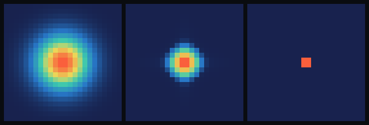

# step_0008 — 단거리 반발(압력): 밀집을 거부하는 힘 (중력의 거울짝)

> 중력이 *모으면*, 압력이 *민다*. 둘이 균형 잡는 밀도에서 붕괴가 멈춰 **유한 크기의 지속하는 덩어리**가 선다.
> step_0007 의 "한 점 무한 붕괴(특이점)"를 멈추는 핵심 한 수 — 입자·물체·접촉으로 가는 첫 자기유지 구조.

## 논의 — 왜 이 step 인가 (사용자와의 결정)

step_0007 의 중력은 끌어모으기만 해 질량 구름이 끝내 한 점으로 무한히 붕괴한다(무압력 dust 특이점, 수치적으로는 발산→NaN — 이게 "에너지가 순식간에 사라지는 것처럼 보인" 정체였다: 보존 위배가 아니라 특이점에서 산술이 깨진 것). 별·행성·물체가 *어떤 크기에서 멈춰 서 있으려면* 반대 방향의 반발이 필요하다.

**핵심 결정 — "양성자/중성자를 만들어야 하나?" → 아니다.** 사용자와의 논의 결론:

- 현실에서 중력 붕괴를 멈추는 건 스케일만 다를 뿐 **모두 한 종류 = 단거리 반발**이다: 열압력(가스) · 전자/중성자 축퇴압(백색왜성·중성자별) · EM+파울리(고체, 원자가 안 겹침) · 강력의 반발 코어(핵자가 안 겹침). 한 문장으로 압축하면 **"물질은 일정 밀도 이상으로 압축되기를 거부한다"**.
- 따라서 **핵자 구조(양성자/중성자/쿼크)를 author 하지 않는다** — 그건 창발 풍부함을 거의 0 추가하면서 author 부담만 키우는 *쓸데없이 깊은 층위*이고, HTJ 의 "타입으로 박지 말고 창발" 원칙에 어긋난다. 대신 **단 하나의 저수준 법칙 — 단거리 반발/포화**를 더하면, 중력↓ ↔ 반발↑ 이 균형 잡는 지점에서 *유한 크기 안정 덩어리*(=입자·물체)가 **창발**한다.
- **상(phase)과 플라즈마도 핵자 문제가 아니다** — 플라즈마 = 핵자가 다른 게 아니라 *물질이 충분히 뜨거워 전자가 풀린 영역*이다. 상은 *타입*이 아니라 같은 연속체 필드의 *영역(regime)*으로, **온도 필드 + 상태방정식 P(ρ,T)** 가 있으면 고체·액체·기체·플라즈마가 전부 영역으로 창발한다(플라즈마 = 온도 임계 위 = step_0004 점화 임계와 동형). → 이건 step_0009(온도)·step_0010(EoS)으로 미룬다. 이번 step 은 **가장 단순한 단위 하나**: 밀도만의 함수인 *바로트로픽 반발* P=K·ρ^γ.

**검증 가능성**: 압력 정의(밀도 단조) · 반발 방향(바깥으로) · 균일 무력 · 운동량 보존 · **붕괴 정지(peak plateau)** · 대조(반발0=폭주).

## 구현 — `engine/htj-pressure.js` (여섯째 법칙, 가법)

법칙은 한 줄의 장 법칙 + 한 줄의 가속:

```
P = K·ρ^γ                  (밀도가 높을수록 가파르게 커지는 반발 퍼텐셜)
운동량 :  g ← g − dt·∇P     (압력 기울기 = 밀집→희박 방향으로 미는 힘/부피)
```

중력이 `g ← g + dt·ρ·(−∇Φ)` 로 *대비를 키운다*면, 압력은 `g ← g − dt·∇P` 로 *대비를 지운다* — 확산과 같은 편(흩음)이지만 *탄도적*(운동량을 통해)이다.

두 가지를 못 박는다:

- **γ > 4/3 이라야 중력을 이긴다(Chandrasekhar)**: 자기중력 붕괴를 멈추려면 압력이 중력보다 *빨리* 세져야 한다. 기본 `γ=2`(≫4/3) → 깨끗이 붕괴를 멈춘다. γ<4/3 이면 못 멈춘다.
- **균일 무력 + 순 운동량 정확 보존**: 균일 밀도 → ∇P=0 → 순 힘 0(중력의 평균 차감과 같은 정신). 주기 경계 중심차분이면 `Σ_i (∇P)_i = 0`(telescoping) → `ΣΔg = 0`(내부 힘은 질량중심 못 가속, 뉴턴 3법칙) — Poisson 의 ā 차감보다도 단순한 정확 보존.

`K=0` 또는 `dt=0` → 항등(early return, 회귀 0). 중력·이류와 직교 공존(중력=모음, 압력=밀어냄, 이류=수송).

**확인용(viewer)**: STEPS `0008`(과밀 구름 → 중력↔반발 균형으로 유한 코어) + 훅 `pressureInit/pressureRun` + 패널 컨트롤 `반발(K)`. engine 은 viewer 를 모른다(단방향).

## 검증

### (a) 수치 — `node steps/step_0008/verify.js` → **PASS (10/10)**

```
PASS  압력 정의 — P=K·ρ^γ 밀도 단조증가(과밀=센 반발) = P(2)=4.0, P(4)=16.0
PASS  반발 방향 — 과밀이 바깥으로 밀린다(왼 −x, 오 +x; 인력의 거울상) = 왼 Σgx=-1.84e+0 (<0), 오 Σgx=1.84e+0 (>0)
PASS  균일 무력 — 균일 밀도 → ∇P=0 → 순 힘 0 = max|g| = 0.00e+0
PASS  운동량 보존 — 주기 중심차분 → Σ∇P=0 → ΣΔg 정확 보존 = |ΔΣg| = 3.22e-16
PASS  붕괴 정지 — 중력+반발: peak 유한·plateau(후반 성장비≈1) = peak 33.27→35.26 (성장비 1.060)
PASS  대조(반발0) — 중력만: peak 폭주(반발 대비 ≫ 큼) = 중력만 peak=2.76e+9 vs 반발 peak=35.26 (비율 7.82e+7)
PASS  질량 보존 — 중력+반발+이류 동안 Σρ 불변 = ΔM/M0 = 2.10e-14
PASS  항등 — K=0 이면 세계 불변(회귀 0) = 0x2654c565
PASS  항등 — dt=0 이면 세계 불변(회귀 0) = 0xefb69dc5
PASS  결정론 — 같은 흐름 → 동일 지문 = 0xfc88757f
```

**회귀 0** 확인: step_0002·0003·0004·0005·0006·0007 전부 재실행 PASS.

### (b) 눈 — `node steps/step_0008/capture.js` → `steps/step_0008/capture.png` (눈 검증 PASS)

3패널(질량 밀도 z-최대 투영, heat 색, 패널별 상대 스케일):



- **① 초기 구름**(넓게 퍼진 흐릿한 과밀 구름, 점유 112cell)
- **② 중력+반발(K=0.2)** → *퍼진 유한 코어*(밝은 중심 + 부드러운 가장자리, 점유 32cell, peak 8.78에서 plateau) — **붕괴가 유한 크기에서 멈췄다**
- **③ 중력만(K=0)** → *한 점*(1~2 셀의 점 스파이크, 점유 4cell, peak 582로 폭주 중) — 반발이 없으면 점으로 무너진다

반발 코어가 붕괴 점보다 **8× 넓게** 퍼져 — *유한 크기 안정 덩어리*가 화면에 그대로. (chromium 부재로 engine 직접 PNG 렌더; engine 은 렌더러 독립 = 같은 세계. 사용자 머신에선 viewer.html `0008` 에서 재현.)

## 쉽게 풀어 쓴 설명

0007 에서 중력은 질량을 *모으기만* 했다 — 그래서 구름이 한 점으로 끝없이 무너졌다(그 "사라진 에너지"의 정체). 이 step 에서 **밀집을 거부하는 반대 힘(압력)**을 더한다. 방식은 "빽빽한 곳일수록 더 세게 밀어낸다"(P=K·ρ²). 그러면 안으로 떨어지던 질량이 *어느 밀도에서 되튕겨* 더는 못 들어간다.

그림이 핵심이다(가운데 패널). 중력만(오른쪽)이면 구름이 *한 픽셀*로 무너지지만, 반발을 켜면(가운데) 구름이 수축하다 *멈춰서* 가장자리가 부드러운 **퍼진 공**으로 선다. 이게 처음으로 *스스로 크기를 지키며 버티는 덩어리* — 돌멩이든 별이든, "어떤 크기로 거기 있는 물체"의 씨앗이다. 같은 반발을 스케일 올리면 "지면이 발을 떠받치는 접촉"이 된다.

## 목적에의 의미 · 다음 연결

…관성(0006) → 중력(0007, 첫 *모으는* 법칙) → **반발(0008, 첫 *멈추는* 힘)**. 0007+0008 = **중력↓ + 반발↑ 의 균형** = §3 방향성 메모가 짚은 *"선 캐릭터"의 두 법칙* 중 골격. 처음으로 author 없이 **유한 크기 자기유지 구조**(입자·물체의 씨앗)가 창발했다.

**다음(step_0009 후보) — 내부에너지/온도 `T`:** 지금 반발은 밀도만의 함수(P=K·ρ^γ) — 차가운 "축퇴압"에 가깝다. 압력을 *온도의 함수* P(ρ,T) 로 올리면:
- 붕괴로 잃던 운동E가 **열**이 되어 — step_0007 의 "사라진 에너지" 장부를 *닫고*(KE→내부E 변환 추적) —
- 별이 *열압력으로* 서고(압축→가열→팽창→안정),
- step_0010(상태방정식 P(ρ,T))에서 **고체·액체·기체·플라즈마가 같은 필드의 영역으로 창발**한다(플라즈마 = 온도 임계 위, step_0004 점화와 동형).

이후 사다리: 반발에 *단거리 인력*(응집/표면장력)을 더하면 → 표면을 가진 *개별 물체*의 정체성 → 결합(입자→물체) → 물체 승격. 핵자 분리는 이 사다리 어디에도 들어가지 않는다 — 단위는 늘 "안정 덩어리"이지 양성자가 아니다.
