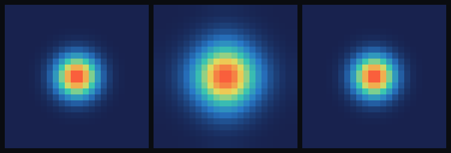

# step_0010 — 열압력 되먹임(능동 압력): 열이 물질을 민다 (KE↔내부E 가역 교환)

> step_0009 의 온도는 *수동*(측정만). 이 step 에서 **열압력이 운동량을 되민다** — 내부에너지가
> *역학적 일*을 해 물질을 밀고, 그 일은 다시 열로 회계된다. **KE↔내부E 가 가역 교환되며 보존**된다.
> 이로써 step_0007 의 "사라진 에너지"가 *열로* 닫힌다 — 단, *가역*이라 진동을 **감쇠하진 않는다**.

## 논의 — 왜 이 step 인가 (사용자와의 발견)

사용자가 viewer 에서 step_0008 을 길게 돌리니 **에너지가 사라졌다**. 직접 측정해 정체를 밝혔다 — *사라진 게
아니라 **CFL 위반으로 수치 발산(NaN)***이었다(약 90스텝에서 `|v|·dt>1` → donor-cell 이류가 음수 밀도 생성
→ 폭주 → overflow → NaN; viewer 는 NaN 셀을 못 그려 "사라진 듯" 보임). 물리적 무한 붕괴는 0008 이 멈췄지만,
**탄성 bounce 에 KE 소산이 없어**(반발은 보존력) 진동이 누적되다 수치적으로 터진 것이다.

그 물리적 공백 — "붕괴 운동E가 어디로도 안 빠진다" — 을 메우려 **열압력 되먹임**으로 간다:
- step_0009 의 열압력 P_th=(γ−1)u 의 기울기로 운동량을 *되민다*(g ← g − dt·∇P_th, step_0008 압력 푸시의 *열* 버전).
- 그 압력이 한 **일**(work)은 PdV 로 내부에너지에 되돌아간다(u ← u − dt·P_th·∇·v).
- 둘이 짝지어 **KE↔내부E 가역 교환**(총E=KE+u 보존) → 붕괴 KE 가 *열로 회계*된다(사라지지 않음).

**정직한 발견(중요) — 가역 되먹임은 *감쇠하지 않는다*.** 구현해 측정해 보니, 열압력 되먹임을 켜도
step_0008 의 발산은 *안 멈췄다*(오히려 데워진 가스가 더 뻣뻣해 더 일찍 터짐). 이유: 이 교환은 **가역(단열)** —
KE 를 열에 *잠시 맡겼다 그대로 돌려준다*(엔트로피 생성 0). 그래서 진동은 *무감쇠*다. 별이 *정착*하려면
**비가역 소산**(충격/점성 가열 = bulk KE 를 열로 *일방* 전환, 또는 복사 냉각 = 열을 세계 밖으로)이 필요하다.
→ 이건 다음 step. 이번엔 "가장 단순한 단위 하나" = *가역* 열압력(능동 압력 + KE↔u 보존)만.

**검증 가능성**: 능동 푸시 방향·균일 무력·운동량 보존·**KE↔내부E 보존(1차·dt 수렴)**·가역 방향(팽창=식음/압축=데움).

## 구현 — `engine/htj-thermal.js` `applyThermalPressure` (여덟째 법칙, 가법)

```
P_th = Kth·(γ−1)·u                 (열압력 = 이상기체; Kth=결합 노브)
운동량 :  g ← g − dt·∇P_th          (압력힘; ΔKE ≈ −dt·v·∇P_th)
내부E  :  u ← u − dt·P_th·(∇·v)     (PdV 일; 압축 ∇·v<0 → u↑)
```

두 조각이 한 인과다 — 압력이 운동량에 한 일이 그대로 내부에너지의 PdV 항이다. 합의 1차 =
`−dt·(v·∇P + P·∇·v) = −dt·∇·(P v)` → 주기 경계서 `Σ∇·(Pv)=0`(telescoping) → **총E=KE+u 보존**(연속체에서
정확, 명시적 이산에서 1차·dt 수렴). ∇·v 는 *밀기 전* 속도(`divergence`)로 계산해 push 와 가열이 같은 시점 v 를
공유한다. 운동량 푸시는 주기 중심차분(step_0008 stencil) → `Σ∇P=0` → **순 운동량 정확 보존**.

`Kth=0` 또는 `dt=0` → 항등(early return, 회귀 0). energy(ρ)는 안 건드린다(질량은 이류 담당).

> **step_0009 `applyHeating` 과의 관계**: 0009 의 수동 가열(−γu∇·v, advect 없는 단독 단열용)을 0010 흐름에서는
> 쓰지 않는다. 능동 흐름은 `advect(scalars:['therm'])` 로 u 를 *수송*하고 `applyThermalPressure` 의 PdV(−(γ−1)u∇·v)가
> *소스* — 오일러 보존형으로 일관(0009 의 −u∇·v 는 advect 의 수송분에 흡수). 0009 는 그 step 의 닫힌 진실로 불변.

**확인용(viewer)**: STEPS `0010`(작고 뜨거운 덩어리 → 제 열압력으로 팽창) + 노브 `열압력(Kth)` + 훅
`thermPressInit/thermPressRun`·`kineticEnergy/internalEnergy`. engine 은 viewer 를 모른다(단방향).

## 검증

### (a) 수치 — `node steps/step_0010/verify.js` → **PASS (8/8)**

```
PASS  능동 정의 — 뜨거운 덩어리가 바깥으로 밀린다(열압력 P=Kth(γ−1)u) = 왼 Σgx=-1.77e+0 (<0), 오 Σgx=1.77e+0 (>0)
PASS  균일 무력 — 균일 u·ρ → ∇P=0·∇·v=0 → 운동량·u 불변 = max|g|=0.00e+0, max|Δu|=0.00e+0
PASS  운동량 보존 — 주기 중심차분 → Σ∇P=0 → ΣΔg 정확 보존 = |Σg| = 5.10e-16
PASS  KE↔내부E 보존 — 열이 운동을 만들고(u→KE) 총E 보존·1차 수렴 = KE 0→1749, u 2000→288; 표류 1.87%→1.02%(dt½, 비율 1.83)
PASS  가역 방향 — 팽창은 식히고(u↓·KE↑), 압축은 데운다(u↑) = 팽창 u 2000→1672; 압축 코어 u 5.16→5.21
PASS  항등 — Kth=0 이면 세계 불변(회귀 0) = 0x5563d9d5
PASS  항등 — dt=0 이면 세계 불변(회귀 0) = 0x6acbf135
PASS  결정론 — 같은 흐름 → 동일 지문 = 0xc1f8ded5
```

**회귀 0** 확인: step_0002·0003·0004·0005·0006·0007·0008·0009 전부 재실행 PASS.

### (b) 눈 — `node steps/step_0010/capture.js` → `steps/step_0010/capture.png` (눈 검증 PASS)

질량 밀도 ρ 의 z-최대 투영(패널별 상대 색):



- **① 초기 뜨거운 덩어리**(작고 조밀, 점유 44cell, peak 4.30, u=3000)
- **② 열압력 ON(Kth=0.5)** → *팽창한 구름*(점유 104cell, peak 1.25) — **열이 능동적으로 밀어** 퍼졌다(u 3000→2181, KE 0→840)
- **③ 열압력 OFF(Kth=0)** → *그대로*(점유 44cell, 불활성)

ON 이 OFF 보다 **2.4× 넓게** 퍼져 — *내부에너지가 역학적 일을 해 물질을 밀었다*(KE↔u 교환). 차가운 0008 반발이
*밀도*로 미는 것과 달리, 여기선 *온도(열)*가 민다. (chromium 부재로 engine 직접 PNG 렌더; engine 은 렌더러 독립.
사용자 머신에선 viewer.html `0010` 에서 재현.)

## 쉽게 풀어 쓴 설명

지금까지 온도는 "측정만 되는" 수동 숫자였다. 이 step 에서 **열이 *힘*을 갖는다** — 뜨거운 가스가 *제 열로*
바깥을 밀어낸다(풍선 속 더운 공기가 풍선을 부풀리듯). 그림(가운데)이 그것 — 작고 뜨거운 덩어리가 열압력으로
*저절로 팽창*한다. 열압력을 끄면(오른쪽) 똑같은 덩어리가 *꿈쩍 안 한다*. 즉 "온도"가 운동을 *만들어낸다*.

그리고 핵심 회계: 밀어낼 때 **운동에너지가 늘면 그만큼 열(내부에너지)이 준다 — 합은 보존된다**. 이게
step_0008 에서 "사라진 듯" 보였던 에너지의 진짜 행방을 닫는다 — 에너지는 사라지지 않고 *운동↔열* 사이를 오간다.

**다만 정직하게**: 이 교환은 *가역*이라(빌려줬다 그대로 돌려받음) 진동을 *멈추진 못한다*. 별이 *정착해서 서려면*,
운동에너지가 열로 *영영* 빠져 다신 안 돌아와야 한다(엔트로피 증가 = 비가역) — 충격/마찰 가열이나 복사로 식는 것.
그게 다음 step 이다. 즉 이번엔 "열이 민다 + 에너지 장부가 닫힌다"까지, 정착은 아직.

## 목적에의 의미 · 다음 연결

…반발(0008, 차가운·멈춤) → 온도(0009, 데움·수동) → **열압력(0010, 능동·교환)**. 처음으로 *열이 동역학을 바꾼다* —
별이 *열압력으로* 서는 부품이 생겼다(차가운 축퇴압과 다른 진짜 가스 별). step_0007 의 "사라진 에너지"는
**KE↔내부E 보존**으로 회계가 닫혔다(사라짐이 아니라 형태 변환).

**다음(step_0011 후보) — 비가역 소산으로 *정착*:** 이번 가역 되먹임은 진동을 못 멈춘다(무감쇠 + CFL 발산). 별이
*가만히 서려면* KE 가 열로 *일방* 빠져야 한다:
- **충격/점성 가열**(artificial viscosity): 수렴 충격에서 bulk KE → 열(엔트로피↑, 비가역) → 진동 감쇠 → 코어 정착. CFL 도 안정화.
- 또는 **복사 냉각**(step_0005 의 radiate 를 therm 에): 열을 세계 밖으로 → 압축↔복사 균형(영구 그래디언트, 0005 의 별 트랙과 합류).
이 둘 중 하나가 step_0008 의 발산을 *물리적으로* 끝낸다.

그 다음 — **상태방정식 P(ρ,T) → 상(phase)**: 온도 임계 위=플라즈마(0004 점화와 동형), 아래=고체·액체·기체 영역으로
*창발*. 상은 타입이 아니라 regime — author 안 한다.
