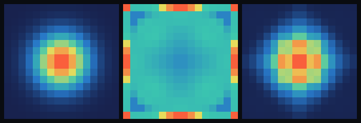

# step_0011 — 비가역 소산(인공 점성/충격 가열): bulk 운동E를 *열로 일방* 전환 → 진동이 *정착*한다

> step_0010 의 열압력은 KE↔내부E 를 *가역*(단열)으로 교환해 진동을 **감쇠하지 못했다**(무감쇠 + CFL 발산).
> 이 step 은 **압축에서만 켜지는 인공 점성**으로 bulk 운동E를 열로 *일방* 떼어낸다(엔트로피↑). 식히는 법이
> 없어 운동E가 다시 안 돌아오므로, 출렁이던 덩어리가 *가만히 선다* — 별이 처음으로 **정착**한다.

## 논의 — 왜 이 step 인가

step_0010 의 정직한 발견: 가역 열압력은 KE 를 열에 *잠시 맡겼다 그대로 돌려준다*(엔트로피 생성 0) →
진동을 못 멈춘다. 별이 *정착해서 서려면* 운동E가 열로 **영영** 빠져 다시 안 돌아와야 한다 = **비가역 소산**.
또한 사용자가 본 step_0008 의 "에너지가 사라짐"의 정체는 CFL 위반 수치 발산(NaN)이었고, 그 근인은
**탄성 bounce 에 KE 소산이 0** 이라 진동이 누적된 것 — 비가역 소산이 그 물리적 공백을 메운다.

STATE NEXT 의 두 후보(① 충격/점성 가열 ② 복사 냉각) 중 **① 인공 점성**을 택했다 — 진동을 *내부에서*
직접 감쇠시켜 step_0008 의 발산을 물리적으로 끝내는 가장 곧은 단위다(복사 냉각은 열을 세계 밖으로 빼는
별도 트랙 = 다음 후보).

**검증 가능성**: 압축 전용 작동·**비가역 일방 밸브**(가역 열압력과 대비)·총E=KE+u 보존(1차·dt 수렴)·
운동량 보존·균일 무력·**감쇠(잔류 KE 가 점성 ON≪OFF)**.

## 구현 — `engine/htj-viscosity.js` `applyViscosity` (아홉째 법칙, 가법)

```
q = Kvisc·ρ·(∇·v)²   단 ∇·v<0(압축)에서만, 아니면 0       (점성 압력, q≥0)
운동량 :  g ← g − dt·∇q          (압축 흐름 *감속* = bulk KE 제거)
내부E  :  u ← u − dt·q·(∇·v)      (PdV 일; ∇·v<0 → u↑ = 가열, 항상 ≥0)
```

step_0010 의 열압력(`applyThermalPressure`)과 **구조가 같다** — 두 조각이 짝지어 총E=KE+u 보존(1차 합 =
`−dt·∇·(q v)` → 주기 경계서 `Σ=0` telescoping), 운동량 정확 보존(주기 중심차분 `Σ∇q=0`). **결정적 차이는
q 가 압축(∇·v<0)에서만 켜진다**는 것 — 팽창에서는 q=0 이라 *식히는 법이 없다*. 그래서 한 진동 사이클에서
압축은 KE 를 열로 떼어가고 팽창은 돌려주지 않아 → **KE 가 열로 *일방* 빠진다**(엔트로피 단조↑ = 비가역).
이것이 가역 열압력과의 본질적 대비이자, 진동을 *감쇠*시켜 별을 *정착*시키는 부품이다.

`Kvisc=0` 또는 `dt=0` → 항등(early return, 회귀 0). energy(ρ)는 안 건드린다(질량은 이류 담당). ∇·v 는
*밀기 전* 속도로 계산해 push 와 가열이 같은 시점 v 를 공유(짝 일관, 열압력 stencil 과 동일).

**확인용(viewer)**: STEPS `0011`(중력↔열압력 진동 + 점성 소산) + 노브 `점성(Kvisc)`. engine 은 viewer 를
모른다(단방향).

## 검증

### (a) 수치 — `node steps/step_0011/verify.js` → **PASS (9/9)**

```
PASS  소산 정의 — 압축(∇·v<0) → bulk KE↓·내부E↑(가열) = ΔKE=-7.04e-2(↓), Δu=7.04e-2(↑, |ΔKE|≈Δu)
PASS  비가역 일방 밸브 — 점성은 팽창서도 안 식힘(Δu≥0, 일방), 가역 열압력은 식힘(Δu<0) = 점성 Δu=1.83e-2 (≥0, 안 식힘), 열압력 Δu=-20.9 (<0, 식힘)
PASS  총E=KE+u 보존 — 점성=형태 변환(KE→u), 표류 작고 dt½ → 표류 절반(1차) = KE→u(잔여 KE 4.01, u 1005→1001); 표류 0.00%→0.00%(비율 2.00)
PASS  운동량 보존 — 주기 중심차분 → Σ∇q=0 → ΣΔg 정확 보존 = |ΣΔg| = 3.00e-16
PASS  균일 무력 — 균일 ρ·균일 v → ∇·v=0 → q=0 → 운동량·u 불변 = max|Δu|=0.00e+0, max|Δg|=0.00e+0
PASS  감쇠(정착) — 점성 ON → 진동 운동E 강하게 감쇠(잔류·peak KE ↓) vs OFF(무감쇠) = 잔류 KE ON=178.0 ≪ OFF=1105.6; peak KE ON=178 < OFF=1380
PASS  항등 — Kvisc=0 이면 세계 불변(회귀 0) = 0x5563d9d5
PASS  항등 — dt=0 이면 세계 불변(회귀 0) = 0xc1794845
PASS  결정론 — 같은 흐름 → 동일 지문 = 0xd4e86405
```

> **표류 0.00% 주석**: 수렴 속도장에 점성만 가했을 때 KE↔u 교환량이 작아(잔여 KE 4) 표류가 소수점
> 둘째 자리 아래다 — dt½ 비율은 정확히 2.00(1차 수렴)으로 보존 구조를 못 박는다.

**회귀 0** 확인: step_0002·0003·0004·0005·0006·0007·0008·0009·0010 전부 재실행 PASS.

### (b) 눈 — `node steps/step_0011/capture.js` → `steps/step_0011/capture.png` (눈 검증 PASS)

질량 밀도 ρ 의 z-최대 투영(패널별 상대 색). 같은 중력+열압력 진동을 60스텝 굴린 결과:



- **① 초기 뜨거운 덩어리**(정지, 점유 52cell, peak 3.59, KE=0)
- **② 점성 OFF(Kvisc=0)** → *무감쇠*: 가역 열압력↔중력이 계속 출렁여 질량이 **상자 전체로 흩어진다**(점유 244cell, peak 1.08, 잔류 KE=1106) — 정착 못 함
- **③ 점성 ON(Kvisc=0.8)** → *감쇠/정착*: bulk KE 가 열로 일방 빠져 **코어가 가만히 선다**(점유 68cell, peak 3.03, 잔류 KE=178)

점성 ON 의 잔류 KE 가 OFF 의 **16%** — *비가역 소산이 진동을 정착*시킨다. 가운데(OFF)는 구조가 없는
출렁이는 죽이 되고, 오른쪽(ON)은 *안정한 덩어리*로 선다. (chromium 부재로 engine 직접 PNG 렌더; engine 은
렌더러 독립. 사용자 머신에선 viewer.html `0011` 에서 재현 — `점성(Kvisc)`을 0↔0.8 로 토글.)

## 쉽게 풀어 쓴 설명

step_0010 에서 "열이 물질을 민다"를 봤지만, 그 밀기는 *되돌릴 수 있는*(빌려줬다 돌려받는) 거래라 한번
출렁이기 시작한 덩어리는 *영영 출렁였다*(그네가 마찰 없이 영원히 흔들리듯). 이 step 은 **마찰**을 준다 —
단, 뭉치려고 *압축될 때만* 작동하는 마찰이다. 압축될 때 운동에너지를 *열로 떼어가고*, 도로 퍼질 때는
**돌려주지 않는다**. 그래서 출렁임의 운동에너지가 매 사이클 조금씩 열로 빠져나가 결국 **덩어리가 가만히
선다**(그림 오른쪽). 마찰을 끄면(가운데) 영영 출렁이며 상자 전체로 흩어진다.

핵심은 *비가역*이다 — 에너지는 (여전히) 사라지지 않고 운동→열로 옮겨가지만, 이번엔 **한 방향으로만**
간다(열은 다시 운동이 안 된다). 이 "한 방향" 이 바로 별이 *정착*할 수 있게 하는 것이고, step_0008 에서
출렁임이 누적되다 수치적으로 터지던(CFL 발산) 문제를 *물리적으로* 멈춘다.

## 목적에의 의미 · 다음 연결

…온도(0009, 데움·수동) → 열압력(0010, 능동·가역·교환) → **비가역 소산(0011, 일방·감쇠·정착)**. 0010 이
"열이 동역학을 바꾼다"를 줬다면, 0011 은 처음으로 **계가 평형으로 *정착*하는 화살(시간의 방향)**을
준다(엔트로피 단조↑). 별이 *진짜로 가만히 서는* 마지막 부품 — 중력(모음)↔열압력(되밀기)↔점성(소산)이
함께 굴러 **안정한 덩어리**가 선다.

**다음(step_0012 후보):**
- **복사 냉각**(step_0005 의 radiate 를 therm 에): 점성으로 쌓인 열을 세계 밖으로 빼면 압축↔복사 균형의
  *영구 그래디언트*(0005 의 별 트랙과 합류) — *빛나며 식는* 별.
- **상태방정식 P(ρ,T) → 상(phase)**: 정착한 덩어리에 온도 임계를 더하면 고체·액체·기체·플라즈마가 같은
  필드의 *영역*으로 갈린다(플라즈마=온도 임계 위, step_0004 점화와 동형). 상은 타입이 아니라 regime —
  author 안 한다.

그 뒤 — 정착한 질량의 회전·궤도·충돌, 그리고 단거리 인력(응집/표면장력)으로 *개별 물체*의 정체성으로.

## 버그 수정 노트 (step_0013 참조) — 점성 CFL 서브스텝

step_0013 의 폭주 수정으로 `applyViscosity` 에 **CFL 서브스텝**(`Kvisc·|∇·v|·dt>1` 이면 dt 를 nsub 로 쪼갬)이 들어갔다 — advect CFL 가드의 점성 버전. 인공 bulk 점성은 확산형이라 강한 압축(붕괴)에서 `Kvisc·|∇·v|·dt≤1` 을 넘으면 발산하는데, 서브스텝이 그걸 막는다. **CFL 안전 흐름은 nsub=1 → byte-동일(회귀 0)** 이라 이 step verify 9/9 불변. 상세는 [step_0013.md](../step_0013/step_0013.md) 「버그 수정」.
