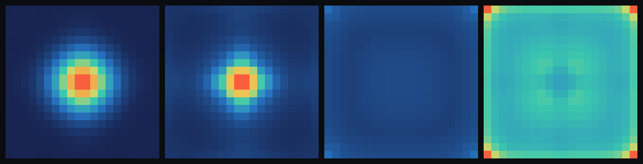

# step_0012 — 내부 발열(별의 점화, 온도 버전): 같은 법칙에서 *별*과 *돌*이 임계로 갈린다

> step_0011 까지로 *돌*(차가운 정착 덩어리)은 창발했다. 이 step 은 **밀도·온도 게이트 내부 발열**로
> *별*(에너지를 방출하는 존재)을 더한다 — 무겁고 뜨거운 코어만 점화해 *스스로 열을 만든다*(질량 보존).
> 무거우면 별, 가벼우면 돌. **같은 법칙·임계 하나로 갈린다 — author 안 한다.**

## 논의 — 왜 이 step 인가 (사용자 요구)

사용자: *"별처럼 에너지를 방출하는 존재도 있고 돌처럼 덩어리로 존재하는 존재도 있는 걸 지금 법칙으로
표현할 수 있어야 한다."* 진단해 보니:
- **돌**(차가운 덩어리)은 *이미 가능* — step_0007~0011 의 정착 코어(낮은 T=u/ρ, 불활성 질량).
- **별**(에너지 방출)은 *부품은 있으나 미통합* — step_0004 점화·step_0005 복사는 `energy`(=질량) 필드에
  붙어 있어, **0006 에서 energy=질량(E=mc²)을 못 박은 뒤로는 "복사=질량 소실·점화=질량 생성"** 이 되어
  물리적으로 어긋난다. 별의 에너지 방출은 *질량*이 아니라 **열(therm/온도)** 에서 나와야 한다.

그래서 점화를 **온도장(therm)에 연결**해 별/돌을 *같은 동역학의 두 regime*으로 가른다. 이번엔 가장 작은
단위 — **내부 발열(점화)** 하나(복사 냉각은 다음 step).

**검증 가능성**: 점화 게이트(ρ·T AND)·질량 보존·발열량 정확·자기지속(latch)·**별 vs 돌(질량이 가른다)**.

## 구현 — `engine/htj-fusion.js` `applyFusion` (열째 법칙, 가법)

```
게이트:  ρ ≥ ρ_crit  AND  T ≥ T_crit         (T=u/ρ; 무겁고 뜨거운 코어만 켜진다)
내부E :  u ← u + dt·rate·ρ   (게이트 켜진 셀)  (질량당 발열률 × 질량 = 발열)
```

핵융합 점화의 본질을 한 게이트로 — 밀도·온도가 임계를 넘으면 내부 에너지원이 켜져 therm 을 데운다.
**`energy`(ρ)는 절대 안 건드린다** → 별이 빛을 내도 질량 보존(step_0005 의 질량 소실 문제를 닫는다).
만들어진 열은 step_0010 열압력으로 코어를 *부풀리고*(별이 큼), 다음 step 의 복사로 식는다.

**별과 돌이 같은 법칙의 두 regime**: 무겁고 조밀한 코어는 중력 압축(0009/0010 의 PdV 가열)으로 ρ·T 가
임계를 넘어 점화 → 자기 발열·자기지속(별). 가볍거나 차가운 덩어리는 임계 못 넘어 게이트가 *영영 안
켜짐* → 그냥 식음(돌). 현실 그대로 — 질량이 임계(~0.08 태양질량) 넘으면 별, 못 넘으면 행성/돌.

`rate=0` 또는 `dt=0` → 항등(early return, 회귀 0). 중력·반발·열압력·점성·이류와 직교 공존.

**확인용(viewer)**: STEPS `0012`(질량만 다른 두 덩어리 → 별/돌) + 노브 `발열률(rate)`. engine 은 viewer 를
모른다(단방향).

## 검증

### (a) 수치 — `node steps/step_0012/verify.js` → **PASS (8/8)**

```
PASS  점화 게이트 — ρ≥ρ_crit ∧ T≥T_crit (무겁고 뜨거운 셀만 발열) = dense+hot Δu=5.0(>0); dense+cold/sparse+hot/sparse+cold Δu=0
PASS  질량 보존 — energy(ρ)는 안 건드린다(별이 빛내도 질량 유지) = fp(energy) 불변 = 0x8e7a252b
PASS  발열량 정확 — Δu = dt·rate·ρ = Δu=6.000 (예측 dt·rate·ρ=6.000)
PASS  자기지속(latch) — 점화 셀 u 단조↑·게이트 유지(켜지면 유지=별) = T 3.0→6.0 (단조↑·계속 점화)
PASS  별 vs 돌 (질량이 가른다) — 무거움=발열 활성(ON≫OFF, 별), 가벼움=발열 불활성(ON≡OFF, 돌) = 별 maxT ON=10.7≫OFF=5.1(점화·부풂 peak 7.6<30.9); 돌 maxT=2.4 ON≡OFF(불활성)
PASS  항등 — rate=0 이면 세계 불변(회귀 0) = 0x17ca76fc
PASS  항등 — dt=0 이면 세계 불변(회귀 0) = 0x17ca76fc
PASS  결정론 — 같은 흐름 → 동일 지문 = 0x3a6cdf5a
```

**회귀 0** 확인: step_0002~0011 verify 전부 재실행 PASS.

> **별 vs 돌 핵심 수치**: 같은 법칙·같은 임계(ρ_crit=6·T_crit=3)로 *질량만* 다른 두 덩어리를 80스텝
> 붕괴시킨 결과 — **무거운 코어(M0=4000)** 는 발열 ON 이 OFF 보다 훨씬 뜨겁고(maxT 10.7 vs 5.1) 발열로
> *부푼다*(peak 7.6 vs 30.9) = **점화한 별**. **가벼운 코어(M0=1000)** 는 발열 ON 이 OFF 와 *byte-동일*
> (게이트 영영 미달 → 발열 법칙 불활성) = **차가운 돌**.

### (b) 눈 — `node steps/step_0012/capture.js` → `steps/step_0012/capture.png` (눈 검증 PASS)

질량만 다른 두 덩어리(돌 M0=1000 · 별 M0=4000)를 같은 법칙으로 붕괴. 4패널 — ①돌 ρ ②별 ρ ③돌 T ④별 T
(온도는 **공유 절대 스케일**):



- **① 돌 ρ** — 조밀한 차가운 코어(peakρ 3.2)
- **② 별 ρ** — 코어가 발열·열압력으로 *부푼다*
- **③ 돌 T** — *어둡게 차갑다*(maxT 2.4, 점화셀 0 = 임계 미달)
- **④ 별 T** — *밝게 뜨겁다*(maxT 10.7, u=16467 = 점화·자기발열)

온도 패널의 대비가 헤드라인 — **별은 뜨겁고 돌은 차갑다**. 질량(돌 Σρ=1000·별 Σρ=4000)은 정확 보존,
NaN 없음. (chromium 부재로 engine 직접 PNG 렌더; engine 은 렌더러 독립. 사용자 머신에선 viewer.html
`0012` 에서 재현 — `발열률(rate)`을 0↔2 로 토글하면 별이 식어 돌이 된다.)

## 쉽게 풀어 쓴 설명

지금까지 만든 덩어리는 다 *돌*이었다 — 뭉쳐서 식어 가만히 있는 차가운 질량. 이 step 은 **별**을 더한다.
차이는 딱 하나의 규칙: *충분히 무겁고 뜨거운 코어는 스스로 열을 만든다*(핵융합 점화처럼). 가벼운 덩어리는
이 규칙이 *영영 안 켜져서* 그냥 돌로 남는다. 무거운 덩어리는 중력이 짓눌러 뜨거워지다 임계를 넘는 순간
점화해 *스스로 타오르는 별*이 된다 — 그림(오른쪽 두 칸)에서 별은 밝게 뜨겁고, 돌(왼쪽)은 어둡게 차갑다.

핵심은 **별과 돌을 따로 만들지 않았다**는 것 — *똑같은 법칙*에 질량만 다르게 줬더니 하나는 별, 하나는
돌이 됐다(author 안 함). 그리고 별이 빛(열)을 내도 **질량은 줄지 않는다**(빛은 *열*에서 나오지 *질량*에서
나오지 않는다) — 이게 step_0005 에서 "복사가 질량을 깎던" 모순을 바로잡는다.

## 목적에의 의미 · 다음 연결

…정착(0011) → **내부 발열(0012, 별의 점화)**. 처음으로 세계가 **에너지를 *생성*하는 능동적 존재(별)와
불활성 존재(돌)** 를 *동시에*, *같은 법칙*으로 표현한다 — 사용자 요구("별도 돌도 표현 가능해야") 충족.
0004 의 "별은 author 안 한다"를 질량·온도 세계로 끌어올려 못 박았다.

**다음(step_0013 후보):**
- **복사 냉각(therm sink, 질량 보존)**: 발열로 쌓인 열을 세계 밖으로 → 발열↔복사 균형의 *영구 그래디언트*
  (뜨거운 코어→식는 표면) = 빛나며 식는 지속 별(step_0005 별 트랙 합류, 단 *질량 보존* 으로 교정). 발열이
  꺼진 돌은 남은 열을 복사하고 *완전히 식는다*.
- **상태방정식 P(ρ,T) → 상(phase)**: 점화 영역=플라즈마(별), 그 아래=고체·액체·기체(돌의 상). 같은 필드의
  *영역*으로 — 상은 타입이 아니라 regime.
