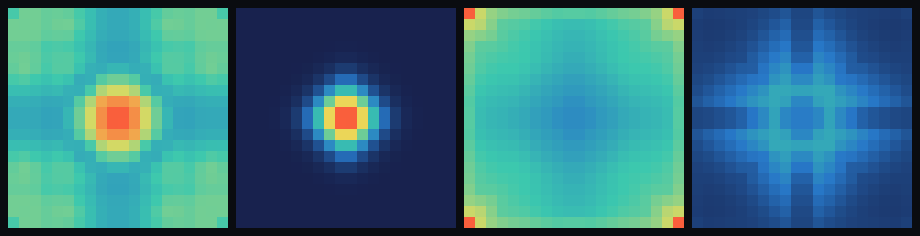

# step_0013 — 복사 냉각(빛으로 식는 별) = 열의 *출구*, 질량 보존

> 열한째 법칙. step_0012 의 발열(점화)에 **복사 냉각**을 더한다 — 뜨거운 물질이 열을 빛으로 내버린다.
> 발열(source)↔복사(sink)가 균형 잡아 별이 *유한 정상상태*에서 빛나고, 식어서 *뭉친 채* 유지된다.

## 논의 — 왜 이 step 인가

step_0012 의 별은 점화하면 코어에 열을 *무한정* 쌓았다(복사가 없어 runaway — STATE 가 "(주시) 발열 무제한 runaway"로 남겨둔 격차). 현실의 별은 **빛난다** = 열을 공간으로 내버린다. 그래서:

- 별은 발열↔복사가 균형 잡는 **정상상태 온도**에서 멈춘다(무한히 뜨거워지지 않는다).
- 열을 버려야 별이 *부풀어 흩어지지 않고* 중력에 뭉친 채 유지된다 — **냉각이 별을 *유지*시킨다**.
- 발열이 꺼진 *돌*은 남은 열을 복사하고 **완전히 식는다**.

step_0005 의 경계 복사는 `energy`(=질량)를 내보내 — 0006 의 energy=질량(E=mc²) 이후로는 "복사=질량 소실"이라 어긋난다. **빛은 질량이 아니라 *열(therm)* 에서 나와야 한다.** 이 step 은 `therm` 만 줄인다(발열 0012 의 거울짝: 발열=u 의 source, 복사=u 의 sink, 둘 다 ρ 불변).

**무엇으로 검증 가능한가**: ① 평형온도 정량(T*=rate/coolRate, 밀도 무관) ② runaway 닫힘(발열만 vs 발열+복사) ③ 붕괴에서 냉각 ON=조밀·점화 지속 vs OFF=흩어짐 ④ 질량 보존·열 회계. **무엇이 보존/변하나**: energy(질량)·열 회계(u 감소=radiated 증가) 보존 / 내부에너지 u 가 빛으로 빠진다.

## 구현 — `engine/htj-cooling.js` (열한째 법칙, 가법)

법칙은 **광학적으로 얇은 회색 복사** 하나 — 모든 셀이 제 내부에너지에 비례해 열을 빛으로 방출:

```
u ← u·(1 − dt·coolRate)        (du/dt = −coolRate·u, 셀마다)
빛 = Σ dt·coolRate·u → world.radiated 장부(빛으로 나간 총량)
energy(ρ)는 절대 안 건드린다 → 질량 보존
```

- **세계 안 u 감소분 = 세계 밖 radiated 증가분**(열 회계 보존, step_0005 의 `world.radiated` 장부 패턴 재사용 — 단 *열*을 적재).
- `coolRate=0` 또는 `dt=0` → 항등 early-return → **회귀 0**(0001~0012 불변). 발열·중력·열압력·점성·이류와 직교 공존.
- `dt·coolRate>1` 이어도 factor 를 0 으로 클램프 → u 비음수 보장(과냉각 음수 방지·결정론 유지).
- 측정자: `totalInternal`(세계 안 열), `equilibriumT(rate,coolRate,dt)`(이산 평형온도 예측 — 검증·문서 공유).

**확인용(viewer)** — `viewer.html` STEPS 에 `0013`(별 점화+복사 냉각) 추가, `htj-cooling.js` 스크립트 등록, 복사 슬라이더를 냉각율 노브로 재사용. engine 은 viewer 를 모른다(단방향).

## 검증 — `verify.js` (수치 10/10) + 캡처(눈)

```
PASS  냉각 정의 — u ← u·(1−dt·coolRate), 비음수 = factor=0.8 → u[0] 50→40.000, u[1] 6→4.800
PASS  질량 보존 — energy(ρ)는 안 건드린다(빛은 열에서, 질량 아님) = fp(energy) 불변 = 0x8e7a252b
PASS  열 회계 — 세계 안 u 감소 = 세계 밖 radiated(빛 보존) = Δu=61.4049 = radiated=61.4049
PASS  돌은 식는다 — 발열 없는 셀 u 단조↓ → 0(완전히 식음) = T 4.0 → 1.39e-2 (단조 감소)
PASS  별의 정상상태 — T*=rate(1−dt·coolRate)/coolRate, 밀도 무관 [헤드라인]
      = T*(예측)=19.6000; ρ=10→T=19.6000, ρ=20→T=19.6000 (같은 평형=무게 무관)
PASS  runaway 닫힘 — 발열만 T 무한↑(∝스텝) vs 발열+복사 유한 평형 [헤드라인]
      = 발열만 T 300→600스텝 125→245(×1.96 무한↑) vs 발열+복사 19.57→19.60(×1.002 평형)
PASS  붕괴 파이프라인 — 냉각 ON: 조밀·점화 지속·빛 방출 vs OFF 과열로 흩어짐 [헤드라인 창발]
      = ON 점화 24셀·peakρ 38.0·빛 12098 vs OFF 점화 0·peakρ 1.2(흩어짐)·빛 0; Σu 8215<16388·Σρ 4000
PASS  항등 — coolRate=0 이면 세계 불변(회귀 0) = 0x17ca76fc
PASS  항등 — dt=0 이면 세계 불변(회귀 0) = 0x17ca76fc
PASS  결정론 — 같은 흐름 → 동일 지문 = 0x42d2b743

결과: PASS (10/10)
```

**헤드라인 1 (정량)**: 발열↔복사 균형의 평형온도 **T* = rate(1−dt·coolRate)/coolRate** — 식에 ρ 가 없다. 무게 다른 두 별(ρ=10, ρ=20)이 *같은* 표면온도 19.6000 으로 정착한다. 0012 의 무한 runaway 가 *유한 평형*으로 닫혔다.

**헤드라인 2 (창발)**: 같은 별(M0=4000)을 120스텝 붕괴시킬 때 — **냉각 OFF(=0012)**: 제 발열로 과열돼 *부풀어 흩어진다*(peakρ 1.2·점화 0셀). **냉각 ON(0.06)**: 과열을 빛으로 버려 *조밀하게 뭉친 채 점화를 지속*한다(peakρ 38.0·점화 24셀·빛 12098). **31× 밀도차** — 복사가 별을 *유지*시킨다.

**눈 — `capture.png`** (engine 직접 PNG, 4패널 ① OFF ρ ② ON ρ ③ OFF T ④ ON T):



밀도 패널이 헤드라인을 그대로 보인다 — **① 냉각 OFF 는 질량이 넓게 퍼져 흩어졌고(확산), ② 냉각 ON 은 밝고 조밀한 코어로 뭉쳤다**(31× 조밀). 온도 패널 ③④는 ON 이 열을 빛으로 버려 전체적으로 더 식었음을 보인다(정직 — 냉각의 직접 효과). verify 가설(냉각=조밀·점화 지속·빛 방출)과 일치.

## 쉽게 풀어 쓴 설명

별은 *타면서 빛을 낸다*. 그 빛은 별이 가진 열을 우주로 내보내는 것이다. 이 step 은 "모든 뜨거운 칸이 제 열의 일부를 빛으로 내보낸다"는 규칙 하나를 더했다(질량은 그대로 — 빛은 무게가 아니라 *열*에서 나온다).

그랬더니 두 가지가 저절로 일어났다. **첫째**, 별이 무한히 뜨거워지지 않는다 — 만드는 열(발열)과 버리는 열(복사)이 균형 잡히는 온도에서 멈춘다. 그 온도는 신기하게도 *별의 무게와 상관없다*(T*=발열율/복사율). **둘째**, 더 중요한 것 — 열을 버려야 별이 *뭉친 채로 유지*된다. 안 식으면(0012) 제 열의 압력으로 풍선처럼 부풀어 흩어진다. 식으니까(0013) 쪼그라들어 단단하고 밝은 별로 남는다(같은 조건에서 밀도가 31배 차이!). 발열이 아예 없는 *돌*은 남은 열을 다 내보내고 차갑게 식는다. 별과 돌, 둘 다 같은 냉각 법칙을 따른다.

## 목적에의 의미 · 다음 연결

…점화(0012, 별의 탄생) → **복사 냉각(0013, 빛나며 식는 별)**. step_0005 의 "빛나는 별"을 *질량 보존*으로 교정해 합류시켰다 — 빛은 열에서 나오고(질량 불변), 발열↔복사가 균형 잡아 별이 *지속하는 비평형 구조*(뜨거운 코어 ↔ 식는 표면 ↔ 차가운 우주)로 선다. STATE 가 주시하던 "발열 무제한 runaway" 격차를 **유한 평형**으로 닫았다. 별/돌 dichotomy 가 완성에 가까워졌다 — 무거우면 점화·복사 균형의 *빛나는 별*, 가벼우면 식어 *차가운 돌*.

**다음(step_0014 후보):**
- **상태방정식 P(ρ,T) → 상(phase)**: 점화 영역=플라즈마(별), 그 아래=고체·액체·기체(돌의 상). 같은 연속체 필드가 *영역*으로 갈린다(0004 점화와 동형) — 상은 타입이 아니라 regime.
- **불투명도(optical depth)**: 현재 복사는 광학적으로 *얇다*(모든 셀이 자유 방출). 두꺼운 코어는 빛이 갇혀(복사 수송) 더 뜨겁게 — 진짜 별의 코어-표면 온도 구조. coolRate 를 국소 밀도의 함수로.
- **복사압**: 방출한 빛이 운동량을 *되민다*(별의 항성풍·에딩턴 한계) — 복사가 sink 를 넘어 *능동 힘*이 되는 단계.
