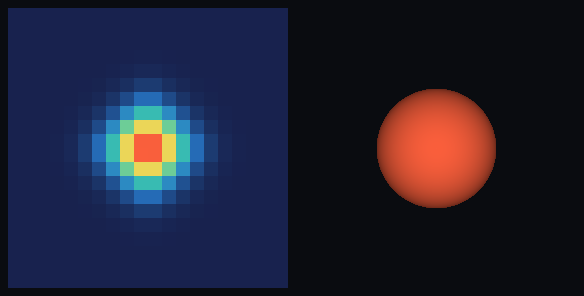

# step_0014 — 덩어리 검출·환원 (안정 덩어리 → 개체/구체)

> 한 줄: step_0007~0013 이 창발시킨 *돌·별*(안정 덩어리)을, 장을 *읽기만* 해서 **소수 파라미터의 개체(구체)로 환원**하는 관찰 연산자를 세운다. 같은 별이 ①에선 수천 셀, ②에선 **구체 하나**로 보인다. [design/scalability.md](../../design/scalability.md) §4 의 **S4**.



*왼쪽 ① 별 = 수천 voxel 셀(heat ρ 투영) · 오른쪽 ② 같은 별 = 검출된 구체 1개. 검출은 읽기 전용 — 같은 세계의 두 표현.*

---

## 논의 — 이 step 의 의미

사용자 방향(이번 트랙): "물질이 덩어리지면 **① 구체로 보여지고 ② 덩어리(개체)로 시뮬레이션**되어야 한다"(design/scalability.md §0). 이 둘의 공통 토대는 **"안정 덩어리를 검출해 개체로 환원하는 기계"**다 — ①은 그 개체를 구체로 그리고, ②(다음 step)는 그 개체를 *승격*해 격자에서 빼내 굴린다.

그래서 이번 step 은 그 **검출·환원**을 가장 단순·안전한 단위로 세운다:

- **무엇을 더하나**: `engine/htj-cluster.js` — `detectClumps(world, opts)`. ρ>eps 셀의 6-이웃 **연결 성분**을 찾아 각각을 `{ 중심(CoM), 질량 Σρ, 반지름(점유 볼륨 등가 구), 평균온도 Σu/Σρ, 정점밀도, 셀수 }` 로 환원.
- **동역학 법칙이 아니다 — 관찰 연산자다**: 장을 *읽기만* 하고 **아무 것도 바꾸지 않는다**. 따라서 모든 동역학과 회귀 0 으로 공존한다(필드 지문 불변).
- **무엇이 보존/변하나**: 세계는 *불변*(읽기 전용). 산출물에서 **질량이 개체로 정확히 보존**된다 — Σ개체질량 = Σ_{ρ>eps} ρ. 이 보존이 ②(승격)에서 "질량을 위층으로 상속"하는 토대.
- **무엇으로 검증하나**: 연결 성분 분리/병합·질량 이관 보존·CoM·등가 구 반지름·질량가중 평균온도·읽기 전용(지문 불변)·빈 검출·노이즈 컷·결정론, 그리고 **헤드라인**: 0013 붕괴 별을 검출하면 *지배적 한 개체*로 환원된다(질량 대부분 흡수·뜨겁다·질량 보존).

---

## 구현

### `engine/htj-cluster.js` (신규 — 관찰 연산자)

- `detectClumps(world, opts)`: scratch 의 방문 버퍼(`__cseen`)로 6-이웃 flood fill. 고정 인덱스 순서로 훑어 성분을 모으고, 각 성분을 환원. **질량 내림차순 정렬**(같으면 셀수) → 결정론적 안정 순서.
  - 중심 = 질량중심 `Σρ·pos / Σρ`.
  - 반지름 = 점유 셀수 V 의 등가 구 `r=(3V/4π)^(1/3)` (`equivalentRadius`).
  - 평균온도 = 질량가중 `Σu/Σρ`(=T=u/ρ 의 질량가중; therm 장 없으면 0).
  - `opts.eps`(점유 임계, 기본 1e-9)·`opts.minCells`(노이즈 컷, 기본 1).
- 측정자: `clumpCount`, `totalClumpMass`(이관 보존 검증용).
- **순수**: world 의 어떤 장도 변형하지 않는다(scratch 만 사용).

### 확인용 (viewer) — `render: 'spheres'`

- `viewer/htj-render.js` 에 `drawClumps(ctx, world, cam, clumps)` 추가 — `draw` 와 동일한 직교 투영으로 덩어리를 *방사 그라디언트 원반*(구체감)으로, 정점밀도 heat 색·깊이 정렬. **확인용 전용**(세계 불변).
- `viewer.html` STEPS 에 `0014` 추가(0013 과 같은 붕괴 파이프라인, `render:'spheres'`). `render()` 가 그 플래그면 `HTJCluster.detectClumps`(본체 임계=평균×1.5) 후 `drawClumps`. **engine 은 viewer 를 모른다**(단방향 의존 유지).
- 헤드리스 눈 검증은 `steps/step_0014/capture.js`(engine 직접 PNG, step_0006~0013 동일 폴백) — 2패널(① 셀 ρ 투영 vs ② 구체).

---

## 검증

### 수치 — `node HTJ/steps/step_0014/verify.js` → **PASS (10/10)**

```
PASS  연결 성분 — 떨어진 둘 → 2 개체, 이으면 → 1 개체 = 분리=2개(질량 10,4) · 연결=1개
PASS  질량 이관 보존 — Σ개체질량 = Σ_{ρ>eps} ρ (질량 한 톨도 안 샌다) = Σ개체=1253.942648 = Σρ=1253.942648 (Δ=6.82e-13)
PASS  질량중심 — 대칭 블롭 개체 중심 = 기하 중심 = CoM=(3.000,3.000,3.000) = (3,3,3)
PASS  등가 구 반지름 — r=(3·셀수/4π)^(1/3), 셀수↑→반지름↑ = 2셀 r=0.7816 < 8셀 r=1.2407 (공식=0.7816,1.2407)
PASS  평균온도 — 질량가중 Σu/Σρ = T=5.000000 = 200/40 = 5 (질량 40)
PASS  읽기 전용 — 검출은 energy·therm 을 안 건드린다(지문 불변 = 회귀 0) = fp(energy)=0x64eb6d51 불변
PASS  빈 검출 — eps>정점이면 0 개체 = eps=100 > peak=5 → 0개
PASS  minCells — 셀수<minCells 노이즈 성분 컷 = minCells=1 → 2개 · minCells=2 → 1개(본체만)
PASS  결정론 — 같은 세계 → 동일 개체 목록(개수·질량·중심) = 2개 동일(질량 12,4)
PASS  통합(별→구체) — 0013 붕괴 별이 지배적 한 개체로 환원 = 개체 1개·지배 질량 3493(본체 3493의 100%)·r=4.28·T=2.0·Σρ=4000
```

### 눈 — `node HTJ/steps/step_0014/capture.js` → **PASS** (`capture.png`)

```
① 셀 렌더 : 본체(ρ>2) 투영 셀 60개 — 별이 수많은 voxel 로 그려진다
② 구체 렌더: 검출 개체 1개 · 지배 질량 3493(본체 3493의 100%) · r=4.28 · 중심=(9.5,9.5)
읽기 전용 : 검출이 별을 안 건드림(fp 불변=true) · 질량보존 Σρ=4000(=4000)
```

화면이 가설과 일치한다 — 같은 별이 왼쪽엔 수천 셀, 오른쪽엔 구체 하나. 검출이 세계를 안 건드리므로 둘은 같은 세계의 두 표현이다.

### 회귀 — 전 step verify **14/14 PASS** (0001~0014, 회귀 0). 검출은 읽기 전용이고 신규 파일이라 기존 동역학에 영향 없음.

---

## 쉽게 풀어 쓴 설명

지금까지 세계는 별을 **수천 개의 작은 칸(셀)** 으로 들고 있었다. 사람 눈엔 "별"이지만 컴퓨터엔 그냥 칸 밭이다. 이 step 은 처음으로 컴퓨터에게 *"저 칸 무더기는 하나의 덩어리다"* 라고 알아보게 한다 — 서로 붙어 있는 칸들을 묶어(연결 성분), 그 무더기를 **중심·질량·크기·온도** 몇 개의 숫자로 줄인다. 그러면 별을 **구체 하나**로 그릴 수 있다(오른쪽 그림).

중요한 건 이 "알아보기"가 세계를 *건드리지 않는다*는 것 — 별은 그대로 칸으로 굴러가고, 우리는 그걸 *읽어서* 구체로 표현할 뿐이다(그래서 안전하고, 이전 모든 검증이 그대로 통과한다). 그리고 묶어도 **질량이 한 톨도 안 샌다**(Σ개체질량 = Σ칸질량). 이 "질량 보존된 환원"이 다음 단계의 토대다.

---

## 목적에 남긴 의미 · 다음 연결

- **남긴 것**: design/scalability.md §0 목적 **①(덩어리=구체로 보임)** 을 실현하고, **②(덩어리로 시뮬=승격)** 의 *검출 기계*를 세웠다. 질량 보존 환원 = 위층 상속의 토대.
- **다음(S5 — 승격)**: 이 검출 산출물을 *시뮬*에 쓴다 — 안정 판정된 덩어리를 **개체로 승격**(격자에서 제거)하고 강체로 굴리며, 외력/충돌/가열이 임계를 넘으면 다시 유체로 풀어놓는다(역승격). 그때의 관문은 **승격↔강등 시 질량·운동량·에너지 정확 이관**(보존) — 이 step 의 질량 보존 환원이 그 첫 절반이다. (안정 판정 재료는 design 의 S3 동결/활동도와 연결.)
- 열린 격차: 현재 "안정"을 *형태/운동 변화 임계*로 판정하는 로직은 아직 없다(검출은 매 호출 즉석). 승격에는 "일정 기간 거의 안 변함" 판정이 필요 — S3/S5 에서.
