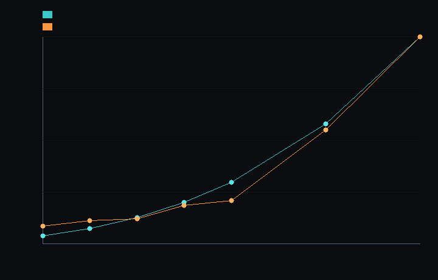

# step_0015 — S1 측정 베이스라인 (비용은 O(N³) 로 터진다)

> 한 줄: 확장성 설계의 *전제*("조밀 격자는 세계가 커지면 부피 비용으로 무너진다")를 **측정으로 박는다**. N 을 키우며 비용을 재고 O(N³) 스케일을 단언 — 이후 S2~(희소화·승격·LOD) 가 *실제로* 비용을 줄였는지 비교할 **영구 베이스라인**. [design/scalability.md](../../design/scalability.md) §4 의 **S1**.



*비용 곡선 — 청록=메모리(결정론, nFields·N³·8) · 주황=벽시계 ms/step(실측, 머신 의존). 둘 다 N 이 커질수록 가파르게 위로 휜다(초선형 = O(N³)).*

---

## 논의 — 이 step 의 의미

확장성 트랙 전체(S1~S7)는 "수억 칸은 못 돌린다"는 *전제* 위에 서 있다. 추측으로 두지 않고 **수치로 확정**하는 것이 첫 발이다(design §5: "측정으로 결정"). 또한 S2(희소화)·S5(승격) 같은 후속이 *정말로* 빨라졌는지 비교할 **기준선**이 없으면 개선을 주장할 수 없다.

- **무엇을 더하나**: 세계 법칙을 *더하지 않는다*. `steps/step_0015/` 안에 측정 도구(`verify.js`·`capture.js`)만 — N 을 키우며 전체 법칙 파이프라인(0013/0014 와 동일: 중력+반발+열압력+점성+발열+냉각+이류)을 굴려 비용을 잰다.
- **비용 두 종류**:
  - **결정론적 프록시**(머신 무관·영구 단언 대상): 메모리 = `nFields·N³·8` byte, 격자 작업량 = `(중력 iters + 국소 법칙 패스수)·N³` ops/step. 둘 다 N→2N 에 정확히 ×8(=부피 N³).
  - **벽시계 ms**(머신 의존): *정보용*만 — verify 에서 단언하지 않는다(비결정·환경마다 다름). 곡선의 *모양*(초선형)이 증거.
- **무엇이 보존/변하나**: 세계는 *불변*(측정만). 단언은 결정론 프록시에만 — 그래서 영구 회귀 가드가 된다.
- **무엇으로 검증하나**: 메모리 공식·메모리 O(N³)·작업량 O(N³)·중력이 지배항·무너지는 지점(N=256)·결정론.

---

## 구현

세계(engine)는 손대지 않았다. 측정은 engine 을 *읽어* 굴릴 뿐.

- `steps/step_0015/verify.js`: `measure(N, steps)` — N 격자에 별을 심고 파이프라인을 굴린 뒤 실측 메모리(Σ 장 byteLength)·결정론 작업량 프록시·벽시계를 잰다. N=16/32 쌍으로 ×8(부피) 단언, N=48(viewer 최대) 정보 출력.
- `steps/step_0015/capture.js`: 여러 N 의 비용을 재서 *차트 PNG* 로 그린다(engine 직접, step_0006~0014 폴백 패턴). 두 곡선이 위로 휘는 게 눈 증거.

상수: 중력 `iters=40`(전-격자 완화 패스), 국소 법칙 `LOCAL_PASSES=7`(모델 상수). 이 둘이 작업량 프록시 `(40+7)·N³` 를 만든다.

---

## 검증

### 수치 — `node HTJ/steps/step_0015/verify.js` → **PASS (6/6)**

```
  N=16 ·     4.1K칸 · 메모리   0.19MB · 작업    0.2M ops/step · 벽시계 ~25 ms/step
  N=32 ·    32.8K칸 · 메모리   1.50MB · 작업    1.5M ops/step · 벽시계 ~74 ms/step
  N=48 ·   110.6K칸 · 메모리   5.06MB · 작업    5.2M ops/step · 벽시계 ~283 ms/step
PASS  메모리 공식 — Σ(장 byteLength) = nFields·N³·8 = N=16: 196608B = 6장·4096칸·8
PASS  메모리 O(N³) — N 2배 → 메모리 ×8 = mem(16)=192KB → mem(32)=1.50MB (×8.00)
PASS  작업량 O(N³) — N 2배 → 스텝당 격자 작업 ×8 = 0.19M → 1.5M ops/step (×8.00)
PASS  중력이 지배항 — 전역 중력(40패스·N³)이 국소(7패스·N³)보다 5.7× (§3 "중력은 따로")
PASS  무너지는 지점 — N=256 조밀 메모리 0.75GB (수억 칸=실측 불가 = 전제 확정)
PASS  결정론 — 같은 N 두 번 빌드 → 동일 지문 = 0xf8e75b04
```

> 벽시계는 머신 의존이라 단언하지 않지만, 추세는 명확: N 16→48 에 ~25→~283 ms (≈11×). 칸 수는 ×27 인데 시간은 ×11 — 단일 머신 캐시/JIT 효과로 곡선이 들쭉날쭉하나 *초선형*은 분명(차트 참조).

### 눈 — `node HTJ/steps/step_0015/capture.js` → **PASS** (`capture.png`)

두 곡선(메모리·벽시계)이 N 이 커질수록 가파르게 위로 휜다 — verify 의 O(N³) 가설이 화면에 보인다. 메모리 N16→N32 = ×8.00(정확히 부피), 벽시계 N16→N48 = ×12.

### 회귀 — 전 step verify **15/15 PASS** (0001~0015, 회귀 0). 측정 전용·engine 불변.

---

## 쉽게 풀어 쓴 설명

"세계가 커지면 못 돌린다"는 말은 *느낌*이 아니라 *사실*이어야 한다. 이 step 은 그 사실을 **자로 잰다** — 격자 한 변(N)을 16, 24, 32, 48 로 키우며 메모리와 시간이 얼마나 드는지 측정했다. 결과: 한 변을 2배 키우면 비용이 **8배**가 된다(부피니까 당연 — N³). 그래서 N=256(흔한 게임 복셀 해상도)이면 장 6개만 해도 메모리가 **0.75GB**, 매 스텝 수억 번 연산 — 조밀하게 다 풀면 무너진다.

이 숫자가 *베이스라인*이다. 앞으로 희소화(S2)·승격(S5)을 넣을 때마다 이 자를 다시 대서 "정말 줄었나?"를 확인한다. 측정 없이 최적화를 주장하지 않는다.

---

## 목적에 남긴 의미 · 다음 연결

- **남긴 것**: 확장성 트랙의 *전제*를 수치로 확정(O(N³)·N=256 무너짐)하고, 후속 단계가 개선을 *증명*할 영구 기준선을 세웠다. "중력이 지배항"도 못 박아 S6(중력 트리 가속)의 근거를 마련.
- **다음(S2 — 희소 컨테이너)**: `Float64Array(N³)` → 활성 블록만 저장·순회. 빈 공간 0원 → 비용이 *부피*가 아니라 *활성 칸*에 비례. 이 step 의 메모리/작업량 프록시를 다시 재서 "활성 비례"로 꺾이는지 확인한다. 관문: 조밀 결과와 비트 동일(빈 칸=0 동치) + 지문 재정의. (그 전에 S2 의 토대 위에서 S3 동결·S5 승격으로 이어짐 — 로드맵 STATE §2.)
