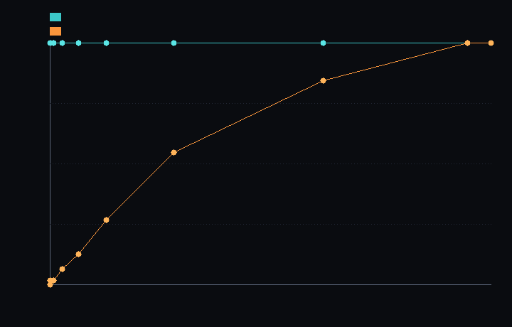

# step_0016 — S2 희소 블록 컨테이너 (빈 공간은 0원)

> 한 줄: step_0015(S1)가 박은 베이스라인 — "조밀 격자는 비용이 *부피*에 묶인다(1셀 세계도 가득 찬 세계와 같은 메모리 = 점유 무관)" — 를 **뒤집는 컨테이너**를 세운다. 격자를 8³ 블록으로 타일링해 *비-영 블록만* 할당 → 비용이 *점유한 블록 수*에 비례. [design/scalability.md](../../design/scalability.md) §2 레버 1 · §4 의 **S2** 첫 단위.



*고정 N=64, 점유(별 반지름)를 키우며 잰 메모리. 청록=조밀(수평선=점유 무관, step_0015 베이스라인 그대로) · 주황=희소(우상향=점유 비례). 별이 작을수록 희소는 거의 0, 조밀은 그대로 꽉 — 두 선이 갈라지는 게 S2 가 베이스라인을 깬 증거. 가득 차면(우측) 합류한다.*

---

## 논의 — 이 step 의 의미

S2(희소 컨테이너)는 design §4 의 큰 단계라 2–3 step 으로 쪼갠다. 그 **첫 단위 = 컨테이너 자료구조 자체**다. 세계 법칙(`htj-*.js`)은 *건드리지 않는다* — 그것들은 다음 step 에서 "활성 블록만 순회"로 일반화한다. 이번엔 그 토대가 될 그릇을 세우고, 그릇이 *조밀과 정확히 같은 세계를 담으면서 비용만 점유에 비례*함을 못 박는다.

- **무엇을 더하나**: 신규 engine 모듈 `engine/htj-sparse.js` — `SparseField`(N³ 격자를 bs³=8³ 블록으로 타일링, 비-영 블록만 `Map` 에 할당). 기존 법칙·세계 불변.
- **무엇이 보존되나(관문)**: **조밀 결과와 비트 동일**. `dense → fromDense → toDense()` 가 *byte 완벽* 왕복. 빈 칸=0 동치. 측정량(count/max/min)도 정확히 같다.
- **무엇이 변하나(헤드라인)**: 메모리가 *부피*(N³·8)가 아니라 **점유한 블록 수**에 비례. step_0015 §2 단언("1셀 세계 = 가득 찬 세계 메모리")의 *정확한 반대*가 성립한다.
- **무엇으로 검증하나**: 왕복 비트 동일 · 측정 일치 · 점유 비례 메모리 · 점유 무관성 뒤집기 · 빈 칸=0 동치 · 지문 재정의(순서 무관·조밀 교차 일치) · 결정론.

---

## 구현

신규 `engine/htj-sparse.js` (세계의 *그릇* — 법칙 아님, 렌더·DOM 무의존):

- **블록 타일링**: `createSparseField(N, blockSize=8)`. 블록키 → `Float64Array(512)`, *비-영 블록만* 할당. `get` 은 미할당 블록서 0, `set(…,0)` 은 빈 블록을 만들지 않는다(빈 공간 0원 불변).
- **희소 ↔ 조밀**: `fromDense(N, dense)` 는 *비-영 byte 가 하나라도 있는 블록만* 할당(byte 단위 판정 → -0 같은 비트도 보존 = 왕복 bit 완벽). `toDense()` 는 미할당 칸을 0 으로 복원.
- **측정자**: `total/count/max/min` — 미할당 블록(=0)은 건너뛴다. count/max/min 은 조밀과 정확히 동일. (total 은 부동소수 합산 *순서*가 블록순 vs gi순으로 달라 마지막 ULP 만 차이 — 상대 1e-12 이내.)
- **점유/메모리**: `activeBlocks()`·`memBytes()`(할당 블록 byteLength 합)·`compact()`(전부-0 블록 회수).
- **지문 재정의**: 조밀-바이트 지문(`htj-world.fingerprint`)은 희소와 양립 못 한다(빈 칸 표현·순회 순서가 다름). 대신 *각 비-영 칸*마다 `hc = FNV-1a(전역 인덱스 gi ‖ 8바이트)` 를 구해 **XOR 누적**한다 — XOR 은 교환적이라 블록/삽입 순서와 무관하고, `gi` 가 칸마다 유일해 충돌·상쇄가 없다. 전부-0 블록은 건너뛰어 미할당과 동치. 조밀에서 같은 규칙으로 계산한 `referenceFingerprint` 와 정확히 일치(= 희소 지문이 조밀 내용의 충실한 재정의).

---

## 검증

### 수치 — `node HTJ/steps/step_0016/verify.js` → **PASS (7/7)**

```
  가우시안 별(파이프라인) N=64: 점유 512/512블록 = 희소 2048KB (조밀 대비 100% — 꼬리가 전 격자 채움, 희소 이득 없음=정직한 한계)
  정확한 진공 별(seedBall) N=64: 점유 32/512블록 = 희소 128KB (조밀 대비 6% — 여기서 희소 이득 실재)
  PASS  왕복 비트 동일 — dense → fromDense → toDense() 가 byte 동일(빈 칸=0 동치, S2 관문) = N=64 별 세계 · 262144칸 byte-identical
  PASS  측정 일치 — count/max/min 정확(===) · total 합산 순서차만(상대 1e-12) = count=6272 max=3 min=0 total Δ=0.0e+0
  PASS  점유 비례 메모리 — memBytes = 점유블록·512·8 ∝ 점유 (조밀 N³·8 보다 작다, S1 베이스라인 깸) = 희소 128KB (32/512블록) < 조밀 2048KB = 6.3%
  PASS  점유 무관성 뒤집기 — 1셀 세계 ≪ 가득 찬 세계 (조밀은 동일, 희소는 점유에 비례) = 1셀 4.0KB(1블록) vs 가득 2.00MB(전 블록) = 512× 차이
  PASS  빈 칸=0 동치 — 미할당 읽기=0 · set(…,0) 무할당 · 전부-0 블록 지문 = 빈 컨테이너 동치 = read0=true noAlloc=true zeroBlock≡empty(0x0)
  PASS  지문 재정의 — 비-영 칸 정규 직렬화: 삽입 순서 무관 · 조밀 참조와 교차 일치 = 순서무관 0x2d6bb544 · 희소=조밀참조 0xafed5831
  PASS  결정론 — 같은 조밀 내용 두 번 변환 → 동일 지문 = 0xafed5831
```

### 눈 — `node HTJ/steps/step_0016/capture.js` → **PASS** (`capture.png`)

고정 N=64 에서 점유(반지름 0→55)를 키우며 메모리를 잰 차트. 조밀은 *완전 수평선*(2048KB 고정 = 점유 무관, step_0015 베이스라인 그대로), 희소는 *우상향*(0→2048KB, 점유 비례). 작은 별 r=8 에서 희소 = 조밀의 **2%**. verify 가설("비용이 부피→점유로")이 화면에 그대로 보인다.

```
    r= 0 · 점유   0.0% · 조밀 2048KB · 희소    0KB
    r= 8 · 점유   0.8% · 조밀 2048KB · 희소   32KB   ← 희소 2% (별 하나, 빈 우주)
    r=26 · 점유  28.2% · 조밀 2048KB · 희소 1120KB
    r=55 · 점유 100.0% · 조밀 2048KB · 희소 2048KB   ← 가득 차면 조밀과 합류
```

### 회귀 — 전 step verify **16/16 PASS** (0001~0016, 회귀 0). 신규 engine 파일 추가뿐 — 기존 법칙·세계 불변.

---

## 정직한 한계 (이 step 이 *아직* 못 하는 것)

**파이프라인 별(가우시안)은 희소하지 않다** — 점유 512/512 블록, 조밀과 동일 100% 메모리. 가우시안 밀도 분포는 꼬리가 *전 격자를 비-영으로* 채우기 때문이다. 희소 이득은 **정확한 진공**(exact 0)이 있을 때만 실재한다(seedBall = 32/512 블록 = 6%). 즉 컨테이너는 준비됐지만, *현재 세계의 내용물*이 이득을 받으려면 **활성/비활성 전이 규칙**(임계 미만 = 0 으로 흡수, 흡수량은 이웃으로 분배해 보존)이 필요하다 — design §2 레버1 의 "대가/주의" 그대로다. 이건 S3(활동도/동결, design §4) 또는 그 직전의 진공 임계 step 에서 닫는다. **이 step 의 약속은 "그릇이 옳다"**(왕복 비트 동일 + 점유 비례)이지, "현재 세계가 즉시 싸진다"가 아니다.

또한 **법칙은 아직 조밀 배열 위에서 돈다** — 이 컨테이너로 *순회*하지 않는다. 법칙을 "활성 블록 집합을 받아 도는" 인터페이스로 일반화하는 건 다음 step(S2 둘째 단위).

---

## 쉽게 풀어 쓴 설명

지금까지 세계는 한 변 N 짜리 정육면체 격자를 *통째로* 메모리에 들고 있었다. 별이 한가운데 콩알만 해도, 텅 빈 우주 칸까지 전부 똑같이 자리를 차지한다(step_0015 가 이걸 측정으로 박았다 — "1칸짜리 세계나 꽉 찬 세계나 메모리는 똑같다").

이 step 은 격자를 작은 8×8×8 블록으로 잘라, **물질이 든 블록만** 들고 있는 그릇(`SparseField`)을 만들었다. 빈 블록은 아예 안 만든다 — 읽으면 그냥 0. 그래서 작은 별 하나면 메모리가 **조밀의 2%**(차트 주황선)로 떨어진다. 반대로 세계가 꽉 차면 조밀과 똑같아진다(우측에서 합류) — 손해는 없다.

가장 중요한 약속은 **"내용물은 한 글자도 안 바뀐다"** 다. 조밀 → 희소 → 조밀 로 왕복시키면 바이트 단위로 완벽히 같다(왕복 비트 동일). 그래야 다음 step 에서 법칙들을 이 그릇 위로 옮겨도 세계가 *정확히 그대로* 굴러간다.

단, 정직하게: 지금 별은 가우시안이라 옅은 꼬리가 우주 전체에 깔려 있어 사실상 빈 칸이 없다 → 그릇은 이득을 못 준다. 진짜로 싸지려면 "너무 옅으면 0 으로 본다"는 진공 규칙이 필요하고, 그건 다음 단계 몫이다.

---

## 목적에 남긴 의미 · 다음 연결

- **남긴 것**: 확장성 레버 1(희소화)의 *그릇*을 세웠다 — 빈 공간 0원, 점유 비례 메모리, 조밀과 왕복 비트 동일, 순서 무관 지문 재정의. step_0015 의 "점유 무관성" 베이스라인을 *측정으로 뒤집었다*(1셀 ≪ 가득, 512× 차이). 보존(측정 일치)·결정론(지문)이라는 HTJ 척추를 희소 구조에서 다시 못 박았다.
- **다음(S2 둘째 단위 — 법칙 일반화)**: 법칙(`htj-*.js`)을 "활성 블록 집합을 받아 도는" 인터페이스로 일반화해, 이 컨테이너 위에서 *조밀과 비트 동일하게* 굴린다. 관문: 조밀 파이프라인과 지문 일치 + 활성 칸 비례 비용. 그 전(또는 함께)에 **진공 전이 규칙**(임계 미만=0 흡수+보존 분배)을 넣어야 가우시안 세계도 실제로 희소해진다(위 "정직한 한계"). 그 뒤 S3 동결·S5 승격으로 이어진다(로드맵 STATE §2).
