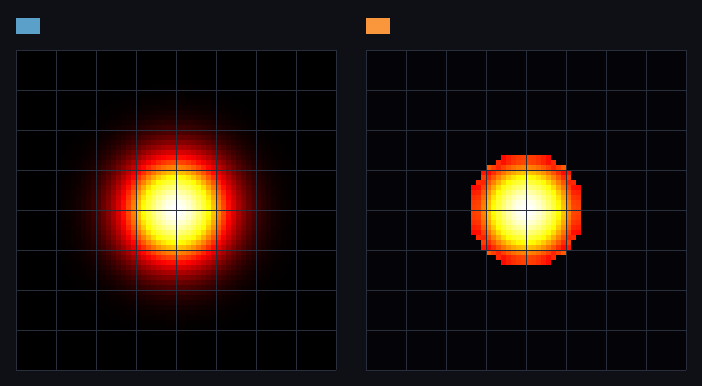

# step_0017 — S2 진공 전이 규칙 (너무 옅으면 0 으로 흡수, 질량 보존)

> 한 줄: step_0016(희소 컨테이너)의 정직한 한계 — *가우시안 별은 꼬리가 전 격자를 비-영으로 채워 희소 이득 0(512/512블록)* — 을 닫는다. 옅은 셀(0<ρ<eps)의 질량을 *더 밀한 이웃*으로 옮기고 정확한 0 으로 만든다(질량 보존). 진공이 바깥부터 자라나 가우시안 별이 **실제로 희소**해진다(512→32블록=6%). [design/scalability.md](../../design/scalability.md) §2 레버1 "전이 규칙" · §4 의 **S2 둘째 단위(②)**.



*작은 가우시안 별의 중앙면 슬라이스(heat 램프, 강한 감마로 옅은 꼬리를 드러냄). 좌 BEFORE = 넓게 퍼진 글로우(꼬리가 전 격자 점유 512/512블록) · 우 AFTER = 날카로운 경계의 압축 코어 + 단단한 검정 진공(옅은 꼬리가 정확한 0 으로 흡수, 점유 32/512블록). 질량은 코어로 모여 보존(Δ=1.0e-10). 8³ 블록 격자선 = 희소가 회수하는 빈 블록.*

---

## 논의 — 이 step 의 의미

STATE NEXT 의 step_0017 은 원래 "①법칙 일반화 + ②진공 전이 규칙"을 묶었으나, skill 원칙("한 step = 가장 단순한 단위 하나")에 따라 둘을 쪼갰다. 이번은 **② 진공 전이 규칙** — step_0016 이 *측정으로 드러낸 한계*(가우시안 세계는 희소 안 됨)를 직접 닫는 자기완결 법칙. ① 법칙 일반화(활성 블록 순회 리팩터)는 step_0018 로 분리.

- **왜 이게 먼저인가**: 희소 컨테이너(step_0016)는 *그릇*만 옳을 뿐, *내용물*(가우시안 꼬리가 전 격자에 깔림)이 이득을 못 받았다. 이 규칙이 near-vacuum 을 진짜 vacuum(exact 0)으로 만들어야 컨테이너가 비로소 값어치를 한다.
- **무엇을 더하나**: 신규 engine 모듈 `engine/htj-vacuum.js` 의 `applyVacuum`. 밀도(=질량)장만 다룬다.
- **무엇이 보존되나(척추)**: **질량 보존**. 옅은 셀을 0 으로 만들 때 그 질량을 버리지 않고 *더 밀한 이웃*으로 옮긴다 → total 불변(기계 정밀도 이내).
- **무엇이 변하나(헤드라인)**: 옅은 꼬리 → 정확한 0. 가우시안 별 점유 512/512블록 → 32/512블록(6%) = step_0016 한계가 닫힌다.
- **무엇으로 검증하나**: 보존 · 진공 생성 · 코어 보존 · 흡수 방향 · 고립 옅음 보존 · 가법성(회귀 0) · **희소 이득 실현**(step_0016 컨테이너로 교차) · 결정론.

---

## 구현

신규 `engine/htj-vacuum.js` — 세계의 *전이 규칙*(법칙, 렌더·DOM 무의존):

- **흡수**: 옅은 셀(0<ρ<eps)의 질량을 *가장 밀한 6-이웃*(동률=최저 인덱스)으로 통째 옮기고 자신은 0. **자기보다 밀한 이웃이 있을 때만** 기부 → 질량이 *밀한 쪽(안쪽)으로만* 흐른다(옆으로 뒤섞지 않음). 가우시안 꼬리가 바깥부터 벗겨져 진공이 자라난다.
- **고립 옅음 보존**: 더 밀한 이웃이 없는 국소 최대 옅은 덩어리는 *그대로 둔다*(갈 곳 없음 → 방향성 없는 셔플 방지).
- **보존**: 기부 = full ρ 이동(`out[i]-=v; out[bj]+=v`) → 합산 1회 반올림만(기계 정밀도). 더블버퍼(스냅샷 R 에서 판정, out 에 기록) → 순서 무관·결정론.
- **가법성/회귀 0**: `eps=0` → early return(byte 동일). 기존 11개 법칙과 직교 — 파이프라인이 호출 안 하면 세계 불변.
- **정직한 범위**: 밀도장만 옮긴다(운동량 동반 수송은 후속 — S2 둘째 단위 일반화에서 advect 와 합류). 그래서 "near-vacuum 을 vacuum 으로 보는" *물리적 정규화*이자 희소화의 전이 규칙이다.

---

## 검증

### 수치 — `node HTJ/steps/step_0017/verify.js` → **PASS (9/9)**

```
  작은 가우시안 별 N=64 eps=0.05: 점유 512/512블록 → 32/512블록(진공 80패스) · 질량 4000.0→4000.0(보존)
  PASS  보존 — total(질량) 불변(기계 정밀도 이내) [1패스] = Δ=7.4e-11 (total≈4000.0)
  PASS  진공 생성 — 비-영 셀 ↓ · 정확한 0 셀 ↑ (옅은 꼬리가 0 으로) = 비-영 262144→239072 · 정확한0 0→23072
  PASS  코어 보존 — max 비감소(질량이 안쪽으로 모임, 밀한 셀 안 사라짐) = max 4.373 → 4.373
  PASS  보존 — total(질량) 불변(기계 정밀도 이내) [30패스] = Δ=1.0e-10
  PASS  흡수 방향 — 옅은 셀 질량이 가장 밀한 이웃으로 가고 자신은 0 = donor=0:true · core 1→1.025 (=+0.025)
  PASS  고립 옅음 보존 — 더 밀한 이웃 없는 국소 최대 옅은 셀은 그대로(옆으로 안 뒤섞음) = iso 0.025 → 0.025 (불변)
  PASS  가법성/회귀 0 — eps=0 → byte 동일(early return, 세계 불변) = eps=0 → 항등
  PASS  희소 이득 실현 — 가우시안 별 진공 반복 → 점유 블록 급감(step_0016 한계 닫음) · 질량 보존 = 점유 512/512블록 → 32/512블록 (6%) · 질량 Δ=1.0e-10
  PASS  결정론 — 같은 장 두 번 흡수 → 동일 지문 = 0x78cd69b2
```

### 눈 — `node HTJ/steps/step_0017/capture.js` → **PASS** (`capture.png`)

진공 전후 슬라이스. 좌(BEFORE)는 넓게 퍼진 가우시안 글로우(꼬리가 전 격자 점유), 우(AFTER)는 날카로운 경계의 압축 코어 + 단단한 검정 진공. 정확한 0 으로 흡수된 셀 255,816개, 질량 4000.0→4000.0(Δ=1.0e-10 보존). verify 가설("꼬리가 0 으로, 코어는 남고, 질량 보존")이 화면에 그대로 보인다.

### 회귀 — 전 step verify **17/17 PASS** (0001~0017, 회귀 0). 신규 engine 파일 추가뿐 — 기존 법칙·세계 불변(파이프라인이 `applyVacuum` 미호출).

---

## 정직한 한계 (이 step 이 *아직* 못 하는 것)

- **운동량 동반 안 함**: 진공 규칙은 밀도장만 옮긴다 — 옮긴 질량이 운동량을 끌고 가지 않는다. 그래서 *전체 동역학 파이프라인 안*에서 매 스텝 돌리면 운동량 보존과 약간 어긋난다. 이번 step 은 규칙을 *독립*으로 검증했고(정규화로서), 파이프라인 통합(advect 와 합류해 운동량도 함께 옮김)은 다음 step(S2 둘째 단위 ① 법칙 일반화)에서.
- **수렴 속도**: 흡수는 한 패스에 한 셀씩 안쪽으로 옮기므로(donor→denser neighbor), 매끄러운 꼬리를 비우려면 여러 패스가 든다(N=64 작은 별 80패스). 이는 국소 보존 재분배의 본질적 비용(design §2 "대가/주의"). 큰 밀도 대비(붕괴 별)에선 더 빠르다.
- **임계 eps 는 시뮬 상수성**: eps 는 결과(어디까지 진공으로 볼지)를 바꾼다 → 결정론에 영향. design §5 "결정론에 영향 주는 임계는 시뮬 상수" 원칙대로, 튜닝하더라도 고정 시나리오로 verify 를 재기준해야 한다.

---

## 쉽게 풀어 쓴 설명

step_0016 에서 "물질이 든 블록만 들고 있는 그릇"을 만들었지만, 별이 가우시안(종 모양)이라 *아주 옅은 안개*가 우주 끝까지 깔려 있었다 — 컴퓨터에겐 0.000001 도 0 이 아니라서, 그릇은 결국 모든 블록을 들고 있어야 했다(이득 0).

이 step 은 **"너무 옅으면 그냥 진공으로 친다"**는 규칙을 더했다. 단, 옅은 칸의 질량을 *그냥 지우면* 질량이 사라지니(보존 위배), 그 질량을 *더 진한 옆 칸*으로 밀어넣고 자기는 0 이 된다. 이걸 반복하면 옅은 안개가 바깥부터 걷히고 질량은 가운데로 모인다 — 별은 *더 또렷하고 단단한 덩어리*가 되고, 둘러싼 공간은 진짜 진공(정확한 0)이 된다. 그릇은 이제 가운데 32블록만 들면 된다(512개 중 6%).

가장 중요한 건 **질량이 한 톨도 안 사라진다**는 것(4000.0 → 4000.0). 안개를 지운 게 아니라 *모은* 것이다. 그림 좌(전)·우(후)를 보면, 넓게 번진 빛이 → 날카로운 코어 + 검은 진공으로 바뀌었다.

---

## 목적에 남긴 의미 · 다음 연결

- **남긴 것**: 희소화 레버1 의 *전이 규칙*을 세워 step_0016 의 정직한 한계를 닫았다 — 가우시안 별(512/512블록, 이득 0)이 진공 흡수로 *실제로 희소*(32/512블록, 6%)해지고 질량은 보존된다. 컨테이너(그릇)와 전이 규칙(내용물 정리)이 합쳐져 비로소 "비용이 점유에 비례"가 *현실의 세계 내용*에서 성립한다.
- **다음(step_0018 = S2 둘째 단위 ① 법칙 일반화)**: 법칙(`htj-*.js`)을 "활성 블록 집합을 받아 도는" 인터페이스로 일반화해 `htj-sparse.js` 위에서 *조밀과 비트 동일하게* 굴린다(이때 진공 규칙을 advect 와 합류해 운동량도 함께 옮겨 위 "정직한 한계" 닫음). 관문: 조밀 파이프라인과 지문 일치 + 비용이 활성 칸 비례(step_0015/0016 프록시 재측정). 그 뒤 S3 동결·S5 승격으로 이어진다(로드맵 STATE §2).
