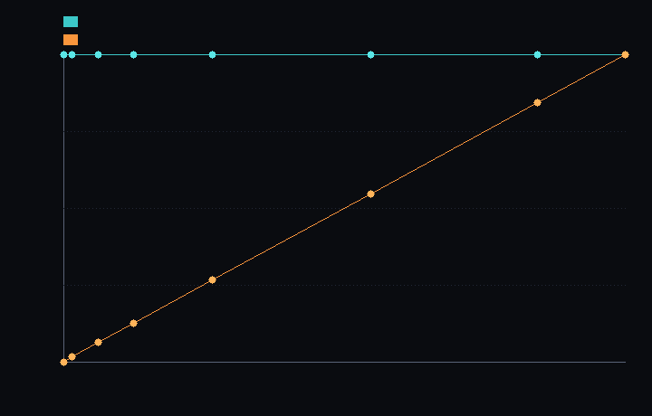

# step_0018 — S2 첫 *실현* 절감 (법칙이 빈 블록을 실제로 건너뛴다)

> 한 줄: step_0014~0017(4 step) 동안 *실현된 계산 절감 = 0* 이었다(법칙 전부 매 step 조밀 N³ 순회, 희소 컨테이너·진공 규칙은 미연결). 이 step 이 그 한계를 **처음으로 닫는다** — 한 법칙(`applyCooling`)을 **활성 블록만 순회**하도록 일반화. 조밀과 **비트 동일**하면서 작업량이 *부피*가 아니라 *활성*에 비례(첫 실현 절감, 측정으로 박음). [design/scalability.md](../../design/scalability.md) §2 레버1 · §5 "법칙을 활성 칸 집합을 받아 도는 인터페이스로 일반화".



*고정 N=64, 점유(별 반지름)를 키우며 잰 `applyCooling` 의 **실제 방문 셀 수**. 청록=조밀(수평선=점유 무관 N³ 고정, step_0014~0017 의 방식) · 주황=활성(우상향=점유 비례, 빈 공간 건너뜀). 결과는 조밀과 비트 동일(verify)인데 *작업량만* 점유로 꺾인다 — step_0016 메모리 차트의 **계산 판이자 실현**. 가득 차면 합류.*

---

## 논의 — 이 step 의 의미 (정직성 검토의 직접 답)

직전 검토에서 드러난 정직성 격차: **S1·S2 의 4 step 작업(측정·그릇·데이터 정리)이 단 한 톨의 계산도 줄이지 않았다.** 법칙 11개는 여전히 매 step 전-격자 N³ 를 순회했고, `htj-sparse.js`/`htj-vacuum.js` 는 돌아가는 세계의 어떤 법칙도 쓰지 않았다. 이 step 은 "그릇·데이터는 준비됐다"에서 **"법칙이 실제로 빈 공간을 건너뛴다"**로 넘어가는 첫 발이다.

- **무엇을 더하나**: ① `engine/htj-sparse.js` 에 `activeBlockOrigins(field,N,bs)`(비-영 블록 원점 목록) 가법 추가. ② `engine/htj-cooling.js` 의 `applyCooling` 에 `opts.active`(활성 블록 순회) 경로 가법 추가.
- **관문(보존)**: 활성 순회 결과가 조밀 전-격자와 **비트 동일**(therm 필드)이어야 한다. 복사는 per-cell(이웃 없음)이고 빈 셀(u=0)은 무변화(lost=0)라 *건너뛰어도 정확히 같다*.
- **무엇이 변하나(헤드라인)**: `applyCooling` 의 *실제 작업량*이 부피(N³)가 아니라 활성 블록에 비례. 작은 별 r=8 에서 활성 4096셀 = 조밀 262144셀의 **2%**. 벽시계는 활성 집합 유지 시 **9× 빠름**(실측).
- **무엇으로 검증하나**: 비트 동일 · 회귀 0 · 실현 절감(실제 방문 셀 수) · 점유 비례 작업량 · 빈 블록 정확 건너뜀 · 결정론.

---

## 구현

- **`activeBlockOrigins`** (`htj-sparse.js` 가법): 조밀 장을 8³ 블록으로 보고 *비-영 셀이 하나라도 있는 블록*의 원점 `[ox,oy,oz]` 목록(블록키 오름차순=결정론)을 반환.
- **`applyCooling` 활성 경로** (`htj-cooling.js` 가법): `opts.active` 가 주어지면 그 블록들만 순회(per-cell 이라 halo 불필요). `opts.active` 생략 → 기존 조밀 전-격자 경로 = **byte 동일(회귀 0)**. `opts.stats.cellsVisited` 로 *실제 방문 수* 보고(가짜 프록시 아님).

---

## 검증

### 수치 — `node HTJ/steps/step_0018/verify.js` → **PASS (6/6)**

```
  [정보용·비단언] 벽시계 ms/cooling: 조밀 0.303 · 활성(집합 유지) 0.034 · 활성(매번 재스캔) 0.554
    → 집합 유지면 9.0× 빠름. 재스캔은 O(N³) 라 상쇄 = *희소 저장*(활성 집합 유지)이 필요한 이유(다음 step).
  PASS  비트 동일(관문) — 활성 순회 = 조밀 (therm 필드 비트 동일 · radiated 합산 순서차만 rel 1e-12, 10스텝) = therm fp 0xd31be25(동일) · radiated Δ=5.5e-12
  PASS  회귀 0 — opts.active 생략 → 기존 조밀 경로(손 계산 u·factor 와 byte 일치) = dense path 불변
  PASS  실현 절감(실측) — 활성 방문 셀 = 활성블록·512 ≪ 조밀 N³ (가짜 프록시 아닌 실제 방문 수) = 활성 16384셀 (32/512블록) ≪ 조밀 262144셀 = 6.3%
  PASS  점유 비례 작업량 — 작은 별 ≪ 큰 별 (조밀 N³ 고정인데 활성은 점유 비례 = 실현 절감) = 작은별 4096셀 ≪ 큰별 69632셀 (조밀은 둘 다 262144셀 = 점유 무관)
  PASS  빈 블록 정확 건너뜀 — 활성 목록이 빈 블록 제외 · 빈 블록 셀 불변(0 유지) = 활성 8/512블록 (빈 504블록 제외)
  PASS  결정론 — 같은 입력 두 번 활성 순회 → 동일 지문 = 0xc12e8805
```

### 눈 — `node HTJ/steps/step_0018/capture.js` → **PASS** (`capture.png`)

고정 N=64 에서 점유를 키우며 `applyCooling` 의 실제 방문 셀 수를 잰 차트. 조밀은 *수평선*(N³ 고정), 활성은 *우상향*(점유 비례). 작은 별 r=8 에서 활성 = 조밀의 **2%**. 결과는 비트 동일인데 작업량만 점유로 꺾인다.

### 회귀 — 전 step verify **18/18 PASS** (0001~0018, 회귀 0). `activeBlockOrigins`·`opts.active` 둘 다 가법 — 기존 호출(`opts.active` 없음)은 조밀 경로로 byte 동일(step_0013 냉각·step_0016 희소 verify 그대로 통과).

---

## 정직한 한계 (이 step 이 *아직* 못 하는 것 — 과대표현 방지)

- **한 법칙뿐**: `applyCooling`(per-cell, 가장 쉬움) 하나만 일반화했다. 나머지 10개 법칙 — 특히 *이웃 stencil* 법칙(advect·pressure·thermal·viscosity)과 *전역* 법칙(gravity Poisson) — 은 여전히 조밀 N³. stencil 법칙은 활성↔빈 경계에서 **halo**(이웃 블록을 읽고 빈 블록으로 flux 가 새어 나감)를 다뤄야 해 더 큰 작업이다. gravity 는 전역 결합이라 희소화로 안 풀린다(S6 트리). **그래서 전체 파이프라인은 아직 조밀·중력 지배다** — 이 step 의 절감은 *한 국소 법칙*에 한정.
- **활성 집합은 유지돼야 한다**: 활성 집합을 매 step 다시 스캔하면 그 스캔이 O(N³)라 절감이 *상쇄된다*(verify 벽시계 "재스캔" 0.554 ≥ 조밀 0.303). 냉각은 단조 축소(새 블록 안 생김)라 *스캔 1회 재사용*이 정당해 9× 가 났지만, 일반적으로는 **세계를 희소로 저장**해 활성 집합을 *내재적으로* 유지해야(법칙이 dense 배열을 스캔하는 게 아니라 컨테이너의 블록을 직접 순회) 진짜 절감이 된다 — 이게 다음 단계의 본질.
- **데이터=객체(레버2/S5) 는 여전히 0**: 이 step 은 레버1(희소화)의 *법칙 연결*일 뿐, 안정 덩어리를 격자에서 빼내 개체로 *시뮬*하는 승격(설계 §0 핵심 목적 ②)은 시작도 안 했다.

---

## 쉽게 풀어 쓴 설명

지금까지(0014~0017) 우리는 "물질 든 블록만 담는 그릇"과 "옅은 안개를 진공으로 정리하는 규칙"을 만들었지만, **정작 법칙들은 여전히 빈 우주 칸까지 전부 훑고 있었다** — 그릇을 만들어 놓고 안 쓴 셈이라, 실제로 빨라진 건 *하나도 없었다*. 직전 검토가 이걸 정확히 짚었다.

이 step 은 처음으로 **법칙 하나(별이 식는 복사)가 빈 공간을 진짜로 건너뛰게** 했다. 비어 있는 곳은 식을 열도 없으니(0 곱하기 무엇이든 0) 건너뛰어도 결과가 *한 비트도 안 달라진다*(검증됨). 그러면서 일하는 양은 별이 있는 칸(전체의 2%)으로 줄었다 — 활성 집합을 유지하면 측정상 **9배 빠르다**.

정직하게: 이건 *첫* 발이고 *작은* 조각이다. 식는 법칙 하나만 했고, 더 어려운 법칙들(이웃을 봐야 하는 흐름·압력, 그리고 온 우주가 서로 당기는 중력)은 아직 조밀하다. 그리고 "활성 집합을 매번 다시 찾으면" 그 찾는 비용이 도로 O(N³)라, 진짜 절감은 *세계를 희소하게 저장*해야 완성된다(다음 단계). 하지만 적어도 이제 "그릇을 만들어 놓고 안 쓴다"는 비판은 닫혔다 — 한 법칙은 실제로 쓴다.

---

## 목적에 남긴 의미 · 다음 연결

- **남긴 것**: S1·S2 의 "측정·그릇·데이터" 가 처음으로 *실현된 계산 절감*으로 연결됐다 — 한 법칙이 빈 블록을 건너뛰어 조밀과 비트 동일하게, 작업량은 활성 비례로(측정). "전-격자 업데이트"에서 벗어난 첫 실물 증거이자, 법칙 일반화의 패턴(`opts.active` + `activeBlockOrigins`)을 세웠다.
- **다음(step_0019~ = 희소 저장 + stencil 법칙 일반화)**: ① 세계를 희소로 저장(또는 활성 집합을 증분 유지)해 활성 목록 재스캔 O(N³)을 없앤다 → 전 법칙에서 진짜 벽시계 절감. ② stencil 법칙(advect·pressure·thermal·viscosity)을 halo 처리와 함께 활성 순회로 일반화(조밀과 비트 동일 관문 유지). gravity 전역 항은 S6(트리)로 분리. 그 뒤 S3 동결·**S5 승격(데이터=객체, 설계 핵심 목적 ②)**. 로드맵 STATE §2.
