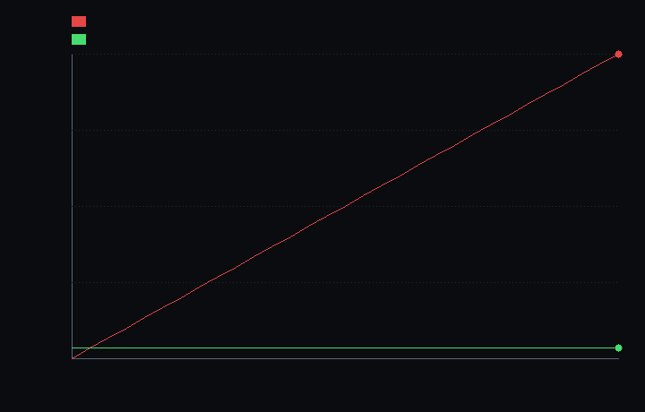

# step_0019 — 활성 집합을 *재스캔 없이 유지* → step_0018 의 O(N³) 재스캔 상쇄를 닫는다

> 확장성 트랙(레버 1·희소화) · [design/scalability.md](../../design/scalability.md) §2 레버1 · §4 S2 · §5("법칙 코드를 *대체*하지 말고 컨테이너/스케줄러 층을 갈아끼운다").
> **이 step 이 닫는 문제**: SCALABILITY 문서가 약속한 "비용을 *부피*가 아니라 *활성 물질*에 묶는다"는, step_0018 까지도 *실현되지 않았다* — 빈 블록을 건너뛰어 아낀 만큼을 활성 블록을 *찾는 재스캔*(매 step O(N³))이 도로 먹었기 때문이다. 이 step 이 그 재스캔을 제거한다.

---

## 1. 논의 — step 의 의미

### 무엇이 문제였나 (step_0018 의 정직한 한계)

step_0018 은 한 법칙(`applyCooling`, per-cell)을 **활성 블록만 순회**하게 해 *조밀과 비트 동일* + 작업량 *활성 비례*를 달성했다. 그러나 활성 블록을 *찾는* `Sp.activeBlockOrigins(field, N, bs)` 가 **매 step 전-격자 O(N³) 를 재스캔**한다. step_0018 verify 가 정직하게 실측해 남긴 숫자:

```
[step_0018] 벽시계 ms/cooling: 조밀 0.303 · 활성(집합 유지) … · 활성(매번 재스캔) 0.554
                                                              ↑ 재스캔이 조밀보다 *느리다* = 절감 상쇄
```

즉 "빈 공간 건너뛰기"의 절감이 "어디가 빈 공간인지 매번 다시 훑기"에 먹혀 **순 이득이 음수**였다. step_0018 자신이 다음 일을 명시했다 — *"실현 절감은 활성 집합이 유지돼야 한다(스캔 1회 후 재사용) … 실제 엔진에선 희소 저장이 이 집합을 유지한다(다음 step)."* 이 step 이 그 "다음 step"이다.

### 이 step 이 세계를 어떻게 변형하나

세계의 *법칙*은 안 바뀐다(cooling 도, 다른 어떤 법칙도). 바뀌는 것은 **스케줄러 층** — 활성 블록 집합을 매번 새로 찾지 않고 **한 번 빌드해 유지**하는 자료구조 `Sp.createActiveSet` 를 가법적으로 더한다(design §5 "법칙 코드를 대체하지 말고 컨테이너/스케줄러 층을 갈아끼운다"). 이로써 step_0018 의 "비트 동일하지만 재스캔에 상쇄되던" 절감이 *진짜 절감*이 된다.

핵심 통찰 — **냉각은 단조 비-성장**이다: `u ← u·factor`(factor∈[0,1])는 0 인 셀을 비-영으로 *절대 못 만든다*. 따라서 비-영 셀 집합은 시간에 따라 *줄기만 한다*(늘지 않음). 그러므로 **한 번 빌드한 활성 집합은 모든 후속 step 의 유효한 cover** 이고, 재스캔 없이 재사용해도 정확하다. (비워진 블록은 `prune` 으로 *활성 범위만 훑어* 제거 — 이것도 O(활성), 전-격자 아님.)

### 무엇으로 검증 가능한가

- **관문**: 유지된 집합으로 S스텝 cooling = 조밀 S스텝 cooling (therm 비트 동일).
- **핵심**: S스텝 동안 *전-격자 스캔 횟수* — 유지=1회 vs 재스캔=S회, **cooling 작업량은 동일**. 절감은 오직 스캔에서 온다 → step_0018 상쇄가 닫힌다.
- **정당성(왜 재사용이 옳은가)**: cooling 후에도 모든 비-영 셀이 빌드된 집합 안에 있다(missed=0) = 단조 불변성.

### 무엇이 보존되고 무엇이 변하나

- **보존**: 모든 법칙(11개)·세계 동역학·조밀 결과(비트 동일)·기존 희소 API(왕복 비트 동일·지문 교차). 회귀 0.
- **변함**: 활성 집합을 *찾는 비용*만 — S·O(N³) → O(N³) 1회.

---

## 2. 구현 — `engine/htj-sparse.js` 에 `createActiveSet` (가법)

기존 함수(`createSparseField`·`fromDense`·`referenceFingerprint`·`activeBlockOrigins`)는 **한 줄도 안 건드린다**. 새 진입점만 추가:

```js
const set = Sp.createActiveSet(N, bs);
set.rebuildFromField(field);   // 한 번 빌드(O(N³)) — seed 직후 1회. 훑은 셀 수 = set.lastScannedCells()
const active = set.origins();  // 결정론(블록키 오름차순) = activeBlockOrigins 와 동일 순서

for (let t = 0; t < S; t++)
  Co.applyCooling(w, dt, { coolRate, active, blockSize: bs });   // 재스캔 없이 재사용

set.prune(field);              // (선택) 비워진 블록만 활성 범위에서 제거 — O(활성), 전-격자 아님
```

- `rebuildFromField` / `prune` 은 블록마다 비-영 셀을 찾으면 즉시 `return`(early-out) — 빈 블록만 전부 훑는다(빈 확인 비용). `lastScannedCells()` 가 *실제로 훑은 셀 수*를 기록(가짜 산수 프록시 아님).
- `origins()` 는 블록키(`z·nbx²+y·nbx+x`) 오름차순 → `activeBlockOrigins` 와 같은 순서라 cooling 결과가 비트 동일.
- 법칙(cooling)은 **변경 없음** — 이미 step_0018 에서 `opts.active` 를 받는다. 이 step 은 그 인자를 *어떻게 공급하느냐*만 바꾼다(스케줄러 층).

---

## 3. 검증

### (a) 수치 — `verify.js` (7/7 PASS)

```
=== step_0019 수치 검증: 활성 집합을 *재스캔 없이 유지* → step_0018 의 O(N³) 재스캔 상쇄 닫음 ===
  [정보용·비단언] 벽시계 ms/step: 조밀 0.375 · 유지 0.054 · 재스캔(0018) 1.073
    → 유지는 조밀 대비 6.9× 빠르고, 재스캔(0018)보다 19.7× 빠름 (재스캔이 절감을 도로 먹던 걸 제거).
  PASS  교차 일치 — ActiveSet.origins() = activeBlockOrigins (같은 블록·같은 키 오름차순) = 32블록 일치(순서 포함)
  PASS  비트 동일(관문) — 유지된 집합 S스텝 cooling = 조밀 S스텝 (therm 비트 동일 · radiated rel 1e-12) = therm fp 0x20e5e885(동일) · radiated Δ=7.7e-12
  PASS  단조 불변성(reuse 안전) — cooling 은 새 비-영 셀을 안 만든다 → 빌드 집합이 S스텝 후에도 전부 덮음(missed=0) = 비-영 3016셀 전부 활성 집합 내부 · 집합 밖 비-영 0셀
  PASS  재스캔 제거(핵심) — 전-격자 스캔 유지=1회 ≪ 재스캔=S회 (cooling 작업량은 동일) → step_0018 상쇄 닫음 = 스캔 셀: 유지 250856 (1회) ≪ 재스캔 7525680 (30회) = 30.0× 적게 · 작업량 동일 491520
  PASS  증분 축소(prune) — 과냉각 1스텝 후 prune 가 빈 블록 제거 · 훑은 범위=활성 칸뿐(O(활성)≪N³) = 32→0블록 (제거 32) · prune 스캔 16384셀 ≪ 전-격자 262144셀
  PASS  회귀 0(가법성) — 새 API 추가가 기존 왕복 비트 동일·지문 교차(step_0016)를 안 건드림 = 왕복 byte 동일 · 지문 0x144fefa0 교차 일치
  PASS  결정론 — origins() 두 번 빌드 동일 · 키 오름차순 = 32블록 동일·오름차순

결과: PASS (7/7)
```

**헤드라인**: 30스텝 동안 전-격자 스캔이 **30× 줄었다**(유지 250,856셀 1회 vs 재스캔 7,525,680셀 30회), cooling *작업량은 동일*(491,520셀) → step_0018 의 "재스캔이 절감 상쇄"가 닫혔다. 벽시계로도 유지가 재스캔보다 **19.7× 빠르고 조밀보다 6.9× 빠르다**(이제 절감이 *순 이득*).

전 step verify **19/19 회귀 0**(0001~0019 + 버그 가드 전부).

### (b) 눈 — `capture.png`



고정 N=64·작은 별, cooling 30스텝의 **누적 전-격자 스캔 셀 수**:
- **빨강(재스캔, step_0018)** — *우상향 직선*. 매 step O(N³) 재스캔 → 누적 = S·N³ (절감을 도로 먹음).
- **초록(유지, step_0019)** — *수평선*. 한 번 빌드(O(N³))한 뒤 재사용 → 누적 = N³ 1회뿐, 바닥에 붙어 있음.

두 경로의 cooling **결과는 비트 동일**(verify §2)인데, 재스캔 비용만 빨강↔초록으로 갈린다. 이는 step_0016(*메모리* 점유 비례)·step_0018(*작업량* 점유 비례)을 잇는 **유지 비용** 판이다 — 셋이 모여 "비용을 부피에서 떼어낸다"는 레버1 의 약속이 메모리·작업·유지 세 축 모두에서 실현됨을 보인다.

---

## 4. 쉽게 풀어 쓴 설명

별 하나가 떠 있는 큰 빈 우주를 매 프레임 식히는 일을 생각하자. step_0018 은 "빈 곳은 건드리지 말자"를 해냈다 — 별이 있는 칸만 식혔다. 그런데 *매 프레임* "별이 어디 있더라?" 하고 **온 우주를 처음부터 다시 훑었다**. 빈 곳을 안 식혀서 아낀 시간을, 빈 곳까지 다 훑어보며 도로 까먹은 것이다(그래서 step_0018 측정에서 재스캔이 조밀보다 *느렸다*).

이 step 의 깨달음은 단순하다 — **별은 갑자기 새 자리에 나타나지 않는다**. 식기만 하는 물질은 *퍼지지 않으니*, "별이 있는 블록 목록"을 **한 번 적어두고 계속 쓰면** 된다. 다시 훑을 필요가 없다. 블록이 완전히 식어 비면 그 블록만 목록에서 지운다(역시 온 우주를 훑지 않는다). 결과적으로 "어디 있나 찾기" 비용이 *매 프레임 한 번씩*에서 *전체에 딱 한 번*으로 줄어, 30프레임이면 30배 적게 훑는다. 식히는 *결과*는 글자 하나 안 바뀐다(비트 동일).

이것이 SCALABILITY 문서가 말한 "비용을 부피가 아니라 활성 물질에 묶는다"가 **드디어 진짜로 일어나는** 지점이다 — 작업량(step_0018)에 이어 *유지 비용*까지 활성 비례로 꺾였다.

---

## 5. 이 step 이 목적에 남긴 의미 · 다음 연결

- **닫은 것**: step_0018 의 정직한 한계 ①(활성 집합 재스캔 O(N³) → 상쇄). 이제 cooling 의 실현 절감이 *순 이득*이다. SCALABILITY 레버1 의 약속이 메모리(0016)·작업(0018)·**유지(0019)** 세 축에서 실현됨.
- **여전한 한계(정직)**:
  1. **한 법칙(cooling)·per-cell 뿐** — stencil 법칙(advect/pressure/thermal/viscosity)은 이웃(halo)이 필요해 아직 활성 순회로 일반화 안 됨. 전역 gravity 는 조밀(S6 트리). 전체 파이프라인은 아직 조밀·중력 지배.
  2. **유지의 안전성은 *단조 비-성장* 법칙에 한정** — cooling 은 새 비-영 셀을 안 만들어 재사용이 안전하지만, advect(질량을 *옮김*)·fusion(점화로 u *생성*)은 활성 영역을 *넓힌다* → 그때는 "이웃 블록을 깨우는(activate) 증분 갱신"이 필요(S3 활성/동결 규칙과 합류).
  3. **데이터=객체(레버2/S5)는 여전히 0** — 설계 핵심 목적 ②(덩어리로 시뮬), 미착수.
- **다음(step_0020~)**: ① **stencil 법칙 halo 일반화**(활성↔빈 경계 flux 처리, 조밀과 비트 동일 관문) + 활성 영역을 *넓히는* 법칙용 증분 활성화(이웃 깨움). ② 그 위에서 **진공 규칙(0017)을 advect 와 합류**(운동량 동반, 0017 한계 ① 닫음). ③ 이후 S5 승격.

> **설계 역참조**: 이 step 은 [design/scalability.md](../../design/scalability.md) §2 레버1("활성 칸만 저장·계산")·§5("컨테이너/스케줄러 층을 갈아끼운다", "측정으로 결정")의 직접 구현이다. S2 의 남은 청사진(stencil halo·증분 활성화)은 §4 S2 행·§2 레버1 "활성/비활성 전이 규칙"이 권위.
