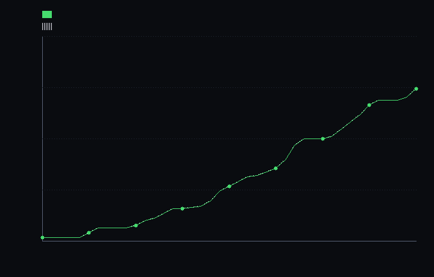

# step_0020 — *번지는* stencil 법칙(확산)을 활성 순회 + halo + 증분 활성화로 일반화

> 확장성 트랙(레버 1·희소화) · [design/scalability.md](../../design/scalability.md) §2 레버1("활성/비활성 전이 규칙")·§4 S2·§5("법칙 코드를 *활성 칸 집합을 받아 도는* 인터페이스로 일반화하면 희소/조밀 양쪽에서 재사용").
> **이 step 이 닫는 문제**: step_0019 까지 활성 순회는 *per-cell·단조 비-성장* 법칙(cooling)뿐이었다. 실제 세계의 법칙 대부분은 *stencil*(이웃을 읽고)이며 *번진다*(활성 영역을 넓힌다). 이 step 이 가장 단순한 stencil 법칙(확산)을 활성 순회로 일반화해, 번지는 법칙도 *조밀과 비트 동일·재스캔 없이* 돌 수 있음을 박는다.

---

## 1. 논의 — step 의 의미

### 무엇이 문제였나 (step_0019 의 정직한 한계)

step_0019 는 활성 집합을 *재스캔 없이 유지*해 cooling 의 절감을 순 이득으로 만들었다. 그러나 두 한계가 남았다:
1. **stencil 법칙 미일반화** — cooling 은 per-cell(이웃 안 읽음)이라 쉬웠다. advect·pressure·thermal·viscosity·확산은 이웃을 읽는 *stencil* 이라 활성 순회로 안 돌았다.
2. **유지 안전성이 *단조 비-성장* 한정** — cooling 은 `u·factor` 라 0 셀을 비-영으로 *못 만든다* → 활성 집합이 줄기만 함 → 한 번 빌드 후 고정이 안전. 그러나 확산·advect 는 *번진다*(0 셀이 비-영 이웃의 flux 를 받아 비-영이 됨) → 활성 영역이 *넓어진다*.

**번지는 stencil 법칙에선 이 둘이 한 문제다.** 활성 블록만 돌면 *경계 번짐*(활성 블록 밖으로 새 나가는 흐름)을 놓쳐 조밀과 달라진다(에너지도 샌다). 해법 두 짝:
- **halo** — 활성 블록 + 그 **6-면 이웃 블록**까지 함께 순회. 번짐이 닿을 수 있는 칸을 모두 덮는다.
- **증분 활성화(이웃 깨움)** — 번져서 비-영이 된 halo 블록을 활성 집합에 *추가*. 전선이 자라난다.

### halo 가 *왜* 충분한가 (비트 동일 증명)

비-영 셀은 *활성 블록에만* 산다(불변식). 어떤 비-영 셀의 6-면 이웃은 ① 같은 활성 블록 안이거나 ② 그 블록의 면-이웃 블록(=halo) 안이다. 따라서 **active∪halo 밖의 셀은 자신도 0이고 모든 이웃도 0** → 확산 결과 `0 + α·0 = 0` = 불변. 그러므로 그 칸들을 *건너뛰어도 조밀과 비트 동일*하다. 처리하는 칸(active∪halo)은 조밀과 똑같은 공식·똑같은 입력(옛 E)을 읽으므로 결과도 똑같다. (더블버퍼라 1패스 계산 → 2패스 써넣기 → 순서 무관.)

에너지 보존도 보장된다 — 흐름은 *적어도 한쪽이 비-영*인 면에서만 일어나고, 비-영 셀 + 그 이웃은 전부 active∪halo 안 → 에너지가 처리 영역을 *가로지르지 않는다*. no-flux 경계 보존이 그대로 산다.

### 이 step 이 세계를 어떻게 변형하나

세계의 *법칙*(확산 공식)은 안 바뀐다 — 같은 셀에 같은 결과. 바뀌는 것은 ① `diffuseEnergy` 에 `opts.active` 경로(활성∪halo 만 순회, 생략 시 조밀=byte 동일) ② `createActiveSet` 에 `originsWithHalo`(halo 목록)·`activateFrom`(이웃 깨움) — 가법.

### 무엇으로 검증 가능한가 / 보존·변화

- **관문**: S스텝 active∪halo 확산(+증분 활성화) = 조밀 S스텝 (energy 비트 동일).
- **halo 필요성**: halo *없이* 돌면 조밀과 달라진다(에너지 샘) → 왜 halo 인지를 *반례*로 박음.
- **증분 활성화**: 활성 블록이 번짐 따라 *자라며* 조밀 지원과 정확 일치(0019 의 비-성장과 대조).
- **보존**: 에너지 총량 = 초기(rel ≤1e-12). **회귀 0**: opts.active 생략 → 조밀 byte 동일. **결정론**.

---

## 2. 구현

### `engine/htj-sparse.js` — `createActiveSet` 에 halo·활성화 추가(가법)

```js
originsWithHalo()           // 활성 블록 ∪ 6-면 이웃 블록 원점(중복 제거·결정론 키 오름차순)
activateFrom(field, origins)// 후보(보통 originsWithHalo) 중 *비-영이 된* 블록을 집합에 추가, 반환=추가 수
```
둘 다 O(활성) — halo 는 활성 블록의 이웃만, 활성화는 후보 목록만 훑는다(전-격자 재스캔 아님).

### `engine/htj-energy.js` — `diffuseEnergy(world, alpha, name, opts)` 에 `opts.active` 경로(가법)

```js
const set = Sp.createActiveSet(N, bs).rebuildFromField(w.fields.energy);   // 한 번 빌드
for (let t = 0; t < S; t++) {
  const iter = set.originsWithHalo();                                       // 활성 + halo
  En.diffuseEnergy(w, alpha, 'energy', { active: iter, blockSize: bs });    // active∪halo 만 순회
  set.activateFrom(w.fields.energy, iter);                                  // 번진 halo 블록 깨움(전선 자람)
}
```
확산 공식(`step()`)은 조밀·활성 공통 — 활성 경로는 1패스(계산)·2패스(써넣기)로 처리 칸만 갱신(나머지 0 불변). `opts.active` 생략 → 조밀 전-격자(기존 경로) = byte 동일(회귀 0).

---

## 3. 검증

### (a) 수치 — `verify.js` (7/7 PASS)

```
=== step_0020 수치 검증: *번지는* stencil 법칙(확산)을 활성 순회 + halo + 증분 활성화로 일반화 ===
  [정보용·비단언] 벽시계 ms/step: 조밀 2.717 · 활성∪halo 2.931 → 0.9× (작은 핫스팟, 번질수록 합류).
  PASS  비트 동일(관문) — S스텝 active∪halo 확산(+증분 활성화) = 조밀 S스텝 (energy 비트 동일) = energy fp 0x13ea5492 (동일) · 15스텝
  PASS  halo 필요성 — halo 없이 활성 블록만 돌면 조밀과 *달라진다*(경계 번짐 누락) → 왜 halo 인가 = 조밀 Σ=1000.000 ≠ halo없음 Σ=987.222
  PASS  증분 활성화 — 활성 블록이 번짐 따라 자라며(0019 비-성장과 대조) 조밀 지원과 정확 일치(missed=0) = 활성 8→181블록(자라남) · 조밀 지원 181블록 일치 · 집합 밖 비-영 0셀
  PASS  재스캔 없음(O(활성)) — halo 순회 + 활성화 스캔이 전-격자 N³ ≪ (step 마다 활성 비례, 재스캔 아님) = halo 방문 16384셀 · 활성화 스캔 12288셀 ≪ 전-격자 262144셀
  PASS  보존 — 활성∪halo 확산이 에너지 보존(no-flux 경계) → 총에너지 = 초기(상대 오차 ≤1e-12) = Σ 1000.000000 → 1000.000000 · rel=8.9e-15
  PASS  회귀 0 — opts.active 생략 → 기존 조밀 경로(손 계산 1스텝과 byte 일치) = dense path 불변
  PASS  결정론 — 같은 입력 두 번 active∪halo 확산 → 동일 지문 = 0x58016517

결과: PASS (7/7)
```

**헤드라인**: 번지는 stencil 법칙이 처음으로 활성 순회로 돈다 — *조밀과 비트 동일*. **halo 가 필수임을 반례로 박았다**(halo 없이는 1000→987.222 로 에너지가 활성 블록 밖으로 새 나감). **증분 활성화로 활성 전선이 8→181블록으로 자라며** 조밀 지원과 한 치 오차 없이 일치(0019 cooling 의 *비-성장*과 정반대), **전-격자 재스캔 없이**. (벽시계는 작은 핫스팟이 40스텝이면 격자 대부분으로 번져 ~합류 — 이 step 의 성과는 속도가 아니라 *번지는 법칙의 정확한 활성 일반화*다. 국소에 머무는 법칙·큰 격자일수록 절감.)

전 step verify **20/20 회귀 0**(0001~0020 + 버그 가드 전부).

### (b) 눈 — `capture.png`



확산 40스텝의 **활성 블록 수**: 초록(증분 추적)이 8→380블록으로 *우상향*(번짐 전선이 자라남), 흰 점선(조밀 지원=ground truth)과 **정확히 겹친다** — 증분 활성화가 전-격자 재스캔 없이 전선을 한 치 오차 없이 따라간다. step_0019 캡처(활성 집합이 *줄기만* 하는 cooling 유지 비용)의 *거울짝* — 여기선 번지며 *자란다*. 그래도 확산 결과는 조밀과 비트 동일(차트 출력 `비트 동일=true`).

---

## 4. 쉽게 풀어 쓴 설명

step_0019 의 별은 *식기만* 했다 — 빛나는 칸이 새로 생기지 않으니, "어디가 빛나나" 목록을 한 번 적어두면 됐다. 그런데 *잉크 한 방울이 물에 퍼지는* 확산은 다르다 — 매 순간 *가장자리가 한 칸씩 번진다*. 빛나던 칸 목록만 보고 일하면, 막 번져 나간 *가장자리 바로 바깥* 칸을 빼먹는다(그 칸으로 흘러간 잉크가 *사라져* 총량이 줄어든다 — verify 가 1000→987 로 잡았다).

해법은 두 가지다. ① **테두리 한 겹(halo)을 같이 처리한다** — 번짐이 닿을 수 있는 바로 바깥 블록까지 훑으면 새 나가는 흐름을 놓치지 않는다. ② **번져서 새로 물든 블록을 목록에 더한다(이웃 깨움)** — 다음 순간엔 그 칸도 "빛나는 칸"이 되어 그 *바깥*을 또 처리한다. 이렇게 목록이 잉크 자국을 따라 *자라난다*. 온 우주를 다시 훑지 않고(재스캔 없음) 가장자리 한 겹만 살피면 된다.

결과는 *조밀(전부 다 처리)과 글자 하나 안 다르다*. SCALABILITY 문서가 말한 "법칙을 *활성 칸 집합을 받아 도는 인터페이스로 일반화*"가, 이번엔 cooling 같은 얌전한 법칙이 아니라 *번지는* 법칙에서도 성립함을 보인 것이다.

---

## 5. 이 step 이 목적에 남긴 의미 · 다음 연결

- **닫은 것**: step_0019 의 정직한 한계 ①(stencil halo 미일반화)·②(유지 안전성 단조 비-성장 한정)을 *번지는 stencil 법칙* 한 개(확산)에서 닫음. 이제 "활성 칸을 받아 도는 인터페이스"가 per-cell(cooling)·*번지는* stencil(확산) 양쪽에서 검증됨 — design §5 의 일반화 원칙 실증.
- **여전한 한계(정직)**:
  1. **확산 한 법칙뿐** — 같은 halo/활성화 틀을 advect(질량 *수송*=donor-cell·CFL 서브스텝)·pressure/thermal/viscosity(∇ 연산)에 *적용*해야 전체 파이프라인이 활성으로 돈다. 확산은 가장 순한 stencil(대칭 flux·자기 갱신)이라 첫 일반화에 골랐다.
  2. **halo = 6-면 1겹** — 확산은 면-이웃만 번져 충분하지만, advect 는 속도에 따라 여러 칸 건너뛸 수 있어(CFL nsub) halo 폭을 *속도 기반*으로 정해야 할 수 있다.
  3. **gravity 전역 항은 여전히 조밀**(S6 트리). **데이터=객체(레버2/S5)는 0**.
- **다음(step_0021~)**: ① 같은 틀을 **advect 에 적용**(질량 수송 = 번짐 + 방향성, 진공 규칙 0017 합류로 운동량 동반 — 0017 한계 ① 닫음) ② 이후 pressure/thermal/viscosity → 전체 파이프라인 활성화 ③ 그 위에서 S5 승격.

> **설계 역참조**: 이 step 은 [design/scalability.md](../../design/scalability.md) §5("법칙 코드를 활성 칸 집합을 받아 도는 인터페이스로 일반화")·§2 레버1("활성/비활성 전이 규칙": 임계 미만 흡수↔이웃 분배의 *깨움* 짝)의 직접 구현이다. 남은 stencil 법칙·advect 합류는 §4 S2 행·§2 레버1 이 권위.
