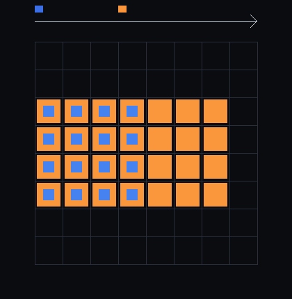

# step_0021 — *수송하는* stencil 법칙(advect)을 활성 순회 + halo + 증분 활성화로 일반화

> 확장성 트랙(레버 1·희소화) · [design/scalability.md](../../design/scalability.md) §5("법칙 코드를 *활성 칸 집합을 받아 도는* 인터페이스로 일반화→희소/조밀 재사용")·§2 레버1·§4 S2.
> **이 step 이 닫는 문제**: step_0020 은 *대칭으로 번지는* stencil(확산)을 활성화했다. 실제 동역학의 중심은 *방향성 수송*(질량이 흐름을 타고 옮겨감)인 **advect** 다. 이 step 이 그 가장 복잡한 법칙(donor-cell·CFL 서브스텝·진공 가드)을 활성 순회로 일반화해, 흐르는 물질도 *조밀과 비트 동일·재스캔 없이* 돌 수 있음을 박는다.

---

## 1. 논의 — step 의 의미

### 확산(0020)과 무엇이 다른가

| | 확산(0020) | advect(0021) |
|---|---|---|
| 성격 | *대칭* 번짐(사방 균등) | *방향성* 수송(흐름 방향) |
| 활성 전선 | 사방 대칭 자람 | **흐름 방향으로 비대칭** 이동·자람 |
| 한 호출 이동 | ≤1칸(자기 갱신) | **CFL 서브스텝(nsub)** 으로 여러 칸 가능 |
| 보존량 | 에너지 | **질량 Σρ + 운동량 Σg** |

### halo 가 여기서도 충분한 이유 (비트 동일)

donor-cell 상류차분의 flux 는 **donor 셀의 ρ·g 에 비례**한다(`flux = h·uf·Q[up]`). 빈 셀(ρ=0)은 donor 값이 0 → flux 0. 비-영 셀은 활성 블록에만 사니, 비-영 donor 가 관여하는 모든 면은 active∪halo 안에 있다. active∪halo *밖*의 면은 양쪽 donor 가 0 → flux 0(속도 scratch 가 낡았어도 0 을 곱하니 무해). 그러므로 active∪halo 만 돌아도 **조밀과 비트 동일**(step_0020 확산과 같은 논리, 경계 flux 가 donor=0 으로 자동 0).

운동량도 따라온다 — 진공 g-가드(`|g|≤ρ·VMAX`)가 ρ=0 ⟹ g=0 을 보장 → g 의 비-영 지지 ⊆ ρ 지지 → **활성 집합을 ρ(energy)로 추적하면 운동량 장도 자동으로 덮인다**.

### 핵심 안전장치 — CFL 폴백 (보존 척추)

advect 는 CFL 서브스텝으로 **한 호출에 여러 칸**(≈courant) 이동할 수 있다. courant 가 halo 폭(1블록)을 넘으면 질량이 active∪halo 밖으로 *이탈*해 보존이 샌다. 그래서:
- **CFL 안전(courant≤1, nsub=1)에서만 활성 경로** — 한 호출에 ≤1칸 이동 → 1-블록 halo 에 넉넉히 든다.
- **courant>1(폭주·고속)은 조밀로 폴백** — 한 호출에 정확히 조밀로 풀어 *질량 이탈 0*. 드물고(정상 흐름 courant≈0.25), 보존(HTJ 척추)을 절대 안 깬다.

### 무엇으로 검증 가능한가 / 보존·변화

- **관문**: S스텝 active advect = 조밀 S스텝 (ρ·g 비트 동일).
- **방향성 활성화**: 전선이 흐름 따라 비대칭 이동(CoM +x) · 조밀 지원과 정확 일치.
- **보존**: Σρ·Σg 보존(advect 척추). **halo 필요성**: halo 없이 질량 샘. **nsub>1 폴백**: 고속은 조밀 폴백→비트 동일.
- **회귀 0**: opts.active 생략 → 조밀 byte 동일. **결정론**.

---

## 2. 구현 — `engine/htj-inertia.js` `advect` 에 `opts.active` 경로(가법)

```js
const set = Sp.createActiveSet(N, bs).rebuildFromField(w.fields.energy);   // ρ 로 추적(g⊆ρ)
for (let t = 0; t < S; t++) {
  const iter = set.originsWithHalo();                                       // 활성 + halo
  In.advect(w, dt, { active: iter, blockSize: bs });                        // active∪halo 만(courant>1 → 조밀 폴백)
  set.activateFrom(w.fields.energy, iter);   // 흐름이 닿은 halo 블록 깨움(전선 전진)
  set.prune(w.fields.energy);                // 질량이 빠져나간 블록 회수(전선이 지나온 자리)
}
```

활성 경로: cells = active∪halo 셀 목록 → ① courant 읽기 추정(상태 불변, 폴백 판정) → courant≤1 이면 ② 진공 g-가드(iter) ③ 속도 재계산(iter) ④ donor-cell 3축 sweep(iter, 조밀과 동일 식) ⑤ write-back(iter). courant>1 이면 *조밀 폴백*(상태 아직 불변 = 순수 조밀 결과). `opts.active` 생략 → 조밀 전-격자(기존 경로) = byte 동일(회귀 0). `prune` 가 더해진 건 0020(확산=번지기만)과 달리 advect 는 *질량이 떠나* 블록을 비울 수 있기 때문(전선이 자라고 *지나간 자리는 줄어든다*).

---

## 3. 검증

### (a) 수치 — `verify.js` (8/8 PASS)

```
=== step_0021 수치 검증: *수송하는* stencil 법칙 advect 를 활성 순회 + halo + 증분 활성화로 일반화 ===
  [정보용·비단언] 벽시계 ms/step: 조밀 17.084 · 활성∪halo 27.153 → 0.6× (작은 덩어리, 활성 비례).
  PASS  비트 동일(관문) — S스텝 active advect(active∪halo+증분 활성화+prune) = 조밀 S스텝 (ρ·g 비트 동일) = ρ fp 0xb391c6a5 · gx fp 0xab68a83d (동일) · 20스텝
  PASS  방향성 활성화 — 전선이 흐름 방향(+x)으로 비대칭 자람(CoM 이동) · 조밀 지원과 정확 일치(missed=0) = CoM_x 19.2→24.2(+x 직진) · 활성 192블록 = 조밀 지원 192블록 · 집합 밖 비-영 0
  PASS  보존 — Σρ·Σg 보존(활성∪halo advect, no-flux 경계) = advect 척추 (상대 오차 ≤1e-12) = Σρ rel=1.0e-14 · Σg rel=1.0e-14
  PASS  halo 필요성 — halo 없이 활성 블록만 돌면 흐름 전선에서 질량 샘 → 조밀과 달라짐 = 조밀 Σρ=999.650 ≠ halo없음 Σρ=999.584
  PASS  nsub>1 폴백 — 고속 흐름(courant>1)은 조밀 폴백 → 여전히 조밀과 비트 동일(질량 이탈 방지) = courant≈1.5>1 → 폴백 · ρ·g fp 조밀과 동일
  PASS  재스캔 없음(O(활성)) — 한 step 방문 셀 ≪ 전-격자 N³ (활성∪halo 비례) = 방문 120832셀 ≪ 전-격자 262144셀 = 46.1%
  PASS  회귀 0 — opts.active 생략 → 기존 조밀 경로(결정론·불변) = dense path 0x428de3cd
  PASS  결정론 — 같은 입력 두 번 active advect → 동일 지문 = 0x4c129635

결과: PASS (8/8)
```

**헤드라인**: 가장 복잡한 동역학 법칙(advect)이 활성 순회로 돈다 — *조밀과 비트 동일*. **방향성 활성화**: 활성 전선이 흐름 따라 +x 로 이동(CoM 19.2→24.2)하며 조밀 지원과 한 치 오차 없이 일치(0020 의 *대칭* 번짐과 달리 *비대칭* 수송). **보존 척추 지킴**: Σρ·Σg rel 1e-14, **halo 필수성 반례로 박음**(halo 없이 질량 샘), **고속 흐름은 조밀 폴백으로 질량 이탈 0**. 전 step verify **21/21 회귀 0**.

> **정직한 한계 — 속도가 아니라 정확성**: 벽시계는 0.6×(더 느림). 1차 상류차분 advect 는 *수치 확산*이 커서 작은 덩어리가 60스텝이면 격자의 ~46%로 번진다 + halo·셀 단위 함수 호출 overhead. 이 step 의 성과는 *속도가 아니라 가장 어려운 법칙의 정확한 활성 일반화*(비트 동일·방향성·보존·폴백 안전)다. 절감은 국소에 머무는 흐름·큰 격자·수치 확산이 작은 고차 스킴에서 실재한다.

### (b) 눈 — `capture.png`



z-중앙 슬라이스의 활성 블록(흐름 +x = 상단 화살표): **파랑=초기 활성**(왼쪽, 덩어리 시작 자리), **주황=후기 활성**(흐름 따라 오른쪽으로 확장·이동한 전선). 활성 집합이 *흐름을 따라 옮겨간다* — step_0020 확산의 *사방 대칭* 자람과 대비되는 *방향성* 전선. 텍스트 출력 `조밀 지원과 매 step 정확 일치=true · advect 결과 비트 동일=true`.

---

## 4. 쉽게 풀어 쓴 설명

step_0020 의 잉크는 *제자리에서 사방으로* 번졌다. 이번엔 **강물에 띄운 잉크** — 잉크가 *하류로 떠내려간다*. "잉크 있는 칸 목록"만 보면, 하류로 막 떠내려간 *앞쪽 가장자리*를 빼먹어서 그 잉크가 사라진다(verify 가 질량 샘을 잡았다).

해법은 0020 과 같은 두 짝이다 — **앞쪽 테두리 한 겹(halo)을 같이 살피고**, **잉크가 새로 닿은 칸을 목록에 더한다(이웃 깨움)**. 다른 점 하나 더: 강물은 *지나간 자리를 비운다* → 잉크가 떠나 텅 빈 칸은 목록에서 *지운다*(prune). 그래서 목록이 잉크 자국을 따라 *하류로 옮겨간다* — 그림의 파랑(처음 자리)에서 주황(나중 자리)으로.

딱 하나 조심할 게 있다 — 물살이 *너무 빠르면* 한 순간에 테두리 한 겹을 넘어 멀리 튀어, 안 살핀 칸으로 잉크가 사라질 수 있다. 그래서 **물살이 빠른(한 순간 한 칸 넘게 가는) 경우엔 안전하게 온 강을 다 계산한다**(조밀 폴백). 잉크(질량)는 *절대* 사라지면 안 되니까 — 보존이 이 세계의 척추다.

결과는 *온 강을 다 계산한 것과 글자 하나 안 다르다*(비트 동일). 이로써 SCALABILITY 문서의 "법칙을 활성 칸 인터페이스로 일반화"가 가장 어려운 *흐름* 법칙에서도 성립함을 보였다.

---

## 5. 이 step 이 목적에 남긴 의미 · 다음 연결

- **닫은 것**: step_0020 의 한계 ①(확산 한 법칙뿐)을 *수송* 법칙 advect 로 확장. 이제 "활성 칸 인터페이스"가 per-cell(cooling·0019)·*대칭 번짐*(확산·0020)·*방향성 수송*(advect·0021) 세 종류 stencil 에서 검증 — design §5 일반화 원칙이 동역학의 중심 법칙까지 닿음.
- **여전한 한계(정직)**:
  1. **∇ 기반 힘 법칙(pressure/thermal/viscosity)·전역 gravity 는 아직 조밀** — advect 가 활성이어도 매 step 함께 도는 이 법칙들이 조밀이면 전체 파이프라인은 조밀. pressure 류는 advect 와 같은 halo 틀로 일반화 가능(∇P 는 ±1 이웃 stencil).
  2. **속도 = 정확성 trade**: 1차 upwind 수치 확산이 커 활성 영역이 빨리 자람 → 작은 격자선 절감 미미(큰 격자·국소 흐름·고차 스킴에서 실재).
  3. **진공 규칙(0017)은 아직 advect 와 미합류** — 운동량 동반 진공(0017 한계 ①)은 진공 규칙을 활성 advect 와 같은 sweep 에 얹어야 닫힌다.
  4. **데이터=객체(레버2/S5)는 0**.
- **다음(step_0022~)**: ① **pressure/thermal/viscosity(∇ 법칙)를 같은 halo 틀로 활성화** → 전체 파이프라인이 활성으로 돈다(조밀과 비트 동일 관문) ② 진공 규칙(0017)을 활성 파이프라인과 합류 ③ 그 위에서 S5 승격(레버2 — 설계 핵심 목적 ②).

> **설계 역참조**: [design/scalability.md](../../design/scalability.md) §5("활성 칸 집합을 받아 도는 인터페이스")·§2 레버1("활성/비활성 전이 규칙": 깨움↔회수). 남은 ∇ 법칙·진공 합류는 §4 S2 행이 권위.
