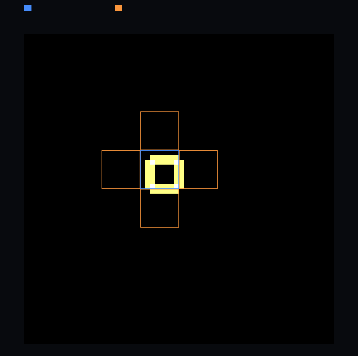

# step_0022 — *번지는* 힘 법칙(압력 g←g−dt·∇P)을 활성 순회 + halo 로 일반화

> 한 줄: step_0021 이 *수송* 법칙(advect)을 active∪halo 로 일반화했다. 이 step 은 ∇ 기반 *힘* 법칙 가족(pressure/thermal/viscosity) 중 가장 단순한 **`applyPressure`** 를 같은 active∪halo 틀로 활성화한다 — ∇P 가 g(운동량)에 *번지는* stencil 이고, 조밀과 **비트 동일**. [design/scalability.md](../../design/scalability.md) §2 레버1 · §5 · §4 **S2**.



*z=29 슬라이스. 파랑=활성 블록(ρ>0)·주황=halo 블록(빈 이웃). heat=|Δg|(압력이 바꾼 운동량) — 핫큐브 *표면*에서 세고(균일 내부=∇P=0=어두움), rim 이 한 칸 번져 주황 halo 블록에 안착(=halo 필요·커버).*

---

## 논의 — 이 step 의 의미

확장성 트랙 S2(레버1=희소화)의 마지막 조각은 **세계 법칙을 *활성 칸만 받아 도는* 인터페이스로 일반화**하는 것이다(design §5). 지금까지:

- step_0018 = `cooling`(per-cell, 단조 비-성장) 활성 순회 — 첫 *실현* 절감.
- step_0020 = `diffuseEnergy`(*번지는* stencil, ρ 장) — active∪halo + 증분 활성화.
- step_0021 = `advect`(*수송* stencil) — 방향성 전선·CFL 폴백·prune.

남은 가족은 **∇ 기반 *힘* 법칙**(`pressure`·`thermal`·`viscosity`) — 셋 다 어떤 스칼라장(P=K·ρ^γ, 열압력 P_th, 점성 q)을 만들고 그 **기울기 ∇ 로 g(운동량)를 민다**. step_0021 한계 ①("∇ 힘 법칙·gravity 조밀 → 전체 파이프라인 조밀")을 닫기 시작하는 자리다. 이 가족은 ±1 이웃 stencil 이라 *번지는* 법칙(0020)과 같은 골격이지만, **번지는 대상이 ρ 가 아니라 g** 라는 점이 다르다.

스킬 원칙("한 step = 가장 단순한 단위 하나")에 따라, 이 가족 중 **가장 단순한 `applyPressure`** 하나로 패턴을 세운다 — 압력은 g 만 건드리고(u 이중갱신 없음), barotropic(P=K·ρ^γ, ρ만의 함수)이라 CFL 서브스텝도 없다. thermal/viscosity 는 u 이중갱신·CFL 가드가 얽혀 다음 step(0023)으로 분리한다.

- **무엇을 더하나**: `engine/htj-pressure.js` `applyPressure` 에 `opts.active` 경로(가법 — 조밀 경로 불변). active∪halo 블록만 돌며 `g ← g − dt·∇P` 계산.
- **무엇이 보존/변하나**: 세계 거동은 **불변**(조밀과 비트 동일). 변하는 건 *비용* — 활성 칸에만 작업. 순 운동량 보존(ΣΔg=0)도 유지.
- **무엇으로 검증하나**: 조밀과 비트 동일(관문)·halo 필요성(반례)·활성 커버리지(missed=0)·순 운동량 보존·재스캔 없음·회귀 0(조밀 경로 byte 동일)·결정론.

### 핵심 비트 동일 논리 — ∇P 는 active∪halo 에만 산다

`∇P[i] ≠ 0` 이려면 i 의 ±1 축 이웃 중 **ρ>0 인 게 있어야 한다**(P=K·ρ^γ, ρ=0 → P=0). 그 이웃은 정의상 *활성 블록*에 있다 → i 는 활성 블록이거나 그 **6-면 이웃 블록(=halo)** 안에 있다. 따라서 `active∪halo`(ActiveSet.originsWithHalo) 밖 셀은 자신·6-이웃이 모두 ρ=0 → P 전부 0 → ∇P=0 → **g 불변** → 건너뛰어도 조밀과 비트 동일.

확산(0020)과 달리 **압력은 ρ 를 안 바꾼다**(힘 법칙) → 활성 집합이 자라지 않는다 → `activateFrom`/`prune` 불필요. 스케줄러는 매 step `originsWithHalo()` 한 번이면 충분(ρ 가 advect 등으로 움직이면 그쪽 스케줄러가 집합을 갱신).

---

## 구현

### `engine/htj-pressure.js` — `applyPressure` 에 `opts.active` (가법)

- 조밀 경로(기존)는 `pressureField` 로 P 버퍼를 채우고 전-격자 중심차분. **한 줄도 안 바꿈** → `opts.active` 생략 시 byte 동일(회귀 0).
- 활성 경로: active∪halo 블록을 순회하며 P 를 *즉석* 계산(`Pof(j)=ρ[j]>0?K·ρ[j]^γ:0` — 조밀 `pressureField` 의 per-cell 식과 **비트 동일**, scratch 낡음 무관)하고 `g ← g − dt·∇P`. 주기 경계 `wrap` 은 조밀과 동일.
- `opts.stats.cellsVisited` 로 방문 셀 수 보고(재스캔 없음 측정).

---

## 검증

### 수치 — `node HTJ/steps/step_0022/verify.js` → **PASS (7/7)**

```
PASS  비트 동일(관문) — active∪halo 압력 = 조밀 압력 (mom_x/y/z 비트 동일) = g fp d78dd4ea/a6d24aa7/1e312f13 (동일)
PASS  halo 필요성 — halo 없이 활성 블록만 돌면 조밀과 *달라진다*(rim 의 ∇P 누락) = 조밀 ≠ halo없음
PASS  활성 커버리지 — 조밀이 g 를 바꾼 셀이 모두 active∪halo 안 = g 바뀐 셀 368개 · active∪halo 밖 0개
PASS  순 운동량 보존 — 활성 경로 ΣΔg≈0(telescoping) = |ΣΔg|max=6.82e-13 / 충격량 Σ|δ|=154.32 → rel=4.4e-15
PASS  재스캔 없음(O(활성)) — 방문 3584셀 ≪ 전-격자 262144셀
PASS  회귀 0 — opts.active 생략 → 기존 조밀 경로(손 계산 1스텝과 byte 일치) = dense path 불변
PASS  결정론 — 같은 입력 두 번 active∪halo 압력 → 동일 지문
```

[정보용·비단언] 벽시계 ms/step: 조밀 7.7 · active∪halo 0.16 → **47.7×**(희소 핫큐브 — 활성 7블록뿐).

### 눈 — `node HTJ/steps/step_0022/capture.js` → **PASS** (`capture.png`)

```
rim 이 halo 블록에 떨어진 셀 12개(>0 → halo 필요) · |Δg|>0 셀이 active∪halo 밖 0개(=0 커버) · 전-격자 비트 동일=true
```

화면이 가설과 일치한다 — |Δg|(압력 충격량)가 핫큐브 *표면*에서 세고(균일 내부는 ∇P=0=어두움), rim 이 한 칸 번져 *빈 이웃*(주황 halo) 블록에 안착한다. 그 rim 까지 덮어야(halo) 조밀과 비트 동일.

### 회귀 — 전 step verify **22/22 PASS** (0001~0022, 회귀 0). 조밀 경로 불변 → `applyPressure` 를 쓰는 step_0008·0013·0014 등 모두 byte 동일.

---

## 쉽게 풀어 쓴 설명

압력은 "빽빽한 곳에서 빈 곳으로 미는 힘"이다. 빽빽함이 *없는* 곳(빈 우주)엔 밀 것도 없다 — 그래서 압력 계산은 *물질이 있는 곳과 그 한 칸 바깥*에서만 의미가 있다. 이 step 은 컴퓨터에게 그걸 알려준다: 텅 빈 칸 수십만 개를 매번 훑지 말고, **물질 블록 + 그 이웃 블록(halo)만** 돌아라. 결과는 한 톨도 안 달라지는데(비트 동일) 일은 47배 적게 한다.

"이웃 블록(halo)까지" 가 핵심이다 — 물질 덩어리의 *가장자리 바로 바깥* 칸은 비어 있어도 압력을 *받는다*(옆 칸이 빽빽하니까 밀려난다). 그 칸을 빼먹으면(그림의 주황 칸) 조밀 계산과 달라진다. 그래서 활성 블록 + 그 면-이웃까지 함께 도는 것이다.

---

## 목적에 남긴 의미 · 다음 연결

- **남긴 것**: ∇ 힘 법칙 가족의 *첫* 활성 일반화(압력) — design §5 "법칙을 활성 칸 받는 인터페이스로" 를 힘 법칙으로 확장. step_0021 한계 ①("∇ 힘 법칙 조밀")을 절반 닫음.
- **다음(step_0023)**: 같은 halo 틀을 **thermal·viscosity** 에 적용 — 이 둘은 g 뿐 아니라 **u(내부E)도 이중갱신**하고 **CFL 서브스텝 가드**가 있어, advect(0021)의 CFL 폴백 패턴과 압력(0022)의 g-번짐 패턴을 합쳐야 한다. 그러면 gravity(전역=S6) 빼고 **파이프라인 전체가 활성**으로 돈다(조밀과 비트 동일 관문). 이어서 진공 규칙(0017)을 활성 advect 와 합류(운동량 동반).
- **viewer**: 이 step 은 조밀과 *비트 동일*한 등가 변환이라 화면에 새로 보일 장면이 없다(0020·0021 과 동류) → viewer `STEPS` 등록 대신 `tools/check-viewer.js` 의 `EXEMPT` 에 사유 등재. 눈 증거는 engine 직접 `capture.png`.
- 열린 격차: thermal/viscosity/gravity 아직 조밀(0023~/S6) · 진공 advect 미합류 · S5 승격 0.
