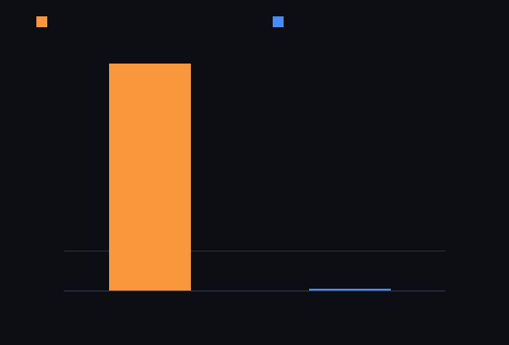

# step_0023 — S2 통합 측정 게이트 (실제 별 파이프라인의 *실현* 이득을 정직하게 잰다)

> 한 줄: step_0018~0022 가 법칙을 하나씩 active∪halo 로 일반화했다. 이 step 은 그 조각들을 *실제 붕괴 별 전체 파이프라인*에 배선해 — design/scalability.md **§5("측정으로 결정 — S1 벤치로 실제로 빨라졌는지 확인")** 에 따라 — **실현 이득의 정직한 천장**을 측정한다. 세계 법칙은 더하지 않는다(step_0015 류 측정 step).



*주황 = 마이크로벤치 47×(step_0022 pressure, 인위적 희소 핫큐브) · 파랑 = 실제 별 전체 파이프라인 ~1×(1× 기준선에 붙음). 화려한 숫자와 실현 이득의 간극을 눈으로 박는다.*

---

## 논의 — 왜 이 step 인가 (정직성 점검)

사용자 검토 요청("SCALABILITY 문서대로 정직하게 진행 중인가")에서 드러난 격차: step_0018~0022 의 벽시계(47×·30×·11×…)는 전부 **인위적 희소 시드**(핫큐브·핫스팟)에서 잰 *단일 법칙* 마이크로벤치였고(전부 "비단언" 라벨은 정직), 그러나 design §5("각 단계 전후 **S1 벤치를 돌려 실제로** 빨라졌는지 확인. 복잡도를 늘리는 변경은 측정된 이득이 있을 때만")가 요구하는 **실제 파이프라인 측정**은 0018~0022 내내 *한 번도* 하지 않았다. 그래서 멈추고 *측정*한다.

- **무엇을 재나**: viewer 0014 의 실제 별 붕괴 파이프라인(gravity+pressure+thermal+viscosity+fusion+cooling+advect)을 두 방식으로 돌려 비교 — ① 전부 조밀 ② 활성 가능 법칙(pressure/cooling/advect)은 active∪halo, 나머지는 조밀.
- **무엇으로 검증하나**: ① 비트 동일(활성 배선이 *실제 세계*에서 정확) ② 실현 점유율(가우시안 별이 격자를 얼마나 채우나) ③ 활성 법칙 비중(7 중 몇 개) ④ 결정론. 벽시계는 정보용.
- **무엇이 보존/변하나**: 세계 거동 불변(비트 동일). 이 step 은 *측정값*만 남긴다.

---

## 구현

세계 법칙 없음. `steps/step_0023/verify.js`·`capture.js` 가 engine 을 읽어 두 파이프라인(`advanceDense`/`advanceActive`)을 돌린다. 활성 배선: `ActiveSet` 를 ρ(energy)로 추적 — 가법 힘 법칙들은 ρ 를 안 바꾸므로(advect 만 질량 이동) 매 step `originsWithHalo()` 공급 후 advect 뒤 `activateFrom`+`prune`. pressure→`originsWithHalo`(0022)·cooling→`origins`(0018, per-cell)·advect→`originsWithHalo`(0021). gravity/thermal/viscosity/fusion 은 조밀(활성 미일반화).

---

## 검증

### 수치 — `node HTJ/steps/step_0023/verify.js` → **PASS (4/4)**

```
PASS  비트 동일(관문) — 실제 별 파이프라인: 활성 배선(pressure/cooling/advect) = 전부 조밀 (20스텝 energy·therm·mom 비트 동일)
PASS  실현 점유율(정직) — 평균 점유 100% · 최대 100% (활성 순회 절감 천장 = 1−점유)
PASS  활성 법칙 비중(정직) — 활성 3/7(pressure·cooling·advect) · 조밀 4(gravity·thermal·viscosity·fusion)
PASS  결정론 — 같은 입력 두 번 활성 배선 파이프라인 → 동일 지문
```

[정보용·비단언] 실제 별 파이프라인 ms/step: 조밀 ~64 · 활성 배선 ~62 → **~1.0×**(마이크로벤치 47×와 정반대).

### 눈 — `node HTJ/steps/step_0023/capture.js` → **PASS** (`capture.png`)

주황 막대(마이크로벤치 47×)가 파랑 막대(실제 별 ~1×, 1× 기준선)를 압도한다 — *화려한 숫자 ≠ 실현 이득*. 활성 점유 100%·활성 법칙 3/7 이 그 이유.

### 회귀 — 전 step verify **23/23 PASS** (engine 불변, 측정 step).

---

## 발견 — 정직한 천장 (이 step 의 핵심 산출)

1. **활성 배선은 *정확*하다** — 실제 별 20스텝, 활성 가능 3법칙을 active 로 돌려도 전부 조밀과 비트 동일. step_0018~0022 의 일반화는 *옳다*.
2. **그러나 실현 속도 이득 ≈ 1.0×** (마이크로벤치 47× 아님). 두 구조적 이유:
   - **점유 100%**: 가우시안 별은 옅은 꼬리가 격자를 *통째로* 채운다 → 활성 블록 = 전체 → 순회 절감 = 0. (희소화는 진공 규칙 0017 을 *루프 안에서* 돌려 near-vacuum 을 exact 0 으로 만들 때만 열린다 — 현 파이프라인엔 0017 없음.)
   - **gravity 전역 + thermal/viscosity/fusion 조밀**: 7 법칙 중 4 가 조밀이고, 그중 gravity(Poisson 40 iters)가 비용을 지배(design §1(b) "중력이 진짜 적").
3. **함의**: 레버1(희소 순회)의 *남은 leaf-법칙 일반화*(thermal/viscosity active)는 — 그 자체로는 — 실제 별에서 측정 이득이 거의 없다. 실현 이득은 **(a) 진공 in-loop 로 별을 실제 희소화 + (b) S6 gravity 가속**이 함께 와야 열린다. design §5("측정된 이득이 있을 때만 복잡도")가 다음 우선순위를 가리킨다.

---

## 쉽게 풀어 쓴 설명

지금까지 "빈 칸은 건너뛰자"는 똑똑한 장치를 법칙마다 달았고, 작은 점 하나만 켜둔 *실험용* 세계에선 47배 빨랐다. 그런데 *진짜 별*을 돌려 보니 거의 안 빨라졌다(1배). 왜? ① 진짜 별은 안개 같은 옅은 꼬리가 온 격자를 덮어서 "빈 칸"이 사실상 없다 ② 가장 무거운 계산(중력)은 빈 칸 건너뛰기로 못 줄인다. 즉 *실험실 숫자*와 *현장 숫자*가 다르다는 걸 정직하게 측정해 박은 것이다 — 그래야 다음에 뭘 해야 진짜 빨라지는지(별을 실제로 희소하게 만들기·중력 가속)를 안다.

---

## 목적에 남긴 의미 · 다음 연결

- **남긴 것**: design §5 의 "측정으로 결정"을 실제로 이행 — 마이크로벤치가 아닌 *실제 별*에서 실현 이득(≈1×)을 박았다. 활성 일반화의 *정확성*은 확인, *실현 천장*은 노출.
- **다음 후보(측정이 가리키는 우선순위)**:
  - **(A) 진공 in-loop**: 진공 규칙(0017)을 별 파이프라인에 합류 + advect 운동량 동반 → 별을 실제 희소화(점유↓) → 그때 비로소 활성 순회 이득이 열린다. 그 *뒤* thermal/viscosity active 가 의미를 가진다.
  - **(B) S5 승격(레버2)**: design 이 "본체·핵심 도약·§0 목적 ②"라 부르는 곳. 안정 별을 격자에서 빼내 개체로 — 비용을 흐르는 유체로 한정. (레버1 leaf 일반화보다 큰 도약.)
  - **(C) S6 gravity 가속**: 지배 비용(전역 중력)을 Barnes-Hut/멀티그리드로.
- 열린 격차: thermal/viscosity 아직 조밀 — 단, 이 step 이 보였듯 *그것만으론* 실제 이득 없음(진공/희소화 선행 필요). viewer: 측정 step(차트)이라 새 시뮬 장면 없음 → `tools/check-viewer.js` EXEMPT 등재.
