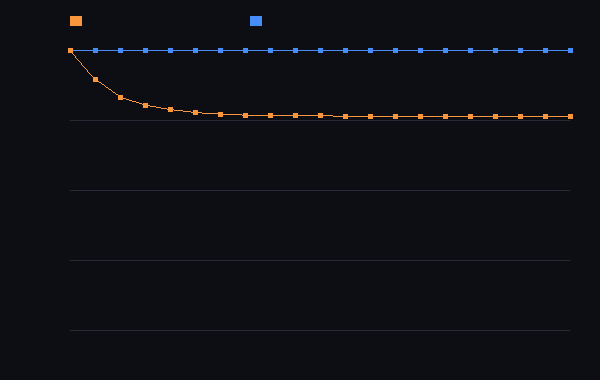

# step_0024 — 진공 운동량·내부E 동반 수송(보존 완성) + 셀≠블록 희소화 천장 측정

> 한 줄: step_0023 게이트가 "실제 별은 점유 100%라 활성 순회 절감 0"을 박았다. 그 처방(A)은 진공 규칙(step_0017)을 합류해 별을 희소화하는 것 — 그러려면 진공이 비우면서 **운동량·내부E 도 동반**해야 보존이 안 샌다(0017 정직한 한계 닫음). 이 step 은 그 동반 수송을 더하고, *실제로 희소화되는지*를 정직하게 측정한다. **발견: 셀은 희소화되나 블록은 안 된다 — 레버1 의 granularity 천장 → 진짜 지렛대는 S5 승격.**



*가우시안 별에 진공(+동반) 반복. 주황(셀 점유) 100%→76% 내림 · 파랑(블록 8³ 점유) 100% 평탄. 두 곡선의 간극이 이 step 의 정직한 발견 — 셀 희소화가 블록 희소화로 안 이어진다.*

---

## 논의 — 이 step 의 의미

step_0023 통합 게이트의 정직한 결론: 활성 배선은 *정확*하나 실제 별 실현 속도 ≈1×(점유 100%). 측정이 가리킨 1순위 처방 **(A) 진공 in-loop 로 희소화**. design §2 레버1 "대가/주의"가 그 방법을 못박았다 — "임계 미만이면 0 으로 흡수, **흡수량은 이웃으로 분배해 보존**". 진공 규칙(0017)이 이미 옅은 셀을 흡수하지만, *밀도장만* 옮겨(0017 정직한 한계 "운동량 동반 안 함") 비우면서 운동량·내부E 를 안 옮기면 보존이 샌다.

- **무엇을 더하나**: `engine/htj-vacuum.js applyVacuum` 에 `opts.scalars` — 옅은 셀이 흡수될 때 *함께 이동할* 장(mom_x/y/z·therm). 기부는 full 이동(셀이 정확히 0) → 동반 장도 full 이동(i→bj). 가법(opts.scalars 없으면 byte 동일=회귀 0·step_0017 불변).
- **무엇이 보존/변하나**: 진공이 질량을 비울 때 **Σρ·Σmom·Σtherm 모두 보존**(상대 ≤1e-12). 별은 희소화(셀)되나 물리 일관(운동량·에너지 따라감).
- **무엇으로 검증하나**: 동반 보존·운동량 국소 이관·셀 희소화·**블록 천장(정직)**·활성 배선 정확성·회귀 0·결정론.

---

## 구현

`applyVacuum` 의 더블버퍼 흡수에 동반 장 버퍼를 추가. 기부 i→bj 매핑은 밀도 R 이 정하고(기존), 각 동반 장 S 는 스냅샷에서 `so[bj]+=S[i]; so[i]-=S[i]`(full 이동). 보존: Σ 불변(상대 위치만 이동). scratch 키 `__vac_<장>` 으로 다른 법칙과 충돌 없음. 파이프라인(0023 골격)에 `applyVacuum(w,{eps,scalars:[mom·therm]})` 합류.

---

## 검증

### 수치 — `node HTJ/steps/step_0024/verify.js` → **PASS (7/7)**

```
PASS  동반 보존(관문) — Σρ·Σmom·Σtherm 모두 보존 = Δρ=2e-15 Δmx=5e-16 Δu=2e-15
PASS  운동량이 질량을 따라간다 — 옅은 셀 mom 0 · 이웃 mom 9(=2+7)·therm 12(=3+9)
PASS  셀 희소화 — 비-영 셀 점유 100% → 76% · 질량 16384=16384 보존
PASS  블록 granularity 천장(정직) — 셀 76%(줄어듦) vs 블록 100%(불변) → 활성 집합 안 줄음
PASS  활성 배선 정확성(진공 합류 후) — 활성 배선=조밀 비트 동일(20스텝)·별 유한·[정직] 블록 점유 100%
PASS  회귀 0 — opts.scalars 생략/무존재 → 밀도장만 경로 byte 동일 · eps=0 항등
PASS  결정론 — 같은 입력 두 번 진공(+동반) → 동일 지문
```

[정보용·비단언] 진공 합류 파이프라인 ms/step: 조밀 ~137 · 활성 배선 ~138 → **~1.0×**(블록 점유 100% 천장 그대로).

### 눈 — `node HTJ/steps/step_0024/capture.js` → **PASS** (`capture.png`)

주황(셀) 100%→76% 내림 vs 파랑(블록) 100% 평탄. 간극이 정직한 발견.

### 회귀 — 전 step verify **24/24 PASS**. **step_0017 byte-동일**(9/9, opts.scalars 기본 off). htj-vacuum 외 engine 불변.

---

## 발견 — 정직한 천장 (이 step 의 핵심 산출)

1. **진공 동반 수송은 보존을 완성한다** — 비우면서 운동량·내부E 가 따라가 Σ 모두 보존. 0017 의 "운동량 동반 안 함" 한계를 닫았다(법칙이 물리적으로 완전해짐).
2. **셀 희소화는 된다** — 가우시안 꼬리가 벗겨져 비-영 셀 100%→76%.
3. **그러나 블록 희소화는 안 된다** — 활성 집합 단위인 8³ 블록은 점유 100% 그대로. 옅은 꼬리가 *모든 블록에 한 셀이라도* 남아, 어떤 블록도 통째로 비지 않는다. 게다가 진공은 "1셀/패스" 로 수렴(0017 한계)해 안쪽으로 천천히 벗겨질 뿐.
4. **함의(측정이 가리키는 다음)**: 블록 단위 활성 순회(레버1)는 *옅은 꼬리를 가진 확산 객체*에선 — 진공을 합류해도 — 절감을 못 낸다. 비용을 실제로 줄이려면 **객체를 격자에서 *빼내는* S5 승격(레버2)** — design §0 목적 ②·"본체·핵심 도약". 진공의 보존된 동반 수송(이 step)은 그 승격의 *질량·운동량·에너지 정확 이관*(S5 관문)의 부품이기도 하다.

---

## 쉽게 풀어 쓴 설명

별 둘레의 옅은 안개를 "진공으로 흡수"해 빈 칸을 늘려봤다. 그리고 흡수할 때 그 안개가 지녔던 *운동량·열*도 같이 안쪽으로 흘려보내(안 그러면 운동량이 허공에 남아 보존이 깨진다) 물리를 일관되게 만들었다 — 이건 진짜 개선이다(보존 완성). 그런데 "빈 칸 건너뛰기"는 *8칸×8칸×8칸 블록* 단위로 작동하는데, 안개가 옅어져도 *모든 블록에 한 톨씩은* 남아서 통째로 빈 블록이 안 생긴다. 그래서 빨라지지 않는다. 교훈: 둘레를 *닦는* 걸로는 부족하고, **별 자체를 격자에서 들어내야**(승격) 진짜 싸진다.

---

## 목적에 남긴 의미 · 다음 연결

- **남긴 것**: ① 진공 법칙의 보존 완성(운동량·내부E 동반) — S5 승격 이관의 부품 ② 레버1(블록 활성 순회)의 *granularity 천장*을 실측으로 박음 — 확산 객체엔 블록 희소화가 안 열린다.
- **다음(측정이 강하게 가리킴) = S5 승격(레버2)**: step_0014 검출(읽기 전용)+이 step 의 보존된 동반 이관을 토대로, 안정 별을 격자에서 빼내 개체로 굴리고(비용=흐르는 유체만) 역승격. 관문=질량·운동량·에너지 정확 이관. design "본체·핵심 도약·§0 목적 ②". S3(안정 판정) 선행 권장.
- 열린 격차: 레버1 실현 이득은 *확산 객체*엔 천장(이 step) — 블록보다 고운/적응 granularity 거나 승격이 답. thermal/viscosity active 는 보류(0023·이 step 이 실익 없음 확인). viewer: 진공은 파이프라인 밖 측정(차트)·새 시뮬 장면 없음 → check-viewer EXEMPT(0017 류).
