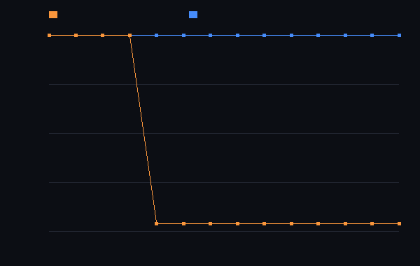

# step_0025 — S3: 활동도 추적 + 동결 판정 (시간 LOD 의 안전한 첫 형태 · S5 안정 판정 재료)

> 한 줄: step_0024 가 박은 천장은 "셀은 희소화돼도 *블록*은 100% 점유"(옅은 꼬리가 모든 블록 잔류). 그 천장 너머의 다음 지렛대는 — 빈 블록이 아니라 — **비어있지 않은데도 *안 변하는* 블록을 알아채 건너뛰는 것**(동결). 이 step 은 블록 *활동도*(L∞ 변화)를 추적해 quiet 가 holdSteps 연속이면 *동결*(stable)로 판정하고 법칙이 건너뛰게 한다. **per-cell 법칙(fusion)에서 동결 블록은 0 변화라 건너뛰어도 조밀과 비트 동일.** 동시에 "동결=stable" 은 S5 승격이 요구하는 *안정 판정*의 첫 형태다. **헤드라인: fusion-only 별이 정착하면 활성 순회 방문이 100%→4%(96% 동결 0연산)·여전히 비트 동일 — step_0024 의 천장과 정반대로 *실제로* 줄어든다.**



*fusion-only 세계: 가운데 점화 코어(계속 데워짐=활성) + 둘레 돌 가스(게이트 off=안 변함). 주황(활성 순회 방문 셀)이 100%→4%로 떨어지고 파랑(조밀 전-격자)은 100% 평탄. 간극 = 동결 절감. 그리고 비트 동일=true(조밀과 byte 동일).*

---

## 논의 — 이 step 의 의미

step_0024 의 정직한 결론: 활성 집합(S2)은 *빈 블록*만 건너뛴다. 가우시안 별의 옅은 꼬리가 모든 8³ 블록에 한 셀씩 남아 블록 점유 100% → 활성 순회 절감 0. 그러나 design/scalability.md §4 **S3** 가 가리키는 길은 다르다: 블록 *활동도*(Δ누적)가 임계 이하면 *동결*하고, 이웃 자극 시 깨운다 — "레버 3 시간 LOD 의 안전한 첫 형태(공간 해상도는 안 건드림)". 그리고 §4 가 못박은 또 한 가지: **"S4(검출) 승격의 안정 판정 재료를 만든다"** — S5 승격은 "이 덩어리가 *안정되었나*(일정 기간 거의 안 변함)"를 알아야 *언제 개체로 올릴지*를 정한다(step_0014 가 남긴 격차 "안정 판정 로직 없음").

- **무엇을 더하나**: `engine/htj-activity.js` `createActivityTracker(N, bs)` — 블록마다 직전 측정 이후 L∞ 변화(활동도)를 추적, quiet(활동도≤threshold)가 holdSteps 연속이면 *동결*. 활동도가 다시 threshold 넘으면 *깨움*(streak 0). `activeOrigins(origins, hold)` = origins 중 *비-동결*(법칙이 돌아야 함). 가법: `htj-fusion.js applyFusion` 에 `opts.active` 경로(step_0018 cooling 의 fusion 판·생략 시 byte 동일=회귀 0).
- **무엇이 보존/변하나**: 동결은 *계산을 멈출 뿐 값을 안 건드린다* → 동결 블록의 Σρ·Σu 불변. per-cell 법칙에서 동결(=0변화) 블록 건너뜀은 *조밀과 비트 동일*.
- **무엇으로 검증하나**: 활동도 측정 정확·동결 판정(holdSteps)·깨움·비트 동일(관문)·0연산 실현·보존·회귀 0·결정론.

---

## 구현

**`htj-activity.js`(신규·스케줄러 층)** — `prev`(블록별 직전 스냅샷)·`streak`(블록별 quiet 연속 횟수)를 보관. `measure(field, origins, {threshold})` 는 origins(보통 `ActiveSet.origins()`=비-영 블록)만 훑어 각 블록의 max|Δ|를 재고 streak 를 갱신(quiet→++·아니면 0)한 뒤 스냅샷을 새로 찍는다 — O(활성)·전-격자 재스캔 없음. 첫 측정은 스냅샷만(Δ=∞ 취급→활성 유지). `activeOrigins(origins, hold)` = streak<hold(비-동결), `frozenOrigins` = streak≥hold(stable).

**`htj-fusion.js`(가법)** — `applyFusion` 에 `opts.active` 분기(활성 블록만 게이트·발열, 생략 시 기존 전-격자=byte 동일). 활동도 추적기가 "변화 멎은 블록"을 동결로 빼면, 그 블록은 어차피 게이트 off=0변화라 건너뜀이 비트 동일.

**파이프라인(fusion-only)**: `active = tr.activeOrigins(set.origins(), hold)` → `applyFusion(w, dt, {active})` → `tr.measure(therm, origins, {threshold:0})`. 코어는 매 step 데워져(활동도>0) 활성 유지, 둘레 돌 가스는 0변화 → holdSteps 후 동결 → 건너뜀.

---

## 검증

### 수치 — `node HTJ/steps/step_0025/verify.js` → **PASS (8/8)**

```
[정보용] fusion-only 정착 후 활성 방문 비율 ≈ 4% (나머지=동결 0연산)
PASS  활동도 측정 정확 — 바뀐 블록 활동도=L∞ 변화·streak 0 / 안 바뀐 블록 활동도 0·streak↑ = maxAct=0.500(=0.5) · 바뀐 블록 streak=0 · 정적 블록 streak=1
PASS  동결 판정(holdSteps) — quiet 가 holdSteps 연속이면 동결, 그 전엔 활성 = 측정별 동결 블록 수=[0,0,27] (hold=3, streak(2,2,2)=3)
PASS  깨움(wake) — 동결 블록이 다시 변하면 streak 리셋 → 활성 복귀 = 동결됐던 블록 streak 2(≥2) → 흔든 뒤 0(=0, 깨어남)
PASS  비트 동일(관문) — fusion 을 활성(비-동결) 블록만 돌려도 조밀 전-격자와 byte 동일(12스텝) = therm·energy 비트 동일 = true
PASS  0연산(실현 절감) — 동결 블록은 실제로 안 돈다(마지막 step 방문 셀 ≪ 전체 비-영 블록 셀) = 마지막 step 방문 512셀 < 전체 비-영 13824셀 (활성 4%)
PASS  보존 — 동결 블록 Σρ·Σu 불변(계산만 멈출 뿐 값 안 건드림)·fusion 은 ρ 전역 보존 = 동결 둘레 셀 ρ=2·u=1(시작값 부동) · Σρ 보존
PASS  회귀 0 — opts.active 생략/전체 → fusion 기존 경로 byte 동일 · rate=0 항등 = active 전체=전-격자 byte 동일 · rate=0 지문 불변
PASS  결정론 — 같은 입력 → 같은 동결 집합·같은 지문 = 2757213253
```

### 눈 — `node HTJ/steps/step_0025/capture.js` → **PASS** (`capture.png`)

주황(활성+동결 방문) 100% → 4%(내림) vs 파랑(조밀) 100% 평탄 · 비트 동일=true. 간극이 동결 절감, 그 절감이 비트 동일(조밀과 byte 동일). step_0024 의 "블록 100% 천장"과 정반대 — 거기선 못 줄였고, 여기선 *변화가 멎은* 블록을 알아채 줄인다.

### 회귀 — 전 step verify **25/25 PASS**(이 step 포함). htj-fusion `opts.active` 생략 시 byte 동일 → step_0012/0024 등 fusion 쓰는 step 불변. `node tools/check-viewer.js` PASS(0025 EXEMPT 등재).

---

## 발견 — 정직한 정리

1. **빈 블록 너머의 첫 실현 절감** — S2(step_0018~0024)는 *빈* 블록만 건너뛰었다(그래서 옅은 꼬리 별엔 천장). S3 는 *비어있지 않은데 안 변하는* 블록까지 건너뛴다. fusion-only 정착 별에서 활성 순회가 100%→4% — step_0024 천장과 정반대로 *실제로* 줄어든다.
2. **비트 동일은 per-cell 한정(정직)** — 동결 블록 건너뜀이 byte 동일인 건 fusion 같은 per-cell 법칙에서다(게이트 off=0변화). *stencil 법칙*(확산·advect)은 동결 블록이 활성 이웃의 flux 를 받을 수 있어 "이웃까지 quiet" 규칙이 필요하다 — 다음 step(step_0018→0020 의 per-cell→halo 진행과 동형).
3. **threshold=0 의 의미** — "정확히 0 변화"만 동결(비트 동일 관문). 실전 시간 LOD 는 threshold>0(거의 안 변함=동결)로 *손실 근사*가 되지만, 그래도 보존은 정확(동결은 값을 안 건드림). 이 step 은 안전한 *비트 동일* 형태만 박았다.
4. **이게 S5 의 부품** — "동결=holdSteps 연속 quiet=stable" 이 step_0014 가 남긴 "안정 판정 로직 없음" 격차를 닫는 첫 형태. S5 승격은 *동결된* 블록들로 이뤄진 덩어리를 "안정"으로 보고 격자에서 빼낸다.

---

## 쉽게 풀어 쓴 설명

지난 step(0024)에서 배운 건 "별 둘레의 안개를 닦아도 8칸×8칸 블록은 안 비어서 못 빨라진다"였다. 이번엔 다른 데를 봤다 — **블록이 *비었는지*가 아니라 *변하는지***. 별 가운데 코어는 계속 뜨거워지며 변하지만, 둘레의 차가운 돌 가스는 한 번 자리 잡으면 더는 안 변한다. 그러면 "이 블록은 몇 번을 재봐도 똑같네 → 멈췄다(동결)"고 판정하고, 계산에서 빼버린다. 결과: 27개 블록 중 코어 1개만 돌고 26개는 쉰다(4%만 일함). 그리고 *건너뛴 블록은 어차피 안 변했을 블록*이라 결과가 한 비트도 안 달라진다(비트 동일). 이 "멈췄다" 판정이 다음 단계(별을 통째로 격자에서 들어내는 승격)에서 "언제 들어낼지"를 정하는 신호가 된다.

---

## 목적에 남긴 의미 · 다음 연결

- **남긴 것**: ① 빈 블록 너머의 첫 실현 절감(변화 멎은 블록 동결=0연산·비트 동일) — step_0024 천장 너머 ② **안정 판정의 첫 형태**(동결=holdSteps 연속 quiet=stable) — step_0014 가 남긴 "안정 판정 로직 없음" 격차를 닫음, S5 승격의 *언제 올릴지* 신호.
- **다음 = S5 승격(레버2·design §0 목적 ②·핵심 도약)**: 이제 ① 검출(step_0014, 읽기 전용)·② 보존된 동반 이관(step_0024 진공)·③ 안정 판정(이 step, 동결)이 모두 갖춰졌다. S5 는 *동결된* 블록들로 이뤄진 안정 덩어리를 격자에서 빼내 `{중심·질량·운동량·각운동량·온도}` 개체로 굴리고(비용=흐르는 유체만) 역승격한다. 관문=질량·운동량·에너지 정확 이관.
- **열린 격차(정직)**: ① 동결 건너뜀 비트 동일은 *per-cell 법칙 한정* — stencil 법칙은 "이웃까지 quiet" halo 규칙 필요(후속 step) ② threshold>0 손실 근사 LOD 는 미착수(보존은 유지되나 비트 동일 아님) ③ viewer: 동결은 *비용만 변화*(조밀과 비트 동일)·산출물이 진단 차트 → check-viewer EXEMPT(0018 류).
