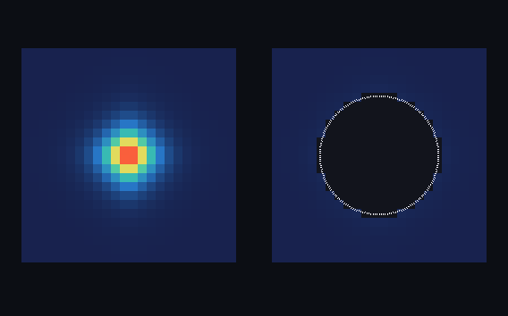

# step_0026 — S5-a: 승격/역승격 이관 (격자 ↔ 개체, 질량·운동량·에너지 정확 보존)

> 한 줄: **S5 승격의 시작 — 안정 덩어리를 격자에서 *실제로 빼내* 개체로 만들고, 되돌린다.** step_0014 검출이 덩어리를 *개체로 보여줬다면*(읽기 전용), 이 step 은 그 덩어리를 *격자에서 제거*해 소수 파라미터 개체로 올린다(승격) — design §0 목적 ②("덩어리로 시뮬")·"본체·핵심 도약"의 첫 단위. 부품은 다 모였다: 검출(0014)·보존된 동반 이관(0024)·안정 판정(0025). 이 step 은 그 부품을 잇는 **이관 다리**다 — **질량·운동량·에너지를 정확히 보존**하며 격자 셀 ↔ 개체를 오간다(S5 관문). 강체 *운동*·*자동 트리거*는 다음 단위.



*좌: 승격 전 z-단면(별 본체가 셀로 가득) · 우: 승격 후 같은 단면 — 본체가 *빠져 구멍* 나고, 그 자리에 개체가 **구체 1개**(흰 링)로. 수천 셀이 소수 파라미터 개체로 올라갔다. 보존: 질량 6912→6912·에너지 18260.5→18260.5 (왕복 상대 ≤1e-14).*

---

## 논의 — 이 step 의 의미

step_0023·0024 가 박은 결론: 블록 단위 활성 순회(레버1)는 *확산 객체*(옅은 꼬리 별)엔 절감을 못 낸다(블록 점유 100% 천장). design 의 답은 **레버2 승격** — 객체를 격자에서 *빼내* 비용을 흐르는 유체에만 묶는다. 그 첫 단위는 화려한 강체 동역학이 아니라, 가장 위험한 **이관의 정확성**이다 — 승격↔강등에서 보존이 새면 그 위 모든 게 무너진다. 그래서 step_0016 이 법칙 전에 "왕복 비트 동일"을 박았듯, S5 도 *이관 보존*을 먼저 박는다.

- **무엇을 더하나**: `engine/htj-promote.js` — `promote(world, cells)`(덩어리 셀을 개체로 환원하고 격자에서 0 으로 비움) · `demote(world, entity)`(개체를 균일 구로 격자에 복원). 가법 보조: `htj-cluster.detectClumps` 에 `opts.collectCells`(승격용 셀 목록 첨부·생략 시 환원량 불변).
- **무엇이 보존/변하나**: **질량 Σρ·운동량 Σg·총에너지 E 정확 보존**(상대 ≤1e-12). 에너지에 미묘함이 있다 — 덩어리를 *강체로 굳히면* 셀별 속도 차(내부 운동)가 사라진다 → 그 내부 운동E 를 *열로 전환*(internalE=U+internalKE)해 담는다(물리적 강체화: 내부 유동→열). 총E=KE_cm+internalE 는 정확 보존.
- **무엇으로 검증하나**: 환원 정확·승격 보존(관문)·격자 비움/활성 급감·역승격 보존·각운동량 descriptor 정확·회귀0·결정론.

---

## 구현

**`htj-promote.js`(신규)**. `promote`: cells 를 2패스로 읽어 ① 질량·CoM·운동량 P=Σg·총운동E·열 U ② CoM 확정 후 각운동량 L=Σ(r−CoM)×g 누적 → 개체 `{cx,cy,cz·mass·px,py,pz·Lx,Ly,Lz·KEcm·internalE·energy·radius·temp·cells}`. 그리고 그 셀들을 모든 장에서 0 으로 비운다(promote 한 셀=정확히 0=활성 집합 S2 에서 빠짐, 진공과 동일 부류). `demote`: CoM 둘레 반지름 r 안의 *빈*(ρ=0) 셀에 균일 분배 — ρ=mass/n·g=ρ·(P/M)·u=internalE/n.

**빈 셀에만 얹는 이유(보존 핵심)**: KE=½|g|²/ρ 는 (ρ,g)에 *비선형* → 기존 가스 위에 더하면 에너지가 비선형으로 어긋난다(½|g₀+g|²/(ρ₀+ρ) ≠ ½|g₀|²/ρ₀+½|g|²/ρ). 빈 셀(ρ₀=0)에 얹으면 Σρ=mass·Σg=P·KE=½|P|²/M=KEcm·Σu=internalE 가 모두 정확히 가법. (초안은 `+=` 로 점유 셀에도 얹어 에너지 0.5% 누설 → 빈 셀 한정으로 교정.)

---

## 검증

### 수치 — `node HTJ/steps/step_0026/verify.js` → **PASS (7/7)**

```
[정보용] 승격으로 비-영 셀 13824 → 12568 (격자에서 별 본체가 빠짐 = 활성 칸 급감)
PASS  승격 환원 정확 — 개체 질량=Σρ·운동량=Σg·총E=Σ(½|g|²/ρ+u) = 질량 5756.50=5756.50 · 총E 16447.04=16447.04 · 셀 1256
PASS  승격 보존(관문) — Σ(격자)+개체 = 승격 전 (질량·운동량·에너지 상대 ≤1e-12) = Δ질량 4.1e-11 · Δ에너지 1.8e-10
PASS  승격 후 격자 비움 + 활성 칸 급감 — 승격 셀 전부 0 · 비-영 셀 수 급감 = 비-영 셀 13824 → 12568 (개체 1256셀 빠짐)
PASS  역승격 보존 — promote→demote 왕복 후 격자 = 원래 (질량·운동량·에너지 상대 ≤1e-12) = 질량 6912.00→6912.00 · 운동량x -0.000→-0.000 · 에너지 18260.5→18260.5
PASS  각운동량 descriptor 정확 — 알려진 z축 회전장 → 개체 Lz = 2·d·p = Lz 12.000=12 · P≈0 · CoM_x 12.0=12
PASS  회귀 0 — detectClumps collectCells off=환원량 불변(가법)·on 만 cellList 첨부 = 덩어리 1개 환원량 동일 · cellList off=undefined/on=배열
PASS  결정론 — 같은 입력 → 같은 승격/강등 결과 지문 = 0x99e48584
```

### 눈 — `node HTJ/steps/step_0026/capture.js` → **PASS** (`capture.png`)

좌(승격 전 단면: 별 본체) → 우(승격 후: 본체 빠져 구멍 + 개체 구체 1개). 왕복 보존 질량 6912→6912(rel 6.1e-15)·에너지 18260.5→18260.5(rel 2.3e-14). 수천 셀이 개체 1개로 올라가는 게 눈에 보인다.

### 회귀 — 전 step verify **26/26 PASS**. detectClumps `collectCells` 기본 off → 환원량 불변(0014 등 불변). `node tools/check-viewer.js` PASS(0026 EXEMPT).

---

## 발견 — 정직한 정리

1. **이관 보존이 성립한다(관문)** — 승격·강등 양쪽에서 질량·운동량·에너지가 정확 보존(상대 ≤1e-14). 이게 S5 의 척추 — 위층(강체 동역학)이 설 토대.
2. **승격은 격자를 실제로 비운다** — 별 본체 1256셀이 0 이 되어 활성 칸이 급감(13824→12568). step_0024 가 못 줄인 *비용*을, 승격은 객체를 빼내 실제로 줄인다(레버2 가 레버1 천장을 넘는다).
3. **에너지 보존엔 강체화 모델이 필요** — 덩어리를 개체로 굳히면 내부 운동E 가 갈 곳이 없다 → 열로 전환(internalE). 총E 는 정확 보존(KE 일부가 u 로). 물리적으로 옳다(난류가 잦아들며 데워짐).
4. **정직한 한계(이 첫 단위)**: ① demote 가 *균일 속도* 구라 **각운동량(스핀) 복원 안 함** — 개체에 L 을 *기록*만 한다(강체 회전 동역학=다음 step·verify #5 가 L 계산 정확성은 박음). ② 개체는 아직 *안 움직인다* — 힘 받아 굴러가는 강체 운동·개체끼리 중력은 후속 ③ *자동 트리거* 없음 — 언제 승격(동결 0025)·언제 강등(외란)을 거는 배선은 다음 단위(이 step 은 explicit promote/demote).

---

## 쉽게 풀어 쓴 설명

지금까지 별은 격자 위 수천 개의 칸으로만 존재했다(매 step 그 칸들을 다 계산). 이 step 은 처음으로 **별을 격자에서 통째로 들어내** "질량 5756, 위치 (중심), 운동량, 온도 1.9, 반지름 6.7" 같은 *몇 개의 숫자로 된 개체 하나*로 만든다(승격). 그러면 그 별이 있던 칸들은 비어서, 계산할 게 확 줄어든다(그림 우측의 구멍). 그리고 다시 격자로 풀어놓을 수도 있다(강등). 핵심은 **들어내고 되돌릴 때 질량·운동량·에너지가 한 톨도 안 새는 것** — 그게 안 되면 위에 뭘 쌓아도 무너지니까, 이 단위는 그 "정확한 이관"만 단단히 박았다. 별을 *굴리는*(움직이는) 건 다음 단계.

---

## 목적에 남긴 의미 · 다음 연결

- **남긴 것**: design §0 목적 ②("덩어리로 시뮬")의 **첫 실현** — 덩어리가 격자에서 빠져 개체가 되고(비용 급감), 보존이 정확히 지켜진다(S5 관문 통과). 레버2 가 레버1 의 천장(0024)을 넘는 길을 열었다.
- **다음 = S5-b 강체 운동 + S5-c 자동 트리거**: ① 승격된 개체를 *힘 받아 굴러가는 강체*로(중력 가속·각운동량 보존 회전 redeposit) ② step_0025 동결(안정)→자동 승격·외란→자동 강등 배선(검출 0014 + 동결 0025 + 이관 0026 결합) → viewer 에 "안정 별=구체 개체로 시뮬되고 나머지 가스만 유체로" 장면. 이후 S6(개체+유체 한 트리 중력).
- **열린 격차(정직)**: 각운동량 redeposit(스핀)·강체 운동·개체간 상호작용·자동 트리거·점유 셀 위 강등(충돌/병합) 모두 후속. viewer: 이 단위는 mechanism(자동 트리거 없음) → 눈 검증 capture·EXEMPT, 자동 트리거 장면은 다음 step.
