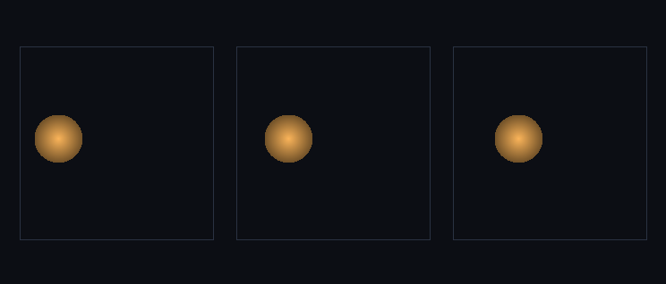

# step_0027 — S5-b(첫 단위): 개체 탄도 운동 (자유 강체 드리프트)

> 한 줄: **승격된 개체를 *개체-공간에서* 굴린다 — 힘이 없으면 제 속도(v=P/질량)를 지킨 채 등속 직진(개체판 뉴턴 1법칙).** step_0026 이 안정 덩어리를 격자에서 빼내 개체 1개로 *환원*했다면(이관 다리), 이 step 은 그 개체를 처음으로 *법칙으로 움직인다*. 격자는 단 한 칸도 안 돈다 — 위치 몇 개 숫자를 적분할 뿐(O(개체), 부피와 무관). step_0006 격자 advect(유체의 탄도 이류)의 *개체-공간* 거울짝.



*좌→우 3 프레임(t=0·중간·끝, top-down x-y 투영): 격자가 텅 빈(셀 0개) 가운데 **구체 1개**가 +x 로 옮겨간다(x: 4.8 → 6.5 → 8.1). 별 하나를 굴리는 데 수천 셀이 아니라 위치 몇 숫자만 적분한다. 드리프트 내내 질량 448.0·에너지 280.0 정확 보존(위치만 변함).*

---

## 논의 — 이 step 의 의미

step_0026 이 S5 의 *이관 다리*(promote/demote, 질량·운동량·에너지 정확 보존)를 박았다. 하지만 거기서 개체는 **안 움직였다** — 격자에서 빼내 descriptor 로 굳혀 놓았을 뿐. design §0 목적 ②("덩어리로 시뮬")가 실제 비용 절감이 되려면, 빠져나온 개체가 *격자 순회 없이 제 파라미터만으로* 굴러야 한다. 그 첫 단위는 화려한 동역학이 아니라 가장 단순한 운동 — **힘 없는 자유 드리프트**다. step_0006 이 격자에 *방향성 운동*(탄도 이류=뉴턴 1법칙)을 처음 준 것처럼, 이 step 은 *개체*에 같은 것을 준다.

- **무엇을 더하나**: `engine/htj-entity.js`(신규) — `stepEntity(entity, dt, opts)`: 개체 위치를 속도(v=P/질량)만큼 전진. `opts.N` 주면 [0,N) 주기 wrap(토러스, 경계 손실 0). `stepEntities`(목록 일괄)·`velocity`(편의).
- **무엇이 보존/변하나**: **위치만 변한다.** 질량·운동량 P·각운동량 L·내부E·총E 는 전부 *불변*(자유 운동 → KE_cm=½|P|²/M 도 불변 → 총E 정확 보존). 격자도 안 변한다(개체-공간 적분이라 셀 순회 0).
- **무엇으로 검증하나**: 위치 적분 정확(해석값)·자유 운동 보존·왕복 통합(promote→drift→demote 로 별이 격자 위 새 자리로 이동)·주기 wrap·항등(dt=0/v=0)·회귀0·결정론.

---

## 구현

**`htj-entity.js`(신규·가법)**. `stepEntity`: `v = P/질량` 으로 `cx += vx·dt`(등속). `opts.N` 이면 `wrap(v,N)`. 보존량(mass·P·L·energy·internalE)·형상 descriptor(radius·temp·cells)는 *손대지 않는다* — 위치만 적분. **신규 파일이라 기존 engine 코드 0 변경 = 회귀 0 trivially.**

**wrap 의 항등 보존**: `wrap(v,N)` 은 이미 `0≤v<N` 이면 *그대로* 반환한다(`((v%N)+N)%N` 이 범위 안에서도 부동소수 오차를 만드는 것을 막음) → dt=0·v=0·범위 내 위치가 정확히 불변(항등). 경계를 넘을 때만 modulo 로 감는다.

**개체-공간 적분의 의미**: 격자 advect(step_0006)는 셀마다 donor-cell flux 를 계산해 부피 O(N³)에 비례한다. 개체 드리프트는 위치 3개 숫자를 더할 뿐 — 별이 격자의 절반을 차지해도, 한 칸만 차지해도 비용이 같다(개체 수에만 비례). 이것이 레버2 가 비용을 *부피→흐르는 유체*로 좁히는 방식의 핵심: 안정 덩어리는 격자에서 빠져 개체로 굴러간다.

---

## 검증

### 수치 — `node HTJ/steps/step_0027/verify.js` → **PASS (7/7)**

```
[정보용] 승격 개체가 격자 순회 없이 위치만 적분돼 격자를 가로지른다 — CoM_x 6.00→7.18 (이동 1.18, 기대 1.20)
PASS  위치 적분 정확 — n 스텝 후 = 시작 + (P/질량)·dt·n (기계 정밀도) = cx 6.0000=6.0000 · cy 5.5000=5.5000
PASS  자유 운동 보존 — 질량·운동량 P·각운동량 L·총E 불변(드리프트는 위치만 바꿈) = 질량 7=7 · P=(3,-2,1) · L=(0.5,-1.5,2.25) · E 321.5=321.5
PASS  왕복 통합(promote→drift→demote) — 격자 질량·운동량·에너지 보존 + 별이 새 자리로 이동 = 질량 448.0→448.0 · 에너지 280.0→280.0 · CoM_x 6.00→7.18 (이동 1.18, 기대 1.20)
PASS  주기 경계 wrap — 경계 넘는 개체가 [0,N) 로 감김(토러스, 손실 0) = cx 3.300∈[0,24) · 기대 3.300 (총 이동 4.80)
PASS  항등(회귀) — dt=0 또는 정지 개체(P=0) → 위치 불변 = dt=0 (3.3,4.4,5.5) · v=0 (7.1,2.2,9.9)
PASS  회귀 0 — 신규 모듈(가법)·드리프트가 보존량/형상 descriptor 안 건드림(위치만) = 질량·P·L·E·반지름·온도·셀수 전부 불변 = true
PASS  결정론 — 같은 입력 → 같은 드리프트+왕복 결과 지문 = 0xc9868eac
```

**왕복 통합(#3) 의 설계 주의**: 깨끗한 *이동* 실증을 위해 옅은 꼬리 없는 **조밀한 균일 구**를 통째로 승격한다 — 그래야 격자가 *완전히* 비고, 드리프트한 개체를 빈 격자의 새 위치에 강등할 때 경계 clamp 없이 옮겨간다. (가우시안 별은 꼬리가 격자를 채워 등가 반지름이 N 보다 커지고 demote 구가 경계서 잘려 *이동이 clamp 인공물에 묻힌다* — 초안에서 발견·교정.)

### 눈 — `node HTJ/steps/step_0027/capture.js` → **PASS** (`capture.png`)

조밀한 구를 승격 → 격자 비-영 셀 **0개**(텅 빔) → 개체 1개(질량 448·반지름 2.99·v_x 0.50). 3 프레임에서 구체 x: **4.8 → 6.5 → 8.1** 로 +x 직진. 드리프트 내내 질량 448.0·에너지 280.0 정확 보존(상대 0). 화면이 verify 가설과 일치 — 격자는 안 도는데 개체가 등속으로 옮겨간다.

### 회귀 — 전 step verify **27/27 PASS**(0001~0027). 신규 파일뿐이라 기존 engine·verify 불변. `node tools/check-viewer.js` PASS(0027 viewer STEPS 등록).

---

## 발견 — 정직한 정리

1. **개체가 처음으로 움직인다** — step_0026 의 멈춰 있던 개체가 제 속도로 직진한다. S5 의 "덩어리로 시뮬"이 환원(0026)에서 *운동*(0027)으로 한 발 나아갔다.
2. **비용이 부피에서 풀린다** — 격자 advect 는 O(N³), 개체 드리프트는 O(개체). 별이 격자를 가로지르는데 셀 순회는 0(capture: 비-영 셀 0개). 레버2 가 레버1 의 천장(0024 블록 점유 100%)을 넘는 방식이 *운동*에서도 성립.
3. **자유 운동은 위치만 바꾼다(완전 보존)** — 질량·운동량·각운동량·총E 가 드리프트 내내 *비트 불변*(verify #2: `===`). step_0006 격자 advect 가 1차 upwind 수치 확산을 동반한 것과 달리, 개체 적분은 *해석적으로 정확*(위치 적분에 오차 0).
4. **정직한 한계(이 단위)**: ① 아직 *힘이 없다* — 자유 드리프트뿐. 중력 가속(개체에 작용)은 다음 step. ② demote 가 균일 속도 구라 **스핀(각운동량) 복원 안 함**(0026 의 한계 그대로 — L 은 기록만, 회전 동역학=후속). ③ 개체끼리 상호작용·*자동 트리거*(동결 0025→승격·외란→강등) 없음(explicit 승격). ④ 토러스 wrap 은 자유 공간 가정 — 중력장 안 운동은 다음 step 에서.

---

## 쉽게 풀어 쓴 설명

step_0026 에서 별을 격자에서 들어내 "질량·위치·속도·온도" 같은 *몇 개 숫자로 된 개체 하나*로 만들었다(승격). 하지만 그 개체는 **가만히 있었다** — 빼내기만 했을 뿐. 이 step 은 처음으로 그 개체를 **움직인다**: 힘이 없으면 별은 제 속도를 지킨 채 *등속으로 직진*한다(밀거나 당기는 게 없으니까 — 뉴턴의 제1법칙). 핵심은 **격자를 전혀 안 건드린다**는 것 — 별이 어디 있는지(위치 숫자 3개)만 매 step 조금씩 더하면 된다. 그래서 별이 화면을 가로질러도 계산할 셀은 0개다(그림: 텅 빈 격자에 구체 하나가 왼쪽→오른쪽으로 옮겨감). 별 하나를 굴리는 비용이 *별이 차지한 칸 수*가 아니라 *별의 개수*에 묶인 것 — 이게 "덩어리로 시뮬"의 진짜 이득이다. 다음은 이 별에 *중력*을 줘서 직진이 아니라 *휘게* 하는 것.

---

## 목적에 남긴 의미 · 다음 연결

- **남긴 것**: design §0 목적 ②("덩어리로 시뮬")의 두 번째 발 — 환원(0026)에 *운동*(0027)을 더했다. 승격된 개체가 격자 순회 없이 굴러 비용이 부피에서 풀린다(레버2 가 운동에서도 천장을 넘음). step_0006(격자 관성)의 개체-공간 거울짝이 섰다.
- **다음 = S5-b 잔여 + S5-c**: ① **중력 가속(개체에 작용)** — 자유 직진(이 step)을 *휘는 궤적*으로(개체가 격자 질량/다른 개체의 중력을 받음, step_0007 의 개체-공간 거울짝). ② **각운동량 보존 회전 redeposit** — demote 균일 속도 한계(0026·0027)를 닫아 스핀 복원. ③ **자동 트리거** — 동결(0025)→자동 승격·외란→자동 강등 배선 → viewer "안정 별=구체 개체로 시뮬되고 나머지 가스만 유체로" 장면. 이후 S6(개체+유체 한 트리 중력).
- **열린 격차(정직)**: 힘(중력)·스핀 회전·개체간 상호작용·자동 트리거·점유 셀 위 강등(충돌/병합) 모두 후속. **viewer**: 0027 은 새 장면(개체 드리프트 구체)이라 viewer STEPS 에 등록(EXEMPT 아님) — 0014 이후 처음으로 *새 시각 장면*이 viewer 에 추가됨.
