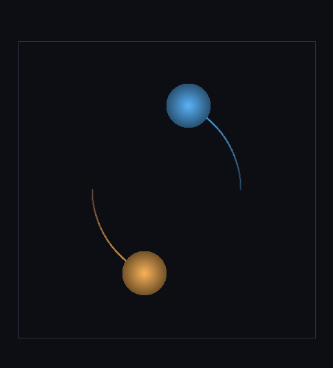

# step_0028 — S5-b(둘째 단위): 개체간 중력 (직접 합산 N-body)

> 한 줄: **승격된 개체끼리 중력으로 끌어당겨, 자유 직진(0027)이 *서로 끌려 휘는 궤적*이 된다.** step_0007 격자 자기중력("모든 질량이 모든 질량을 끈다")의 *개체-공간* 거울짝 — 격자 보간 없이 개체끼리 직접 합산. 쌍힘이 크기 같고 방향 반대(뉴턴 3법칙)라 **순 운동량을 기계 정밀도로 정확 보존**한다. 0027 이 *힘 없는 운동*(뉴턴 1법칙)을 줬다면, 이 step 은 *힘*을 준다(개체 동역학이 힘 받는 강체로).



*한 패널(top-down x-y): 두 개체(같은 질량 6, 접선 속도 ±0.55)가 격자에서 빠진 텅 빈 공간에서 서로 끌려 **곡선 자취**를 그린다(흐린 선=지나온 길·밝은 구=끝 위치). 직선이 아니라 휘었다(직선 이탈 최대 1.13 셀). 격자 셀은 0개 — 개체 2개만 굴린다. 순 운동량 |ΔP|=0(정확 보존)·역학E 진폭 0.08%(유계).*

---

## 논의 — 이 step 의 의미

0027 이 승격된 개체를 *힘 없이* 등속 직진시켰다(개체판 뉴턴 1법칙). 다음 단위는 그 직진을 *휘게 하는 힘* — design §4 S5("상위 층 강체 동역학")·§3(전역 중력)이 가리키는 곳이다. 가장 단순하고 순수한 형태는 **개체끼리의 중력**(직접 합산 N-body) — 격자↔개체 보간이 필요 없어 깨끗하다. step_0007 이 격자 위 질량장에 자기중력을 줬듯, 이 step 은 *개체 집합*에 같은 법칙을 준다. (격자 유체와 개체를 *한 트리*에 넣는 통합 중력은 S6 — 이 단위 밖.)

- **무엇을 더하나**: `engine/htj-entity.js` 에 `applyEntityGravity(entities, dt, opts)`(쌍 루프 직접 합산·운동량 갱신) + `pairPotentialEnergy`(역학E 검증 공유). 가법(신규 함수, 기존 0027 코드 불변).
- **무엇이 보존/변하나**: **운동량(P)·위치가 변한다**(힘이 일을 한다). 단 **순 운동량 ΣP 는 정확 불변**(쌍힘 +F/−F 구조적 상쇄). 운동량이 바뀌면 `KE_cm·energy(=KE_cm+internalE)` 를 재계산해 descriptor 자기일관 유지(internalE 불변). 역학E(ΣKE_cm + U)는 symplectic 적분이라 *유계로* 보존(정확 아님·작은 진동).
- **무엇으로 검증하나**: 인력 방향·순 운동량 정확 보존(관문)·접근·대칭 2체 CoM 정지·역학E 유계·softening 비발산·G=0/dt=0 항등(0027 회귀)·회귀0·결정론.

---

## 구현

**`htj-entity.js applyEntityGravity`(가법)**. 쌍 (i,j) 마다 `F = G·m_i·m_j·(r_j−r_i)/(|r|²+soft²)^{3/2}`, 충격량 `F·dt` 를 `i` 에 `+`·`j` 에 `−`(뉴턴 3법칙). **순 운동량 정확 보존의 구조적 보장**: 쌍 루프에서 같은 `F` 를 `+`/`−` 로 주므로 `ΣΔp=0` 이 *부동소수 오차 없이* 성립(verify #2: ΣP 비트 불변). 그 뒤 각 개체의 `KE_cm=½|P|²/M`·`energy=KE_cm+internalE` 재계산.

**softening**: `soft²` 를 분모에 더해 `r→0` 발산을 막는다(겹쳐도 힘 유한·NaN 없음·verify #6). soft 는 결과를 바꾸는 값이라 시뮬 상수 성격(§5 — CVar 아님).

**적분 순서**: `applyEntityGravity`(kick=운동량 갱신) → `stepEntities`(drift=위치 적분) = semi-implicit(symplectic) Euler. 격자의 `applyGravity → advect` 패턴과 동형 — 역학E 가 *유계 진동*(발산 아님)으로 보존된다.

---

## 검증

### 수치 — `node HTJ/steps/step_0028/verify.js` → **PASS (8/8)**

```
[정보용] 자유 직진(0027)이 서로 끌어 휘는 궤적이 된다(개체-공간 자기중력) — E0 -1.477 · 진폭/|E0| 0.01%
PASS  인력 방향 — 두 개체가 서로 상대 쪽으로 가속(a +x·b −x) = a.px 1.23e-2 · b.px -1.23e-2
PASS  순 운동량 정확 보존(관문) — 쌍힘 equal-opposite → ΣP 불변(기계 정밀도) = ΣP (0.600,-0.700,1.500)→(0.600,-0.700,1.500)
PASS  접근 — 정지서 놓은 두 개체가 서로 향해 떨어진다(거리 ↓) = 거리 12.00 → 11.36
PASS  대칭 2체 — 같은 질량 → CoM 정지(P=0 유지)·축 대칭 접근 = CoM 표류 max 7.1e-15 · a.cx+b.cx 24.0000=24 · ΣP_x 0.0e+0
PASS  역학 에너지 유계 — ΣKE_cm + U 발산 없이 보존(symplectic 작은 표류) = E0 -1.477 · 진폭/|E0| 0.01%
PASS  softening 비발산 — 두 개체 겹쳐도(r→0) 힘 유한·NaN 없음 = r=0 a.px 0 (NaN 없음) · r=ε c.px 8.00e-4 (유한)
PASS  항등(회귀) — G=0 또는 dt=0 → 운동량 불변(0027 자유 운동만) = a.px 1.5=1.5 · b.px 0=0
PASS  결정론 — 같은 입력 → 같은 N-body 결과 지문 = 0xc259cfa
```

### 눈 — `node HTJ/steps/step_0028/capture.js` → **PASS** (`capture.png`)

두 개체(같은 질량, 접선 속도 ±0.55)가 서로 끌려 **곡선 자취**를 그린다 — 직선 이탈 최대 1.13 셀(>1 = 직진 아님·끌려 휘었다). 격자 셀 0개(개체 2개만 굴림). 순 운동량 |ΔP|=0·역학E 진폭 0.08%(유계). 화면이 verify 가설과 일치 — 자유 직진이 *휘는 궤적*으로.

### 회귀 — 전 step verify **28/28 PASS**(0001~0028). `applyEntityGravity` 는 신규 함수라 0027 `stepEntity`·기존 engine 불변. `node tools/check-viewer.js` PASS(0028 viewer STEPS 등록).

---

## 발견 — 정직한 정리

1. **개체가 힘을 받는다** — 0027 의 직진이 0028 에서 *휘는 궤적*이 된다. 개체 동역학이 "힘 없는 운동(뉴턴 1)"에서 "힘 받는 강체(뉴턴 2·3)"로 올라섰다. design §4 S5 "상위 층 강체 동역학"의 본체.
2. **순 운동량이 *구조적으로* 정확 보존** — 격자 중력(step_0007)은 질량가중 평균가속 ā 차감으로 운동량을 보존했지만(근사적), 개체 쌍힘은 +F/−F 라 *기계 정밀도로 정확*(verify #2 비트 불변). 뉴턴 3법칙이 코드 구조 그대로.
3. **비용이 개체 수에 묶인 채 궤도가 창발** — 두 별이 격자 셀 0개로 서로 끌려 감긴다. 레버2 의 약속(비용=흐르는 유체+개체 수)이 *힘 받는 운동*에서도 성립.
4. **정직한 한계(이 단위)**: ① **개체↔격자 유체 결합 중력 없음**(개체끼리만) — 유체 셀+개체를 한 트리에 넣는 통합 중력은 **S6**(Barnes-Hut, design §3). 지금은 격자가 빈 데모(승격된 개체만). ② 직접 합산이라 **O(개체²)** — 큰 개체 수는 S6 트리로. ③ **각운동량 보존 회전(스핀) 복원 안 함**(0026·0027 한계 그대로·demote 균일 속도) ④ **자동 트리거 없음**(동결 0025→승격·외란→강등 배선=S5-c, 다음) — 이 step 도 explicit 승격. ⑤ 역학E 는 *유계* 보존(symplectic)이지 비트 정확 아님.

---

## 쉽게 풀어 쓴 설명

0027 에서 승격된 별(개체)은 힘이 없어 *똑바로* 날아갔다. 이 step 은 별 둘을 놓고 **서로 끌어당기게** 한다 — 그러면 똑바로 가던 길이 *휘어서* 서로를 향해 감긴다(그림의 두 곡선). 이게 중력이다: step_0007 에서 격자 위 질량 구름이 스스로 뭉친 것과 *똑같은 법칙*인데, 이번엔 격자 칸이 아니라 *개체 둘 사이*에 직접 작용한다. 핵심 두 가지: ① 별이 격자에서 빠져 있으니 계산할 칸은 0개인데도 궤도가 생긴다(비용이 *별의 개수*에만 묶임 — 이게 레버2 의 목표). ② 한쪽이 받는 힘과 다른 쪽이 받는 힘이 크기 같고 방향 반대라(뉴턴의 작용-반작용), 둘을 합친 운동량은 한 톨도 안 변한다(정확 보존). 다음은 이 별들이 *격자에 흐르는 유체*와도 서로 끌게 하는 것(통합 중력=S6), 그리고 안정된 별을 *자동으로* 승격하는 배선(S5-c).

---

## 목적에 남긴 의미 · 다음 연결

- **남긴 것**: design §0 목적 ②("덩어리로 시뮬")의 개체 동역학이 *힘*까지 도달 — 이관(0026)→자유 운동(0027)→**중력(0028)**. step_0007 격자 중력의 개체-공간 거울짝이 서고, 비용이 개체 수에 묶인 채 궤도가 창발한다. 순 운동량은 뉴턴 3법칙으로 *구조적 정확* 보존.
- **다음 = S5-b 잔여 + S5-c**: ① **각운동량 보존 회전 redeposit** — demote 균일 속도 한계(0026~0028)를 닫아 스핀 복원. ② **S5-c 자동 트리거** — 동결(0025)→자동 승격·외란→자동 강등 배선(검출 0014+동결 0025+이관 0026+동역학 0027/0028 결합) → viewer "안정 별=구체 개체로 시뮬·나머지 가스만 유체로" 장면 + **S1 벤치로 레버2 의 실제 비용 절감 측정**(§5 "측정으로 결정"의 레버2 게이트, 0023 의 레버1 판에 대응). ③ 이후 **S6**(개체+유체 한 트리 중력 — 이 step 의 직접 합산을 Barnes-Hut 로, 격자 유체 결합).
- **열린 격차(정직)**: 개체↔유체 결합 중력(S6)·O(개체²)→트리·스핀 회전·자동 트리거·역학E 비트 정확(보존형 적분) 모두 후속. **viewer**: 0028 은 새 장면(두 개체 궤도)이라 viewer STEPS 등록(EXEMPT 아님).
