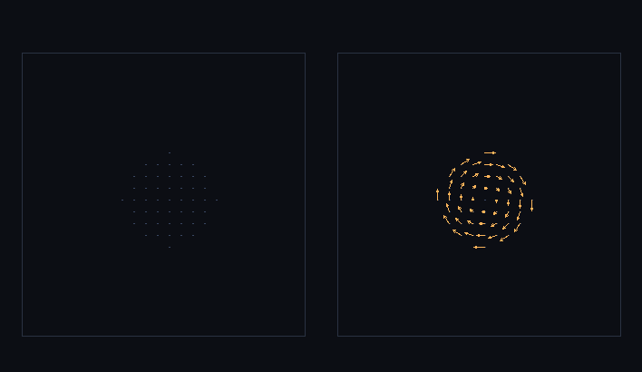

# step_0029 — S5-b(셋째 단위): 각운동량 보존 회전 redeposit (스핀)

> 한 줄: **강등(demote)이 개체의 기록된 각운동량 L 을 *강체 회전장*으로 복원해, 승격↔강등 왕복이 각운동량까지 보존한다.** step_0026~0028 의 한계(demote 가 *균일 속도* 구라 L 을 기록만 하고 스핀을 복원 안 함)를 닫는다. `demote(world, entity, {spin:true})` — ω=I⁻¹·L(I=볼 관성 텐서), 셀 속도 v=v_cm+ω×(r−볼CoM). 회전 KE 는 internalE 에서 빼 열로 분배 → 질량·선운동량·**각운동량**·에너지를 *모두* 정확 보존. **기본(spin off)은 기존과 byte 동일**(가법·회귀 0).



*같은 개체(P=0·Lz=80=순수 스핀)를 강등한 z=중심 단면의 속도장. 좌: spin off(기존 0026~0028) = 속도 0(정지·화살표 없음). 우: spin on(이 step) = 기록된 L 이 강체 회전장으로 복원돼 셀 속도가 중심 둘레로 **소용돌이**친다(반시계, Lz>0). 밀도(구)는 둘 다 같다 — 회전은 *속도*에 있다. 격자 Lz 0 → 80(=entity.Lz)·Σ열 500→497.4(회전 KE 만큼 열에서 빠짐).*

---

## 논의 — 이 step 의 의미

S5-a/b 가 개체를 격자에서 빼내(0026) 굴리고(0027 직진·0028 중력) 있지만, **demote 가 줄곧 균일 속도** — 개체의 각운동량 L 은 promote 가 *기록*만 하고 강등 시 *버려졌다*(균일 구는 L=0). 회전하는 별을 승격→강등하면 스핀이 사라져 각운동량이 새는 셈. design §4 S5 의 보존 관문("질량·운동량·**에너지** 정확 이관")을 *각운동량까지* 넓히는 단위다. 가장 단순한 형태: demote 가 기록된 L 을 강체 회전으로 되돌린다.

- **무엇을 더하나**: `htj-promote.js demote` 에 `opts.spin`(가법·기본 off) — 켜면 ω=I⁻¹·L 로 강체 회전장 복원. 보조: `solve3`(대칭 3×3 Cramer, 관성 텐서 역).
- **무엇이 보존/변하나**: spin on 이면 셀 속도장에 회전이 더해진다. **순 선운동량 ΣP 불변**(회전은 순 선운동량 0 만큼 더함: Σρ·ω×r=ω×Σρr=0), **각운동량 L 복원**(I·ω=L), **질량 불변**, **총E 정확 보존**(회전 KE=½ω·L 를 internalE 에서 빼 열로 → KE_cm+KE_rot+열=KE_cm+internalE). **기본 off → 균일 속도 = 기존과 byte 동일**(0026~0028 불변).
- **무엇으로 검증하나**: 회전장 복원(L_grid=entity.L)·왕복 각운동량 보존(0026 이 못 한 것)·선운동량·질량·에너지 여전히 정확 보존·회귀0(off byte 동일)·회전=비병진+열 감소·열 부족 가드·결정론.

---

## 구현

**`demote(world, entity, opts)` — `opts.spin`(가법)**. off(기본): 기존대로 균일 속도(byte 동일). on: ① 볼 CoM 계산 ② 관성 텐서 I(질량 rhoC 균일·볼 CoM 기준) ③ `ω = I⁻¹·L`(solve3, |det|≈0 이면 회전 생략) ④ `KE_rot=½ω·L` ⑤ 셀 속도 `v = v_cm + ω×(r−볼CoM)`, 셀 열 `uC=(internalE−KE_rot)/n`.

**보존이 성립하는 이유**: 회전 속도 ω×r 은 *볼 CoM 기준* r 에 대해 Σρ(ω×r)=ω×(Σρr)=0 → 순 선운동량은 v_cm 만 남아 Σg=P 불변. 각운동량 Σr×(ρ·ω×r)=I·ω=L 복원. 에너지는 **정의상 정확** — 회전 KE 를 얼마든 internalE 에서 빼 열로 돌리므로(uC=internalE−KE_rot), 볼의 관성이 원래 덩어리와 달라도 총E=KE_cm+internalE 는 항상 보존.

**열 부족 가드(정직)**: internalE < KE_rot 이면(작은 열·큰 L) ω 를 √(internalE/KE_rot) 로 스케일해 KE_rot=internalE·열=0 으로 맞춘다 — **에너지 보존을 우선**하고 L 은 일부만 복원(정직한 한계). 정상적인 별은 promote 가 내부 운동E 를 열로 모아 internalE 가 크므로 L 이 온전히 복원된다.

---

## 검증

### 수치 — `node HTJ/steps/step_0029/verify.js` → **PASS (7/7)**

```
[정보용] demote{spin} 가 기록된 L 을 강체 회전장으로 복원 — 왕복 Lz 2547.200 → 2547.200
PASS  회전장 복원 — 알려진 L → demote{spin} 후 격자 L_grid = entity.L = L_grid_z 80.0000 = entity.Lz 80 · Lx,Ly≈0 (-5.6e-17,-1.1e-16)
PASS  왕복 각운동량 보존 — 회전 덩어리 promote→demote{spin} → 격자 L = 원래(0026 은 못 함) = Lz 2547.200 → 2547.200 (상대 0.0e+0)
PASS  선운동량·질량·에너지 여전히 정확 보존 — 회전은 ΣP·Σρ·총E 안 건드림(회전 KE 는 열에서) = 질량 1028.0→1028.0 · 운동량x 308.400→308.400 · 에너지 3772.2→3772.2
PASS  회귀 0(관문) — demote{spin off, 기본} = 균일 속도, byte 동일(0026~0028 불변) = 기본=빈opts byte 동일 true · 속도 균일(병진만) true
PASS  회전 = 비-병진 운동 + 열 감소(KE_rot 이 internalE 에서 빠짐) = 회전 속도장 비균일 true · Σ열 균일 500.0 → 회전 496.7(감소=KE_rot)
PASS  열 부족 가드 — internalE<KE_rot 면 ω 스케일·열≥0·NaN 없음·총E 보존 = Σ열 0.000(≥0) · 총E 5.000=5 · NaN 없음 true
PASS  결정론 — 같은 입력 → 같은 회전 복원 지문 = 0xfea94285
```

### 눈 — `node HTJ/steps/step_0029/capture.js` → **PASS** (`capture.png`)

같은 개체(P=0·Lz=80) 강등 — 좌 spin off: 격자 Lz=0(정지·화살표 없음) vs 우 spin on: 격자 Lz=80(=entity.Lz·소용돌이 복원)·Σ열 500→497.4(회전 KE 만큼 감소). 화면이 verify 가설과 일치 — 기록만 되던 L 이 *눈에 보이는 회전*으로 복원됐다.

### 회귀 — 전 step verify **29/29 PASS**(0001~0029). `demote` 의 `opts.spin` 기본 off → 기존 균일 강등과 byte 동일(0026~0028 불변·verify #4 관문). `node tools/check-viewer.js` PASS(0029 EXEMPT — 밀도 장면은 균일 구와 동일, 회전은 속도장).

---

## 발견 — 정직한 정리

1. **왕복이 각운동량까지 보존** — 0026~0028 은 질량·선운동량·에너지만 보존하고 L 을 버렸다(균일 강등). 이 step 으로 L 도 정확 복원(왕복 Lz 2547.2→2547.2·상대 0) → S5 의 보존 관문이 4 보존량(질량·선운동량·각운동량·에너지) 전부로 완성.
2. **회전 KE↔열 분배가 에너지를 정확히 닫는다** — 강체로 굳힐 때 내부 운동E 를 열로 모았던(promote) 거울 동작: 강등 시 그 열의 일부를 회전 KE 로 되돌린다. 볼의 관성이 원래와 달라도 총E 는 *정의상* 보존(열이 잔차를 흡수).
3. **가법성 정확** — spin off(기본)는 기존 균일 강등과 byte 동일 → 0026~0028 회귀 0(관문 #4). 회전은 opts.spin 켠 step 만.
4. **정직한 한계(이 단위)**: ① 열 부족(internalE<KE_rot)이면 L 일부만 복원(에너지 우선·ω 스케일) — 정상 별엔 무해하나 극단 케이스는 under-restore. ② demote 강체 회전은 *복원* 뿐 — 개체가 *스핀을 유지하며 굴러가는* 강체 회전 동역학(승격 상태에서 L 보존 회전)은 별도(현재 개체는 L 을 *descriptor 로 들고만* 있고 0028 중력은 병진만 가속). ③ 점유 셀 위 강등(충돌/병합)·자동 트리거(S5-c)는 여전히 후속.

---

## 쉽게 풀어 쓴 설명

지금까지 별을 격자에서 들어낼 때 "얼마나 빙글빙글 도는지"(각운동량)를 숫자로 *적어두기만* 하고, 다시 격자로 풀어놓을 땐 그 회전을 *버렸다* — 풀어놓은 별은 통째로 한 방향으로만 움직이는 멍울이었다. 이 step 은 그 회전을 **되살린다**: 적어둔 각운동량에 맞춰 별 속 물질이 중심 둘레로 *소용돌이*치게 만든다(그림 오른쪽의 빙글빙글 화살표). 핵심은 한 톨도 안 새는 것 — 들어내고 되돌릴 때 무게(질량)·직진 운동(선운동량)·회전(각운동량)·에너지가 *모두* 정확히 보존된다(회전을 되살리는 에너지는 별 안의 열에서 꺼내 쓴다). 그리고 이 회전 기능은 *원할 때만* 켜서, 기존 동작은 한 비트도 안 바뀐다.

---

## 목적에 남긴 의미 · 다음 연결

- **남긴 것**: S5 보존 관문이 *네 보존량 전부*(질량·선운동량·각운동량·에너지)로 완성됐다 — 승격↔강등이 회전하는 별도 한 톨 안 새고 오간다. design §0 목적 ②("덩어리로 시뮬")의 이관이 물리적으로 온전해졌다.
- **다음 = S5-c 자동 트리거 + 레버2 실현 측정**: ① 동결(0025 안정 판정)→자동 *승격*·외란/충돌→자동 *강등* 배선(검출 0014+동결 0025+이관 0026/0029+동역학 0027/0028 결합) → viewer "안정 별=구체 개체로 시뮬되고 나머지 가스만 유체로" 장면. ② **S1 벤치로 레버2 의 실제 비용 절감 측정**(§5 "측정으로 결정"의 레버2 게이트 — 0023 이 레버1 에 한 통합 측정의 레버2 판; 그래야 "비용을 흐르는 유체에 묶었다"를 *측정으로* 주장). ③ 이후 **S6**(개체+유체 한 트리 중력 — 0028 직접 합산을 Barnes-Hut 로·격자 결합).
- **열린 격차(정직)**: 승격 상태의 강체 회전 *동역학*(L 보존 회전·세차)·열 부족 시 L under-restore·점유 셀 위 강등(충돌/병합)·개체↔유체 중력(S6)·자동 트리거 모두 후속. **viewer**: 이 단위는 demote 회전 복원 mechanism(밀도 장면=균일 구와 동일) → 눈 검증 capture·EXEMPT(0026 류).
