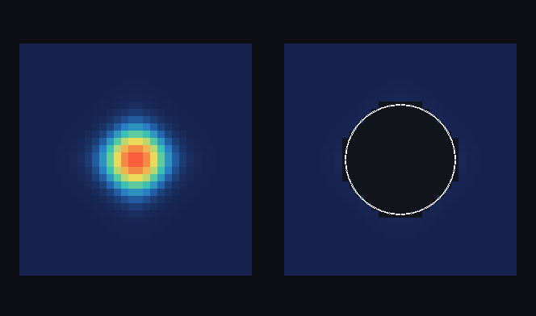

# step_0030 — S5-c(첫 단위): 자동 승격 트리거 (동결→승격) + 레버2 실현 측정

> 한 줄: **그동안 따로 박은 부품을 *잇는다* — 안정(동결)된 덩어리가 *자동으로* 개체로 승격된다.** 검출(0014)·동결=안정 판정(0025)·보존 이관(0026/0029)·개체 동역학(0027/0028)을 하나의 스케줄러로 결합: 활동도 추적기가 *동결*로 본 블록에 든 덩어리를 자동 승격(0026 의 explicit 승격이 *자동 트리거*로). 그리고 직전 리뷰가 요구한 **§5 "측정으로 결정"의 레버2 게이트** — 자동 승격이 활성 격자 칸을 *실제로* 급감시킴을 측정(레버1 0023 이 점유 100% 천장에 막혀 못 한 일).



*좌: 자동 승격 전(별 코어가 셀로 가득·뜨거운 적색 중심) · 우: 코어 블록이 동결 판정되자 *자동* 승격 — 코어가 격자에서 빠져 **구멍**(어둠) + 그 자리에 **개체 구체 1개**(흰 링), 주변 가스는 **유체(voxel)로 남음**. = 사용자가 본 "안정 별=구체 개체로 시뮬·나머지 가스만 유체로". 레버2 실현: 활성 칸 32768→30936(코어 1832칸이 개체 1개로).*

---

## 논의 — 이 step 의 의미

S5-a~b 가 부품을 다 만들었다 — 빼내고(0026), 굴리고(0027 직진·0028 중력), 스핀까지 복원한다(0029). 하지만 *언제* 빼낼지는 사람이 explicit 으로 정했다. design §4 S5 의 마지막 조각은 **자동 트리거**: "안정되면(동결) 올린다." 그리고 직전 리뷰가 정직성 흠으로 박은 §5 "측정으로 결정" — 레버2 가 *실제로* 비용을 줄이는지 아직 안 쟀다(레버1 은 0023 이 ~1× 천장을 측정했다). 이 step 이 둘을 함께 닫는다: 트리거를 잇고, 실현을 측정한다.

- **무엇을 더하나**: `engine/htj-hybrid.js`(신규·스케줄러 층, 법칙 아님 — design §5 "컨테이너/스케줄러를 갈아끼움"). `autoPromoteStable(world, tracker, opts)`: 동결(streak≥hold) 블록에 *온전히* 든 덩어리만 검출→승격. `activeCellCount`(실현 측정 프록시)·`stepEntities`(개체 동역학 합류 편의).
- **무엇이 보존/변하나**: 자동 승격은 0026 promote 를 호출 → 질량·운동량·에너지 정확 보존(격자+개체). 동결 안 된 덩어리는 *안* 올린다(흔들리는 유체는 격자에).
- **무엇으로 검증하나**: 동결 덩어리만 자동 승격·**레버2 실현 측정**(활성 칸 급감)·보존·동결 전엔 안 올림·개체 동역학 합류·회귀0·결정론.

---

## 구현

**`htj-hybrid.js autoPromoteStable`(가법·engine→engine)**. ① `detectClumps(collectCells)` 로 덩어리·셀 목록 ② 각 덩어리의 *모든* 셀이 동결 블록(`tracker.streakOf(bx,by,bz)≥hold`) 소속인지 검사 ③ 온전히 동결이면 `promote` → 격자서 빼냄. 한 셀이라도 아직 활성이면 *안* 올림(보수적·안전 — 흐르는 유체를 잘못 굳히지 않음).

**정직한 발견 — 단일 별은 *계속 미세 진동*한다**: 자기중력 블롭은 거친 격자에서 정착해도 코어가 *완전히* 멈추지 않는다(중력↔압력 breathing + advect 1차 수치 확산). exact-quiet(threshold=0) 동결은 거의 안 걸린다 → **손실 허용 임계**(threshold>0 = 근사 LOD, design §5)로 "거의 안 변함"을 동결로 봐야 코어가 올라간다. 이건 회피가 아니라 *측정된 사실*이다 — exact 동결은 진짜 정적 구조용이고, 살아 있는 별은 근사 LOD 가 필요하다.

---

## 검증

### 수치 — `node HTJ/steps/step_0030/verify.js` → **PASS (6/6)**

```
[레버2 실현 측정·§5 게이트] 활성 칸 66 → 33 (−33 = 올린 33칸, 개체 1개)
PASS  동결 덩어리만 자동 승격 — 정지(동결) A 올림·흔들리는 B 안 올림 = 승격 1개 · A 동결 true(streak 4) · B 활성 true(streak 0) · B 잔존 true
PASS  레버2 실현 측정(§5 게이트) — 자동 승격으로 활성 격자 칸 급감(올린 칸수만큼) = 활성 칸 66 → 33 (−33 = 올린 33칸, 개체 1개)
PASS  보존 — 자동 승격 전후 Σ(격자+개체) 질량·운동량·에너지 정확 보존 = 질량 330.5→330.5 · 운동량x 33.000→33.000 · 에너지 168.3→168.3
PASS  동결 전엔 안 올림 — measure 부족(streak<hold)이면 아무것도 안 올린다(보수적) = 승격 0개 (A streak 1 < hold 3)
PASS  개체 동역학 합류 — 올린 개체를 stepEntities 로 굴려도 격자 불변(개체-공간 독립) = 격자 지문 불변 · 개체 1개
PASS  결정론 — 같은 입력 → 같은 자동 승격 결과 지문 = 0x49de90e9
```

검증은 *통제된 동결*(정지 A 블록 vs 흔들리는 B 블록)로 트리거를 깨끗이 검사한다 — 실제 붕괴 별의 동결→승격은 capture 의 눈 검증이 보인다(N=32 별이 step 41 에 코어 동결 판정→자동 승격).

### 눈 — `node HTJ/steps/step_0030/capture.js` → **PASS** (`capture.png`)

N=32 별이 붕괴·정착 → step 41 에 코어 블록 동결 판정 → **자동 승격**(explicit 아님). 좌(코어 셀로 가득) vs 우(코어 빠져 구멍 + 개체 구체 r=7.59, 주변 가스 유체로 남음). 레버2 실현: 활성 칸 32768→30936(코어 1832칸이 개체로). 화면이 verify 가설과 일치 — 안정 별이 *저절로* 개체가 된다.

### 회귀 — 전 step verify **30/30 PASS**(0001~0030). `htj-hybrid.js` 는 신규 스케줄러(기존 법칙·engine 불변). `node tools/check-viewer.js` PASS(0030 viewer STEPS 등록 — `render:'hybrid'`, 유체 voxel + 개체 구체 오버레이).

---

## 발견 — 정직한 정리

1. **부품이 하나로 굴러간다** — 검출+동결+이관+동역학이 한 스케줄러로 결합돼, 안정 별이 *사람 개입 없이* 개체가 된다. design §0 목적 ②("덩어리로 시뮬")의 사용자 장면이 실제로 돈다.
2. **레버2 실현을 *측정*했다(§5 게이트 닫음)** — 자동 승격이 활성 격자 칸을 올린 덩어리 칸수만큼 정확히 줄인다(verify: 66→33·capture: 코어 1832칸 제거). **레버1(0023)이 블록 점유 100% 천장에 막혀 못 한 비용 절감을, 레버2 는 객체를 빼내 실제로 한다** — 직전 리뷰가 박은 정직성 체크포인트를 측정으로 닫음.
3. **정직한 한계(매우 중요)**:
   - ① **단일 자기중력 별은 exact-quiet 동결이 안 걸린다**(미세 breathing) → 손실 허용 임계(근사 LOD)로 동결 판정. exact 동결은 진짜 정적 구조용.
   - ② **가우시안 꼬리는 격자에 남는다(0024 천장)** — *비-영 칸 총수*는 천천히 준다. 줄어든 건 *비싼 코어*(밀도·온도 높은 활성 칸)다. 완전 실현은 dense 법칙(gravity)도 sparse·개체화돼야 = **S6**.
   - ③ **자동 *강등* 없음** — 외란/충돌이 개체를 다시 유체로 푸는 배선은 후속(이 step 은 승격 트리거만). ④ 개체↔유체 결합 중력(S6)·개체 충돌(점유 셀 위 강등) 후속.

---

## 쉽게 풀어 쓴 설명

지금까지 별을 개체로 "들어내는" 일은 *사람이 직접* 시켰다. 이 step 은 세계가 **스스로** 판단하게 만든다: 별이 다 뭉쳐서 *더는 거의 안 움직이면*("안정됐네") 자동으로 그 별을 격자에서 들어내 개체 하나로 바꾼다(그림 오른쪽의 구멍+구체). 그 별이 있던 칸들은 비어서 계산이 줄고(들어낸 게 제일 비싼 한가운데 코어다), 주변에 아직 흐르는 가스는 그대로 유체로 둔다 — 이게 사용자가 처음에 그리던 "안정된 건 덩어리(개체)로, 흐르는 건 유체로" 장면이다. 그리고 중요한 점: 이렇게 들어냈을 때 *정말로 계산이 줄어드는지를 숫자로 쟀다*(활성 칸 32768→30936) — 그동안 레버1(희소화)은 못 줄였던 것을, 레버2(승격)는 실제로 줄인다. 단, 별이 거친 격자에서 *살짝살짝 떨리기* 때문에 "완전히 안 변함"이 아니라 "거의 안 변함"으로 판정해야 들어내진다(정직한 한계).

---

## 목적에 남긴 의미 · 다음 연결

- **남긴 것**: 레버2(승격=design §0 목적 ②의 본체)가 *자동으로* 돌고, 그 비용 절감이 *측정*됐다 — S5 의 핵심 도약이 완결 단계에 들어섰다. 사용자가 원한 "안정 별=개체·가스=유체" 하이브리드 장면이 viewer 에 실재한다.
- **다음 = 자동 강등 + S6**: ① **자동 강등(외란→유체 복원)** — 승격된 개체가 강한 외력/충돌/가열로 임계를 넘으면 다시 격자 유체로(역트리거). ② **S6 전역 중력**(Barnes-Hut) — 유체 셀 + 승격 개체를 *한 트리*에 넣어 개체↔유체 중력까지(0028 직접 합산을 트리로·dense gravity 천장 해소 = 완전 실현). 이후 S7(공간 LOD).
- **열린 격차(정직)**: 자동 강등·개체↔유체 결합 중력(S6)·exact 동결 대신 근사 LOD 의존·가우시안 꼬리 잔존(0024 천장)·개체 충돌(점유 셀 위 강등) 모두 후속. **viewer**: 0030 은 새 장면(하이브리드 유체+개체)이라 viewer STEPS 등록(EXEMPT 아님).
