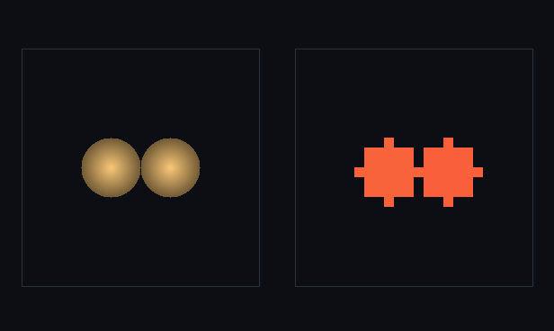

# step_0031 — S5-c(둘째 단위): 자동 강등 (외란/충돌 → 유체 복원)

> 한 줄: **외란(충돌·강한 외력)으로 임계를 넘은 개체를 *자동으로* 다시 격자 유체로 푼다(역승격).** step_0030 이 *승격* 트리거(동결→개체)를 박았다면, 이 step 은 그 *역트리거* — 레버2 의 왕복(승격↔강등)이 자동으로 닫힌다. `autoDemoteOnDisturbance`: 충돌(쌍 근접) 또는 외력 임계 초과 개체를 `demote{spin}`(0029)로 유체 복원 — 질량·운동량·각운동량·에너지 정확 보존.



*좌: 강등 전(개체 구체 2개, 격자 비어 있음) · 우: 두 개체가 접촉하자 *자동* 강등 — 격자에 **유체 덩어리 2개**(셀로 풀림, 개체 0개). 0030 의 자동 승격(동결→개체)의 거울짝(충돌→유체). 강등 내내 Σ질량 240.0 보존.*

---

## 논의 — 이 step 의 의미

0030 이 "안정되면 개체로 올린다"(승격)를 자동화했다. 레버2 의 왕복이 닫히려면 그 역도 필요하다 — design §2 레버2: "상위 개체가 강한 외력/충돌/가열로 임계를 넘으면 다시 격자 유체로 풀어놓는다(역승격)." 강체 근사는 *안정할 때만* 유효하다. 두 별이 충돌하거나 강한 조석을 받으면 강체로 못 다루니, 유체로 풀어 그 복잡한 상호작용(병합·충격·찢김)을 *바닥 법칙*이 풀게 한다.

- **무엇을 더하나**: `engine/htj-hybrid.js autoDemoteOnDisturbance(world, entities, opts)`(가법) — 외란 개체를 demote 로 유체 복원. 트리거: ① 충돌(쌍 중심거리 < r_i+r_j+pad) ② 외력(opts.forceMag>threshold).
- **무엇이 보존/변하나**: 강등은 0026/0029 demote 의 역승격 — 질량·운동량·각운동량(spin 기본 on)·에너지 정확 보존(격자+개체). 둘 자리가 없으면(격자 꽉 참) 안 풀고 개체로 남긴다(질량 손실 0·보존 우선).
- **무엇으로 검증하나**: 충돌 자동 강등·외력 임계 강등·보존·각운동량 복원·꽉 차면 보류(손실 0)·승격↔강등 왕복·회귀0·결정론.

---

## 구현

**`autoDemoteOnDisturbance`(가법)**. ① 쌍 근접 검사(충돌 임박)로 mark ② 선택적 외력 임계로 mark ③ mark 된 개체를 `demote(world, ent, {spin:true})`(0029 회전 복원 포함)로 유체 복원, 격자에 둘 자리 없으면(`demote` 반환 0) 개체로 남김(질량 손실 0). 반환 `{survivors, demoted, addedCells}` — caller 가 개체 목록을 survivors 로 교체.

**보존**: demote 가 이미 질량·운동량·각운동량·에너지를 정확 이관(0026/0029 verify). 이 step 은 *언제 demote 를 부를지*(트리거)만 더한다 — 보존은 demote 가 보장.

---

## 검증

### 수치 — `node HTJ/steps/step_0031/verify.js` → **PASS (7/7)**

```
PASS  충돌 자동 강등 — 접촉 거리 안 두 개체 강등·멀면 안 강등 = 근접: 강등 2·생존 0·셀 +153 / 원거리: 강등 0·생존 2
PASS  외력 임계 강등 — forceMag>threshold 개체만 강등(조석 찢김) = 강등 1(force 50>10) · 생존 1(force 2<10)
PASS  보존 — 강등 전후 Σ(격자+개체) 질량·운동량·에너지 정확 보존 = 질량 240.0→240.0 · 운동량x 12.000→12.000 · 에너지 127.8→127.8
PASS  각운동량 복원 — 회전 개체 강등 시 격자 L 복원(spin 기본 on·0029 합류) = 격자 Lz 60.00 ≈ Σentity Lz 60 (spin 복원)
PASS  둘 자리 없으면 안 풀고 개체 유지 — 격자 꽉 차면 강등 보류(질량 손실 0) = 강등 0 · 생존 2 · 격자 질량 13824 불변
PASS  왕복(승격→강등) — promote 로 빠졌다 autoDemote 로 격자 복귀·보존(레버2 왕복 닫힘) = 활성 칸 65→(승격)0→(강등)186 · 질량 325→325
PASS  결정론 — 같은 입력 → 같은 자동 강등 결과 지문 = 0x37220e9d
```

### 눈 — `node HTJ/steps/step_0031/capture.js` → **PASS** (`capture.png`)

두 개체(거리 6 < 접촉 7)가 충돌 → 둘 다 자동 강등. 좌(개체 구체 2개·격자 빈) → 우(격자 유체 245칸으로 풀림·개체 0개). Σ질량 240.0 보존. 화면이 verify 가설과 일치 — 충돌한 개체가 *저절로* 유체로 돌아간다.

### 회귀 — 전 step verify **31/31 PASS**(0001~0031). `htj-hybrid.js` 에 함수 추가(기존 autoPromoteStable·법칙 불변). `node tools/check-viewer.js` PASS(0031 EXEMPT — 0030 하이브리드의 역트리거 mechanism).

---

## 발견 — 정직한 정리

1. **레버2 왕복이 자동으로 닫혔다** — 동결→자동 승격(0030)·충돌/외력→자동 강등(이 step). 안정되면 개체로 올라가고, 흔들리면 유체로 풀린다 — design §0 목적 ②의 "외력·충돌·가열이 임계를 넘으면 다시 유체로"가 실재.
2. **보존은 demote 가 보장** — 트리거는 *언제*만 정하고, 질량·운동량·각운동량·에너지 이관은 0026/0029 가 박은 demote 가 한다. 트리거 층(스케줄러)과 이관 층(보존)의 깔끔한 분리.
3. **둘 자리 없으면 보류(손실 0)** — 격자가 꽉 차 demote 할 곳이 없으면 강등을 *보류*하고 개체로 남긴다 — 질량 손실 0(보존 우선). 점유 셀 위 강등(충돌 병합)은 후속.
4. **정직한 한계(이 단위)**: ① 충돌 트리거는 *근접 판정*까지 — 실제 *병합 동역학*(두 유체가 섞여 하나 되는 충격·가열)은 강등 후 바닥 법칙(gravity/pressure/viscosity)이 푼다(이 step 은 *풀어놓기*만). ② 강등된 유체가 빈 셀에 균일 구로 놓여 *겹침*은 피하지만, 점유 셀 위 직접 병합(겹쳐 쌓기)은 아직 안 함. ③ 외력 트리거의 forceMag 는 caller 가 공급(개체↔유체 중력 S6 에서 자연 연결).

---

## 쉽게 풀어 쓴 설명

0030 에서 세계는 "안정된 별을 개체로 들어올리는" 일을 스스로 했다. 이 step 은 그 반대를 자동화한다: 두 개체(별)가 **부딪치려 하면**(또는 강하게 끌어당겨져 찢기려 하면), 강체 덩어리로는 그 복잡한 충돌을 못 다루니 *다시 격자 유체로 풀어놓는다*(그림: 구체 2개 → 격자 위 유체 덩어리 2개). 그러면 충돌·병합 같은 복잡한 일은 바닥의 유체 법칙(중력·압력·점성)이 알아서 푼다. 핵심은 들어올릴 때도(승격) 풀어놓을 때도(강등) 무게·운동·회전·에너지가 한 톨도 안 새는 것 — 그 보존은 이미 박아둔 demote 가 책임진다. 이로써 "안정→개체, 흔들림→유체"의 왕복이 자동으로 굴러간다.

---

## 목적에 남긴 의미 · 다음 연결

- **남긴 것**: 레버2(승격=design §0 목적 ②)의 **왕복 트리거 완성** — 동결→자동 승격(0030)·충돌/외력→자동 강등(이 step). 안정 구조는 싼 개체로, 흔들리는·충돌하는 물질은 유체로 — 비용이 "흐르는 유체 + 개체 수"에 묶이는 하이브리드가 자동으로 굴러간다. **S5(레버2) 본체 완성.**
- **다음 = S6 전역 중력(Barnes-Hut/통합 트리)**: design §3 "중력이 진짜 적". 유체 셀 + 승격 개체를 *한 무대*에서 끌게 한다(0028 직접 합산을 트리로·개체↔유체 중력) → 0030 이 남긴 "dense gravity 전-격자 천장" 해소 = 레버2 **완전 실현**. 이후 S7(공간 LOD+스트리밍)으로 세계 크기를 비용에서 분리.
- **열린 격차(정직)**: 점유 셀 위 병합(겹쳐 쌓는 충돌)·외력 트리거의 자연 연결(S6)·개체↔유체 결합 중력(S6)·실제 병합 동역학 모두 후속. **viewer**: 0031 은 0030 하이브리드의 *역트리거* mechanism(밀도 장면 동류) → 눈 검증 capture·EXEMPT(0029 류).
