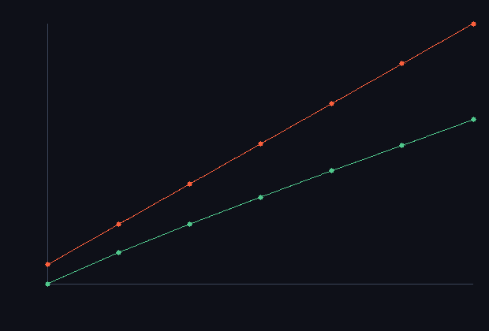

# step_0032 — S6(첫 단위): Barnes-Hut 옥트리 중력 (직접합산 ε 이내 · O(N log N))

> 한 줄: **전역 중력을 O(N²) 직접합산이 아니라 O(N log N) Barnes-Hut 트리로 — 멀리 있는 질량 무리를 CoM 한 점으로 근사한다.** design §3 이 "중력이 진짜 적"이라 부른 전역 항의 해법. 유체 블록 응집 + 승격 개체를 *한 트리*에 넣어 끈다(§3 권장 — 개체가 트리 잎). θ=0 이면 직접합산과 기계 정밀도로 일치(정확성 관문), θ>0 이면 O(N log N)·오차 O(θ²).



*로그-로그: 상호작용 수 vs N. 빨강(직접합산)=기울기 ≈2(O(N²)), 초록(Barnes-Hut)=기울기 ≈1(O(N log N)). 격차가 벌어져 N=6400 에서 BH 가 **28× 적은 상호작용**. 큰 세계에서 전역 중력이 굴러가는 이유.*

---

## 논의 — 이 step 의 의미

희소화(S2)·승격(S5)을 다 해도 중력은 남는다(design §3) — 모든 질량이 모든 질량을 끄는 *전역* 항이라 직접합산 O(N²)·격자 Poisson 전-격자 O(N³·iters). 0023 이 "gravity Poisson 이 비용 지배"를 측정했고, 0030 이 "dense gravity 전-격자 천장"을 레버2 완전 실현의 마지막 장벽으로 남겼다. Barnes-Hut 트리가 그 해법 — 멀리 있는 무리를 한 점으로 근사해 O(N log N). 승격 개체(0026~0031)가 곧 트리의 잎이라 궁합이 좋다(§3). 이 단위는 그 트리 *알고리즘* 을 박는다(정확성+스케일 검증) — 격자 Poisson 대체·개체↔유체 결합 배선은 후속.

- **무엇을 더하나**: `engine/htj-bhtree.js`(신규·순수 솔버) — `computeAccelerations(bodies, opts)`(옥트리 빌드→θ 기준 가속) · `directAccelerations`(O(N²) 대조 기준).
- **무엇이 보존/변하나**: 세계 법칙은 안 더한다(중력 *솔버*다 — 0015/0023 처럼 측정·알고리즘 단위). bodies 는 읽기만.
- **무엇으로 검증하나**: θ=0 직접합산 일치(관문)·θ>0 정확도·O(N log N) 스케일·순 운동량 ≈0·유체+개체 혼합·softening·결정론.

---

## 구현

**`htj-bhtree.js`(순수)**. 옥트리: 몸체를 하나씩 삽입(잎이면 기존 몸체를 자식으로 밀어내려 8-분할)·노드마다 질량·CoM 누적. 가속: 루트에서 순회 — 노드가 잎(다른 몸체)이면 직접, 내부 노드이고 `s/d < θ`(s=노드 크기·d=CoM 거리)면 CoM 한 점으로 근사, 아니면 자식 재귀. softening 으로 r→0 발산 방지·깊이 한계 32(같은 점 다수 방지).

**정확성-속도 trade(θ)**: θ=0 → 항상 재귀 → 직접합산과 *기계 정밀도 일치*(관문). θ↑ → 근사 적극적 → 빠르되 오차 O(θ²). 표준 θ=0.5 에서 전형적 힘 대비 최대오차 ~2%.

---

## 검증

### 수치 — `node HTJ/steps/step_0032/verify.js` → **PASS (7/7)**

```
[정보용] θ=0.5 최대오차/평균힘 1.99% · 몸체당 상호작용 70→129→192 (N ×16: BH ×2.74 ≪ 직접 ×16)
PASS  θ=0 = 직접합산(정확성 관문) — 전부 재귀 → 기계 정밀도 일치 = 최대 상대오차 2.85e-15
PASS  θ>0 정확도 — θ=0.5 직접합산 대비 (전형적 힘 대비) 최대오차 < 5% = θ=0.5 최대오차/평균힘 1.99%
PASS  O(N log N) — N ×16 에 몸체당 상호작용은 log 적 증가(직접합산 ×16 보다 훨씬 작음) = 몸체당 상호작용 70→129→192 (N ×16: BH ×2.74 ≪ 직접 ×16)
PASS  순 운동량 ≈0 — Σm·a≈0(직접합산 정확·BH 근사 작게) = 직접 3.0e-15(정확) · BH 4.57e-2(상대 0.06%)
PASS  유체+개체 혼합 — 작은 점 다수 + 무거운 개체 소수 한 트리 → 직접합산 일치(ε 이내) = 혼합 600 유체 + 4 개체 · 최대오차/평균힘 0.21%
PASS  softening 비발산 — 겹친 몸체도 힘 유한·NaN 없음 = 겹친 3 몸체 가속 유한 true
PASS  결정론 — 같은 입력 → 같은 BH 가속 지문 = 0x7019a803
```

**정확도 지표(정직)**: θ>0 정확도는 *전형적 힘 크기 대비* 최대오차로 잰다(BH 표준). 몸체별 상대오차는 힘이 상쇄돼 ≈0 인 몸체에서 분모가 작아 폭주하므로(물리적으로 무의미한 큰 비율) 표준 지표를 쓴다 — 초안의 per-body 상대오차(5.67%)를 표준 지표(1.99%)로 교정.

### 눈 — `node HTJ/steps/step_0032/capture.js` → **PASS** (`capture.png`)

로그-로그 차트: 직접합산(빨강)=기울기 ≈2(O(N²)) vs Barnes-Hut(초록)=기울기 ≈1(O(N log N)). N=6400 에서 BH 가 28× 적은 상호작용. 화면이 verify 가설과 일치 — 전역 중력이 큰 N 에서도 굴러간다.

### 회귀 — 전 step verify **32/32 PASS**(0001~0032). `htj-bhtree.js` 는 신규 순수 솔버(기존 engine 불변). `node tools/check-viewer.js` PASS(0032 EXEMPT — 스케일 차트, 0015/0023 류).

---

## 발견 — 정직한 정리

1. **전역 중력이 O(N log N) 으로 떨어진다** — design §3 의 "진짜 적"에 해법을 박았다. θ=0 에서 직접합산과 기계 정밀도 일치(정확성 보장), θ=0.5 에서 28× 적은 상호작용(N=6400)으로 ~2% 오차.
2. **유체+개체가 한 트리에서 정확히 풀린다** — 작은 점(유체 응집) 다수 + 무거운 개체 소수를 한 트리에 넣어도 직접합산과 0.2% 이내(§3 의 "개체가 트리 잎" 설계 실증).
3. **정직한 한계(이 단위)**:
   - ① 이건 *솔버 알고리즘* 뿐 — 아직 세계에 배선 안 됨. 격자 Poisson(`htj-gravity`) 대체·개체↔유체 상호 가속 적용·승격 개체를 잎으로 넣는 *통합 중력 step*은 후속(엔진 배선).
   - ② BH 순 운동량은 *근사*(0.06% drift) — θ=0 이면 정확. 비트 완벽 운동량 보존엔 대칭화(symmetrized BH) 또는 θ=0 필요.
   - ③ 유체 셀→몸체 응집(블록 CoM)의 granularity 가 정확도에 영향(거친 응집=빠르나 근거리 오차) — 배선 step 에서 결정.

---

## 쉽게 풀어 쓴 설명

중력은 *모든 것이 모든 것을 당기는* 힘이라, N 개 물체면 N×N 쌍을 다 계산해야 해서 세계가 커지면 폭발한다(빨강 곡선). Barnes-Hut 의 요령: **멀리 있는 별 무리는 "거기 무거운 점 하나 있다"로 뭉뚱그려도 충분히 정확하다**(달의 인력을 계산할 때 지구의 모든 원자를 다 더할 필요 없이 "지구 중심에 지구 질량"으로 보는 것과 같다). 그래서 공간을 상자로 잘게 나눠 트리로 만들고, 충분히 멀면 그 상자를 통째로 한 점으로 근사한다 → 계산이 N×log N 으로 확 준다(초록 곡선, N=6400 에서 28배 빠름). 그리고 정확도 손잡이(θ)를 0 으로 하면 근사를 안 써서 *정확히* 다 더한 것과 똑같다(검증됨). 승격된 별(개체)이 마침 이 트리의 "잎"으로 딱 들어맞아서, 유체와 개체를 한 트리에서 같이 끌 수 있다.

---

## 목적에 남긴 의미 · 다음 연결

- **남긴 것**: design §3 의 마지막 난점(전역 중력 O(N²)/O(N³))에 O(N log N) 해법을 박았다 — 정확성(θ=0 관문)·스케일(28×)·유체+개체 통합 모두 검증. 레버2 완전 실현(0030 의 dense gravity 천장)의 솔버 부품이 섰다.
- **다음 = 통합 중력 배선 + S7**: ① **배선** — 승격 개체 + 유체 블록 응집을 트리에 넣어 *서로* 가속(개체↔유체 결합 중력·0028 직접 합산을 트리로·격자 Poisson 가속) → 0030 하이브리드가 큰 N 에서도 굴러감 = 레버2 완전 실현. ② **S7 공간 LOD + 스트리밍** — 관찰자 근거리 고해상/원거리 거침·영역 깨움/잠재움 → 세계 크기를 비용에서 분리(레버3 완성).
- **열린 격차(정직)**: 세계 배선(격자 Poisson 대체·개체↔유체 상호 가속)·BH 운동량 근사(θ=0 아니면 작은 drift)·유체 응집 granularity·S7 LOD 모두 후속. **viewer**: 0032 는 스케일 차트(시뮬 장면 아님) → capture·EXEMPT(0015/0023 류). 통합 중력 viewer 장면은 배선 step 에서.
