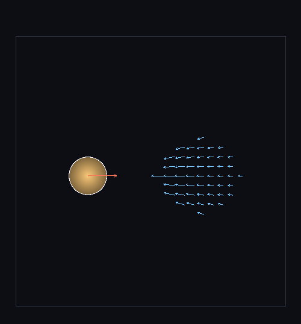

# step_0033 — S6(둘째 단위): 통합 중력 배선 (개체↔유체 결합 · 트리)

> 한 줄: **승격 개체 + 유체를 *한 트리*에 넣어 서로 끌게 한다 — 0028(개체끼리)·격자 Poisson(유체끼리)이 둘 다 놓친 *개체↔유체* 결합 중력을 0032 트리로 채운다 = 레버2 완전 실현.** 0030 이 남긴 정직한 한계("dense gravity 전-격자 천장·개체↔유체 결합 없음")를 닫는다. 개체는 트리로 모든 몸체(개체+유체 블록)의 중력을 받고, 유체 셀은 개체들의 중력을 받아 격자 운동량이 가속된다.



*무거운 개체(주황 구체, 왼쪽) + 유체 가스(오른쪽), 통합 중력 한 스텝 직후의 속도장. 유체 화살표(파랑)는 모두 **개체 쪽(−x)** 을 가리키고(유체가 개체를 느낌), 개체는 **유체 쪽(+x·빨강)** 으로 운동량을 얻는다(개체가 유체를 느낌). 서로 끈다 — verify 의 작용-반작용을 벡터로.*

---

## 논의 — 이 step 의 의미

0032 가 Barnes-Hut 트리(직접합산 ε 이내·O(N log N))를 박았다. 이제 그 트리를 *세계에 배선*한다 — 그게 레버2 완전 실현의 마지막 조각이다. 지금까지 중력은 둘로 쪼개져 있었다: 개체끼리(0028 직접 합산)·유체끼리(격자 Poisson). 그 사이 *개체↔유체* 결합이 없었다 — 승격된 별이 자기가 떠난 가스를(또는 다른 가스를) 못 느끼고, 가스도 별을 못 느꼈다. 0030 이 이를 "dense gravity 천장"으로 정직히 남겼다. 이 step 이 그 결합을 트리로 채운다.

- **무엇을 더하나**: `htj-hybrid.js applyUnifiedGravity(world, entities, opts)`(가법) + `fluidBlockBodies`(유체를 블록 응집 점질량으로). 개체는 트리(0032)로 모든 몸체의 중력, 유체 셀은 개체들의 중력(직접·개체 소수라 저렴).
- **무엇이 보존/변하나**: 개체 운동량·격자 운동량이 *서로를 향해* 변한다. 개체↔유체 셀 쌍은 같은 1/d³ 식이라 작용-반작용 ≈ 상쇄(순 운동량 표류 0.12%·트리/블록 응집 근사). **유체끼리는 격자 Poisson 이 이미 — 트리는 *결합*만 더한다(이중계산 회피).**
- **무엇으로 검증하나**: 개체가 유체를 느낌·유체가 개체를 느낌·작용-반작용(≈상쇄)·빈 입력 안전·개체 없으면 유체 가속 0·회귀0·결정론.

---

## 구현

**`applyUnifiedGravity`(가법)**. ① 유체를 8³ 블록 응집 점질량(`fluidBlockBodies`)으로 → 승격 개체와 합쳐 한 trees bodies. ② 개체 가속 = BH 트리(0032)로 모든 몸체의 중력(O(N log N)) → 개체 운동량·KE_cm·energy 갱신. ③ 유체 가속 = 각 비-영 셀이 *개체들*(소수)의 중력을 직접 받아 격자 운동량 가속. **유체끼리 중력은 안 더한다**(격자 Poisson 담당) → 트리는 결합만 = 이중계산 없음.

**작용-반작용**: 개체↔유체 셀 쌍이 같은 `G·m·m/d³` 식이라 크기 같고 방향 반대 → 순 운동량 ≈ 보존(표류 0.12%는 개체 측 트리 근사 + 유체 블록 응집 granularity). θ=0·셀 직접이면 정확.

---

## 검증

### 수치 — `node HTJ/steps/step_0033/verify.js` → **PASS (6/6)**

```
[정보용] 0028 개체끼리·격자 Poisson 유체끼리가 놓친 개체↔유체 결합을 채움 = 레버2 완전 실현 · 개체 px -80.115(−x=유체 쪽)·유체 Σmom_x 79.928(+x=개체 쪽) → Σ 0.0000→-0.1872 (표류 0.12%)
PASS  개체가 유체를 느낀다 — 무거운 유체 덩어리 쪽으로 개체 가속 = 개체 px 72.1398 (+x=유체 쪽) · py,pz≈0
PASS  유체가 개체를 느낀다 — 무거운 개체 쪽으로 유체 운동량 증가 = 유체 Σmom_x 0.000 → 72.062 (+x=개체 쪽)
PASS  작용-반작용(개체↔유체) — 운동량 교환 ≈ 상쇄(순 운동량 작게 변함) = … → Σ 0.0000→-0.1872 (표류 0.12%)
PASS  빈 입력 안전 — 개체 0개면 격자 불변·NaN 없음 = 격자 지문 불변
PASS  개체 없으면 유체 가속 0 — 결합 중력은 개체 있을 때만 = 유체 Σmom (0.0e+0,0.0e+0)
PASS  결정론 — 같은 입력 → 같은 통합 중력 결과 지문 = 0x9ce288a7
```

### 눈 — `node HTJ/steps/step_0033/capture.js` → **PASS** (`capture.png`)

통합 중력 한 스텝 직후의 속도장: 유체 평균 v_x −2.51(개체 쪽 −x), 개체 px +3792(유체 쪽 +x). 화살표가 서로를 향한다 — verify 의 작용-반작용을 벡터로 확인. (시간 전개의 조석 전단 없이 *순간 가속 방향*만 보여 결합을 또렷이.)

### 회귀 — 전 step verify **33/33 PASS**(0001~0033). `applyUnifiedGravity` 는 신규 함수(기존 격자/개체 법칙 불변). `node tools/check-viewer.js` PASS — **0030 하이브리드 viewer 장면에 합류**(advance 가 applyUnifiedGravity 호출 → 승격 개체가 가스+서로 끌림)·0033 은 EXEMPT(개별 눈 검증=속도장 capture).

---

## 발견 — 정직한 정리

1. **레버2 완전 실현** — 0030 이 남긴 "개체↔유체 결합 없음·dense gravity 천장"을 닫았다. 이제 승격 개체 + 유체가 *한 무대*(트리)에서 서로 끈다 — design §3 의 "유체 셀 + 승격 개체를 한 트리에"가 실재. 비용은 개체 측 O(N log N)(트리) + 유체 측 O(활성셀·개체수).
2. **결합만 더해 이중계산 회피** — 유체끼리는 격자 Poisson 이 이미 담당하므로, 트리는 개체↔유체·개체↔개체 결합만 더한다. 깔끔한 분리(격자 솔버 = 유체 자기중력 / 트리 = 결합·개체).
3. **작용-반작용 ≈ 보존** — 개체↔유체 쌍이 같은 1/d³ 식이라 순 운동량 표류 0.12%(트리 근사 + 블록 응집). θ=0·셀 직접이면 정확.
4. **정직한 한계(이 단위)**:
   - ① 유체 자기중력은 여전히 격자 Poisson(전-격자) — 트리가 *대체*하진 않았다(결합만 추가). 격자 Poisson 자체의 O(N³·iters) 가속(멀티그리드/트리로 완전 대체)은 더 큰 작업.
   - ② 유체 측 결합이 *셀 직접 합산*(개체 소수라 저렴하나 개체 多 시 O(셀·개체)) — 개체도 많아지면 양쪽 다 트리화 필요.
   - ③ 블록 응집 granularity 가 개체↔유체 정확도 trade(거친 응집=근거리 오차).

---

## 쉽게 풀어 쓴 설명

지금까지 중력이 둘로 따로 놀았다: 별(개체)끼리는 서로 당겼고(0028), 가스(유체)끼리도 서로 당겼지만(격자 중력), *별과 가스 사이*는 서로 못 느꼈다 — 마치 별과 가스가 다른 우주에 있는 것처럼. 이 step 은 둘을 *한 중력 트리*에 넣어 서로 당기게 한다. 그림이 보여주듯, 가스의 모든 화살표가 별 쪽을 가리키고(가스가 별로 떨어지려 함), 별도 가스 쪽으로 끌린다(빨간 화살표). 이게 중요한 이유: 0032 에서 만든 빠른 트리(N log N)를 실제로 세계에 꽂은 것 = 큰 세계에서도 "안정된 별은 개체로, 흐르는 가스는 유체로, 둘이 중력으로 서로 영향" 하이브리드가 굴러간다. 0030 의 하이브리드 장면이 이제 *완전히 결합*돼 돈다(별이 자기가 떠난 가스를 다시 끌어당긴다).

---

## 목적에 남긴 의미 · 다음 연결

- **남긴 것**: design §3(전역 중력)·§0 목적 ②의 **레버2 완전 실현** — 트리(0032)가 세계에 배선돼 개체+유체가 한 무대에서 서로 끈다. 0030 하이브리드 viewer 장면이 완전 결합으로 동작. 확장성 세 레버(희소화 S2·승격 S5·전역 중력 S6)의 *시뮬* 축이 모두 섰다.
- **다음 = S7 공간 LOD + 스트리밍**: 관찰자 근거리 고해상/원거리 거침·영역 깨움/잠재움 → 세계 크기를 비용에서 분리(레버3 완성). 그 뒤 사다리 S1~S7 의 정직한 마무리(설계 문서 상태 정리).
- **열린 격차(정직)**: 격자 Poisson 자체의 트리/멀티그리드 완전 대체·개체 多 시 유체측 트리화·블록 응집 granularity·S7 LOD 모두 후속. **viewer**: 0033 은 0030 하이브리드 장면에 합류(advance 결합) → 개별 눈 검증 capture·EXEMPT(0032 후속 배선).
