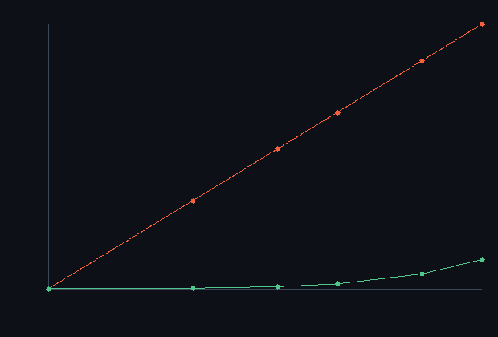

# step_0034 — S7(레버3): 공간 LOD — 보는 곳만 정밀, 비용을 세계 크기에서 분리

> 한 줄: **관찰자 근처는 fine, 멀수록 coarse(블록 평균) → 시뮬 비용이 *세계 크기*가 아니라 *관찰되는 국소*에 묶인다.** design §2 레버3·§4 S7 — 확장성 사다리의 마지막 칸. S2(희소)·S5(승격)·S6(전역 중력) 위에서 세계 크기를 비용에서 분리한다. `downsample`/`upsample` 은 Σ 보존(형상은 손실=근사 LOD), `effectiveCellCount` 는 관찰자 국소 fine 예산을 고정하면 N 을 키워도 비용이 거의 평탄함을 보인다.



*로그-로그: 세계 크기 N 키울 때 셀 수. 빨강(조밀 N³)=가파른 cubic, 초록(LOD 유효 = fine 셀 + coarse 블록)=거의 평탄. N=128 에서 조밀 2.1e6 vs LOD 8184 = **256× 절감**. 관찰자 국소만 fine 이라 세계가 커져도 fine 예산 일정.*

---

## 논의 — 이 step 의 의미

S6 까지 확장성의 *시뮬* 축(희소화·승격·전역 중력)이 다 섰다. 마지막 레버는 *관찰자*다 — 플레이어는 세계의 한 국소만 본다(design §2 레버3). 법칙이 (중력 빼고) 국소라 공간을 타일로 쪼개 *해상도*를 다르게 줄 수 있다: 보는 곳은 정밀(fine), 먼 곳은 거친 블록 평균(coarse). 그러면 비용이 세계 크기 N³ 가 아니라 관찰되는 국소에 묶인다 — 우주가 1024³ 여도 별 하나 주변만 fine 이면 그만큼만 돈다.

- **무엇을 더하나**: `engine/htj-lod.js`(신규·순수) — `downsample`(블록 합=거친 표현)·`upsample`(블록 안 균일 분배)·`lodLevels`(관찰자 거리별 fine/coarse)·`effectiveCellCount`(fine 셀 + coarse 블록).
- **무엇이 보존/변하나**: 세계 법칙은 안 더한다(LOD *스케줄러/표현* 층 — 0015/0032 류). down/up 은 **Σ 보존**(질량·운동량 안 샘) — 단 형상은 손실(블록 안 균일화 = 근사 LOD). design §5: LOD 는 결과를 바꾸므로 "동일 정책 → 동일 결과"의 약한 결정론.
- **무엇으로 검증하나**: 다운샘플 Σ 보존·왕복 Σ 보존(접합면 누설 0)·거친 표현 비용 절감·관찰자 LOD·**비용이 세계 크기와 분리(레버3 핵심)**·다중 필드 보존·결정론.

---

## 구현

**`htj-lod.js`(순수)**. `downsample(field,N,bs)`: bs³ 블록을 1 값(블록 합)으로 → coarse 배열(nbx³). `upsample(coarse,N,bs)`: 거친 값을 블록 안 셀에 균일 분배(셀당=블록합/실제셀수, 경계 블록은 실제 셀 수로 나눠 누설 0). `lodLevels`: 관찰자 블록거리 ≤ radius → 0(fine)·아니면 1(coarse). `effectiveCellCount`: fine 블록=bs³ 셀·coarse 블록=1 셀 합산.

**Σ 보존(접합면 누설 0)**: 블록 합의 합 = 전체 합(다운샘플), 균일 분배 합 = 블록 합(업샘플) → 왕복 Σ 정확 보존. 경계 블록(N%bs≠0)도 *실제* 셀 수로 나눠 누설 0(설계 §5 "접합면에서 보존이 새기 쉽다"를 막음). 형상은 손실(블록 안 평탄화)이지만 보존량은 안 샌다.

---

## 검증

### 수치 — `node HTJ/steps/step_0034/verify.js` → **PASS (7/7)**

```
[레버3 핵심] N=32: 유효 4152(fine 4096+coarse 56)/조밀 32768 · N=64: 유효 4600/조밀 262144
PASS  다운샘플 Σ 보존 — 블록 합의 합 = 전체 합 = Σfine 20978.258 = Σcoarse 20978.258
PASS  왕복(down→up) Σ 보존 — 업샘플 후 전체 합 = 원래 = Σ원래 20349.707 → Σ왕복 20349.707 (Δ 1.9e-9)
PASS  거친 표현 비용 절감 — coarse 셀 수(블록) ≪ fine 셀 수(bs³ 배) = coarse 27블록 vs fine 13824셀 (512× 절감)
PASS  관찰자 LOD — near 블록 fine(0)·far 블록 coarse(1) = 중심 블록 lv 0(fine) · 모서리 블록 lv 1(coarse)
PASS  비용이 세계 크기와 분리(레버3) — N 키워도 fine 예산 일정·유효 셀 ≪ 조밀 N³ = N=32: 유효 4152 · N=64: 유효 4600
PASS  다중 필드 보존 — 질량·운동량 각각 Σ 보존 = Σ질량 20821.84→20821.84 · Σ운동량 20876.09→20876.09
PASS  결정론 — 동일 LOD 정책 → 동일 결과 지문 = 0xe256e000
```

### 눈 — `node HTJ/steps/step_0034/capture.js` → **PASS** (`capture.png`)

로그-로그: 조밀 N³(빨강·cubic) vs LOD 유효 셀(초록·평탄). 세계 8×(32³→64³) 커져도 유효 셀 4152→4600(fine 예산 4096 고정), N=128 에서 256× 절감. 화면이 verify 가설과 일치 — 비용이 세계 크기에서 분리된다.

### 회귀 — 전 step verify **34/34 PASS**(0001~0034). `htj-lod.js` 는 신규 순수 모듈(기존 engine 불변). `node tools/check-viewer.js` PASS(0034 EXEMPT — 비용 vs 세계 크기 차트, 0015/0032 류).

---

## 발견 — 정직한 정리

1. **비용이 세계 크기에서 분리된다(레버3 핵심)** — 관찰자 국소 fine 예산을 고정하면 세계 N 을 키워도 fine 비용은 일정(4096), 유효 셀이 조밀 N³ 보다 256× 적다(N=128). design §0-1 의 "세계 크기와 시뮬 비용이 분리"가 실재.
2. **보존은 안 새고, 형상만 손실** — down/up 이 Σ(질량·운동량) 정확 보존(접합면 누설 0). 잃는 건 *형상*(블록 안 평탄화)뿐 — design §5 의 "LOD 는 손실 근사·약한 결정론"을 정직히 따른다.
3. **정직한 한계(이 단위 + 사다리 frontier)**:
   - ① **2단계 LOD(fine/coarse)뿐** — 다단계(거리별 점진 거침=옥트리)·매끄러운 해상도 전이는 후속. 초록 곡선이 큰 N 에서 *약간* 오르는 건 coarse 블록 수가 여전히 N³/bs³ 라서다 → 완전 평탄은 **재귀 거침(옥트리)** 또는 **스트리밍**(먼 영역을 아예 안 들고 있기)이 필요.
   - ② **스트리밍 미구현** — 관찰자 이동 시 새 영역 깨움/떠난 영역 잠재움(디스크/절차적)은 이 단위 밖. 이게 "세계 크기 *완전* 무관"의 마지막 조각(honest frontier).
   - ③ **LOD 가 법칙에 미배선** — down/up 은 표현 연산자다. 거친 영역에서 *법칙을 거친 격자로 도는* 배선(시간 LOD 결합·접합면 flux)은 후속. S3 동결(0025)이 시간 LOD 의 첫 형태였듯, 공간 LOD 의 법칙 배선도 점진.

---

## 쉽게 풀어 쓴 설명

플레이어는 세계 전체를 한꺼번에 보지 않는다 — 자기 주변만 자세히 본다. 그래서 *보는 곳만 정밀하게* 계산하고 먼 곳은 *대충*(여러 칸을 한 칸으로 뭉뚱그려) 계산하면, 세계가 아무리 커도 계산량은 "지금 보는 국소"에만 묶인다(그림: 세계가 커질수록 빨강=전부 정밀은 폭발하지만, 초록=LOD 는 거의 평평). 핵심은 뭉뚱그릴 때도 *총량은 한 톨도 안 새는 것*(질량·운동량 보존) — 잃는 건 디테일(모양)뿐이다. 이게 마지막 지렛대(레버3)다. 다만 "먼 곳을 대충"까지만 했고, "아주 먼 곳은 아예 메모리에 안 들고 있기"(스트리밍)는 다음 과제로 남겼다 — 그게 세계 크기를 *완전히* 비용에서 떼어내는 마지막 조각이다.

---

## 목적에 남긴 의미 · 다음 연결

- **남긴 것**: design 의 세 레버(희소화 S2·승격 S5·관찰자 LOD S7) + 전역 중력(S6)이 모두 섰다 — **확장성 도입 사다리 S1~S7 완주**. 비용을 *부피 → 활성 물질 → 흐르는 유체 → 관찰되는 국소* 로 단계적으로 좁히는 §6 의 그림이 실현됐다(각 단계 보존·결정론·측정 검증).
- **남은 frontier(정직)**: ① **스트리밍**(먼 영역을 메모리에서 내려 세계 크기 완전 무관) ② **LOD 의 법칙 배선**(거친 격자로 법칙 도는 시간·공간 결합·접합면 flux) ③ **격자 Poisson 의 트리 완전 대체**(현재 결합만) ④ 다단계(옥트리) LOD. 이들은 확장성의 *심화*이지 새 축이 아니다 — 사다리는 완주, 이후는 큰 세계로의 다듬기.
- **viewer**: 0034 는 비용 분리 차트(시뮬 장면 아님) → capture·EXEMPT(0015/0032 류). LOD 거동의 viewer 장면은 법칙 배선 step 에서.
