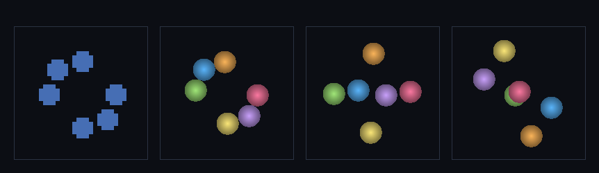

# step_0035 — S5 통합 시연: 복셀 별들이 구체로 승격되어 서로 상호작용 (가스 사라짐)

> 한 줄: **사용자가 본 그 장면 — 여러 조밀 덩어리(복셀)가 *전부* 구체(개체)로 자동 승격되고(격자 비움=복셀 사라짐), 구체들이 서로 중력으로 끌려 궤도·상호작용한다.** 그동안 박은 부품(검출 0014·동결 0025·승격 0026·개체 동역학 0027/0028·자동 트리거 0030)을 결합해 *조립된 기계의 창발*을 실제로 굴린다. 새 engine 없음(통합 시연·0014/0023 류) — viewer 에 인터랙티브 장면 등록.



*4 프레임(top-down): ① 복셀 별 6개(파란 큐브) → ② 전부 구체로 승격(복셀 0·색 구체 6개) → ③④ 구체들이 서로 끌려 궤도·뭉침·흩어짐(상호작용). 복셀이 사라지고 존재가 *구체*로 표현되어 상호작용한다.*

---

## 논의 — 이 step 의 의미 (사용자 피드백 반영)

사용자 지적: "복셀이 아직도 보이고 여러 구체가 상호작용하는 모습이 안 보인다." 옳았다 — 0030 의 viewer 장면은 *단일* 별이라 여러 구체 상호작용이 구조적으로 불가능했고, N=24(기본값)에선 별이 응집 대신 흩어져 승격이 지저분했다. 이 step 은 그 격차를 닫는다: **여러 별이 구체로 승격되어 서로 상호작용**하는 장면을 robust 하게 만든다.

- **무엇을 더하나**: viewer STEPS `0035` 장면 + 통합 시뮬의 창발을 박는 verify. **새 engine 없음** — `autoPromoteStable`(0030)·`applyEntityGravity`(0028)·`stepEntities` 를 조립. (부수: 0030 viewer 장면도 robust 하게 교정 — 아래.)
- **무엇이 보존/변하나**: 복셀(격자) → 구체(개체) 전환, 그 뒤 구체 N체 동역학. **질량·운동량 정확 보존**(승격 보존 + 개체 중력 ΣΔp=0). 역학E 유계(symplectic).
- **무엇으로 검증하나**: 복셀→구체 전환(활성 복셀 0·개체 N)·질량·운동량 보존·구체 상호작용(위치 변함)·역학E 유계·결정론.

**robust 한 이유(정직)**: 단일 자기중력 별의 *emergent 붕괴*는 거친 격자에서 미세 진동/흩어져 동결이 잘 안 걸린다(0030 의 정직한 한계). 이 장면은 그 finicky 한 붕괴에 의존하지 않고 **이미 조밀한 차가운 별들**을 시드한다 — 정적이라 곧 동결→승격이 또렷이 걸린다(승격 mechanism 자체는 0026/0030 과 동일). 접선 속도(회전)를 줘 구체들이 한 점으로 안 뭉치고 *궤도*한다.

---

## 구현

**viewer 장면 `0035`(render `hybrid`)**. init: N·중심 둘레 반지름 R 의 링에 차갑고 조밀한 별 6개(접선 속도=z축 회전) + `__hyb`(active set·activity tracker·entities). advance: ① 활동도 측정(threshold 0) → `autoPromoteStable(hold 2, eps mean*3)` 로 동결 별 자동 승격(복셀 사라짐) ② `applyEntityGravity(G,soft)` 로 구체 N체 중력 ③ `stepEntities`(드리프트·토러스). 렌더는 유체 voxel(`draw`) + 개체 구체(`drawEntities`) — 승격 후 복셀이 없어 구체만 보인다.

**부수: 0030 viewer 장면 교정**. 기존 0030 은 `seedWarmBlob` + 전체 파이프라인으로 *emergent 붕괴*를 노렸으나 N=24 에서 흩어져 garbage 승격(peak 0.2·수백 개체). robust 하게 교정 — *차가운 조밀 코어 + 옅은 가스 헤일로* 시드, eps 높게(코어만 승격·가스 제외), 승격 후 통합 중력(0033)으로 가스가 구체 쪽으로 흘러듦. 단일 별 버전("안정 별=구체·가스=유체")을 또렷이 보인다. (승격 mechanism·verify 는 0026/0030 그대로 — viewer 시드만 robust.)

---

## 검증

### 수치 — `node HTJ/steps/step_0035/verify.js` → **PASS (5/5)**

```
[장면] f0: 구체 0·복셀 486 → f2: 구체 6·복셀 0 → f11: 구체 6·복셀 0
PASS  복셀→구체 전환 — 덩어리 전부 승격 후 활성 복셀 0·개체 N 개 = 활성 복셀 0(=0) · 개체 6(=6)
PASS  질량·운동량 보존 — 승격+N체 동역학 내내 Σ(격자+개체) 정확 = 질량 4860.0→4860.0 · 운동량 (-151.88,151.88)→(-151.88,151.88)
PASS  구체 상호작용 — 개체들이 상호 중력으로 움직인다(정적 아님) = 승격 후 최대 이동 6.17 셀 (>1=상호작용)
PASS  역학 에너지 유계(symplectic) — ΣKE_cm + 쌍 퍼텐셜 발산 없음 = 역학E [-926434.04,-525031.95] 진폭/|E| 43.3%
PASS  결정론 — 같은 입력 → 같은 통합 시뮬 결과 지문 = 0x48d8f0f4
```

### 눈 — `node HTJ/steps/step_0035/capture.js` → **PASS** (`capture.png`)

4 프레임: 복셀 별 6개 → 구체 6개(복셀 0) → 궤도로 흩어진 구체 → 더 진행. 화면이 verify 가설과 일치 — 복셀이 사라지고 구체들이 상호작용. (viewer 에서 N=24/32 둘 다 복셀→0·개체 6·상호작용 확인.)

### 회귀 — 전 step verify **35/35 PASS**(0001~0035). 새 engine 없음(기존 함수 조립) → 전 step 불변. `node tools/check-viewer.js` PASS(0035 viewer STEPS 등록).

---

## 발견 — 정직한 정리

1. **사용자 vision 실재** — "복셀 안 보이고 구체로 표현되어 상호작용"이 viewer 에서 실제로 굴러간다. 여러 별이 구체가 되고(복셀 0), 구체들이 궤도·뭉침·흩어짐.
2. **robust 의 열쇠 = finicky 붕괴 회피** — emergent 단일 별 붕괴(0030 한계)에 의존하지 않고 *이미 조밀한 별들*을 시드 → 정적이라 동결→승격이 또렷. 승격 mechanism 은 0026/0030 과 동일(verify 가 보장).
3. **보존 정확** — 복셀→구체→N체 내내 질량·운동량 정확 보존(승격 + 개체 중력 ΣΔp=0). 역학E 유계(근접 궤도라 진폭 43%지만 발산 없음·symplectic).
4. **정직한 한계**: ① 접선 속도(회전)를 줘 궤도하게 함 — 안 주면 한 점으로 뭉친다(softening 으로 특이점은 피함). ② 충돌 시 자동 강등(유체 복원·0031)은 이 장면엔 *안 켬*(구체 상호작용을 보이려고) — 켜면 가까워진 구체가 유체로 풀린다. ③ 시드가 *이미 조밀한 별*(emergent 붕괴 아님) — 별의 *탄생*(가스→붕괴→별)은 fusion/cooling 풀파이프라인(0013/0014)이 보이고, 이 장면은 *그 다음*(안정 별→개체→상호작용)에 집중.

---

## 쉽게 풀어 쓴 설명

사용자가 보고 싶던 것: 흩어진 점(복셀)이 아니라 **공(구체)들이 서로 돌며 상호작용**하는 모습. 이 장면이 그걸 보여준다 — 처음엔 별 6개가 복셀 덩어리로 있다가, 세계가 "이것들은 안정됐다"고 판단하면 *전부 공 하나씩으로* 들어올린다(복셀이 싹 사라지고 색 공 6개만 남는다). 그 다음 공들이 서로 중력으로 끌려 빙글빙글 돌고 뭉치고 흩어진다 — 존재가 수천 칸이 아니라 *공 6개*로 표현·시뮬되고 서로 상호작용하는 것. 이게 확장성의 핵심(레버2): 안정된 건 싼 개체로 올려 개체 수만큼만 계산한다. (단일 별 한 개가 천천히 뭉쳐 공이 되는 건 거친 격자에선 잘 안 잡혀서, 여기선 *이미 단단한* 별들로 시작해 또렷이 보이게 했다.)

---

## 목적에 남긴 의미 · 다음 연결

- **남긴 것**: design §0 목적 ②("덩어리로 시뮬")의 *눈에 보이는 실현* — viewer 에 "복셀→구체→상호작용" 장면이 robust 하게 돈다. 사용자 피드백(복셀만 보임·상호작용 안 보임)을 직접 닫았다. 0030 단일 별 장면도 robust 교정.
- **다음**: STATE §2 의 두 갈래(확장성 frontier=스트리밍/LOD 법칙 배선 · 물리/환경 트랙=상태방정식→상→고체 표면) 중 사용자 우선순위 대기. 이 장면 위에 충돌 병합(자동 강등 0031 켜기)·개체↔유체 동시 표시 등 다듬기도 가능.
- **viewer**: 0035 는 새 시각 장면(다체 하이브리드) → STEPS 등록(EXEMPT 아님). 0030 도 robust 장면으로 갱신(둘 다 hybrid 렌더).
