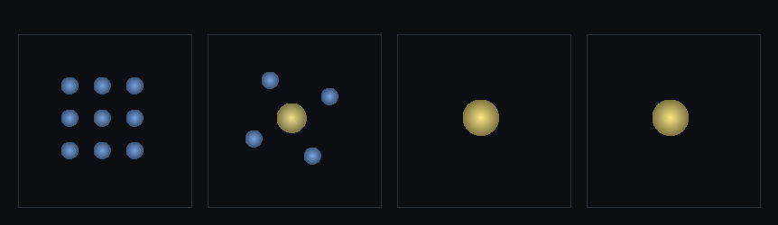

# step_0036 — 구체 합치기(강착): 닿고 느린 구체들이 큰 구체로 (구체 세계 SW1)

> [design/sphere-world.md](../../design/sphere-world.md) §6 **SW1** — 구체 세계의 *첫 벽돌*. 세계를 한 원소(자유 구체)로 굴리는 트랙의 시작.

## 논의 — 이 step 의 의미

직전까지(0026~0035) 우리는 안정 덩어리를 격자에서 빼낸 **자유 구체(개체) substrate** 를 세웠다 — 자유 운동·개체간 중력·스핀·자동 승격/강등·다체 궤도(0035). 이제 세계의 진행 방향이 **"한 원소 = 자유 구체"** 로 재정립됐고(sphere-world.md), 그 위에 *합치기·접촉·쪼개기·LOD* 를 더한다.

**SW1 = 합치기(강착)**: 두 구체가 *닿고*(CoM 거리 ≤ r_a+r_b+pad) *느리면*(상대 속도 ≤ vstick) 하나의 큰 구체로 붙는다.

- **세계를 어떻게 변형?** N 개의 구체가 닿으며 적은 수의 큰 구체로 줄어든다 — *수박*. 이게 두 가지를 동시에 준다: ① **성능**(N↓ → N체 중력·충돌 비용↓ = 적응 LOD 의 Lagrangian 형태) ② **창발 물리**(강착 = 미행성→행성, 행성이 만들어지는 방식 그 자체).
- **무엇으로 검증?** 합치기 4 보존량(질량·운동량·각운동량·총E) 정확 + 임계(느리면 붙고 빠르면 안 붙음) + 눈(작은 구체들→큰 구체).
- **무엇이 보존/변하나?** 보존: 질량·운동량·각운동량(원점 기준)·총E — *합산이라 정확*. 변함: 개체 수↓·반지름↑·internalE↑(강착열). 궤도 각운동량 → 합쳐진 구체의 *스핀*.

## 구현 — `mergeEntities` (engine/htj-entity.js, 가법)

기존 함수(stepEntity·applyEntityGravity·demote) 한 줄도 안 건드림 → **신규 함수 추가 = 회귀 0**. 닿고 느린 쌍을 **연결 성분**(union-find·root=성분 최소 인덱스=결정론)으로 묶어, 각 성분을 한 개체로 **직접 합산**(순서 무관):

```
mass = Σ mᵢ              P = Σ Pᵢ            CoM = Σ mᵢ·rᵢ / mass
KEcm = ½|P|²/mass
internalE = Σ Eᵢ − KEcm                      ← 비탄성 강착열(잃은 CoM KE → 열, 항상 ≥ Σinternalᵢ)
energy = KEcm + internalE = Σ Eᵢ             ← 정확 보존
L_intrinsic = Σ Lᵢ + Σ (rᵢ−CoM)×Pᵢ          ← 궤도 각운동량 → 합쳐진 구체의 스핀
radius = 등가 구(Σ cells)
```

**왜 보존이 정확한가** — 합쳐진 개체의 보존량은 *입력 합 그대로*다:
- energy = KEcm + (ΣEᵢ − KEcm) = **ΣEᵢ** (정확).
- 원점 기준 총 각운동량 = L_intrinsic + CoM×P = Σ Lᵢ + Σ(rᵢ−CoM)×Pᵢ + CoM×ΣPᵢ = **Σ(Lᵢ + rᵢ×Pᵢ)** (정확).
- mass·P 는 단순 합.

**비탄성 = 데워진다**: KEcm ≤ ΣKEcmᵢ (운동량 부분 상쇄) → internalE = ΣEᵢ − KEcm ≥ Σinternalᵢ. 잃은 상대 운동E 가 열로 — 물리적(promote 의 강체화 열의 *구체+구체* 판).

**임계**: 상대 속도 |v_a−v_b| ≤ vstick 면 붙고, 넘으면 안 붙음(빠르면 깨지는 쪽 = SW3). vstick·pad 는 시뮬 상수(결정론).

## 검증

**(a) 수치 — `node HTJ/steps/step_0036/verify.js` → PASS (7/7)**

```
PASS  합치기 4 보존량 — 질량·운동량·각운동량(원점)·총E 정확 보존(2→1) = N 2→1 · 질량 200→200 · L_z -80.0→-80.0 · E 104→104
PASS  비탄성 강착열 — internalE↑(잃은 CoM KE→열)·KEcm 감소 = internalE 100→104.0(+4.0) · KEcm 4.0→0.0
PASS  임계 — 느리면 붙고(2→1) 빠르면 안 붙음(2 그대로) = 느림 N→1(=1) · 빠름 N→2(=2)
PASS  궤도 L→스핀 — 접선 운동량으로 닿은 둘이 합치면 스핀 창발 = 합치기 전 Σ|L_z|=0 → 합쳐진 스핀 L_z=-80.0(=-80=궤도)
PASS  연결 성분(체인) — 일렬로 닿은 셋이 한 개체로(3→1)·보존 = N 3→1 · 질량 300 · CoM_x 18.0(=18)
PASS  안전/항등 — 빈(0)·단일(1)·안 닿음(2) 무변화 = 빈 0 · 단일 1 · 멀리 2(merges 0)
PASS  결정론 — 같은 입력 → 같은 합치기 결과 지문 = 0x27c41
```

전 step verify **36/36 회귀 0**(신규 함수뿐) · `node tools/check-viewer.js` PASS(0036 STEPS 등록).

**(b) 눈 — `steps/step_0036/capture.png`** (engine 직접 PNG, 4 프레임 top-down)



작은 구체 **9개**(파랑·반지름 1.63) → 중력으로 끌려 **5개**(하나 합쳐져 노랗고 큼 2.78) → **1개**(노란 큰 구체 3.38) → 드리프트. 색·크기 = 질량(합쳐질수록 따뜻·큼). **질량 648.0 → 648.0 정확 보존.** 수치 검증의 가설(작은 구체가 강착해 큰 구체로·보존)이 화면에 그대로 보인다. viewer 장면 `0036`(render:'entities')에서도 "개체 N" 이 줄고 ΣP 가 불변임을 확인.

## 쉽게 풀어 쓴 설명

레고처럼 작은 공들이 떠다니다가, **천천히 부딪히면 달라붙어 더 큰 공**이 된다(수박 게임처럼). 빠르게 쾅 부딪히면 안 붙는다(그건 다음에 *깨지는* 걸로). 공이 합쳐질 때 — 무게도, 움직이는 기세(운동량)도, 빙글빙글 도는 기세(각운동량)도, 에너지도 **하나도 안 사라지고** 큰 공으로 그대로 넘어간다. 서로 돌면서 부딪히면 그 *도는 기세*가 큰 공의 *자전*이 되고, 부딪히며 잃은 속도는 *열*이 된다(부딪히면 뜨거워진다). 작은 공이 많을수록 계산이 무거운데, 합쳐서 큰 공 몇 개로 줄이면 **가벼워진다** — 그리고 이게 실제로 **행성이 만들어지는 방식**이다.

## 이 step 이 목적에 남긴 것 + 다음 연결

구체 세계의 **첫 법칙**이 섰다 — 구체가 *합쳐진다*. substrate(0026~0035)가 "구체가 움직이고 끌린다"였다면, 이제 "구체가 *커진다*". 합치기는 곧 **적응 LOD 의 씨앗**(많은 작은 단위 → 적은 큰 단위)이자 **강착 물리**다.

**다음 = SW2(접촉 반발 + 소산)**: 지금 구체는 닿으면 *합쳐지거나 통과*만 한다 — 겹침을 *거부*(반발)하고 *감쇠*(소산)하는 접촉이 없다. SW2 가 그걸 더하면 구체들이 **쌓이고·표면을 이루고·멈춰 선다**("선 캐릭터 = 중력↓ + 접촉↑"의 접촉 쪽). 그 뒤 SW3(쪼개기·합치기의 역)·SW4(적응 합치기=LOD).

**정직한 한계(이 단위)**: ① 접촉 반발·소산 없음(SW2) — 합치기 임계를 못 넘은 구체는 그냥 통과/궤도. ② 쪼개기 없음(SW3) — 빠른 충돌이 *안 붙기*만 하고 *깨지진* 않음. ③ 합치기는 모양에 대해 손실(큰 구체 = 구), 디테일은 *안 합친 배열*에 담김(SW4 적응). ④ vstick 은 상대 속도 임계(시뮬 상수) — 탈출 속도 기반 물리 임계는 후속 정련 여지.
