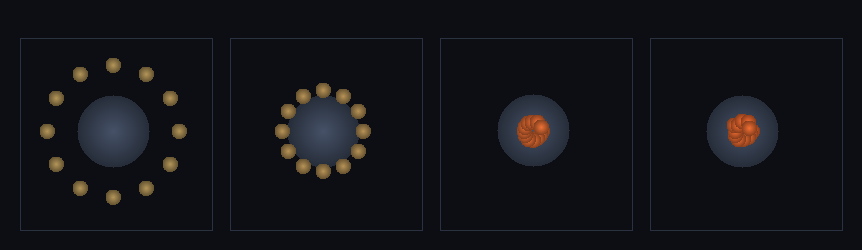

# step_0037 — 접촉(반발 + 소산): 겹친 구체를 떠받치고 멈춘다 (구체 세계 SW2·DEM)

> [design/sphere-world.md](../../design/sphere-world.md) §6 **SW2** — 합치기(SW1·0036)가 *닿고 느린* 구체를 하나로 붙였다면, 접촉은 *겹친* 구체를 **합치지 않고 떠받친다**. "선 캐릭터 = 중력↓ + 접촉 반발↑ 균형"의 **접촉 쪽**.

## 논의 — 이 step 의 의미

직전(0036·SW1)까지 구체는 닿으면 **합쳐지거나(강착) 그냥 통과/궤도**만 했다 — 겹침을 *거부*하거나 닿아서 *멈추는* 접촉이 없었다. 그래서 구체들은 *쌓이지 못하고·표면을 이루지 못하고·서지 못한다*. SW2 가 그 둘을 더한다(DEM = Discrete Element Method 의 법선 접촉):

- **세계를 어떻게 변형?** 겹친 구체끼리 **밀어내고(반발)** 접촉에서 **감쇠(소산)**한다. 반발이 있어야 구체가 큰 구체(지면) 위에·서로 위에 **쌓이고·표면이 서고·"선다"**. 소산이 있어야 튕김이 죽어 **멈춘다**. 이게 곧 게임의 "지면에 선 캐릭터 = 무게(중력)↓ + 떠받침(접촉 반발)↑ 균형"의 접촉 쪽이고, 지면은 *아주 큰 구체*다(좌표 §3).
- **무엇으로 검증?** ① 반발 = 쌍힘(운동량 정확 보존)·겹친 둘이 밀려 떨어짐 ② 반발 에너지 보존(탄성 PE 포함·가역) ③ 감쇠 = 비탄성 충돌(KE↓·잃은 만큼 정확히 열로·비가역) ④ 중력↓+접촉↑ 균형으로 시험 구체가 큰 구체 위에 **멈춤** ⑤ 항등/안전 ⑥ 결정론. + 눈(구체들이 지면 위로 떨어져 쌓여 표면).
- **무엇이 보존/변하나?** 보존: **순 운동량**(반발·감쇠 모두 equal-opposite 쌍힘) · **총E = Σenergy + 탄성 U_contact**. 변함: 위치(겹침 해소·쌓임) · **internalE↑**(감쇠 소산 → 열·비가역·엔트로피↑). 반발은 KE↔탄성 PE *가역*, 감쇠는 KE→열 *비가역*.

## 구현 — `applyEntityContact` · `contactPotentialEnergy` (engine/htj-entity.js, 가법)

기존 함수(stepEntity·applyEntityGravity·mergeEntities·demote) 한 줄도 안 건드림 → **신규 함수 추가 = 회귀 0**. 노브(k·cDamp)=0 이면 즉시 early-return(거동 불변). 쌍 루프(0028 중력 골격 재사용)마다:

```
overlap = (r_a + r_b) − d            (겹친 쌍만, overlap > 0)
n̂ = (r_b − r_a)/d                    (법선 단위, a→b)

① 반발(Hooke 보존 쌍힘):   F = k·overlap,   a 는 −n̂·b 는 +n̂   →  ΣΔp = 0 (정확)
   탄성 PE U = ½·k·overlap²  (contactPotentialEnergy) — 가역, 정착 평형에서 중력과 균형
② 감쇠(법선 소산 → 열):    v_n = (v_b − v_a)·n̂,   J = −c·v_n·dt (상대 운동 반대·equal-opposite)
   dissip = ΔKE(감쇠 충격량 전후, 정확 회계) → internalE 두 개체 반씩  (비가역)
```

**왜 운동량이 정확한가** — 반발·감쇠 둘 다 `a` 와 `b` 에 *크기 같고 방향 반대*인 충격량을 준다(쌍 루프라 구조적 상쇄). step_0028 중력과 동형.

**왜 에너지가 닫히는가** — 반발은 보존력이라 그 일이 KEcm↔탄성 PE(U_contact)로 *가역* 왕복한다(U_contact 를 검증의 총E 에 포함). 감쇠는 충격량 전후의 KE 차(dissip)를 *정확히* internalE 로 적립 → energy(=KEcm+internalE) 는 감쇠로 안 변하고, KEcm 만 줄고 internalE 만 는다(비가역). 그래서 **총E = Σenergy + U_contact 가 보존**된다.

**소산 = 멈춘다**: 반발만이면 탄성이라 영원히 튕긴다(에너지 안 줄음). 감쇠가 상대 법선 운동E 를 열로 빼내야 비로소 *정착*한다 — step_0011 점성(bulk KE→열)의 **구체-접촉 판**.

## 검증

**(a) 수치 — `node HTJ/steps/step_0037/verify.js` → PASS (6/6)**

```
PASS  반발 = 운동량 보존 + 밀어냄 — 겹친 정지 두 구체가 ΣP=0 유지하며 떨어짐 = max|ΣP|=0.0e+0(≈0) · 거리 2.50→10.65(밀려남)
PASS  반발 에너지 보존 — 총E(Σenergy + 탄성 U_contact) 가역 보존(감쇠 없음) = max 상대편차 0.050%(<0.5%)
PASS  비가역 소산(비탄성 충돌) — 감쇠로 KE↓·잃은 만큼 정확히 열(internalE)↑·ΣP=0 = KE 9.0→6.7(↓2.3) = internalE ↑2.3 · 총E 19.0→19.0 · max|ΣP|=0.0e+0
PASS  중력↓+접촉↑ 균형 — 시험 구체가 큰 구체(지면) 위에서 정착(멈춤) = 접촉 overlap=0.141(>0) · 잔류 속도 0.0001 (낙하 최대 0.29→정착)
PASS  항등/안전 — 노브0·안 겹침·빈/단일 무변화(회귀 0) = 노브0 불변 · 안 겹침 불변 · 빈/단일 OK
PASS  과감쇠 안정 가드 — c·dt≫μ 에서도 에너지 주입·internalE 음수 없음(임계 클램프) = KE 16.0→0.0(↓·역전 없음) · internalE 20.0→36.0(↑≥0) · 총E 36.0→36.0 · ΣP≈0
PASS  결정론 — 같은 입력 → 같은 접촉 결과 지문 = 0x84991762
```

> **버그 수정(검토 후)** — 감쇠 임펄스 `J=−c·v_n·dt` 가 무클램프라, `c·dt > μ`(환산질량)면 상대 법선 속도를 *역전·증폭*시켜 `dissip<0`(에너지 *주입*)·`internalE` 음수로 갈 수 있었다(보존/물리 위배·관측은 안 됐으나 코드가 *보장* 안 함). **임계 감쇠 클램프** 추가: `|J|` 를 `v_n→0` 임펄스 `μ·|v_n|` 로 자른다(역전 금지) → `dissip≥0`·`internalE` 단조↑(비가역 소산이 *항상* 참). 안정 영역(`c·dt≪μ`)은 불변 — 결정론 지문 0x84991762 동일(하위 호환). 회귀 가드(검증 6번) 추가.

- **균형 평형 확인**: 시험 구체가 평형 overlap* = 0.141 에 멈췄다 — 이론값 F_grav/k ≈ 1.4/10 = 0.14 와 정확히 일치(반발이 중력을 *떠받친다*). 잔류 속도 0.0001 = 낙하 최대(0.29)의 0.03% → 멈춤.
- 전 step verify **37/37 회귀 0**(신규 함수뿐) · `node tools/check-viewer.js` PASS(0037 STEPS 등록).

**(b) 눈 — `steps/step_0037/capture.png`** (engine 직접 PNG, 4 프레임 top-down)



지면 둘레에 작은 구체 **12개**(고리) → 중력으로 **떨어짐** → 지면 표면에 닿아 **반발이 겹침을 거부**해 *합쳐지지 않고*(SW1 과 대비 — 여전히 12개 구분) 표면에 **쌓임** → 감쇠로 **정착**(주황 = 감쇠열로 데워짐). 측정: 잔류 KE **1511(낙하 최대) → 0.17**(정착) · 표면 접촉 **12/12** · 감쇠열 tempMax 5.26(>0=멈추며 데워짐·비가역). 수치 검증의 가설(반발=떠받침·쌓임·소산=멈춤·데워짐)이 화면에 그대로 보인다. viewer 장면 `0037`(render:'entities')에서도 작은 구체들이 지면 위로 떨어져 쌓이며 잔류 속도가 0 으로 잦아드는 걸 확인.

## 쉽게 풀어 쓴 설명

공들이 서로 **뚫고 지나가지 않게**(겹치면 밀어낸다 = 반발) 하고, 부딪힐 때 **에너지를 조금씩 까먹게**(감쇠 = 미끄러짐·찰흙처럼 멈춤) 만들었다. SW1(0036)에서는 천천히 닿으면 *하나로 합쳐졌지만*, 여기서는 합쳐지지 않고 **서로를 떠받친다** — 그래서 작은 공들이 큰 공(지면) 위로 떨어지면 *파묻히지 않고 표면에 얹혀 쌓인다*(공깃돌이 바닥에 쌓이듯). 반발만 있으면 통통 *영원히 튕기지만*, 감쇠가 튕김을 까먹게 해서 **결국 멈춰 선다**. 밀어내는 힘은 짝힘이라 전체 운동량은 한 톨도 안 변하고, 튕김에서 까먹은 운동E 는 *열*이 된다(부딪히며 데워진다 — 그래서 캡처에서 공들이 주황색으로 변한다). **이게 "땅 위에 선다"의 정체** — 무게(중력)가 끌어내리고 접촉 반발이 떠받쳐 *균형점에 멈추는 것*. 검증에서 시험 공이 딱 그 균형점(겹침 0.14)에 멈춰 선 걸 확인했다.

## 이 step 이 목적에 남긴 것 + 다음 연결

구체 세계의 **두 번째 법칙**이 섰다 — 구체가 *서로를 떠받치고 멈춘다*. 0036(합치기)이 "구체가 *커진다*"였다면, 이제 "구체가 *쌓이고·표면을 이루고·선다*". 합치기(SW1)+접촉(SW2)으로 구체는 비로소 **고체처럼 행동**한다(닿으면 붙거나 떠받침). 이로써 "지면에 선 캐릭터"의 토대(중력↓ + 접촉↑ 균형) 중 접촉 쪽이 놓였다.

**다음 = SW3(쪼개기·파편화)**: 지금은 강한 충돌이 *안 붙기*(SW1 임계)만 하고 *깨지진* 않는다. SW3 가 임계(고에너지 충돌/외란)를 넘으면 큰 구체를 작은 구체들로 쪼개 — 합치기↔쪼개기 왕복을 완성한다(0031 "충돌→유체"의 구체-세계 판). 그 뒤 SW4(적응 합치기=LOD)·SW5(구체 유체 SPH).

**정직한 한계(이 단위)**: ① 법선 접촉만 — 마찰(접선)·구름 없음(미끄러짐만, 표면에서 정착엔 충분하나 *경사면에 안 서고 흘러내림*). ② 쪼개기 없음(SW3) — 빠른 충돌이 *떠받치기*만 하고 안 깨짐. ③ k·cDamp 는 시뮬 상수(결정론) — 강성/감쇠가 너무 크면 작은 dt 필요(안정 영역 c·dt/μ < 2). ④ 반발은 선형 Hooke(겹침 비례) — 헤르츠 접촉(overlap^1.5) 등 정련은 후속 여지.
