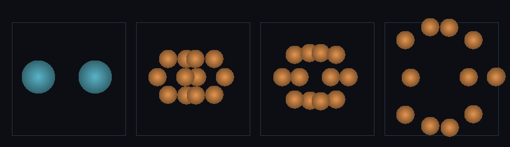

# step_0038 — 쪼개기(파편화): 임계 넘은 구체가 작은 구체들로 (구체 세계 SW3·합치기의 거울)

> [design/sphere-world.md](../../design/sphere-world.md) §6 **SW3** — 합치기(SW1·0036)의 *거울*. 닿고 *느리면* 합쳐졌듯(SW1), 닿고 *빠르면*(임계 넘으면) 깨진다. 합치기↔쪼개기 **왕복** 완성.

## 논의 — 이 step 의 의미

0036(SW1)은 닿고 *느린* 구체를 하나로 **합쳤고**, 0037(SW2)은 닿은 구체를 **떠받쳤다**. 남은 짝은 닿고 *빠른* 구체가 **깨지는** 것 — 강한 충돌/외란이 임계를 넘으면 큰 구체가 작은 구체들로 파편화한다(SW3).

- **세계를 어떻게 변형?** 한 구체가 N 조각으로 *터진다*. `mergeGroup`(0036)이 N→1 합산이었다면, 이건 그 **역**(1→N 분배). 합치기↔쪼개기가 왕복하면 — 미행성이 모여 행성이 되고(강착), 큰 충돌로 다시 부서진다. 0031("충돌→유체")의 구체-세계 판.
- **무엇으로 검증?** ① 쪼개기 4 보존량(쪼갠 합=원본) ② 분산 역대칭(결합열→분산 KE) ③ 임계가 가름(빠름→깸·느림→안 깸) ④ 스핀 분배 ⑤ 항등/안전 ⑥ 결정론. + 눈(큰 구체 충돌→파편).
- **무엇이 보존/변하나?** 보존: **질량·운동량·각운동량(원점)·총E**(합산의 역이라 정확). 변함: 개체 수↑·반지름↓·internalE↓(결합열이 분산 KE 로). 부모 intrinsic 스핀 → 조각마다 L/n. **에너지 짝대칭**: 합치기는 "잃은 CoM KE → 열(internalE↑)", 쪼개기는 그 역 "결합열(internalE) → 조각 분산 KE".

## 구현 — `fragmentEntity` · `fragmentOnImpact` (engine/htj-entity.js, 가법)

기존 함수 한 줄도 안 건드림 → **신규 함수 = 회귀 0**.

**`fragmentEntity(entity, {n, dispersalFrac, spread})`** — 부모 1개 → n 조각, `mergeGroup` 의 정확한 역:

```
조각 배치(대칭): n 조각을 CoM 둘레 평면 고리(각 2πk/n)에 등질량(M/n)·등셀로, 반경 폭발 속도 s·û_k
 운동량:  Σ m·(v_cm + s·û_k − offset) = M·v_cm = P     (offset=질량가중 평균차감 → 기계정밀도 정확·0007 거울)
 각운동량: 부모 스핀 L 을 조각마다 L/n + 대칭 배치라 궤도 L=0 → 원점 기준 총 L 정확
 에너지:  KE_explosion = ½M·s² = dispersalFrac·internalE,  조각 internalE = (1−df)·internalE/n
          ΣE = KEcm_parent + internalE_parent = E_parent  (정확)
```

**왜 보존이 정확한가** — 조각의 보존량 합이 *부모 그대로*다(위 식). 분산 KE 는 부모 결합열에서 꺼내므로(internalE↔KEcm 재분배) 총E 불변 — merge 의 비탄성 가열을 *되감은* 것.

**`fragmentOnImpact(entities, {shatterKE, n, ...})`** — 자기-트리거(`mergeEntities` 의 거울): 접촉(거리 ≤ r_a+r_b+pad)한 쌍의 상대 운동E ½·μ·|v_a−v_b|² 가 임계 이상이면 두 구체를 `fragmentEntity` 로 깬다. 각 조각화가 *제* 보존량을 정확 보존하므로 쌍 총량도 정확.

**재파편 폭주 차단**: 조각은 질량 M/n → 환산질량 μ↓ → 조각끼리 상대 운동E 가 임계 아래로 떨어져 더 안 깨진다(자연 차단·N 이 안정).

## 검증

**(a) 수치 — `node HTJ/steps/step_0038/verify.js` → PASS (6/6)**

```
PASS  쪼개기 4 보존량 — 질량·운동량·각운동량(원점)·총E 정확 보존(1→6) = N 1→6 · 질량 600→600 · ΣP [120,-60,30]→[120,-60,30] · L_z -3095.0→-3095.0 · E 215.75→215.8
PASS  분산 역대칭 — 결합열(internalE) → 조각 분산 KE(merge 의 역)·합=부모E = 분산 ΣKEcm 80.0(=80.0) · 잔류 Σinternal 80.0(=80.0) · 합 160.0=E 160
PASS  임계가 가름 — 빠른 충돌→깸(N↑)·느린 충돌→안 깸(N 그대로)·보존 = 빠름 N 2→8(깸·shatters 2) · 느림 N 2→2(안 깸) · 빠름 질량 200·ΣP_x 0 보존
PASS  스핀 분배 — 부모 스핀 L 이 조각마다 L/n·원점 총 L 보존 = 조각당 L_z=18.0(=18) · Σintrinsic 90.0(=90) · 원점 총 L_z 90.00(=90)
PASS  항등/안전 — n<2·안 닿음·빈/단일·임계 미만 무변화 = n<2 1 · 안 닿음 2(shatters 0) · 빈/단일 0/1 · 임계미만 2
PASS  결정론 — 같은 입력 → 같은 쪼개기 결과 지문 = 0x5ab3f67a
```

- 전 step verify **38/38 회귀 0**(신규 함수뿐) · `node tools/check-viewer.js` PASS(0038 STEPS 등록).

**(b) 눈 — `steps/step_0038/capture.png`** (engine 직접 PNG, 4 프레임 top-down)



온전한 큰 구체 **2개**(청록·반지름 4.72) 접근 → 빠른 충돌로 **각각 6 조각**으로 깨짐(**2→12**·주황·반지름 2.59) → 파편 **분산**. N 2→12→12→12(재파편 폭주 없음) · **질량 800→800·운동량 ΣP_x 0→0 정확 보존**. 수치 검증의 가설(빠른 충돌→파편·보존·폭주 차단)이 화면에 그대로 보인다. viewer 장면 `0038`(render:'entities')에서도 큰 구체 둘이 충돌해 작은 구체들로 깨지고 ΣP 가 불변임을 확인.

## 쉽게 풀어 쓴 설명

공 둘이 **세게 부딪히면 산산조각**난다(천천히 부딪히면 SW1 에서 합쳐졌고, 보통이면 SW2 가 떠받쳤다 — *빠르면* 깨진다). 큰 공 하나가 작은 공 여섯 개로 쪼개질 때, 무게도·움직이는 기세(운동량)도·도는 기세(각운동량)도·에너지도 **한 톨도 안 사라지고** 조각들로 그대로 나뉜다(합치기를 *거꾸로* 돌린 셈). 조각들이 *튀어나가는 속도*는 부모 공이 품고 있던 **열(결합 에너지)에서** 나온다 — 합쳐질 때 *열로 변했던 운동E* 가, 깨질 때 *다시 운동E 로* 풀려나는 것(완벽한 짝대칭). 조각은 작아서 다음 충돌 땐 잘 안 깨진다(그래서 *끝없이 부서지지 않는다*). 이걸로 "**모이고(합치기) ↔ 부서진다(쪼개기)**"의 왕복이 완성됐다 — 행성이 생기고, 큰 충돌로 다시 부서지는 그 순환.

## 이 step 이 목적에 남긴 것 + 다음 연결

구체 세계의 **세 번째 법칙**이 섰다 — 구체가 *깨진다*. 0036(합치기·커짐)·0037(접촉·쌓임)에 이어, 이제 **합치기↔쪼개기 왕복**이 닫혔다. 구체는 모이고·떠받치고·부서지는 세 거동을 모두 갖춰, 그 위에서 *행성 형성과 파괴의 순환*이 굴러갈 토대가 됐다.

**다음 = SW4(적응 합치기 = LOD)**: 지금 합치기(SW1)는 *물리적으로 닿고 느릴 때*만, 쪼개기(SW3)는 *세게 부딪힐 때*만 일어난다. SW4 는 이를 **관찰자 거리**에 결합한다 — *멀면 합치고(coarse) 가까이서 쪼갠다(fine)*. 같은 보존 합산/분배(0036·0038)를 *비용 분리*(0034 공간 LOD 의 Lagrangian 형태)에 재사용해, 세계가 커져도 비용이 관찰 영역에만 묶이게 한다. 그 뒤 SW5(구체 유체 SPH → 격자 은퇴).

**정직한 한계(이 단위)**: ① 분산 KE 가 *충돌 운동E* 가 아니라 부모 *internalE(결합열)*에서 나온다(보존을 단순·정확하게 하려는 선택) — 충돌 자체의 운동E 소비는 후속 정련 여지. ② 조각 수 n 고정(충돌 세기에 따른 가변 n·질량 분포는 후속). ③ 조각은 등질량·평면 고리 배치(3D 등방·불균등 파편은 후속). ④ 적응(거리 결합)은 SW4.
