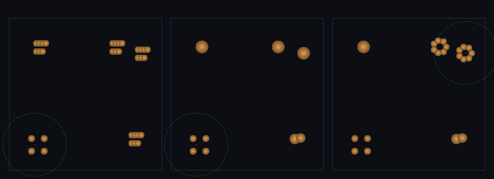

# step_0039 — 적응 LOD: 관찰자 멀면 합치고 가까이서 쪼갠다 (구체 세계 SW4·0034 격자 LOD 의 Lagrangian 판)

> [design/sphere-world.md](../../design/sphere-world.md) §6 **SW4** / §4 — 합치기(SW1·0036)·쪼개기(SW3·0038)를 **관찰자 거리에 결합**한다. 같은 보존 합산/분배를 *물리 임계* 대신 **거리 임계**로 재사용해, 비용을 *세계 크기*가 아니라 *관찰되는 디테일*에 묶는다. 0034 격자 LOD(downsample/upsample)의 **Lagrangian(구체) 판**.

## 논의 — 이 step 의 의미

0036(SW1)은 닿고 *느린* 구체를 하나로 **합쳤고**, 0038(SW3)은 닿고 *빠른* 구체를 작은 구체들로 **깼다**. 둘 다 *물리 임계*(상대 속도·충돌E)가 가른다. SW4 는 같은 두 연산을 **관찰자 거리**가 가르게 한다 — *멀면 합치고(coarse)·가까이서 쪼갠다(fine)*. 이게 곧 적응 LOD = 성능이다.

- **세계를 어떻게 변형?** 새 법칙이 아니다. `mergeGroup`(0036·N→1 합산)·`fragmentEntity`(0038·1→N 분배)를 **트리거만 바꿔** 재사용한다 — 물리 임계 대신 *거리 임계*. 관찰자서 먼 구체는 블록당 1 개로 합쳐 노드를 줄이고(coarsen), 관찰자가 다가온 곳의 coarse 구체는 fine 으로 되쪼갠다(refine). 세계가 커져도(먼 구체가 늘어도) **비용이 관찰 영역에 묶인다**.
- **무엇으로 검증?** ① coarsen 보존(먼 무리 합침·벌크 정확·N↓) ② refine 보존(near coarse→fine·폭발 없이 벌크만) ③ 왕복 보존(멀 때 coarsen→다가오면 refine·한 바퀴 후 정확·fine 복원) ④ **비용이 관찰 영역에 묶임**(먼 구체 밀도 4× 키워도 effective 개체 수 불변) ⑤ 항등/안전(observer 없음→early-return·회귀 0) ⑥ 결정론. + 눈(원거리 coarse·근거리 fine).
- **무엇이 보존/변하나?** 보존: **질량·운동량·각운동량(원점)·총E** — 합산(mergeGroup)·분배(fragmentEntity)가 이미 정확하므로 coarsen·refine·왕복 모두 *정확*. 변함: 개체 수(관찰자 위치 따라 숨쉬듯)·모양(coarse 는 내부 배열을 잃고·refine 은 평면 고리로 *근사 복원* = LOD 손실·약한 결정론). **모양은 손실, 벌크는 정확**(design §5 난점 1).

## 구현 — `adaptLOD(entities, opts)` (engine/htj-entity.js, 가법)

기존 함수 한 줄도 안 건드림 → **신규 함수 = 회귀 0**. 노브(observer/blockSize) 없으면 즉시 반환.

**`adaptLOD(entities, {observer, blockSize, nearRadius, spread})`** — 두 방향:

```
near/far 분류: |r_i − observer| ≤ nearRadius → near · 아니면 far(블록 버킷으로)
① coarsen(far→합침): 같은 블록(floor(r/bs))의 far 구체 2+ → mergeGroup 으로 블록당 1 개 coarse 구체
      occupied far block 1 개 = 1 노드 → 먼 구체를 아무리 늘려도 비용이 *블록 수*에 묶인다.
      merged.lodMembers = Σ(구성원 lodMembers)  ← 되쪼갤 fine 수 기억
② refine(near→쪼갬): near 의 coarse 구체(lodMembers>1) → fragmentEntity(n=members, dispersalFrac=0)
      dispersalFrac=0 → 폭발 속도 s=0·조각이 v_cm 공유 → 벌크 정확(KEcm·L·E 그대로 분배)·디테일 복원
```

**왜 보존이 정확한가** — coarsen 은 `mergeGroup`(0036·합산이 정확)을, refine 은 `fragmentEntity`(0038·분배가 정확)를 그대로 호출한다. 둘 다 질량·운동량·각운동량(원점)·총E 를 기계 정밀도로 보존하므로, 트리거를 거리로 바꿔도 *벌크는 그대로*다. `dispersalFrac=0` 으로 refine 하면 조각이 폭발 없이 `v_cm` 을 공유해 — coarse 의 KEcm·internalE·스핀이 정확히 나뉜다(왕복에서 벌크 불변).

**비용이 관찰 영역에 묶이는 원리** — effective 개체 수 = (near 의 fine 개체) + (occupied far 블록 수). 세계를 키워 *먼 구체 밀도를 올려도* 같은 블록에 떨어지면 합쳐져 블록 수는 그대로 → effective 일정(scalability.md 레버3·0034 격자 LOD `effectiveCellCount` 의 구체 버전).

## 검증

**(a) 수치 — `node HTJ/steps/step_0039/verify.js` → PASS (6/6)**

```
PASS  coarsen 보존 — 먼 무리를 블록당 1 개로 합쳐도 4 보존량 정확(N↓) = N 6→1(coarsened 1) · 질량 75→75.0 · ΣP_x 9.0→9.0 · L_z -1597.0→-1597.0 · E 121.36→121.36 · lodMembers 6
PASS  refine 보존 — near coarse 구체를 fine 조각으로 되쪼개도 4 보존량 정확(폭발 없이) = N 1→5(refined 1) · 질량 50→50.0 · ΣP 12.0→12.0 · L_z 2.00→2.00 · E 82.2→82.2 · 모두 fine true
PASS  왕복 보존 — coarsen(멀 때)→refine(다가옴)·한 바퀴 후 벌크 정확·fine 복원 = N 4→coarsen 1→refine 4 · 질량 54→54.0 · ΣP_x 4.0→4.0 · L_z 740.0→740.0 · E 65.66→65.66(coarse 단계 E 65.66)
PASS  비용이 관찰 영역에 묶임 — 먼 구체 밀도 4× 키워도 effective 개체 수 불변(세계 크기 분리) = raw 19→effective 5 · raw 67→effective 5(불변·near 3 + far 블록) · 4× 원시 67 인데 비용 5
PASS  항등/안전 — observer 없음·bs≤0→early-return·빈/단일·near 단독 무변화 = noObs N 2(coarsened 0) · noBs N 2 · empty 0 · single 1 · near단독 1(refined 0)
PASS  결정론 — 같은 입력 → 같은 적응 LOD 결과 지문 = 0xb8782fda
```

- 전 step verify **39/39 회귀 0**(신규 함수뿐) · `node tools/check-viewer.js` PASS(0039 STEPS 등록).

**(b) 눈 — `steps/step_0039/capture.png`** (engine 직접 PNG, 3 패널 top-down)



세계 전역에 흩어진 작은 구체 떼(주황) + 관찰자(흰 점·초록 near 링). **① 원본 32 개** → **② coarsen 9 개**(관찰자서 먼 블록들이 각각 큰 구체 1 개로 합쳐짐·near 영역 fine 유지) → **③ refine 21 개**(관찰자가 우상단 블록으로 다가오자 그곳 coarse 가 다시 작은 구체들로 쪼개짐 — 고리 모양 근사 복원). **질량 82.0→82.0→82.0·운동량 ΣP_x 12.30→12.30→12.30 정확 보존**. 수치 검증의 가설(멀면 합쳐 N↓·가까이 쪼개 디테일↑·벌크 불변)이 화면에 그대로 보인다. viewer 장면 `0039`(render:'entities')에서도 관찰자가 원궤도로 세계를 훑으며 "개체 N" 이 숨쉬듯 늘었다 줄었다 하고 ΣP 가 불변임을 확인.

## 쉽게 풀어 쓴 설명

게임에서 **멀리 있는 건 대충, 가까이 있는 건 자세히** 그리는 LOD(level of detail)를 — 격자가 아니라 **구체**로 한다. 관찰자(보는 사람)에서 **멀리 있는 작은 공들은 큰 공 하나로 뭉치고**(그릴 게 줄어 빠르다), 관찰자가 **다가오면 그 큰 공이 다시 작은 공들로 풀린다**(가까이선 자세히). 새 법칙을 만든 게 아니라, 앞서 만든 **합치기(SW1)와 쪼개기(SW3)를 "거리"로 켜고 끈** 것뿐이다 — 전엔 *세게 부딪힐 때* 합쳐지고 깨졌다면, 이제 *멀고 가까움*이 그걸 결정한다. 뭉치고 풀어도 **무게·움직이는 기세·도는 기세·에너지는 한 톨도 안 변한다**(모양만 대충 근사될 뿐). 핵심 이득: 세계가 아무리 커져도(멀리 공이 아무리 많아도) 멀면 다 뭉쳐지니까 — **비용이 "세계 크기"가 아니라 "내가 보는 만큼"에만 묶인다**. 검증에서 먼 공을 4배로 늘려도 실제 다루는 공 개수가 그대로였다(5개).

## 이 step 이 목적에 남긴 것 + 다음 연결

구체 세계의 **네 번째 법칙**이 섰다 — 해상도가 *관찰자를 따라간다*. 0036(합치기)·0037(접촉)·0038(쪼개기)가 *물리*로 구체를 모으고·떠받치고·깼다면, SW4 는 그 합치기·쪼개기를 **성능 레버**로 재사용해 — 세계 크기를 비용에서 분리했다. scalability.md 의 세 레버(희소화·승격·LOD)가 이제 **하나의 Lagrangian 원소(자유 구체)**로 통합됐다: 빈 곳엔 구체가 없고(희소화)·안정 덩어리는 이미 구체이며(승격)·합치기/쪼개기가 곧 LOD(SW4)다.

**다음 = SW5(구체 유체 SPH)**: 마지막 단계 — 아직 격자(0002~0013)에 남은 *유체*를 구체(SPH 압력·확산·열)로 이주시켜 격자를 은퇴시킨다. 그러면 세계가 **한 원소(자유 구체)만으로** 굴러간다(design §6 SW5). 단 *측정된 필요*가 올 때 최후에(0023 교훈·design §5 난점 3) — 큰 이주라 서두르지 않는다.

**정직한 한계(이 단위)**: ① 모양 복원은 *근사*(refine 는 평면 고리 배치 — 원래 배열이 아니라 같은 벌크의 새 배열·약한 결정론). ② 블록 버킷은 *고정 격자*(옥트리 다단계 LOD 아님 — 2단계 near/far). ③ coarsen 은 블록당 2+ 일 때만(far 단독은 그대로). ④ 구체 유체(SPH)는 SW5. 여기선 *적응 LOD 한 법칙*만.
