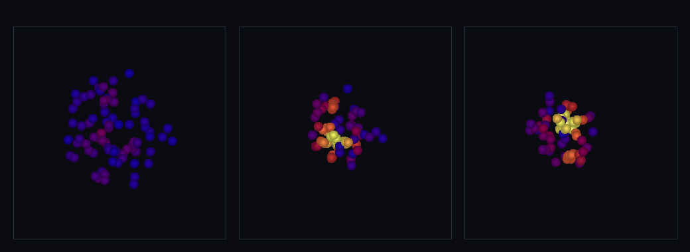

# step_0040 — SPH 밀도 추정: 구체 떼의 국소 밀도 (구체 세계 SW5 첫 벽돌)

> [design/sphere-world.md](../../design/sphere-world.md) §6 **SW5** / §3 — "가스·유체 = 작은 구체 떼(SPH 압력·확산)". 지금 유체는 격자(0002~0013)에 있다. SW5 는 그 유체를 *구체(SPH 입자)*로 옮겨 격자를 은퇴시키는 **최후 단계** — 큰 작업이라 측정된 필요가 올 때 *가법적으로 한 벽돌씩* 쌓는다(design §5 난점 3·§7 측정으로 결정). 이 첫 벽돌 = SPH 의 토대 **밀도 추정**.

## 논의 — 이 step 의 의미

SW1~SW4 가 구체의 *역학*(합치기·접촉·쪼개기·LOD)을 세웠다. 이제 남은 표현은 **유체/가스** — design §3 은 이를 "작은 구체 떼(SPH)"로 본다. SW5 는 격자 유체를 구체로 이주시켜 세계를 *한 원소(자유 구체)만으로* 굴리는 최후 단계다. 가장 큰 작업이라 한 step 에 다 넣지 않고 **가장 작은 첫 벽돌부터** 놓는다.

- **세계를 어떻게 변형?** SPH 의 모든 것이 서는 **토대 = 밀도**를 도입한다. 입자가 *어디에 얼마나 모였는지*를 이웃 합으로 잰다: ρ_i = Σ_j m_j·W(|r_i−r_j|, h). 이게 곧 압력·점성·확산이 읽을 *국소 밀도장*이다. 0009(온도)가 *수동 양*으로 먼저 도입돼 0010 압력의 토대가 된 것과 같은 정신 — **이 단위는 밀도를 *재기만* 하고 아직 힘을 만들지 않는다**(회귀 0).
- **무엇으로 검증?** ① 커널 정규화 ∫W dV=1(연속 극한 밀도 정확)·짝함수·지지 밖 0 ② 균일 분포 → 참 밀도(ρ→m·n₀) ③ 단일 입자 ρ=m·W(0,h)=m/(πh³)(자기 기여) ④ 밀집 → 밀도↑(단조) ⑤ 평행이동 불변(국소 양) ⑥ 결정론. + 눈(중력 수축 구름의 중심 밀도↑).
- **무엇이 보존/변하나?** 새 *측정 양*(density) 추가뿐 — 기존 보존량(질량·운동량·각운동량·총E)은 손대지 않는다(밀도는 힘이 아니라 진단). 회귀 0 = 신규 파일·신규 함수, 기존 함수 호출 없음.

## 구현 — `engine/htj-sph.js` (신규 법칙 파일, 가법)

새 SPH 법칙 가족의 첫 파일. 기존 코드 한 줄도 안 건드림 → **회귀 0**.

**커널 `kernelW(r, h)`** — 3D 3차 B-스플라인(Monaghan cubic spline), 지지반경 2h·정규화 ∫W dV=1:

```
W(r,h) = (1/π h³) · { 1 − 1.5q² + 0.75q³      (0 ≤ q < 1)
                      0.25(2−q)³               (1 ≤ q < 2)     (q = |r|/h)
                      0                         (q ≥ 2) }
```

**밀도 `sphDensity(particles, {h})`** — ρ_i = Σ_j m_j·W(|r_i−r_j|, h). 자기 기여(j=i, r=0 → W=σ) 포함(표준 SPH). 각 입자에 `density` 를 써 넣는다. O(N²) 직접 합산(이웃 탐색 가속은 0032 Barnes-Hut 처럼 후속 최적화).

**왜 이 형태인가** — 정규화 ∫W dV=1 이면, 수밀도 n₀ 의 연속 분포에서 ρ = Σ_j m_j·W → m·n₀·∫W dV = m·n₀ = 참 밀도. 즉 *균일하면 참 밀도를 정확히 회복*하고, 모이면(국소 n↑) ρ↑. 부드러운 커널이라 입자 위치의 작은 변화에 매끄럽게 반응(미분 가능 → 후속 ∇W 압력 힘의 토대).

## 검증

**(a) 수치 — `node HTJ/steps/step_0040/verify.js` → PASS (6/6)**

```
PASS  커널 정규화 — ∫W dV ≈ 1·짝함수·지지 밖(q≥2) 0 = ∫W dV = 1.0000(≈1) · W(2h)=0 · W(−0.7)=W(0.7)=0.07069
PASS  균일 분포 → 참 밀도 — 등간격 격자 내부 입자 ρ ≈ m·n₀(연속 극한) = ρ_center = 2.4000 · 참 밀도 m·n₀ = 2.4000(m=0.3·n₀=8) · 상대오차 0.00%
PASS  단일 입자 — ρ = m·W(0,h) = m/(π h³)(자기 기여) 정확 = ρ = 0.161973 · m/(π h³) = 0.161973
PASS  밀집 → 밀도↑ — 모인 입자(좁은 간격) 중심 ρ > 흩어진 입자 중심 ρ(단조) = 좁은 간격 ρ_center = 0.8499 > 넓은 간격 ρ_center = 0.2377
PASS  평행이동 불변 — 전체를 옮겨도 각 입자 ρ 불변(국소 양) = 각 ρ 일치(예: 0.16248 = 0.16248)
PASS  결정론 — 같은 입력 → 같은 밀도 추정 지문 = 0x97ee7557
```

- 전 step verify **40/40 회귀 0**(신규 파일·신규 함수뿐) · `node tools/check-viewer.js` PASS(0040 STEPS 등록).

**(b) 눈 — `steps/step_0040/capture.png`** (engine 직접 PNG, 3 프레임 top-down·밀도 heat 색)



흩어진 작은 구체 구름 80개(어두운 파랑=옅음)가 **약한 중력으로 수축**(0028 재사용)하며 중심이 모인다. 매 프레임 SPH 밀도를 재 색으로 칠한다: **① 흩어진 구름**(최대 ρ 0.062) → **② 수축 중**(0.209·중심 주황) → **③ 코어 밀집**(0.241·중심 밝은 노랑). **최대 밀도가 단조 증가**(0.062→0.209→0.241) — 중력이 위치를 모으면 sphDensity 가 그 모임을 *밀도로 읽어낸다*. 수치 검증의 가설("밀집→ρ↑")이 화면에 그대로 보인다. viewer 장면 `0040`(render:'entities')에서도 구름이 수축하며 중심 구체가 밀도 색으로 밝아짐을 확인.

## 쉽게 풀어 쓴 설명

물·가스 같은 유체를 격자(칸)가 아니라 **작은 공 떼**로 표현하려는 게 마지막 목표(SW5)다. 그 첫걸음 = "**여기 공이 얼마나 빽빽한가**"를 재는 것 — 각 공 둘레에 *부드러운 종 모양 가중치*(커널)를 씌워서 가까운 이웃 공들의 무게를 합치면, 그 자리의 **밀도**가 나온다(가까울수록 크게·멀면 0). 공이 흩어져 있으면 밀도가 낮고(어두움), 한곳에 모이면 밀도가 높다(밝음). 이 종 모양 가중치는 전체를 적분하면 정확히 1 이 되게 맞춰져 있어서 — 공이 고르게 깔리면 *진짜 밀도*를 정확히 되살린다. 지금은 밀도를 **재기만** 한다(아직 밀어내는 힘은 없음). 하지만 이게 있어야 다음에 "빽빽하면 밀어낸다"(압력)·"끈적하게 끌린다"(점성) 같은 유체 힘을 얹을 수 있다 — 온도를 먼저 재고(0009) 나서 열압력(0010)을 얹었던 것과 똑같은 순서다.

## 이 step 이 목적에 남긴 것 + 다음 연결

구체 세계의 **마지막 표현(유체)**을 향한 첫 벽돌이 놓였다 — 구체 떼가 이제 *국소 밀도*를 안다. SW1~SW4 가 구체의 역학(합치기·접촉·쪼개기·LOD)을 세웠다면, SW5 는 구체로 *유체*를 표현하기 시작한다. 밀도는 그 토대 — 압력·점성·확산이 모두 이 위에 선다.

**다음 = SW5 둘째 벽돌(SPH 압력 힘)**: 밀도가 생겼으니 이제 *압력*을 얹는다 — ρ 가 높으면 상태식(P=f(ρ))으로 압력을 만들고, **∇W 대칭 쌍힘**(F_ij = −F_ji·운동량 정확 보존)으로 입자를 밀어낸다. 그러면 구체 떼가 *가스처럼 퍼지고 튄다*(0008 격자 반발·0010 열압력의 SPH 판). 그 뒤 점성·열, 마지막으로 격자 유체 은퇴(측정된 필요 후).

**정직한 한계(이 단위)**: ① 밀도는 *수동 측정* — 아직 아무 힘도 안 만든다(압력은 다음 step). ② 이웃 탐색 O(N²)(가속은 후속). ③ 평활길이 h 고정(적응 h 는 후속). ④ 격자 유체 은퇴는 SW5 마지막. 여기선 *밀도 추정 한 법칙*만.
