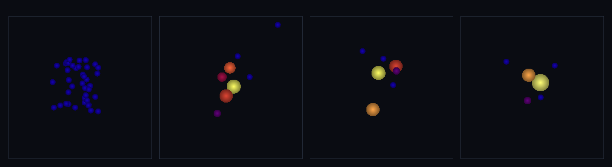

# step_0043 — 강착 세계: 중력+소산 접촉+합치기를 한 세계로 조립 (구체 세계 SW1+SW2, 새 엔진 없음)

> [design/sphere-world.md](../../design/sphere-world.md) §0·§6 SW1·SW2 — "구체는 합쳐져 더 큰 구체가 된다". 가진 부품(중력 0028 + 접촉 반발·소산 0037 + 합치기 0036)을 *한 세계*에서 함께 굴려 **창발 강착**을 보인다. **0035 "새 engine 없음" 선례와 동형 — 조립이 곧 창발 무대.**

## 논의 — 이 step 의 의미 (사용자 관찰에서 출발)

**문제 제기**: "모여서 커지면 하나로 합쳐 단순화한다"는 비전이 진행되고 있나? 화면에선 *공이 겹쳐 비비기만* 하고 시뮬레이션이라 할 현상이 없다.

**진단(코드로 측정)** — 정직한 격차였다:
1. **기본 화면(0040~0042)은 SPH 가스** — 입자가 *겹쳐야* 밀도·압력이 계산되는 게 정상(겹침=의도). 합치기가 아니다.
2. **합치기 임계가 중력 낙하 속도를 못 따라감** — 중력으로 끌려온 구체가 닿는 순간 상대속도 **20.89** vs vstick **0.9**(23배 초과). 게다가 0036 장면엔 접촉 반발·소산이 없어 *안 붙은 빠른 구체는 그냥 통과*(겹침·비비기). 중력만인 구름은 수축→통과→팽창 **무한 진동**(충돌 없는 N체).
3. **법칙들이 따로 논다** — 합치기(0036)·접촉 소산(0037)·중력이 *한 장면에 같이 돈 적이 없다.* 진짜 현상(낙하E가 소산으로 식어→느려진 접촉이 합쳐져→천체로 강착)은 셋이 **함께** 돌아야 나온다.

**이 step 이 하는 일**: 부품을 조립한다. 작은 구체 40개 구름에 **중력 + 접촉(반발+소산) + 합치기**를 함께 굴리면 — 무너지며 충돌·소산으로 식고, 느려진 접촉이 합쳐져 **몇 개의 큰 천체로 강착**한다(미행성→행성). **새 엔진 법칙 없음**(0035 와 같은 *조립 step*).

- **무엇으로 검증?** ① 강착(N 40→몇 개) ② 질량·운동량 정확 보존(merge·contact·gravity 모두 쌍 보존) ③ 소산=시간의 화살(internalE 단조↑·비가역) ④ **대조**: 소산 없으면(중력만) N·내부E 불변 = 현상엔 소산이 필수 ⑤ 한 점 안 됨(각운동량→몇 천체·궤도) ⑥ 결정론. + 눈(40 작은 구체→몇 개 큰 천체·강착열로 밝아짐).
- **무엇이 보존/변하나?** 보존: **질량·운동량**(기계 정밀도). 변함(비가역): internalE 단조↑(낙하E→열)·개체 수↓·천체 크기↑. **정직한 한계**: 각운동량 때문에 한 점이 아니라 몇 천체로 정착(물리적으로 옳음)·합쳐진 천체끼리는 더는 안 닿아 추가 소산이 멈춤(궤도 N체).

## 구현 — viewer 장면 0043 + verify (engine 변경 0)

엔진 한 줄도 안 건드림 — `applyEntityGravity`(0028)·`applyEntityContact`(0037)·`stepEntities`(0027)·`mergeEntities`(0036)를 `advance` 한 바퀴에서 **순서대로** 호출:

```
applyEntityGravity → applyEntityContact(반발+소산) → stepEntities → mergeEntities
```

파라미터(시뮬 상수): G=0.5·soft=N·0.085 / 접촉 stiffness=4·damping=25(강한 소산) / 합치기 vstick=3.0. 낮은 stiffness(merge 방해↓) + 강한 damping(빠른 낙하도 식힘) + 넉넉한 vstick → 식어 느려진 접촉이 합쳐진다. 약한 접선 속도(각운동량)로 한 점 붕괴 대신 궤도 천체를 만든다.

## 검증

**(a) 수치 — `node HTJ/steps/step_0043/verify.js` → PASS (6/6)**

```
PASS  강착 — 40개 구름이 소산·합치기로 몇 천체로 줄어든다(N↓) = 개체 40 → 6(크게 줆·강착)
PASS  질량·운동량 정확 보존 — merge·contact·gravity 모두 쌍 보존(합산/뉴턴3) = M 960.0→960.0 · ΣP (28.17,4.49)→(28.17,4.49)
PASS  소산 = 시간의 화살 — internalE 단조↑(낙하E → 접촉 감쇠+강착열·비가역) = 내부E 120 → 2291(단조↑·소산+강착열)
PASS  대조: 소산 없으면 현상 없음 — 중력만이면 N 불변·내부E 불변(충돌 없는 진동) = 중력만 N 40→40·U 120(불변) vs 강착 N→6·소산 발생
PASS  한 점 안 됨 — 각운동량 있는 강착은 한 덩어리 아닌 몇 천체로 정착(N≥2) = 정착 천체 6개(≥2·궤도·design §0 "더 큰 구체"들)
PASS  결정론 — 같은 입력 → 같은 강착 결과 지문 = 0x16c87bee
```

- 전 step verify **43/43 회귀 0**(엔진 변경 0) · `node tools/check-viewer.js` PASS(0043 STEPS 등록).
- **대조 검증이 핵심**: 같은 구름이 *중력만*이면 40개 그대로·내부E 120 그대로(영원히 진동) — *소산을 더하면* 40→6·내부E 120→2291. "비비기만" 하던 까닭이 소산·합치기의 *부재*였음을 수치로 못박는다.

**(b) 눈 — `steps/step_0043/capture.png`** (engine 직접 PNG, 4 프레임 top-down·크기=질량·색=온도)



작은 구체 40개(파랑=차가움)가 무너지며 **합쳐져 몇 개의 큰 천체가 된다**: 개체 수 **40 → 8 → 7 → 6**(단조↓·강착)·질량 **960 불변**(정확 보존)·운동량 ΣP_x **28.17 불변**(정확 보존)·내부E **120 → 1534 → 1686 → 2284**(소산+강착열↑). 합쳐진 천체가 커지고 **노랑/주황으로 달아오른다**(낙하E→열). 수치 검증의 가설("모여서 합쳐짐·보존·소산")이 화면에 그대로 보인다.

## 쉽게 풀어 쓴 설명

그동안 화면에서 "공들이 겹쳐 비비기만" 한 데는 두 가지 이유가 있었다. 첫째, 기본 화면이 *가스*(SPH)라 — 가스는 원래 입자가 겹쳐야 계산되니 비비는 게 정상이었다. 둘째, "모여서 합쳐짐" 법칙은 만들어 뒀지만(0036) 그게 *중력·충돌과 따로 놀아서*, 막상 중력으로 빠르게 끌려온 공들은 너무 빨라 안 붙고 그냥 통과해 버렸다(붙는 기준속도의 23배로 도착). **이번엔 셋을 한 세계에 같이 넣었다**: 중력이 끌어당기고 → 부딪치면 *튕기면서 동시에 그 충돌 에너지를 열로 식히고*(소산) → 식어서 느려진 것들이 *합쳐진다*. 그러자 작은 공 40개가 무너져 **몇 개의 큰 천체로 뭉쳤다**(40→6). 이게 바로 *미행성이 부딪치고 합쳐져 행성이 되는* 방식이고, 사용자가 말한 "모여서 커지면 합쳐 단순화"의 실현이다. 핵심 증거는 **대조**다: 똑같은 구름이 *충돌·합치기 없이 중력만* 있으면 40개 그대로 영원히 출렁이고, *소산을 더하니까* 비로소 합쳐졌다 — 현상이 없던 건 법칙이 틀려서가 아니라 *조립이 안 돼서*였다. (한 덩어리로 안 뭉치고 몇 개로 갈라져 서로 도는 건 *맞는* 거다 — 각운동량 때문에 행성도 하나로 안 합쳐지고 여럿이 궤도를 돈다.)

## 이 step 이 목적에 남긴 것 + 다음 연결

구체 세계가 처음으로 **여러 법칙이 함께 굴러 창발하는 살아있는 무대**가 됐다 — SW1(합치기)·SW2(접촉 소산)·중력이 조립돼 *강착=천체 형성*을 낳는다. "모여서 합쳐 단순화"(적응 LOD 의 물리판)가 화면에서 실제로 보인다. 사용자가 짚은 공백을 메운 step.

**다음 후보**:
- **강착 + 쪼개기(SW3) 왕복** — 빠른 정면충돌은 깨지고(파편) 느린 건 합쳐지는 *임계가 가르는* 완전한 왕복을 한 세계에서(지금은 소산이 식혀 합침 우세).
- **SW5 SPH 잇기** — 능동 열압력(P=(γ−1)ρu)·점성으로 가스까지 같은 무대에(0042 다음 벽돌).
- **추가 소산 채널** — 합쳐진 궤도 천체끼리 더 정착시키려면(조석·복사) 측정된 필요 후.

**정직한 한계(이 단위)**: ① 새 법칙 없음 — *조립*이라 각 부품의 한계를 그대로 물려받음(접촉=법선만·합치기 모양 손실). ② 각운동량→몇 천체로 정착(한 점 아님·물리적으로 옳음). ③ 합쳐진 천체끼리는 더는 안 닿아 추가 소산 멈춤(궤도 N체). ④ 파라미터는 소산이 합침을 이기게 튜닝(SW3 쪼개기와의 경쟁은 다음). 여기선 *부품 조립 한 무대*만.
