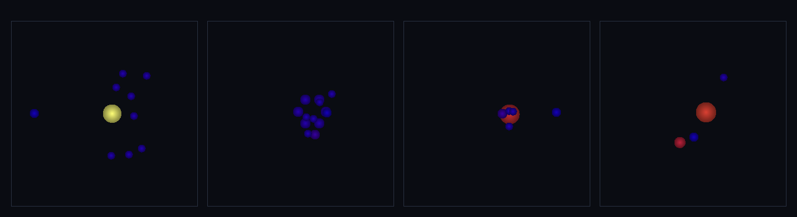

# step_0044 — 강착↔파편 왕복: 임계가 합침/깨짐을 가른다 (구체 세계 SW3 조립, 새 엔진 없음)

> [design/sphere-world.md](../../design/sphere-world.md) §6 SW3·§4 — "상대 속도가 임계를 넘으면 깨지고, 못 넘으면 붙는다 — **author 하지 않고 임계가 가른다**". 강착 세계(0043)에 쪼개기(0038)를 더해 *한 세계*에서 합치기↔쪼개기 **왕복을 닫는다**. 0043 처럼 새 엔진 법칙 없는 *조립 step*.

## 논의 — 이 step 의 의미

0043 강착 세계는 *합침*만 보여줬다(소산이 식혀 합침 우세). 그 자리에 약속된 다른 반쪽 — **빠른 충돌은 깨진다** — 을 더해 왕복을 완성한다. advance 한 바퀴:

```
gravity → contact(반발+소산) → step → fragment(빠름→파편) → merge(느림→합침)
```

- **세계를 어떻게 변형?** 고속 충돌체가 뜨거운 천체에 박히면 상대 운동E 가 임계(shatterKE)를 넘어 **파편으로 폭발**(N↑)하고, 흩어진 파편이 중력+소산으로 식어 **느려지면 다시 합쳐진다**(N↓·재강착). *같은 두 법칙(합치기·쪼개기)이 충돌 속도에 따라 갈린다* — author 없이 임계가 행동을 가른다.
- **무엇으로 검증?** ① 임계가 가른다(같은 코드 경로 frag→merge, 느림→합침·빠름→파편) ② 왕복 보존(질량·운동량 정확) ③ **포섭**: shatterKE=∞ 면 0043 강착(merge-only)과 *동일*(보수적 확장) ④ 재강착 왕복(N 폭발↑→재강착↓·비단조) ⑤ 안전·flicker 없음(느린 2체 안 깸·깬 파편 분산>vstick 라 같은 루프 재합침 안 함) ⑥ 결정론. + 눈(천체→파편 폭발→재강착).
- **무엇이 보존/변하나?** 보존: **질량·운동량**(frag·merge·contact·gravity 모두 쌍 보존). 변함: 개체 수(폭발↑↔재강착↓·비단조). **핵심 발견 = 임계 분리**: 파편 분산 속도 > vstick 라야 *깨자마자 재합침(flicker)* 없이 왕복이 닫힌다(merge·shatter 두 임계 띠가 안 겹치게 분리해야 함).

## 구현 — viewer 장면 0044 + verify (engine 변경 0)

엔진 한 줄도 안 건드림 — `applyEntityGravity`(0028)·`applyEntityContact`(0037)·`fragmentOnImpact`(0038)·`mergeEntities`(0036)를 `advance` 한 바퀴에서 호출. `fragmentOnImpact` 를 `mergeEntities` *앞*에 둔다(빠름 먼저 깨고 → 남은 느림 합침). 파라미터(시뮬 상수): 동일 질량 쌍이면 shatterKE=80·vstick=1.2 → 깸 속도 √(2·80/μ)=1.41 > vstick 1.2 라 merge(<1.2)·bounce(1.2~1.41)·shatter(>1.41) 가 겹치지 않게 분리(flicker 방지). 장면(충돌체)은 shatterKE=40·n=6·dispersalFrac=0.85(파편이 분산>vstick 로 흩어짐).

## 검증

**(a) 수치 — `node HTJ/steps/step_0044/verify.js` → PASS (6/6)**

```
PASS  임계가 가른다 — 느린 쌍은 합쳐(N↓)·빠른 쌍은 깨짐(N↑)·속도만 갈림 = 느림 N 2→1(합침) · 빠름 N 2→12(파편·shatter 2)
PASS  왕복 보존 — frag·merge·contact·gravity 모두 쌍 보존 → 질량·운동량 정확 불변 = M 552.0→552.0 · ΣP (219.77,24.68)→(219.77,24.68)
PASS  포섭(항등) — shatterKE=∞ 면 0043 강착(merge-only)과 동일(쪼개기 추가=보수적 확장) = merge-only N→4 = frag(∞) N→4(느린 세계는 안 깸)
PASS  재강착 왕복 — 고속 충돌체가 천체 부숨(N 폭발) → 파편 중력+소산으로 다시 합침(N↓) = N 시작 10 → 폭발 15 → 재강착 4(비단조·shatter 496)
PASS  안전·flicker 없음 — 느린 2체 안 깸(shatter 0)·깬 파편 분산>vstick 라 즉시 재합침 안 함 = 느림 shatter 0 · 깸 후 12개 → merge 후 12개(>2·재합침 안 함)
PASS  결정론 — 같은 입력 → 같은 왕복 결과 지문 = 0x75c31c34
```

- 전 step verify **44/44 회귀 0**(엔진 변경 0) · `node tools/check-viewer.js` PASS(0044 STEPS 등록).
- **포섭 검증이 핵심 안전망**: shatterKE=∞(절대 안 깸)면 0043 강착과 *글자 그대로 동일*(merge-only N→4 = frag(∞) N→4) — 쪼개기를 더해도 *느린 세계는 그대로 합쳐진다*(보수적 확장·기존 동작 회귀 0).

**(b) 눈 — `steps/step_0044/capture.png`** (engine 직접 PNG, 4 프레임 top-down·크기=질량·색=온도)



뜨거운 천체(노랑=강착열)에 왼쪽에서 고속 충돌체가 날아와 박힌다: 개체 수 **10 → 13 → 6 → 4**(최대 15·**폭발↑ 했다가 재강착↓**·비단조)·질량 **552 불변**·운동량 ΣP_x **219.77 불변**(정확 보존). 2번째 프레임에서 큰 천체가 **파편 무리로 흩어지고**(깨짐), 3~4번째에서 파편이 다시 끌려 **몇 개의 큰 천체로 재강착**(빨강)한다. 수치 검증의 가설("빠름→깨짐·느림→합침·재강착·보존")이 화면에 그대로 보인다.

## 쉽게 풀어 쓴 설명

앞 step(0043)에선 작은 공들이 *모여서 합쳐지는* 것만 봤다. 그런데 현실에선 반대도 있다 — **세게 부딪치면 깨진다**(소행성 충돌처럼). 이번엔 그 반쪽을 같은 세계에 넣었다. 핵심은 *무엇이 합치고 무엇이 깨지는지를 우리가 정하지 않는다*는 것 — **충돌 속도가 정한다**. 느리게 닿으면 합쳐지고, 임계보다 빠르게 박으면 깨진다. 그래서 고속 충돌체가 큰 천체에 박히자 **천체가 파편으로 터지고**(개체 수가 확 늘고), 흩어진 파편들은 다시 중력에 끌려 식으면서 **도로 합쳐졌다**(재강착). 깼다가 다시 모이는 *왕복*이 닫힌 것이다. 한 가지 중요한 발견: 깨진 파편이 *너무 느리게 흩어지면* 합치기 규칙이 즉시 도로 붙여버려 깜빡거린다(flicker). 그래서 "깨짐"과 "합침"의 속도 경계를 서로 안 겹치게 띄워야 — 깬 파편이 합치기 기준속도보다 빠르게 흩어지도록 — 왕복이 깔끔하게 닫힌다. 그리고 안전장치: *절대 안 깨지게* 설정하면 결과가 0043 강착과 글자 그대로 똑같다 — 쪼개기를 더해도 느린 세계는 그대로 합쳐진다.

## 이 step 이 목적에 남긴 것 + 다음 연결

구체 세계의 **합치기↔쪼개기 왕복이 한 세계에서 닫혔다** — 0036(합침)·0038(깸)·0043(강착 조립) 위에서, *임계가 author 없이 두 거동을 가른다*(design §4 의 정신). 충돌 강착과 충돌 파괴의 양면이 같은 무대에서 굴러, 세계가 더 풍부한 동역학(충돌 cascade·재강착)을 갖췄다.

**다음 후보**:
- **SW5 SPH 잇기** — 능동 열압력(P=(γ−1)ρu)·점성으로 가스까지 같은 무대에(0042 다음 벽돌·로드맵 본류).
- **충돌E→파편 분산 연결** — 지금 파편 분산E 는 부모 internalE 에서(0038 한계 계승). 충돌 운동E 를 직접 소비하게 하면 더 물리적(측정된 필요 후).
- **적응 LOD(SW4)와 강착 결합** — 관찰자 근거리만 fine 강착, 원거리는 coarse.

**정직한 한계(이 단위)**: ① 새 법칙 없음 — *조립*이라 부품 한계 계승(파편 분산E 가 internalE 에서·충돌E 직접 소비 아님·조각 수 n 고정·0038 한계). ② 재강착은 중력+소산 파라미터 영역에 의존(항상 깔끔히 닫히진 않음). ③ flicker 회피를 위해 임계 분리(파편 분산>vstick) 필요. ④ 충돌체는 장면이 author(행위성 아님). 여기선 *왕복 조립 한 무대*만.
