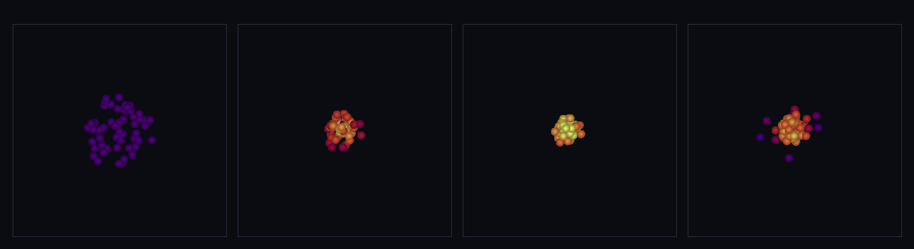

# step_0045 — SW5 능동 열압력: P=(γ−1)ρu 되먹임 (구체 세계 SW5 넷째 벽돌)

> [design/sphere-world.md](../../design/sphere-world.md) §6 SW5 — 0041(barotropic·u 무관)·0042(에너지 닫힘·u 가 힘에 안 먹임)의 *되먹임* 판. **0009(수동 온도)→0010(능동 열압력)의 SPH 판.** (긴 설명은 viewer `note` 0045 가 집.)

## 논의 (법칙 step)

- **세계를 어떻게 변형?** 압력이 *내부에너지에서 나온다* — 상태식 **P_i = (γ−1)·ρ_i·u_i**(u=internalE/질량). 압축이 u 를 데우고(0042) → 데운 u 가 P 를 키워(이 step) *더 세게 떠받친다*. 0041 압력 힘(Monaghan 대칭 쌍힘)+0042 에너지 닫힘(대칭 내부E식)을 한 함수에서 열 EOS 로 묶음(`sphThermalPressureForce`).
- **무엇으로 검증?** ① 열 EOS·되먹임(뜨거우면 더 센 힘·u 의존) ② 운동량 정확 보존 ③ 총E 닫힘(순간 전력 균형) ④ 항등/안전(u≤0→P=0) ⑤ 결정론. + 눈(찬 가스 붕괴→핫코어→단열 되튐).
- **무엇이 보존/변하나?** 보존: 운동량(대칭 쌍힘·기계 정밀도)·총E(KE↔u 닫힘·중력 PE 제외). 변함: u→P 되먹임으로 가스가 단열 지지. **0041 과의 차이**: EOS 가 u 의존 = 데운 가스가 더 센 압력(barotropic 은 u 무관).

## 구현 — `sphThermalPressureForce` (engine/htj-sph.js, 가법·신규 함수)

```
P_i = (γ−1)·ρ_i·u_i            (u_i = internalE_i/m_i·u≥0→P≥0)
a_i  = −Σ_j m_j (P_i/ρ_i² + P_j/ρ_j²) ∇_i W_ij                 (0041 운동량)
dU_i =  m_i·½ Σ_j m_j (P_i/ρ_i² + P_j/ρ_j²) v_ij·∇_i W_ij·dt     (0042 에너지)
```
같은 사전 속도로 a_i·dU_i 를 함께 계산해 적용 → 운동량 정확 + 순간 전력 균형(−S+S=0) 기계 정밀도. **u 가 P 에 들어가 되먹임**. 신규 함수·기존 호출처 없음 → 회귀 0(구조적). VERSION 3→4.

## 검증

**(a) 수치 — `node HTJ/steps/step_0045/verify.js` → PASS (5/5)**

```
PASS  열 EOS·되먹임 — 뜨거운 가스(u↑)가 찬 가스보다 더 센 압력 힘(P=(γ−1)ρu·u 의존) = 뜨거움 |Δp|=8.138e-1 > 차가움 |Δp|=8.138e-2(u 10배→힘 ↑·반발)
PASS  운동량 정확 보존 — 대칭 쌍힘(뉴턴3)·ΣP 기계 정밀도 불변 = ΣP (-5.176,2.388,-0.242) → (-5.176,2.388,-0.242)
PASS  총E 닫힘 — 압력이 KE 에 한 일 + 내부E 증가 = 0(순간 전력 균형·기계 정밀도) = Σv·Δp=8.486e-2 · ΔU=-8.486e-2 · 합=-1.43e-15(≈0)
PASS  항등/안전 — 단일/빈/지지 밖 무변화·u≤0 → P=0(음압 없음) = 단일 Δp 0 · 빈 [] · 멀리 Δp 0 · u=0 힘 0(P≥0)
PASS  결정론 — 같은 입력 → 같은 지문 = 0x2694e84
```
- 전 step verify **45/45 회귀 0**(신규 함수뿐) · `node tools/check-viewer.js` PASS(0045 등록). 되먹임이 u 에 선형(u 10배→힘 정확히 10배).

**(b) 눈 — `steps/step_0045/capture.png`** (engine 직접 PNG·`tools/htj-capture.js` 헬퍼·색=온도)



찬 가스(보라)가 무너지며 **압축으로 데워지고 핫코어(노랑)를 거쳐 되튄다**: rms **6.70 → 3.00 → 2.15(최소) → 3.40**(수축→되튐)·내부E U **12 → 36.5 → 53.2 → 35.9**(압축 데움↑·되튐서 식음)·운동E KE **30 → 24.7 → 14.2 → 26.7**(KE↔u 단열 교환)·운동량 ΣP_x **−3.547 불변**. 열압력이 중력 붕괴를 멈춰 한 점으로 안 찌부러지고 *단열 공에서 되튄다* — verify 가설("u→P 되먹임·단열 지지")이 화면에 그대로.

## 다음

SW5 가 **밀도(0040)→압력(0041)→에너지 닫힘(0042)→열압력 되먹임(0045)** 으로 격자 유체(0008→0010)의 골격을 SPH 로 갖췄다. 가스가 *별 코어처럼 단열로 스스로 지탱*한다.

**다음 = SW5 점성(충격 감쇠)** 또는 **격자 유체 은퇴 착수**(측정된 필요 후·design §5 난점 3). **정직한 한계(이 단위)**: 점성 없음(단열 진동이 안 식음)·평활길이 h 고정·이웃 O(N²)·격자 은퇴 안 됨. 여기선 *열압력 되먹임 한 법칙*만.
