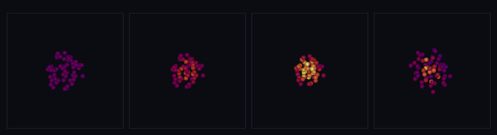

# step_0046 — SW5 점성(인공 점성·비가역 소산): bulk KE → 열 (구체 세계 SW5 다섯째 벽돌)

> [design/sphere-world.md](../../design/sphere-world.md) §6 SW5 / §5 난점 2 — 0041~0045 압력은 가역(데움↔식힘)이라 단열 진동이 안 식는다. Monaghan 인공 점성이 *접근하는* 쌍의 bulk 운동E를 열로 일방 소산해 진동을 식힌다. **0011(비가역 점성 소산·시간의 화살)·0037(DEM 접촉 감쇠)의 SPH 판.** (긴 설명은 viewer `note` 0046 이 집.)

## 논의 (법칙 step)

- **세계를 어떻게 변형?** SPH 인공 점성 Π_ij(Monaghan-Gingold)을 더한다 — **접근하는**(v_ij·r_ij<0) 입자 쌍에만 작용하는 소산 압력으로 상대운동을 깎고 그 bulk 운동E를 내부E로 *일방* 전환(`sphViscosity`). 0045 압력은 가역이라 단열 진동이 영원히 안 식음 → 점성이 그걸 식혀 *정착*시킨다.
- **무엇으로 검증?** ① 비가역 소산(접근→U↑·상대속도 깎임 / 멀어짐→무변화 = 단방향·시간의 화살) ② 운동량 정확 보존(대칭 쌍힘) ③ 총E 닫힘(KE 일+ΔU=0 전력 균형) ④ 항등/안전(α=0→early-return·멀어짐→Π=0) ⑤ 결정론. + 눈(점성 끄면 진동 영원·켜면 감쇠 정착).
- **무엇이 보존/변하나?** 보존: 운동량(±쌍힘·뉴턴3)·총E(KE↔u 닫힘). 변함: bulk KE → 내부E *단방향*(엔트로피↑). **0045 압력(가역)과 달리 점성은 오직 데우기만**.

## 구현 — `sphViscosity` (engine/htj-sph.js, 가법·신규 함수)

```
μ_ij = h (v_ij·r_ij) / (|r_ij|² + 0.01 h²)          (접근 v·r<0 → μ<0, 아니면 0=건너뜀)
Π_ij = (−α c̄_ij μ_ij + β μ_ij²) / ρ̄_ij             (μ<0 → 두 항 ≥0 → Π≥0)
a_i  = −Σ_j m_j Π_ij ∇_i W_ij                        (0041 과 같은 대칭 쌍힘 → 운동량 보존)
dU_i =  m_i·½ Σ_j m_j Π_ij v_ij·∇_i W_ij·dt          (0042 와 같은 대칭 에너지 → 총E 닫힘)
```
c̄=(c_i+c_j)/2 음속·ρ̄=(ρ_i+ρ_j)/2. 음속은 0045 열 EOS 정합 **c_i=√(γ(γ−1)u_i)**(뜨거우면 더 끈적). a_i·dU_i 를 한 쌍 루프에서 같은 사전 속도로 계산해 적용 → 운동량 정확 + 순간 전력 균형(KE 일+ΔU=0) 기계 정밀도. 그러나 Π≥0·접근 쌍 v_ij·∇_iW>0 → **ΔU≥0 = 오직 데움(시간의 화살)** = 0045 가역 압력과의 차이. opts `alpha`(=0 → early-return·회귀 0)·`beta`(기본 2α)·`gamma`(5/3)·`h`. 신규 함수·기존 호출처 없음 → 회귀 0(구조적). VERSION 4→5.

## 검증

**(a) 수치 — `node HTJ/steps/step_0046/verify.js` → PASS (5/5)**

```
PASS  비가역 소산(시간의 화살) — 접근 쌍은 데우고 상대운동 깎임 / 멀어지는 쌍은 무변화(단방향) = 접근 ΣU 4.000→6.602(↑)·상대속도 2.000→0.602(↓) · 멀어짐 무변화
PASS  운동량 정확 보존 — 대칭 쌍힘(뉴턴3)·ΣP 기계 정밀도 불변 = ΣP (1.436,-1.983,-2.209) → (1.436,-1.983,-2.209)
PASS  총E 닫힘 — 점성이 KE 에 한 일 + 내부E 증가 = 0(순간 전력 균형·기계 정밀도) = Σv·Δp(점성 일)=-3.523e+0 · ΔU=3.523e+0(>0 소산) · 합=5.33e-15(≈0)
PASS  항등/안전 — α=0 → 회귀 0·단일/빈/지지 밖 무변화 = α=0 ΣP·ΣU 불변 · 단일 Δp 0 · 빈 [] · 멀리(지지 밖) Δp 0
PASS  결정론 — 같은 입력 → 같은 지문 = 0x205b05c
```
- 전 step verify **46/46 회귀 0**(신규 함수뿐) · `node tools/check-viewer.js` PASS(0046 등록). 점성 일이 정확히 ΔU 로 닫힘(합 5.33e-15)·소산은 항상 데움(ΔU>0).

**(b) 눈 — `steps/step_0046/capture.png`** (engine 직접 PNG·`tools/htj-capture.js` 헬퍼·색=온도)



찬 가스(보라)가 중력으로 무너지며 **압축으로 핫코어(노랑)를 거쳐 데워지고**, 점성이 진동을 식혀 *따뜻한 공으로 정착*한다: rms **6.70 → 5.76 → 4.95 → 6.82**(묶인 채 숨쉬다 정착)·내부E U **12.0 → 16.6 → 24.6 → 15.4**·운동량 ΣP_x **−1.419 불변**. **대조(점성 켬 vs 끔)**: 후반 KE 진동 진폭 점성 켬 **2.2 < 끔 4.7**(감쇠)·최종 내부E 점성 켬 **15.3 > 끔 13.6**(소산 열 추가). 가역 압력만이면 진동이 안 식지만 점성이 *멈춰 세운다* — verify 가설("접근 쌍 KE→열·비가역")이 화면에 그대로.

## 다음

SW5 가 **밀도(0040)→압력(0041)→에너지 닫힘(0042)→열압력 되먹임(0045)→점성(0046)** 으로 격자 유체(0008→0013)의 골격을 거의 SPH 로 갖췄다 — 가스가 *데워지고 떠받쳐지고 식어 멎는다*(별 정착의 SPH 판).

**다음 = 격자 유체 은퇴 착수**(측정된 필요 후·design §5 난점 3·0023 교훈) 또는 SPH 가속(이웃 탐색 O(N²)→트리/그리드). **정직한 한계(이 단위)**: 평활길이 h 고정·이웃 O(N²)·격자 은퇴 안 됨. 여기선 *점성 한 법칙*만.
