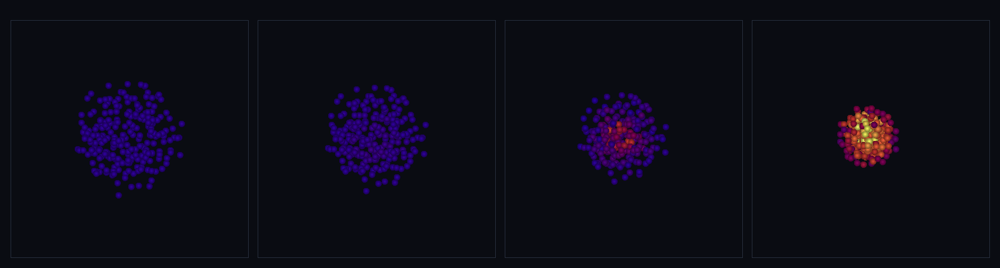

# step_0047 — SW5 이웃 탐색 가속: 셀 리스트로 O(N²)→O(N) (구체 세계 SW5 가속 벽돌)

> [design/sphere-world.md](../../design/sphere-world.md) §6 SW5 / §7 — SPH 합은 지지반경 2h 안 이웃만 기여(먼 쌍 W=0·∇W=0). 셀 크기=2h 격자로 27 이웃 셀만 훑어 가속. **0032 Barnes-Hut(중력 O(N log N))의 SPH·근거리 판.** 물리 불변 — brute 와 비트 동일. (긴 설명은 viewer `note` 0047 이 집.)

## 논의 (가속 = 순수 솔버 step·새 물리 0)

- **세계를 어떻게 변형?** 세계(물리)는 *안 변한다*. SPH 합은 지지반경 2h 안 이웃만 기여하는데 기본 경로는 O(N²) 모든 쌍을 본다. 셀 크기=2h 균일 격자에 입자를 버킷팅하면 이웃은 자기 셀+26 인접(27셀) 안에만 → 균일 밀도 O(N). 같은 쌍을 같은 순서로(이웃 오름차순·먼 쌍 0 기여) 봐 **brute 와 비트 동일**.
- **무엇으로 검증?** ① brute 와 정확 일치(밀도·압력·점성·열압력 비트 동일) ② 비용 O(N²)→O(N)(쌍 검사 수 측정) ③ 보존 불변(가속 경로 운동량·총E) ④ 항등/안전(grid 미지정→brute=기본·빈/단일·prebuilt grid=accelerate) ⑤ 결정론.
- **무엇이 보존/변하나?** 물리는 아무것도 안 변함(보존·결정론 brute 와 동일) — *비용만* 준다.

## 구현 — `sphNeighborGrid`·`sphNeighbors` + `opts.grid`/`opts.accelerate` (engine/htj-sph.js, 가법)

```
sphNeighborGrid: 셀 크기 2h 균일 격자 → Map(셀키→입자 인덱스 버킷)
sphNeighbors(i): 27 이웃 셀의 인덱스를 모아 오름차순 정렬(자기 포함)   // brute 와 같은 합 순서
eachPair(grid): grid 있으면 27셀 후보 쌍(i<j)만, 없으면 전체 O(N²)    // 사전식 순서 동일
```
5개 SPH 함수(`sphDensity`·`sphPressureForce`·`sphThermalEnergy`·`sphThermalPressureForce`·`sphViscosity`)에 `opts.grid`(prebuilt) / `opts.accelerate`(즉석 빌드) 경로를 단다. **기본(미지정)=brute → 닫은 step 회귀 0**. 27셀이 지지반경 2h 를 완전히 덮고(분리 ≤2h → 셀 차 ≤1), 먼 쌍은 W=0·∇W=0(정확 0) → 빠뜨리거나 더해도 합 동일 → **비트 동일**. VERSION 5→6.

## 검증

**(a) 수치 — `node HTJ/steps/step_0047/verify.js` → PASS (5/5)**

```
PASS  brute 와 정확 일치(비트 동일) — 밀도·압력·점성·열압력 가속 경로 = brute = 밀도 = · 압력 = · 점성 = · 열압력 =
PASS  비용 O(N²)→O(N) — 쌍 검사 수: grid 선형·brute 제곱 = N 64→512(×8) · grid 쌍 2016→19396(×9.6≈선형) · brute 쌍 2016→130816(×65≈제곱)
PASS  보존 불변(가속 경로) — 운동량 정확·총E 닫힘(KE 일+ΔU=0) = ΣP 불변 (-3.58,-6.80,1.63)→(-3.58,-6.80,1.63) · KE 일+ΔU=1.33e-15
PASS  항등/안전 — grid 미지정→brute·빈/단일 무탈·prebuilt grid=accelerate = 기본=brute = · 빈 [] · 단일 자기기여 true · prebuilt=accelerate true
PASS  결정론 — 가속 경로 같은 입력 → 같은 지문 = 0xe14d71b9
```
- 전 step verify **47/47 회귀 0**(기본 경로 비트 동일·refactor 안전) · `node tools/check-viewer.js` PASS(0047 등록). 비트 동일이라 brute 의 모든 보존·결정론을 그대로 물려받음.

**(b) 눈 — `steps/step_0047/capture.png`** (engine 직접 PNG·`tools/htj-capture.js` 헬퍼·색=온도)



가속의 *payoff* — **입자 240개** 큰 가스 구름을 가속 경로로 굴린다(중력+열압력+점성 한 무대): 가속 후보 쌍 **7320 ≪ brute 전체 28680(3.9× 절감)**·rms **11.24 → 10.23 → 8.34 → 5.73**(무너짐)·내부E U **48.0 → 52.4 → 82.7 → 232.4**(압축 데움)·운동량 ΣP_x **1.259 불변**. 찬 보라 구름이 무너지며 핫코어(노랑)로 데워진다 — brute 면 쌍이 폭증할 규모를 가속이 연다.

## 다음

SW5 가 밀도·압력·에너지·열압력·점성에 더해 **이웃 탐색 가속**으로 *큰 가스 구름*을 감당한다 — design §6 SW5 "구체 가스 구름"·"비용을 관찰 디테일에 묶기"의 한 발.

**다음 = 적응 평활길이 h**(밀도 변화 큰 영역·grad-h) 또는 **격자 유체 은퇴 착수**(측정된 필요 후·design §5 난점 3). **정직한 한계(이 단위)**: 균일 밀도 가정(국소 과밀이면 한 셀에 몰림)·평활길이 h 고정·격자 은퇴 안 됨. 여기선 *이웃 탐색 가속 한 가지*만(새 물리 0).
