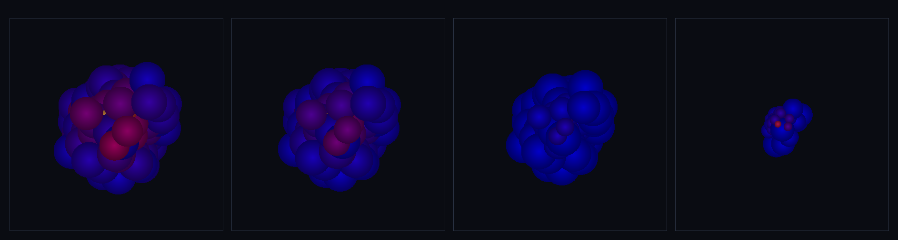

# step_0048 — SW5 적응 평활길이 h: 분해능이 밀도를 따라간다 (구체 세계 SW5 벽돌)

> [design/sphere-world.md](../../design/sphere-world.md) §6 SW5 / §4 — 고정 h 는 밀도가 자릿수로 변하는 붕괴 코어를 과평활/희박부 미분해. h_i 를 국소 밀도에 묶어 *이웃 수를 일정*하게: **h_i = η(m_i/ρ_i)^⅓** 자기일관. **SW4 적응 LOD(분해능이 물질을 따라감)의 SPH·연속판.** (긴 설명은 viewer `note` 0048 이 집.)

## 논의 (법칙 step·새 법칙 하나·수동 측정)

- **세계를 어떻게 변형?** 지금까지 SPH 의 평활길이 h 는 전 입자 공통 상수였다. 입자마다 `h_i = η(m_i/ρ_i)^⅓` 로 *자기 분해능*을 갖게 한다 — 조밀하면 좁은 h(촘촘히 분해)·희박하면 넓은 h → 이웃 수 일정. ρ_i 가 h_i 에 의존하니 **자기일관**(고정점 반복)으로 푼다.
- **무엇으로 검증?** ① 자기일관 수렴(h_i=η(m_i/ρ_i)^⅓ 잔차→0) ② 밀도 적응=이웃 수 일정(고정 h 대비 CoV↓·코어 h<헤일로 h) ③ 항등(균일 밀도→균일 h) ④ 측정만(운동량·내부E·위치 불변·신규 함수→회귀0) ⑤ 결정론.
- **무엇이 보존/변하나?** 0040 밀도처럼 *수동 측정* — `a.h`·`a.density` 만 써넣고 **힘은 안 만든다**(신규 함수·호출처 없음 → 구조적 회귀 0). 운동량·총E·위치 불변.

## 구현 — `sphAdaptiveH` (engine/htj-sph.js, 가법·VERSION 6→7)

```
입자 i 마다 고정점 반복(감쇠 불필요·단조 수렴):
  ρ_i = Σ_j m_j W(r_ij, h_i)          // 현재 h 로 밀도
  h_i ← η (m_i/ρ_i)^⅓                 // 이웃 수 노브 η
  |Δh|/h < tol 이면 멈춤
최종 h 로 ρ 재계산 → (h_i, ρ_i) 진짜 자기일관 쌍
```
opts: `{ eta(1.3), h0(1), iters(30), tol(1e-5) }`. 따뜻한 시작(`a.h` 재사용) 지원. 적응-h *힘*(대칭 커널·grad-h Ω 보정)은 후속 벽돌 — 이 step 은 측정만.

## 검증

**(a) 수치 — `node HTJ/steps/step_0048/verify.js` → PASS (5/5)**

```
PASS  자기일관 수렴 — h_i = η(m_i/ρ_i)^⅓ (잔차→0) = max 상대 잔차 1.40e-5
PASS  밀도 적응 — 코어 h < 헤일로 h · 이웃 수 CoV 적응 ≪ 고정 = 코어 h 0.65 < 헤일로 h 3.93(6.0×) · 이웃수 CoV 적응 0.41 vs 고정 0.88
PASS  항등 — 균일 밀도 → 내부 h 균일 = 내부(3³) h CoV 0.00e+0 · h≈1.301
PASS  측정만 — 위치·운동량·내부E 불변 · 빈/특이 무탈 = 불변 true · 빈 [] · 단일 유한(h=2.5e+8)
PASS  결정론 — 같은 입력 → 같은 h 지문 = 0x19dbdd81
```
- 전 step verify **48/48 회귀 0** · `node tools/check-viewer.js` PASS(0048 등록).

**(b) 눈 — `steps/step_0048/capture.png`** (engine 직접 PNG·`tools/htj-capture.js`·**원 반지름 = h_i**·색=밀도)



무너지는 구름(중력+고정-h 열압력으로 운동): rms **10.91 → 10.00 → 7.99 → 2.99**(붕괴)·코어 최소 h **3.39 → 2.73 → 1.21 → 0.80**(조밀해질수록 커널 줄어듦=분해능 4× 예리화)·h 범위 hmax/hmin **2.9 → 3.4 → 7.0 → 5.6**(코어↔헤일로 분해능 분화). 평활 커널이 코어에서 작아지고 헤일로에서 큰 게 눈에 보인다 — verify 의 "분해능이 밀도를 따라감"이 화면에 그대로.

## 다음

SPH 분해능이 *물질을 따라간다* — SW4 적응 LOD 가 입자 합치기/쪼개기로 한 일을, SW5 가 평활길이로 연속화. **다음 = 적응-h 힘**(대칭 커널 h_ij·grad-h Ω 보정으로 압력·점성을 가변 h 에서 운동량·에너지 일관) 또는 **격자↔SPH 정성 일치 검증**(격자 은퇴의 전제·SW5 verify gate). **정직한 한계(이 단위)**: 측정만(힘 미연동)·외톨이 입자 h 발산(이웃 없음·물리적)·격자 은퇴는 SW5 최후(측정된 필요 후).
