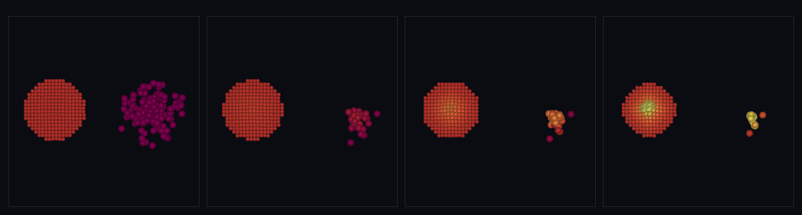

# step_0050 — 격자 ↔ 구체(SPH) 정성 일치 (SW5 verify gate · 격자 은퇴의 전제)

> [design/sphere-world.md](../../design/sphere-world.md) §6 SW5 — "구체 떼가 가스처럼 거동·보존·**격자 결과와 정성 일치**". SPH 가 이제 압력(0041)·에너지 닫힘(0042)·능동 열압력(0045)·점성(0046)·확산(0049)을 갖췄다. 이 step 은 *새 법칙이 아니라* 두 substrate 를 같은 시나리오로 돌려 **창발 물리가 일치**하는지 본다 = 격자 은퇴(SW5 최후·§5 난점 3·4)의 전제(측정된 필요).

## 논의 (조립/관찰 step·새 engine 법칙 0)

- **세계를 어떻게 변형?** 변형 없음 — 가진 두 substrate(격자 유체 0002~0013 ↔ 구체 SPH 0040~0049)를 **같은 물리 시나리오**(자기중력 가스 붕괴)로 나란히 굴려, 둘이 *같은 창발 시그니처*를 내는지 관찰한다. 격자=Eulerian(공간 고정 칸·물질이 칸 사이로 흐름)·구체=Lagrangian(물질 따라 점이 움직임) — 표현이 정반대인데도 거동이 같아야(§2).
- **무엇으로 검증?** ① 격자 붕괴+가열+보존 ② SPH 붕괴+가열+보존 ③ **정성 일치**(두 substrate 가 같은 시그니처: 붕괴=밀도↑ + 코어 압축 가열=온도↑) ④ 결정론.
- **무엇이 보존/변하나?** 각 substrate 질량·순 운동량 정확 보존(파이프라인). 각 연산자의 에너지 닫힘은 *부품 verify*(0041/0042/0045·0007/0010)가 이미 보증 → 조립 step 은 중복 검증 안 함(skill). 총E=KE+u 는 중력이 PE→KE 일을 해 *증가*가 맞다(중력 PE 미포함).

## 구현 — verify.js 가 두 substrate 를 직접 조립(engine 변경 0·구조적 회귀 0)

```
격자: createWorld → 가우시안 밀도 블롭 + 균일 T → [applyGravity + applyThermalPressure + advect]×24
구체: 가스 구체 떼(안쪽 속도) → [applyEntityGravity + sphThermalPressureForce + stepEntities]×40
측정: 격자=중심 셀 ρ·T / SPH=최대 sphDensity·코어 u  → 둘 다 붕괴(ρ↑)+가열(T↑) 인지
```

## 검증

**(a) 수치 — `node HTJ/steps/step_0050/verify.js` → PASS (4/4)**

```
PASS  격자 붕괴+가열+보존 — 중심ρ↑·중심T↑·질량/운동량 보존 = 중심ρ ×70.5 · 중심T ×11.9 · 질량 2050.85→2050.85 · |ΣP| 4.3e-13
PASS  SPH 붕괴+가열+보존 — 최대ρ↑·코어u↑·질량/운동량 보존 = 최대ρ ×1.84 · 코어u ×2.26 · 질량 120→120 · |ΣP| 2.926→2.926(보존)
PASS  정성 일치 — 격자·SPH 둘 다 붕괴+코어 가열(SW5 gate) = 격자[붕괴 true·가열 true] · SPH[붕괴 true·가열 true]
PASS  결정론 — 격자·SPH 같은 입력 → 같은 지문 = 격자 0xac4a3c1f · SPH 0xbc1b9218
```
- 전 step verify **50/50 회귀 0** · `node tools/check-viewer.js` PASS(0050 EXEMPT — 아래).

**(b) 눈 — `steps/step_0050/capture.png`** (engine 직접 PNG·한 패널에 좌=격자 슬라이스·우=SPH 입자 나란히·색=온도)



자기중력 가스 붕괴를 두 substrate 나란히: 격자 중심ρ **1.97 → 44.17**·중심T **0.30 → 0.73**(Eulerian·footprint 유지하며 중심 가열=노랑 코어) / SPH 최대ρ **0.110 → 0.211**·코어u **0.080 → 0.225**(Lagrangian·눈에 띄게 수축하며 코어 가열). **표현은 정반대(격자 칸 vs 자유 구체)인데 둘 다 붕괴+코어 가열** — design §2 의 격자↔구체 대비가 그대로, SW5 "정성 일치" gate 통과.

## 닫기 — viewer EXEMPT 사유

조립/관찰 step(새 장면 없음): 산출물이 *격자↔SPH 나란히 비교* capture.png 이고, 두 substrate 는 이미 각자 갤러리 live(격자 0008~0013·SPH 0045~0049). 단일 substrate live 장면은 0045/0049 중복 → `tools/check-viewer.js` EXEMPT 등재(0023/0032 비교 산출물 류).

## 다음

**SW5 의 verify gate 통과 — 구체 SPH 가 격자 유체의 핵심 거동(자기중력 붕괴→코어 가열)을 정성 재현**. 이로써 *격자 은퇴*(SW5 최후·design §5 난점 3·4)의 전제(측정된 필요)가 섰다. **다음 = 적응-h 힘**(0048 측정을 압력·점성·전도에 연동·대칭 커널·grad-h) 또는 **격자 은퇴 착수**(가법적 한 벽돌씩·격자는 SW5 완료까지 비계 공존). **정직한 한계(이 단위)**: 정량 *일치*가 아닌 정성(시그니처) 일치(단위·스케일 다름)·중력 소프트닝/BC 등 미시 차이는 남음·격자 은퇴는 아직 안 함.
