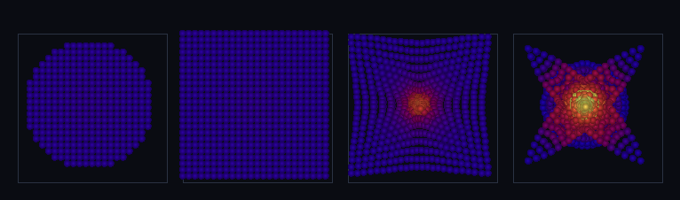

# step_0051 — SW5 격자 은퇴 첫 벽돌: 격자 유체 → SPH 입자 이주

> [design/sphere-world.md](../../design/sphere-world.md) §6 SW5 — "격자 유체를 구체로 이주 → 격자 은퇴". 0050 으로 SPH 가 격자 핵심 거동을 정성 재현함이 *측정*됐다(전제·0023 교훈). 이 step 은 그 **이주 메커니즘** = `fluidToParticles`: 격자장(ρ·운동량·내부E)을 셀마다 SPH 입자 하나로 재버킷팅 = **0026 promote(덩어리→개체)의 *유체 전체* 판**. (긴 설명은 step 문서가 집 — viewer EXEMPT.)

## 논의 (법칙 step·이주 메커니즘 하나)

- **세계를 어떻게 변형?** 격자(Eulerian·칸 고정) 위 연속 유체장을 *셀마다 SPH 입자 하나*로 옮긴다. 셀 부피 dV=1(격자 단위)이라 셀 i 의 보존량이 그대로 입자 양: 위치=셀 중심·질량 m=ρ_i·운동량 p=(g_x,g_y,g_z)_i·내부E=u_i·속도 v=p/m·KE=½|p|²/m. 진공 셀(ρ≤0)은 건너뛰어 *희소화*(빈 곳엔 구체 없음·Lagrangian).
- **무엇으로 검증?** ① 변환 정의·완전성·희소화 ② 질량·운동량·내부E·KE 정확 보존(단순 재버킷팅·Δ=0) ③ 속도 일치(v=g/ρ) ④ 이주 후 SPH 정합(밀도/압력 정상·보존) ⑤ 결정론.
- **무엇이 보존/변하나?** 단순 재버킷팅이라 질량·운동량·내부E·KE **정확 보존**(진공 셀 기여 0). 표현만 격자→입자로 바뀐다(모양 손실 없음 — 셀↔입자 1:1).

## 구현 — `fluidToParticles(world, opts)` (engine/htj-sph.js, 가법·VERSION 8→9)

```
셀 i (ρ_i > threshold) 마다 입자 1개:
  pos = (x,y,z) · mass = ρ_i · p = (mom_x,mom_y,mom_z)_i · internalE = therm_i
  KEcm = ½|p|²/m · energy = KEcm + internalE · radius = (3/4π)^⅓ (부피1 등가)
ρ_i ≤ threshold(진공) → 건너뜀(희소화)
```
세계(읽기 전용·htj-world import 없음·fields 만 읽음) → 새 입자 배열 반환. 신규 함수·기존 호출처 없음 → 구조적 회귀 0. 이주 후 입자는 SPH 힘(0041~0049)으로 자유로이 굴러간다.

## 검증

**(a) 수치 — `node HTJ/steps/step_0051/verify.js` → PASS (5/5)**

```
PASS  변환 정의·완전성·희소화 — ρ>0 셀마다 입자 1개·진공 셀 0 = 입자 3 = 점유 셀 3(64셀 중) · (1,1,1): m=4 px=2 u=5
PASS  정확 보존 — 질량·운동량·내부E·KE = 격자 장 총합(Δ=0) = 질량 Δ0.0e+0 · 운동량 Δ0.0e+0 · 내부E Δ0.0e+0 · KE Δ0.0e+0
PASS  속도 일치 — 입자 v=p/m = 격자 셀 v=g/ρ = max |Δv_x| 0.00e+0
PASS  이주 후 SPH 정합 — 밀도/압력 정상(NaN 없음)·운동량 보존 = 밀도 정상 true · 압력 후 정상 true · 운동량 보존 Δ5.7e-16
PASS  결정론 — 같은 세계 → 같은 입자 지문 = 0x264318a
```
- 전 step verify **51/51 회귀 0** · `node tools/check-viewer.js` PASS(0051 EXEMPT — 아래).

**(b) 눈 — `steps/step_0051/capture.png`** (engine 직접 PNG·4 패널 바통 패스·색=온도)



격자 유체 블롭 → ② 변환 직후 SPH 입자(같은 분포=바통 패스) → ③④ 입자가 SPH 로 *자유 붕괴*(격자가 못 하던 Lagrangian·4갈래 caustic=자유낙하 특징·핫코어 형성). **이주 정확 보존**: 질량 1774.37→1774.37·|ΣP| 0→0·내부E 553.47→553.47(13824 셀→13824 입자·Δ≈0). 이주 후 최대ρ **2.57 → 25.92 → 18.17**(자유 붕괴+압력 되튐) — 격자에선 칸에 갇혔던 유체가 이제 구체로 자유로이 굴러간다.

## 닫기 — viewer EXEMPT 사유

전체 장 변환은 N³ 입자(24³=13824)라 live O(N²) 뷰어엔 과중, 이주 후 장면도 기존 SPH 입자 장면(0045/0049)과 동류. 산출물이 *바통 패스* 4패널 capture 이고 mechanism 검증은 capture.js(0026 promote 류) → `tools/check-viewer.js` EXEMPT. live 이주 장면은 viewer SPH 가속(0047)+threshold 배선 시 후속.

## 다음

**격자 은퇴의 토대 = 이주 메커니즘이 섰다** — 격자 유체를 보존하며 구체로 옮길 수 있다. **다음 = 격자 은퇴 다음 벽돌**: ① 자동 이주 트리거(0026 autoPromote 류·격자 영역이 일정 조건이면 SPH 로 이주) ② viewer 격자 장면을 SPH 로 점진 대체(SPH 가속+threshold 배선) ③ 또는 적응-h 힘(SPH 정밀도 마감). **정직한 한계(이 단위)**: 전체 장 변환은 N³ 입자(threshold 로 희소화 가능하나 그만큼 질량 손실)·이주는 일방(격자→입자)·자동 트리거/역이주는 후속·격자는 아직 비계로 공존.
