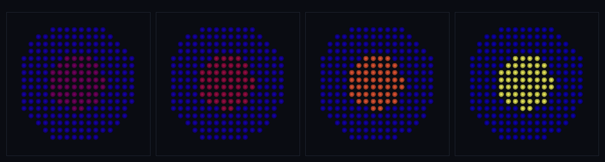

# step_0053 — SW5 점화: 충분히 뜨거우면 불붙어 빛난다 (별 vs 별 아님)

> [design/sphere-world.md](../../design/sphere-world.md) §6 SW5 — 0052 복사는 열의 *출구*(sink). 이 법칙은 열의 *입구*(source) = **점화** = **0004(임계 방출=별)·0003(potential→energy)의 SPH 판**. 0052 복사와 짝지으면 발열↔복사 균형 → 별이 virial 정상상태에서 빛난다. (긴 설명은 viewer `note` 0053 이 집.)

## 논의 (법칙 step·새 법칙 하나)

- **세계를 어떻게 변형?** 충분히 뜨거운(u≥uCrit) 입자가 핵융합으로 불붙어 연료를 열로 바꾼다: `burn = min(fuel, rate·m·dt)`, internalE += burn, fuel −= burn. 계의 첫 에너지 *source*(0052 는 sink). 임계 하나가 별과 가스를 가른다(author 없이).
- **무엇으로 검증?** ① 점화 정의·임계(뜨거운 것만 발열) ② 연료↔열 보존(Σ(fuel+u)·질량/운동량/KE 불변) ③ 연료 고갈(다 타면 멈춤) ④ 점화↔복사 정상상태(발열↔복사 균형·runaway 도 cold 도 아닌 별) ⑤ 항등/안전 ⑥ 결정론.
- **무엇이 보존/변하나?** 연료가 열로 바뀔 뿐 → **Σ(fuel+internalE) 정확 보존**. 질량·운동량·KE 불변(0005 질량소실 닫음). 연료 유한 → 무한 발열 없음. rate=0→회귀0(신규 함수→구조적 회귀0).

## 구현 — `sphIgnition(particles, dt, opts)` (engine/htj-sph.js, 가법·VERSION 10→11)

```
u_i = internalE_i/m_i
u_i ≥ uCrit  (그리고 ρ_i ≥ rhoCrit)  이고  fuel_i > 0 →
   burn = min(fuel_i, rate·m_i·dt); internalE += burn; fuel −= burn; energy = KEcm + internalE
```
opts: `{ rate(0), uCrit(∞), rhoCrit(0), fuel0(e.fuel 없을 때 초기 연료) }`. 0052 복사와 짝: 정상상태 u* = rate·(1−dt·coolRate)/coolRate. rate=0 또는 dt=0 → early-return.

## 검증

**(a) 수치 — `node HTJ/steps/step_0053/verify.js` → PASS (6/6)**

```
PASS  점화 정의·임계 — 뜨겁고(u≥uCrit) 연료 있는 입자만 발열 = 뜨거움 u 8→9.00(연료↓) · 차가움 불변 true · 연료없음 불변 true
PASS  연료↔열 보존 — Σ(fuel+internalE) 정확·질량/운동량/KE 불변 = Σ(fuel+u) 122.000→122.000 · 질량 true·운동량 true·KE true
PASS  연료 고갈 — 다 타면 멈춤(무한 발열 없음) = 연료 3→0.0000 · 고갈 후 u 11.00 더 안 늘어남
PASS  점화↔복사 정상상태 — 발열↔복사 균형으로 별이 finite·stable·점화 유지 = u_eq 3.800(예측 3.800) · 안정 true·점화유지 true·runaway아님 true
PASS  항등/안전 — rate=0·차가움·연료없음 무변화 · 빈 무탈 = rate=0 회귀 true · 차가움 불변 true · 빈 []
PASS  결정론 — 같은 입력 → 같은 지문 = 0x613bba35
```
- 전 step verify **53/53 회귀 0** · `node tools/check-viewer.js` PASS(0053 등록).

**(b) 눈 — `steps/step_0053/capture.png`** (engine 직접 PNG·평면 원반·색=온도 절대)



위치 고정 원반·점화(uCrit=1.5)+복사(0052) 균형: 코어 u **2.00 → 6.65**(점화→밝아짐·정상상태 u*≈7.35 로 수렴·48입자 점화)·가장자리 u **0.40 → 0.23**(점화 못 함→복사로 식음). **코어는 빨강→노랑으로 불붙어 별이 되고, 가장자리는 파랑으로 어두워진다** — 임계 하나가 별과 가스를 가르는 0004 의 본질.

## 다음

**SPH 가 이제 열의 source(점화)+sink(복사)를 모두 가진다** — 격자 별-탄생 파이프라인(붕괴→가열→**점화→복사→virial 정착**)이 *구체로 완성*됐다. **남은 SPH 물리 = 적응-h 힘**(0048 측정을 압력·점성·전도·점화 임계에 연동·대칭 커널) — 그걸 닫으면 SPH 물리 스택 완성. **정직한 한계(이 단위)**: 점화 조건은 온도 임계(밀도 임계는 옵션)·전체 붕괴→virial 별은 열압력 되먹임 균형이 섬세(여기선 위치 고정으로 점화 임계만 격리·verify 정상상태 검사가 균형 보증).
