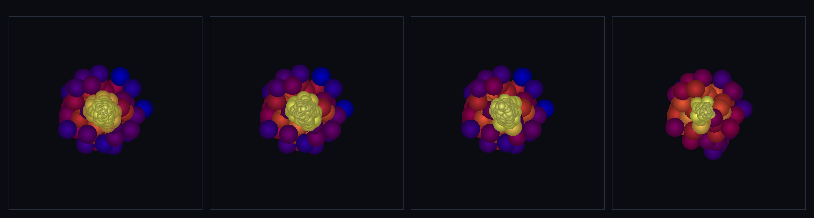

# step_0054 — SW5 적응-h 압력 힘: 0048 측정의 힘 연동 (SPH 물리 마무리)

> [design/sphere-world.md](../../design/sphere-world.md) §6 SW5 — 0041 압력은 *고정* h. 0048 은 입자별 h_i=η(m_i/ρ_i)^⅓ 를 자기일관으로 *재기만* 했다(수동 측정). 이 법칙은 그 h_i 를 *힘에 쓴다* — **대칭 평균 커널**로 가변 h 에서도 운동량을 정확 보존. **SW4 적응 LOD 의 SPH 힘-레벨 완성·SPH 물리 스택 마무리.** (긴 설명은 viewer `note` 0054 가 집.)

## 논의 (법칙 step·새 법칙 하나)

- **세계를 어떻게 변형?** 입자별 h_i 를 압력 힘에 연동한다. 쌍 h_i≠h_j 면 ∇W 비대칭 → 운동량 보존 위험. **대칭 평균 커널** `∇W̄_ij = ½(∇W(r,h_i)+∇W(r,h_j))` 로 막는다(W̄ 대칭 → `∇_jW̄=−∇_iW̄` → 순 운동량 정확 보존).
- **무엇으로 검증?** ① 가변 h 운동량 정확 보존 ② 균일 h→0041 비트 일치(포섭) ③ 대칭 평균 커널 반대칭 ④ 적응 h 연동·압축 반발(NaN 없음) ⑤ 항등/안전·결정론.
- **무엇이 보존/변하나?** 가변 h 여도 **순 운동량 정확 보존**(대칭 커널·쌍 m_i m_j 상쇄). internalE 불변(압력은 힘만). 균일 h → 0041 비트 동일(고정-h SPH 를 특수경우로 포섭). k=0→early-return·신규 함수→구조적 회귀0.

## 구현 — `sphPressureForceVarH(particles, dt, opts)` (engine/htj-sph.js, 가법·VERSION 11→12)

```
P_i = k·ρ_i^γ                                  // 입자별 ρ_i(자기 h_i·caller 가 sphAdaptiveH 로 설정)
쌍 (i<j): gi=∇W(r,h_i), gj=∇W(r,h_j)
  ∇W̄ = ½(gi+gj)                                // 대칭 평균 커널
  term = P_i/ρ_i² + P_j/ρ_j²
  a_i −= m_j·term·∇W̄ ; a_j += m_i·term·∇W̄      // ∇_jW̄=−∇_iW̄ → ΣΔp=0(가변 h 여도)
```
caller 가 입자별 `a.h`·`a.density` 설정(`sphAdaptiveH`)·없으면 `h0` 폴백(그때 모든 h 동일 → ∇W̄=∇W → 0041 비트 동일). opts: `{ stiffness(0→early-return), gamma(2), h0(폴백·1) }`.

## 검증

**(a) 수치 — `node HTJ/steps/step_0054/verify.js` → PASS (5/5)**

```
PASS  가변 h 운동량 정확 보존 — 대칭 평균 커널(∇_jW̄=−∇_iW̄) = h 범위 0.23~5.90(×25.6 가변) · |ΣP| 0.0e+0→1.6e-14
PASS  균일 h → 0041 비트 일치(포섭) — ∇W̄=∇W = max|Δpx| 0.00e+0 (0=비트 동일)
PASS  대칭 평균 커널 반대칭 — ∇_iW̄ = −∇_jW̄ = ∇_iW̄ (-0.0605,0.0403,-0.0302) = −∇_jW̄
PASS  적응 h 연동·압축 반발 — 압력이 퍼뜨림(rms↑)·NaN 없음 = rms 4.20→4.48(반발로 퍼짐) · NaN 없음 true
PASS  항등/안전·결정론 — k=0 회귀·n<2 무탈·결정론 = k=0 회귀 true · n<2 ok · 결정론 true
```
- 전 step verify **54/54 회귀 0** · `node tools/check-viewer.js` PASS(0054 등록).

**(b) 눈 — `steps/step_0054/capture.png`** (engine 직접 PNG·반지름=h_i·색=분해능)



변밀도 구름(중력으로 묶음)·적응-h 압력: **조밀 코어엔 작은 커널 촘촘(노랑·고분해)·희박 헤일로엔 큰 커널(보라·저분해)**이 한 무대에 공존 — h 범위 코어 0.4 ~ 헤일로 8.8(×20 가변)·순 운동량 |ΣP| 0→4e-14(가변 h 여도 정확 보존). 분해능이 물질을 따라가면서 힘이 운동량을 정확 보존.

## 다음

**SPH 물리 스택 마무리 — 밀도·압력·에너지·열압력·점성·전도·복사·점화·이웃 가속·적응 h(측정+힘) 완비.** 구체가 격자 유체의 모든 핵심 거동을 *보존하며* 재현한다. **다음 = 격자 은퇴 엮기**(자동 이주 트리거·viewer 격자 장면 SPH 대체·격자 없는 live 세계). **정직한 한계(이 단위)**: grad-h Ω 보정(에너지 일관)은 생략(운동량엔 대칭만으로 충분)·점성/전도의 적응-h 는 같은 대칭-커널 패턴으로 확장(기계적 후속).
