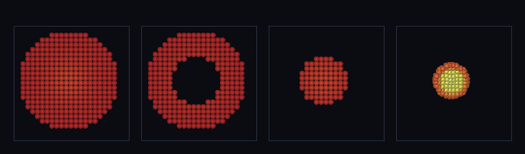

# step_0055 — SW5 격자 은퇴 자동 이주 트리거: 조건 충족 격자 영역 → SPH 입자 *이동*

> [design/sphere-world.md](../../design/sphere-world.md) §6 SW5·§5 난점 3·4 — SW5 의 목적지는 *격자 유체를 구체(SPH)로 옮겨 격자를 은퇴*시키는 것. 0051 `fluidToParticles` 는 격자장을 *읽어 복사*로 이주를 보였다(격자·입자 중복). 이 step 은 그 *이동* 판 = **자동 이주 트리거**: 조건(region) 충족 셀만 SPH 입자로 옮기고 *격자에서 비운다*(셀=0) → 격자가 실제 은퇴(활성 셀↓). **0035 autoPromote(동결 덩어리→구체)의 *유체* 판.** (긴 설명은 viewer `note` 0055 가 집.)

## 논의 (법칙 step·새 법칙 하나)

- **세계를 어떻게 변형?** 격자 영역이 조건(밀집·region 술어)을 충족하면 그 셀들을 SPH 입자로 옮기고 **격자에서 비운다**(rho·운동량·내부E=0). 0051 이 *복사*(읽기 전용·합 배가)였다면 이건 *이동*(격자에서 빠짐·합 불변) — 물질이 격자→입자로 옮겨가 격자가 점진 은퇴.
- **무엇으로 검증?** ① 선택성(region 안 셀만 이주·밖 셀 격자 잔류) ② 이동 보존(Σ입자=비운 셀·(남은 격자+입자) 전역 총량 불변) ③ 격자 은퇴(이주 셀 진공화·활성 셀↓) ④ 항등/안전(region 불충족·threshold 초과→입자 0·격자 불변) ⑤ 결정론.
- **무엇이 보존/변하나?** 물질이 한 표현에서 다른 표현으로 *이동* — 질량·운동량·내부E·KE **전역 정확 보존**(복제 아님). 격자 작업량↓(은퇴)·이주 셀 진공화. region=false/threshold↑ → 회귀 0.

## 구현 — `migrateRegionToSPH(world, opts)` (engine/htj-sph.js, 가법·VERSION 12→13)

```
for 셀 (x,y,z):
  m = rho[i]; if (m ≤ threshold) continue            // 진공 건너뜀(희소화)
  if (region && !region(x,y,z)) continue             // 조건 불충족 셀 → 격자 잔류(선택성)
  입자 push {cx,cy,cz, mass=m, p=(mom), KEcm, internalE, energy, radius}   // 0051 과 같은 재버킷팅
  rho[i]=0; mom_*[i]=0; therm[i]=0                    // ← 격자에서 비움(은퇴·이동의 핵심)
return { particles, migratedCells, removedMass }
```
0051 `fluidToParticles`(읽기 전용 복사)의 *이동* 형제 — 같은 입자 정의에 **격자 비움 + region 선택**을 더한다. world 를 *제자리 변형*. opts: `{ field('energy'), threshold(0), region((x,y,z)=>bool·기본 전체) }`.

## 검증

**(a) 수치 — `node HTJ/steps/step_0055/verify.js` → PASS (5/5)**

```
PASS  선택성 — region 안 셀만 이주·밖 셀 격자 잔류 = 이주 108=108 · 입자 모두 x<3 true · 잔류 모두 x≥3 true · 활성 216→108
PASS  이동 보존 — Σ입자=비운 셀·(남은 격자+입자) 총량 불변(복사 아닌 이동) = 질량 Δ3.4e-13 · 운동량 Δ9.0e-17 · 내부E Δ1.4e-12 · KE Δ9.9e-14 · 부분이주 true
PASS  격자 은퇴 — 이주 셀 진공화(rho·운동량·내부E=0)·활성 셀↓ = 활성 5832→0 (이주 5832) · 이주 셀 모두 진공 true
PASS  항등/안전 — region 불충족·threshold 초과 → 입자 0·격자 불변(회귀 0) = region=false 입자 0·지문 불변 true · threshold↑ 입자 0
PASS  결정론 — 같은 세계·region → 같은 입자 지문 = 0xc51e549b
```
- 전 step verify **55/55 회귀 0** · `node tools/check-viewer.js` PASS(0055 등록·hybrid 렌더).

**(b) 눈 — `steps/step_0055/capture.png`** (engine 직접 PNG·색=온도)



4 패널: ① 격자 블롭(전부 격자) → ② 코어 region(반지름 5) 이주 후 **격자 잔류만 — 코어에 구멍**(은퇴: 활성 셀 4464→3912) → ③ 이주된 입자만(SPH 가 코어 이어받음) → ④ 입자 SPH 자유 붕괴(최대ρ 2.57→5.42·코어 가열 노랑). **이동 보존**: (격자+입자) 질량 1774.367 불변·내부E 553.467 불변(복사면 배가될 합이 *불변* = 진짜 이동).

## 다음

**격자 은퇴 엮기의 첫 벽돌 — 자동 이주 트리거가 섰다**(조건 충족 격자 영역이 SPH 로 *이동*하며 격자 은퇴·총량 보존). **다음**: viewer 격자 장면을 SPH 로 점진 대체(0055 hybrid 장면이 그 첫 형태) + (선택) 통합 중력의 SPH 판(이주 입자↔잔류 격자 결합·0033)·SPH→격자 역이주(0031 자동 강등의 SPH 판). **정직한 한계(이 단위)**: 일방(역이주 없음)·이주 입자는 격자 중력과 미결합(개체끼리만)·밀집 임계는 장면 노브(결정론 임계 아님).
