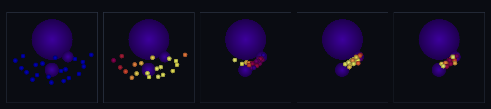

# step_0056 — TW1 산 = 딛는 지형 표면 (기복 정적 앵커 위에 구체가 정착)

> [design/environment.md](../../design/environment.md) §3 TW1 — **새 방향: 광활한 자연 환경(산·바다·강)을 구체 세계로**. sphere-world 트랙은 구체의 *동역학*(궤도·강착·SPH)을 세웠으나 *딛고 다닐 환경*이 없었다(오픈월드 MMORPG 로 가려면 필수). 환경 트랙의 첫 벽돌 = **산 = 딛는 지형 표면**: 기복 있는 정적 앵커 지형 위에 작은 구체(캐릭터 대리)가 떨어져 정착(딛기). 새 엔진 법칙 0 — 중력(0028)+접촉(0037) *조립*. (긴 설명은 viewer `note` 0056 가 집.)

## 논의 (조립 step·새 엔진 법칙 0)

- **세계를 어떻게 변형?** 지면(큰 앵커=중력원) + 산(돌출 앵커=고체 장애물)으로 **기복 지형**을 만들고(모양은 *구체 배열*에 담김·sphere-world §3) 그 위에 작은 구체를 떨어뜨려 **중력↓ + 접촉 반발↑ 균형으로 정착**(딛기). 지형 = **정적 앵커**(질량 무한 극한·외부 경계, 지구처럼) — 큰 질량 구체끼리의 중력 폭발을 이 극한이 피한다.
- **무엇으로 검증?** ① 정착(딛기·지면 관통 안 함) ② 창발(산 위 구체가 낮은 데로 굴러내림·중력 PE↓) ③ 지속성(앵커 정적·표면 안 무너짐) ④ 부드러운 착지(낙하 KE→열 소산) ⑤ 결정론. *조립이라 부품 보존은 0028/0037 verify 가 보증(중복 금지).*
- **무엇이 보존/변하나?** 작은 구체들의 동역학은 중력(0028)+접촉(0037) 그대로 — 앵커는 그 부분계 밖 경계(충격 흡수). engine 변경 0 → 회귀 구조적 0.

## 구현 — 새 엔진 법칙 0 (engine 변경 없음·중력 0028 + 접촉 0037 조립)

지형 = 정적 앵커. `viewer`/`verify` 가 장면 구성으로 고정(engine 은 모든 구체를 동등히 봄):
```
advance: applyEntityGravity(0028) → applyEntityContact(0037·반발+감쇠) → stepEntities
         → pinAnchors: 지형 구체 위치·속도 원복(무한 질량 극한·environment §4)
```
지면 = 큰 질량(중력원·앵커)·산 = 저질량 앵커(고체 돌출·중력 영향 없는 장애물)·작은 구체 = 자유.

## 검증

**(a) 수치 — `node HTJ/steps/step_0056/verify.js` → PASS (5/5)**

```
PASS  정착(딛기) — 작은 구체가 기복 지형 표면 위에 멈춤(지면 관통 안 함) = 관통 없음 true(모두 r>10) · 잔류 속도 max 0.0071(낙하 최대 1.23→정착)
PASS  창발(낮은 데로) — 산 위 구체가 굴러내림(중력 PE↓·비탈 미끄러짐) = 시험 구체 높이 r 18.25(산 정상)→13.06(지면 표면≈11.2)
PASS  지속성 — 지형 앵커(지면·산) 정적·작은 외란에 표면 안 무너짐 = 지면 변위 0 · 산 변위 0 (정적 앵커=불변)
PASS  부드러운 착지 — 낙하 KE→열(internalE↑) 소산으로 정착 = internalE 0.0→234.9(↑=소산) · 작은 구체 모두 멈춤 true
PASS  결정론 — 같은 지형·낙하 → 같은 정착 지문 = 0x73bec56b
```
- 전 step verify **56/56 회귀 0**(engine 변경 없음=구조적) · `node tools/check-viewer.js` PASS(0056 등록·entities 렌더).

**(b) 눈 — `steps/step_0056/capture.png`** (engine 직접 PNG·x-z 단면·색=속도)



5 패널: 작은 구체들이 위에서 떨어져(파랑=빠름) → 곡면 지형 표면에 넓게 닿아 → 반발로 떠받쳐지고 감쇠로 식어(노랑→정착) → 표면 위에 정착. 지형 앵커(보라)는 불변. **마찰이 없어 경사면선 못 서고 낮은 골로 굴러 모인다** — 물리적으로 옳고, "딛는 표면엔 마찰이 필요"를 드러냄.

## 다음

**환경 트랙(오픈월드)이 열렸다 — 동역학만 있던 구체 세계에 처음으로 *딛고 다닐 환경*.** **정직한 발견**: 마찰 없는 법선 접촉(SW2 한계)이라 경사면에 못 서고 골로 모인다 → **"딛는 표면엔 마찰이 필요"가 다음 벽돌의 씨앗**(접선 마찰·구름 저항). **다음(environment.md §3)**: TW2 바다(분지를 SPH 떼로 채워 수면)·TW3 강(경사 따라 흐름)·TW4 광활함(지형 LOD·끝없이 펼침). **한계(이 단위)**: 정적 앵커는 외부 경계로 충격 흡수(작은 구체 사이 보존은 유지)·마찰 없음·기복은 손수 배치(절차 생성 아님).
