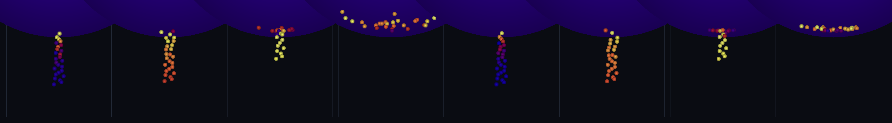

# step_0057 — TW1 마찰 (접촉의 접선 저항 + 구름 → 안식각)

> [design/environment.md](../../design/environment.md) §3 TW1 — 0056 이 드러낸 격차("마찰 없는 법선 접촉이라 경사면서 못 서고 골로 미끄러짐")를 메우는 **새 엔진 법칙**. `applyEntityFriction`: 접촉(0037)의 *법선* 반발/감쇠가 못 막는 **접선 상대 운동**에 저항. Coulomb |F_t|≤μ·F_n + 구름(접촉점 작용→스핀). (긴 설명은 viewer `note` 0057 가 집.)

## 논의 (법칙 step·법칙 하나)

- **세계를 어떻게 변형?** 겹친 두 구체의 **접선(미끄럼) 상대 운동**에 저항하는 마찰을 더한다. 미끄럼 크면 동마찰(점성 cTan·|v_t|, **μ·F_n 상한**=Coulomb)로 KE→열 소산, 작으면 접선 운동을 0 까지만 잡아 **구름**으로 넘긴다. → 0056 격차(경사서 미끄러짐) 해소·**안식각**(구가 더미로 쌓임).
- **무엇으로 검증?** ① 접선 미끄럼 소산(슬립→구름·스핀↑) ② Coulomb 상한 ③ 안식각(μ 유무 대조) ④ 보존(운동량·각운동량·총E) ⑤ μ=0 항등(0037 불변) ⑥ 결정론.
- **무엇이 보존/변하나?** 운동량(equal-opposite 쌍힘)·각운동량(**접촉점 단일화**로 스핀 보정 → 정확)·총E(잃은 병진 KE→internalE, merge 규약 계승) 보존. 새로 변하는 것: 접선 속도(미끄럼)가 줄고 **스핀(L)이 유도**된다(구름).

## 구현 — `applyEntityFriction(entities, dt, {k, mu, cTan})` (htj-entity.js)

겹친 쌍마다 — **단일 접촉점**(겹침 중점)으로 양 구 지렛대를 맞춰 각운동량 정확 보존:
```
F_n = k·overlap                                  // 반발력(=Coulomb 기준)
접촉점 표면 상대속도 v_rel = (v_b + ω_b×r_b) − (v_a + ω_a×r_a),  ω=L/I,  I=⅖mr²
v_t = v_rel − (v_rel·n̂)n̂,   t̂ = v_t/|v_t|
J = min( cTan·|v_t|·dt,  μ·F_n·dt,  |v_t|/mEffInv )   // 점성 vs Coulomb 상한 vs 정지(역전 금지)
a.p += J·t̂ ; b.p −= J·t̂                          // equal-opposite → 운동량 보존
a.L += r_a×(+J t̂) ; b.L += r_b×(−J t̂)            // 접촉점 토크 → 스핀(구름)·ΔL_total=p_c×0=0
internalE += (잃은 병진 KE)                        // merge 규약(스핀 KE 도 lump)
```
`mu=0` → early-return(0037 거동 불변·회귀 0). 새 export·VERSION 7.

## 검증

**(a) 수치 — `node HTJ/steps/step_0057/verify.js` → PASS (6/6)**

```
PASS  접선 미끄럼 소산 — 슬립이 마찰로 줄어 구른다(스핀↑)·KE→internalE = 슬립 4.00→0.002(→0=구름) · 스핀 |L| a=126.4 b=126.4(0→유도) · internalE 302.3
PASS  보존(미끄럼) — 운동량·각운동량(접촉점 단일화)·총E 정확 = max|ΔΣP| 0.0e+0 · max|ΔΣL| 6.4e-12 · 총E 400.0→400.0(보존)
PASS  Coulomb 상한 — 슬립 크고 F_n 작으면 접선 임펄스 = μ·F_n·dt 로 잘림 = J 실제 1.200e-3 = μ·F_n·dt 1.200e-3
PASS  안식각 — 마찰 있으면 더미로 쌓여 좁게 머물고·없으면 액체처럼 퍼진다 = 퍼짐(수평 반경 RMS) 마찰X 18.19(퍼짐) · 마찰O 10.99(더미·60%)
PASS  μ=0 항등 + 안전 — 0037 거동 불변(회귀0)·안 겹침·빈/단일 무변화 = μ0 불변 · 안 겹침 불변 · 빈/단일 OK
PASS  결정론 — 같은 입력 → 같은 마찰 결과 지문 = 0xe1a68024
```
- 전 step verify **57/57 회귀 0**(가법: 새 함수·μ=0 early-return) · `node tools/check-viewer.js` PASS(0057 등록·entities 렌더).

**(b) 눈 — `steps/step_0057/capture.png`** (engine 직접 PNG·x-z 단면·색=속도)



8 패널 = 좌4 **마찰 없음**(μ=0) · 우4 **마찰 있음**(μ=0.9), 같은 초기 더미. 좁은 기둥으로 떨군 구체가 마찰 없으면 **액체처럼 퍼져 팬케이크**(수평 반경 RMS 18.7)가 되고, 마찰 있으면 **더미로 쌓여 좁게 머문다**(9.5·51%) — 안식각 = "딛는 표면이 모양 유지".

## 다음

**TW1 완성** — 0056 "딛는 표면"의 빠진 조각(마찰)을 채웠다. 강체 구는 경사에 *못 선다*(늘 구름)는 물리적 진실 위에서, 마찰은 알갱이들이 **더미·경사(안식각)를 이루게** 한다 = 지형이 평평히 무너지지 않고 산·언덕 모양을 유지. **다음(environment.md §3)**: TW2 바다(분지를 SPH 떼로 채워 수면)·TW3 강(경사 따라 흐름)·TW4 광활함(지형 LOD). **정직한 한계**: 스핀 KE 를 internalE 에 lump(별도 회전E 장 없음·merge 동일 규약)·단일 μ(정/동마찰 미구분)·구름 저항 없음(굴러가면 안 멈춤)·점착 없음.
