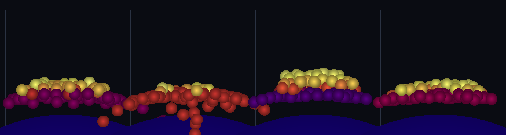

# step_0058 — TW1 구름 저항 (굴러가다 멈춰 가파른 안식각 → 진짜 산 더미)

> [design/environment.md](../../design/environment.md) §3 TW1 — 0057 이 "구름 저항 없음"으로 남긴 한계를 메우는 **새 엔진 법칙**. 마찰(0057)이 *미끄럼*을 막아도 구체는 자유로이 굴러 비탈을 흘러내려 안식각이 완만했다(납작한 더미·10°). `applyEntityRollingResistance`: *구름 자체*에 저항(상대 구름 각속도 ω_rel 에 반대 토크 쌍)해 굴러가다 멈추게 한다 → **가파른 안식각**(28°·진짜 산). (긴 설명은 viewer `note` 0058 가 집.)

## 논의 (법칙 step·법칙 하나)

- **세계를 어떻게 변형?** 겹친 두 구의 **상대 구름 각속도** ω_rel=ω_a−ω_b 에 반대하는 **토크 쌍**(a 에 −M·b 에 +M)을 줘 *구름을 멈춘다*. 마찰(미끄럼)+구름 저항(구름)이 함께라야 알갱이가 **가파른 산·언덕**을 이루고 유지 = 사용자 질문("확실히 지형이 만들어지냐")의 *눈에 보이는* 답.
- **무엇으로 검증?** ① 구름 감속(ω_rel↓) ② 보존(각운동량·운동량·총E) ③ **가파른 안식각**(μ_r 유무 대조·핵심 페이오프) ④ μ_r=0 항등(0057 불변) ⑤ 결정론.
- **무엇이 보존/변하나?** 각운동량(토크 쌍이라 ΣL_spin 불변)·운동량(순수 토크·불변)·총E(스핀 KE 는 internalE 에 lump·0057 규약, 구름이 줄면 열로 재분류 → KEcm·internalE 불변) 보존. 변하는 것: 상대 구름이 멈추고 더미가 가팔라진다.

## 구현 — `applyEntityRollingResistance(entities, dt, {k, muRoll, cRoll})` (htj-entity.js)

겹친 쌍마다:
```
ω_rel = L_a/I_a − L_b/I_b  (I=⅖mr²)
J = min(cRoll·|ω_rel|·dt,  μ_r·R_eff·F_n·dt,  |ω_rel|/(1/I_a+1/I_b))   // 점성 vs Coulomb 상한 vs 정지
a.L −= J·(ω_rel/|ω_rel|) ;  b.L += J·(ω_rel/|ω_rel|)                   // 토크 쌍 → ΣL_spin 불변
```
F_n=k·overlap, R_eff=조화평균 반경. `muRoll=0` → early-return(0057 불변). 운동량·internalE·KEcm 안 건드림 → 총E 보존. 새 export·VERSION 8→회귀0.

## 검증

**(a) 수치 — `node HTJ/steps/step_0058/verify.js` → PASS (5/5)**

```
PASS  구름 감속 — 상대 구름 각속도 ω_rel 이 구름저항으로 줄어 멈춘다 = ω_rel 2.50→0.000(→0=멈춤)
PASS  보존 — 총 각운동량(토크 쌍)·운동량(불변)·총E 정확 = max|ΔΣP| 0.0e+0 · max|ΔΣL| 0.0e+0 · 총E 0.000→0.000(불변)
PASS  가파른 안식각 — 구름저항으로 더미가 가팔라진다(굴러 안 퍼짐·진짜 산) = 안식각 구름저항X 13.2°(완만·퍼짐) → 구름저항O 24.8°(가파름·산)
PASS  μ_r=0 항등 + 안전 — 0057 거동 불변(회귀0)·안 겹침·빈/단일 무변화
PASS  결정론 — 같은 입력 → 같은 구름저항 결과 지문
```
- 전 step verify **58/58 회귀 0**(가법: 새 함수·μ_r=0 early-return) · `node tools/check-viewer.js` PASS(0058 등록).

**(b) 눈 — `steps/step_0058/capture.png`** (engine 직접 PNG·x-z 단면·색=높이)



4 패널 = 좌2 **구름저항 X**(굴러 퍼져 팬케이크·안식각 12°) · 우2 **구름저항 O**(가파른 산이 솟는다·28°). 아래 파란 곡선=지면 앵커, 그 위로 구체가 쌓여 **언덕(노랑=정상)이 창발**. 손 안 대고 구체 법칙이 쌓은 산.

## 다음

**TW1 "지형이 보인다" 완성** — 사용자 의심("확실히 지형이 만들어지냐")에 답: 마찰(0057)+구름 저항(0058)으로 알갱이가 **author 없이 가파른 산·언덕을 쌓고 유지**한다. **다음(environment.md §3)**: TW2 바다(분지를 SPH 떼로 채워 수면)·TW3 강(흐름)·TW4 광활함(지형 LOD). **정직한 한계**: 28° 입상 안식각(가파른 암벽엔 점착 cohesion 필요)·낮은 둔덕 규모(스케일·연속 표면은 TW4)·단일 μ_r(속도 무관)·스핀 KE 를 internalE 에 lump.
